# Deep Natural Language Processing

## Lesson 1

### Course

#### General presentation of Data Science

General concept of data science: Extracting *knowledge* and *insights*
from data. There is a huge variety of methods to do it, ranging from
basic statistics to deep neural networks.

Machine learning systems learn how to combine *input* to produce
useful *predictions* on *never-before-seen* data.

General concepts of machine learning:
  - Labels: A *label* is the thing we're predicting - the `y` variable
    in simple linear regression (_y = ax + b_). The label could be the
    future price of wheat, the kind of animal shown in a picture, the
    meaning of an audio clip, or just about anything.
  - Features: A *feature* is an input variable - the `x` variable in a
    simple linear regression (_y = ax + b_). A simple machine learning
    project might use a single feature, while a more sophisticated
    machine learning project could use millions of features, specified
    as: _x<sub>1</sub>_,_x<sub>2</sub>_, ..., _x<sub>n</sub>_.
  - Models: A *model* defines the relationship between features and
    label - `ax + b` in a simple linear regression (_y = ax + b_). For
    example, a spam detection model might associate certain features
    strongly with "spam". Let's highlight two phases of a model's
    life. *Training* means creating or *learning* the model. That is,
    you show the model labeled examples and enable the model to
    gradually learn the relationship between features and label. In
    the case of a linear regression, it consists in finding "good"
    values for `a` and `b`, the *parameters* of the model. *Inference*
    means applying the trained model to unlabeled examples. That is,
    you use the trained model to make useful predictions (`y'`). For
    example, during inference, you can predict for a new incoming mail
    whether it is spam or not.
  - Supervised learning: In *supervised* learning, we model the
    relationship input and output. Depending on the type of
    values predicted by the model, we call it either a
    *regression* model or a *classification* model. A regression
    model predicts continuous values. For example, regression
    models make predictions that answer questions like "What is
    the value of a house in California?" or "What is the
    probability that a user will click on this ad?". A
    classification model predicts discrete values. For example,
    classification models make predictions that answer questions
    like "Is a given message spam or not spam?" or "Is this an
    image of a dog, a cat, or a hamster?".
  - Unsupervised learning: In *unsupervised* learning, we model
    the features of a dataset without reference to any label. It
    is often described as "letting the dataset speak for
    itself". These type of machine learning model include tasks
    such as *clustering* or *dimensionality
    reduction*. Clustering algorithms identify distinct groups
    of data while dimensionality reduction algorithms search for
    a more succint representations of the data.
  - There exist more learning paradigms such as [Reinforcement
    learning](https://en.wikipedia.org/wiki/Reinforcement_learning)
    (AlphaGo), [Semi-supervised
    learning](https://en.wikipedia.org/wiki/Semi-supervised_learning)
    (hybrid between supervised and unsupervised) and
    [Self-supervised
    learning](https://lilianweng.github.io/lil-log/2019/11/10/self-supervised-learning.html)
    (a kind of unsupervised learning in which we use the data
    itself to create a "virtual" supervision, an example of
    self-supervised model would be a learned
    compressor-decompressor).

#### Deep learning

Deep learning is a part of machine learning methods based on
*artificial neural networks*. Artificial neural networks are a family
of computation models _vaguely_ inspired by the biological neural
networks that constitute animal brains. We will go briefly over the
history of this discipline and then study the example of the linear
regression. While not a neural network per se, understanding all its
concepts should give a very solid base for studying deep neural
networks.

##### History

A short history of deep learning (from
[Wikipedia](https://en.wikipedia.org/wiki/Timeline_of_machine_learning)):
- 1951: First neural network machine by Marvin Minsky
- 1957: Invention of the
  [Perceptron](https://en.wikipedia.org/wiki/Perceptron) by Frank
  Rosenblatt
- 1970: [Automatic
  differentiation](https://en.wikipedia.org/wiki/Automatic_differentiation)
  by Seppo Linnainmaa
- 1980: [Neocognitron](https://en.wikipedia.org/wiki/Neocognitron),
  the inspiration for [convolutional neural
  networks](https://en.wikipedia.org/wiki/Convolutional_neural_network)
  by Kunihiko Fukushima
- 1982: [Hopfield
  networks](https://en.wikipedia.org/wiki/Hopfield_network), a type of
  recurrent neural network
- 1997: [Long short-term
  memory](https://en.wikipedia.org/wiki/Long_short-term_memory)
  recurrent neural networks by Sepp Hochreiter and Jürgen Schmidhuber
- 1998: Neural networks on [MNIST](http://yann.lecun.com/exdb/mnist/),
  an digit image classification dataset

##### Linear regression

Inspired by [ML crash course](https://developers.google.com/machine-learning/crash-course/descending-into-ml/training-and-loss)

Finding "good" parameters `a` and `b` of a line `y = ax + b` to
approximate a set of point is an example of machine learning. The set
of points `(x, y)` is the *dataset* or *training data* of the
problem. In this case, the *model* is a Linear Regression (a line of
equation `y = ax + b`).  Finding "good" parameters for `a` and `b`
using labelled examples is the *training process*, *optimization* or
*learning* of the model and to define what being a "good model" means
we will need a *loss function*.

#### Loss function

The *loss function* used to evaluate a model. It penalizes bad
prediction. If the model's prediction is perfect, the loss is zero
otherwise, the loss is greater. The goal of *training* model is to
find a set of parameters (in our case `a` and `b`) that have low loss,
on average, across all examples.


Notice that the arrows in the left plot are much longer than their
counterparts in the right plot. Clearly, the line in the right plot is
a much better predictive model than the line in the left plot.

You might be wondering whether you could create a mathematical
function - a loss function - that would aggregate the individual
losses in a meaningful fashing.

The linear regression models we'll examine here use a loss function
called *squared loss* (also known as *L<sub>2</sub> loss*). The
squared loss of a model `y' = ax + b` for a single example `(x, y)` is
as follows:

- = the square of the difference between the label and the prediction
- = (observation - prediction(x))<sup>2</sup>
- = (y - y')<sup>2</sup>
- = (y - (ax + b))<sup>2</sup>
- = (y - ax - b) <sup>2</sup>

*Mean square error (MSE)* is the average squared loss per example over
the whole dataset. To calculate MSE, sum up all the squared losses for
individual examples and then divide by the number of examples:

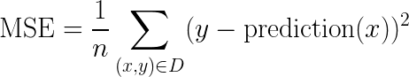

where:
- `(x, y)` is an example in which
    - `x` is the set of features (for example, chirps / minute, age,
      gender) that the model uses to make predictions.
    - `y` is the example's label (for example, temperature).
- `prediction(x)` is a function of the weights and bias in combination
  with the set of features `x`. In our case case `prediction(x) = ax +
  b`.
- `D` is a data set containing many labeled examples, which are `(x,
  y)` pairs.
- `N` is the number of examples in `D`.

Altough MSE is commonly-used in machine learning, it is neither the
only practical loss function nor the best loss function for all
circumstances. Because of the squaring operation, a single *large*
difference between a prediction and a label will be penalized more
than many smaller ones.

A *high loss value* signifies that the models' predictions are poor
approximation of the labels. Conversely a *small loss value* means
that our model captures the structure of the data. Now that we know
that, we will take a look at algorithms designed to lower the loss of
a specific model on a specific dataset by modifying its parameters.

#### Training algorithms

##### Iterative approach

The procedure that we will use to learn our model is *iterative*. We
start with a random guess for each parameter of our model (here `a`
and `b`), we compute the loss to evaluate how good our current
parameters are and, using this loss, we will compute an update hoping
to lower the loss on the next iteration.

The following figure summarizes the process:


To be able to apply this procedure to our problem, we have to find a
way to compute parameters updates.

##### Gradient descent

Suppose we had the time and the computing resources to calculate the
loss for all possible values of `a` (w<sub>1</sub> in the
figures). For the kind of regression problems we have been examining,
the resulting plot of loss vs `a` will always be *convex*. In other
words, the plot will always be bowl-shaped, kind of like this:


Convex problems have only one minimum; that is, only one place where
the *slope* is exactly 0. The minimum is where the loss function
converges.

As computing the loss function for all values of `a` to find its
minimum would be extremely ineficient we need a better
mechanism. Let's examine such an algorithm, the *gradient descent*.

As explained in the previous section, we start with a random guess for
our parameter.


Now that we have an initial value for our parameter `a`, we can
compute the loss value for our linear regression. Next, we would like
to know whether we should *increase* or *decrease* the value of `a` to
make the loss decrease.

To get this information, the gradient descent algorithm calculates the
*gradient* of the loss curve at the current point. In the next Figure,
the gradient of the loss is equal to the derivative (slope) of the
curve and tells you that you should *increase* the value of `a` to
make the loss value decrease.


As the gradient of a curve approximates it well in a very small
neighborhood, we add a small fraction (this fraction is called
*learning rate*) of the gradient magnitude to the starting point.


Now that we have a new (and hopefully better) value for `a`, we
iterate the previous process to improve it even further.

##### Learning rate

The *learning rate* is an *hyperparameter* in this problem, a
*parameter of the training process*, not of the model. It is important
to note that the learning rate (which determines the size of the steps
during the descent process) should neither be too small (otherwise the
training process will take very long to converge) nor too big (which
can lead to the process not converging at all).

[Interactive graph of the learning rate
importance](https://developers.google.com/machine-learning/crash-course/fitter/graph)

##### Gradient descent on many parameters

In the example that we have seen earlier we used the gradient descent
to find the correct value for a single parameter. In cases where we
have more parameters (`a` and `b` for a line equation), we compute the
gradient of the loss function (the derivatives according to each of
the variable) and update them all at once.

Let's compute the gradients of `a` and `b` in our example. First lets
recall and develop the MSE loss formula in our case.

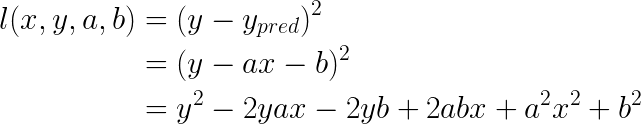

Now we want to differentiate this function according to `a` and `b`
separately. Let's start with `a`. In order to simplify the
computation we factor the previous formula by `a`.


from there we easily compute the derivative of the loss according to
`a`.

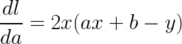

Now onto `b`, we follow a similar process. First we factor by `b`.

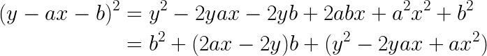

from there we compute the derivate of `l` according to `b`.

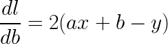

An animation of an application of the gradient descent algorithm on a
linear regression problem can be found [here](../figures/anim_gd.pdf).

##### Stochastic version

In real problems, it is often not practical to compute the value of
the average loss across all of the training set as it often contains a
huge quantity of data.

To deal with this problem, we run the gradient descent using
*batches*. A batch is a subset of the training set (usually 10 to 1000
examples) that we use to compute an approximation of the gradient. The
larger the size of the batches the better the gradient approximation,
the more robust the training procedure is. By using this algorithm, we
trade robustness for efficiency.

##### Takeaways

The main takeaways of this section are the following:
- Artificial neural network have existed for a long time.
- The two main components that made them "work" were the
  backpropagation algorithm (automatic differentiation) and the advent
  of more powerful computers.
- Artificial Neural Networks are huge derivable functions that we
  optimize using a variant of the Stochastic gradient descent
  algorithm.

### Practical work

PyTorch tensor practical work, inspired from [Python Data Science
Handbook](https://nbviewer.jupyter.org/github/jakevdp/PythonDataScienceHandbook/blob/master/notebooks/02.00-Introduction-to-NumPy.ipynb)

In this practical work, we will setup a Python environment and
discover PyTorch tensors. Tensors are the PyTorch version of NumPy
[ndarray](https://docs.scipy.org/doc/numpy/reference/generated/numpy.ndarray.html)
with additional capabilities specific to GPU use and automatic
differentiation. Most the methods available on NumPy arrays have an
equivalent with PyTorch tensors but the name may be different.


#### Anaconda setup

[Anaconda](https://www.anaconda.com/distribution/): Anaconda is a
Python distribution with great machine learning integration working on
Linux, Windows and Mac OS X. Using it instead of the default Python
distribution of the OS will allow us to have a finer control without
the need for admnistrator privileges.

During this course, we will a *virtual environments*. A virtual
environment is a tool that helps to keep dependencies required by
different projects separate by creating isolated Python *virtual*
environments for them. It also provides a way to easily reproduce the
environment required to run a specific piece of code. This is one of
the most important tools that most of the developers use, even outside
of the data science world. In this course we will use Anaconda virtual
environments instead of `virtualenv` or `pipenv` because Anaconda
environments are able to keep track of packages installed with
`conda` (Anaconda package manager).

Downloading the Python 3.7 version of Anaconda from [this
address](https://www.anaconda.com/distribution/)

Launch the installation shell script.

```shell
> chmod u+x Anaconda3-2019.10-Linux-x86_64.sh
> ./Anaconda3-2019.10-Linux-x86_64.sh
```

The installer will ask you if it should modify your `.bashrc` to add
the anaconda folders to the `PATH`, answer yes.

Now that anaconda in installed, we will create a virtual environment
in which we will setup all our libraries. The documentation for the
anaconda virtual environment management is available
[here](https://docs.conda.io/projects/conda/en/latest/user-guide/tasks/manage-environments.html).

I have already created a virtual environment containing all the
libraries that we will use during this course. Download the export
file [here](../env_files/deep_nlp.yml) and import the environment using
the following command:

```shell
conda env create -f deep_nlp.yml
```

#### Creation of PyTorch tensors

We can use `torch.tensor` to create tensors (arrays) from Python
lists:

```python
>>> import torch
>>> torch.tensor([1,2,3,4,5])
tensor([1, 2, 3, 4, 5])
```

All the values in a PyTorch tensor have to contain the same type or be
compatible via up-cast:

```python
>>> torch.tensor([3.14, 2, 3, 4])
tensor([3.1400, 2.0000, 3.0000, 4.0000])
```

NumPy arrays can be multi-dimensional. Here we create a 2 dimensional
array using a list of lists.

```python
>>> a = torch.tensor([range(i, i + 3) for i in [2, 4]])
>>> a
tensor([[2, 3, 4],
        [4, 5, 6]])

>>> a.ndim
2

>>> a.shape
torch.Size([2, 3])

>>> a.dtype
torch.int64
```

`a.ndim` tells us that we have created a 2D tensor. `a.shape` tells us
that the first dimension being of length 2 (rows) and the second one
being of length 3 (columns). `a.dtype` tells us that the tensor
contains integers stored on 64 bytes. It is important to note that
these are not Python arbitrary precision integers. In order to perform
fast computations on a large quantity of data PyTorch uses internally
low level types (more explanations on this subject
[here](https://pytorch.org/docs/stable/tensors.html)).

There are many efficient ways to create a variety of PyTorch tensors,
most of them identical to the NumPy counterparts described
[here](https://nbviewer.jupyter.org/github/jakevdp/PythonDataScienceHandbook/blob/master/notebooks/02.01-Understanding-Data-Types.ipynb#Creating-Arrays-from-Scratch). The
official documentation for PyTorch tensor creation is available
[here](https://pytorch.org/docs/stable/torch.html#creation-ops)

Exercices, from
[ML+](https://www.machinelearningplus.com/python/101-numpy-exercises-python/):
- Create a 1D array of numbers from 0 to 9

```python
tensor([0, 1, 2, 3, 4, 5, 6, 7, 8, 9])
```

- Create a 3×3 PyTorch tensor of all True’s

```python
tensor([[True, True, True],
        [True, True, True],
        [True, True, True]])
```

#### Indexing

Now that we can create NumPy arrays, let's learn how to access
the values they contain.

For 1D tensors, indexing elements can be done similarly to Python
lists:

```python
>>> a = torch.tensor([5, 0, 3, 3, 7, 9])
>>> a
tensor([5, 0, 3, 3, 7, 9])

>>> a[0]
tensor(5)

>>> a[2]
tensor(3)

>>> a[-1]
tensor(9)

>>> a[-2]
tensor(7)
```

In a multi-dimensional tensors, items can be accessed using a
comma-separated tuple of indices:

```python
>>> a = torch.tensor([[3, 5, 2, 4], [7, 6, 8, 8], [1, 6, 7, 7]])
>>> a
tensor([[3, 5, 2, 4],
        [7, 6, 8, 8],
        [1, 6, 7, 7]])

>>> a[0]
tensor([3, 5, 2, 4])

>>> a[0][2]
tensor(2)

>>> a[0, 2]
tensor(2)

>>> a[-1, -2]
tensor(7)

>>> a[-1, -2] = 10
>>> a
tensor([[ 3,  5,  2,  4],
        [ 7,  6,  8,  8],
        [ 1,  6, 10,  7]])
```

#### Slicing

Like with usual Python lists, we can create subtensors using the
*slice* notation. The PyTorch slicing follows that of the standard
Python list; to access a slice of an array `x`, use this:

```python
x[start:stop:step]
```

If any of these are unspecified, they default to the values `start =
0`, `stop = size of dimension`, `step = 1`.

```python
>>> x = torch.arange(10)
>>> x
tensor([0, 1, 2, 3, 4, 5, 6, 7, 8, 9])
>>> x[:5] # first five elements
tensor([0, 1, 2, 3, 4])
>>> x[5:] # elements after index 5
tensor([5, 6, 7, 8, 9])
>>> x[4:7] # middle sub-array
tensor([4, 5, 6])
>>> x[::2] # every other element
tensor([0, 2, 4, 6, 8])
>>> x[1::2] # every other element, starting at index 1
tensor([1, 3, 5, 7, 9])
```

As of today, PyTorch does not support using a [negative step
size](https://github.com/pytorch/pytorch/issues/229) to flip a
tensor. The same behavior can be obtained by using `torch.flip`
although this operation creates a copy of the tensor and not a view
(this will be explained later).

```python
>>> torch.flip(x, dims = (0,))
tensor([9, 8, 7, 6, 5, 4, 3, 2, 1, 0])
```

We can also slice multidimensional arrays. Like with indexing, we will
specify the slicing indices for each dimension separated by `,`.

```python
>>> x = torch.tensor([[12,  5,  2,  4], [ 7,  6,  8,  8], [ 1,  6,  7,  7]])
>>> x
tensor([[12,  5,  2,  4],
        [ 7,  6,  8,  8],
        [ 1,  6,  7,  7]])

>>> x[:2, :3] # first two rows, first three columns
tensor([[12,  5,  2],
        [ 7,  6,  8]])

>>> x[:, ::2] # all rows (: is a slicing with default start and stop), every other column
tensor([[12,  2],
        [ 7,  8],
        [ 1,  7]])
```

An _extremely important_ concept to keep in mind when working with
tensor slices is that they return *views* rather than *copies* of the
array data. When slicing Python lists, the slice is a copy of the
original array, this is not the case with `torch.tensor` slices.

```python
>>> x = torch.tensor([[12,  5,  2,  4], [ 7,  6,  8,  8], [ 1,  6,  7,  7]])
>>> x
tensor([[12,  5,  2,  4],
        [ 7,  6,  8,  8],
        [ 1,  6,  7,  7]])

>>> x2 = x[:2, :2]
>>> x2
tensor([[12,  5],
        [ 7,  6]])

>>> x2[0, 0] = 99
>>> x2
tensor([[99,  5],
        [ 7,  6]])

>>> x
tensor([[99,  5,  2,  4],
        [ 7,  6,  8,  8],
        [ 1,  6,  7,  7]])
```

Keeping this fact in mind will spare you from terrible debugging
sessions.

Exercices:
All the exercices use the following array:

```python
>>> x = torch.tensor([[12,  5,  2,  4], [ 7,  6,  8,  8], [ 1,  6,  7,  7]])
>>> x
tensor([[12,  5,  2,  4],
        [ 7,  6,  8,  8],
        [ 1,  6,  7,  7]])
```

1. Select the last line of `x`

```python
tensor([1, 6, 7, 7])
```

2. Slice the two sevens on the last line of `x`

```python
tensor([7, 7])
```

3. (_harder_) Slice and reverse the lines and the columns of the top right rectangle

```python
tensor([[8, 8, 6],
        [4, 2, 5]])
```

#### Shape manipulation

Another useful type of operation is reshaping of arrays. The most
flexible way of doing this is with the `reshape` method. For example,
if you want to put the number `1` through `9` in a `3x3` grid, you can
do the following:

```python
>>> torch.arange(1, 10).view(3, 3)
tensor([[1, 2, 3],
        [4, 5, 6],
        [7, 8, 9]])
```

You can use `-1` as a joker when reshaping, PyTorch will deduce the
correct value from the number of elements of the array.

```python
>>> torch.arange(1, 10).view(3, -1)
tensor([[1, 2, 3],
        [4, 5, 6],
        [7, 8, 9]])
```

A common thing to do when working with tensors is to flatten them
using `.view(-1)`.

```python
>>> x = torch.arange(1, 10).view(3, -1)
>>> x
tensor([[1, 2, 3],
        [4, 5, 6],
        [7, 8, 9]])

>>> x.view(-1)
tensor([1, 2, 3, 4, 5, 6, 7, 8, 9])
```

Another common reshaping pattern is the conversion of a
one-dimensional array into a two-dimensional row or column
matrix. This can be done with the view method, or more easily by
making use of `None` keyword within a slice operation:

```python
>>> x = torch.tensor([1, 2, 3])

>>> x.view(1, 3) # Row vector via view
tensor([[1, 2, 3]])

>>> x[None, :] # Row vector via None
tensor([[1, 2, 3]])

>>> x.view(3, 1) # Column vector via view
tensor([[1],
        [2],
        [3]])

>>> x[:, None] # Column vector via None
tensor([[1],
        [2],
        [3]])
```

Exercices:
1. Create a 3D tensor containing the numbers from `1` to `27` with shape
  `(3, 3, 3)`

```python
tensor([[[ 1,  2,  3],
         [ 4,  5,  6],
         [ 7,  8,  9]],

        [[10, 11, 12],
         [13, 14, 15],
         [16, 17, 18]],

        [[19, 20, 21],
         [22, 23, 24],
         [25, 26, 27]]])
```

2. Create the following tensor

```python
tensor([[ 0,  2],
        [ 4,  6],
        [ 8, 10],
        [12, 14],
        [16, 18]])
```

3. Using the answer to question 2, create the following tensor

```python
tensor([[16, 18],
        [12, 14],
        [ 8, 10],
        [ 4,  6],
        [ 0,  2]])
```

4. Using the answer to question 2, create the following tensor

```python
tensor([[18, 16],
        [14, 12],
        [10,  8],
        [ 6,  4],
        [ 2,  0]])
```

5. (_harder_) Create the following tensor
```python
tensor([ 2,  1,  4,  3,  6,  5,  8,  7, 10,  9, 12, 11])
```

#### Combination

It is possible to combine multiple tensors into one, and to conversely
split a single tensor into multiple tensors.

First, to concatenate multiple 1D tensors, we can simply do the
following:

```python
>>> x = torch.tensor([1, 2, 3])
>>> y = torch.tensor([4, 5, 6])

>>> torch.cat([x, y])
tensor([1, 2, 3, 4, 5, 6])

>>> torch.cat([x, y, x])
tensor([1, 2, 3, 4, 5, 6, 1, 2, 3])
```

We can also concatenate multidimensional arrays by precising the axis
(dimension) along which we want to perform the concatenation:

```python
>>> y = torch.arange(6, 12).view(2, 3)
>>> x = torch.arange(6).view(2, 3)
>>> x
tensor([[0, 1, 2],
        [3, 4, 5]])

>>> y = torch.arange(6, 12).view(2, 3)
>>> y
tensor([[ 6,  7,  8],
        [ 9, 10, 11]])

>>> torch.cat([x, y], dim = 0) # Concatenate along dimension 0 (rows)
tensor([[ 0,  1,  2],
        [ 3,  4,  5],
        [ 6,  7,  8],
        [ 9, 10, 11]])

>>> torch.cat([x, y]) # The default concatenation dimension is 0
tensor([[ 0,  1,  2],
        [ 3,  4,  5],
        [ 6,  7,  8],
        [ 9, 10, 11]])

>>> torch.cat([x, y], dim = 1) # Concatenate along dimension 1 (columns)
tensor([[ 0,  1,  2,  6,  7,  8],
        [ 3,  4,  5,  9, 10, 11]])
```

Exercices:
All the exercices use the following tensors:

```python
>>> x = torch.tensor([1, 2, 3])
>>> y = torch.arange(6).view(2, 3)
>>> y
tensor([[0, 1, 2],
        [3, 4, 5]])
```

1. Concatenate `x` and `y` to create the following tensor. Be careful
   of the shapes of the array you are manipulating.

```python
tensor([[1, 2, 3],
        [0, 1, 2],
        [3, 4, 5]])
```

2. (_harder_) Using `x`, `y` and `torch.cat` create the following array

```python
tensor([[0, 1, 2, 1, 2, 3],
        [3, 4, 5, 1, 2, 3]])
```

#### Aggregations

Multiple aggregations methods are available in NumPy. Here are a few
examples:

```python
>>> x = torch.arange(10, dtype = torch.float32) # Have to precise floating type to compute mean and std
>>> x
tensor([0., 1., 2., 3., 4., 5., 6., 7., 8., 9.])

>>> x.sum()
tensor(45.)

>>> x.mean()
tensor(4.5000)

>>> x.std()
tensor(3.0277)

>>> x.min()
tensor(0.)

>>> x.max()
tensor(9.)
```

Similarly to the `torch.cat` function, we can precise along which axis
we want to perform the computation.

```python
>>> x = torch.arange(12, dtype = torch.float32).reshape(3, 4)
>>> x
tensor([[ 0.,  1.,  2.,  3.],
        [ 4.,  5.,  6.,  7.],
        [ 8.,  9., 10., 11.]])

>>> x.sum(dim = 0) # Sum along the rows, we have one result by column
tensor([12., 15., 18., 21.])

>>> x.sum(dim = 1) # Sum along the columns, we have one result by row
tensor([ 6., 22., 38.])

>>> x.mean(dim = 0) # Mean along the rows, we have one result by column
tensor([4., 5., 6., 7.])

>>> x.mean(dim = 1) # Mean long the columns, we have one result by row
tensor([1.5000, 5.5000, 9.5000])

>>> x.min(dim = 0) # Minimum along the rows, we get two tensors, the first one with
                   # the value of the min for each column, the second one with the
                   # index of the row in which the minimum is.
torch.return_types.min(
values=tensor([0., 1., 2., 3.]),
indices=tensor([0, 0, 0, 0]))

>>> x.min(dim = 1) # Minimum along the columns, we get two tensors, the first one with
                   # the value of the min for each row, the second one with the
                   # index of the column in which the minimum is.
torch.return_types.min(
values=tensor([0., 4., 8.]),
indices=tensor([0, 0, 0]))
```

Exercice:

1. Compute, for each column, the mean of the values of the rows of
   even index in the following tensor.

```python
>>> x = torch.arange(49, dtype = torch.float32).view(7, 7)
>>> x
tensor([[ 0.,  1.,  2.,  3.,  4.,  5.,  6.],
        [ 7.,  8.,  9., 10., 11., 12., 13.],
        [14., 15., 16., 17., 18., 19., 20.],
        [21., 22., 23., 24., 25., 26., 27.],
        [28., 29., 30., 31., 32., 33., 34.],
        [35., 36., 37., 38., 39., 40., 41.],
        [42., 43., 44., 45., 46., 47., 48.]])
```

The result should be

```python
tensor([21., 22., 23., 24., 25., 26., 27.])
```

#### Broadcasting

Now that we know basic manipulations on PyTorch tensors, we can start
making operations between them.

When arrays have identical sizes, binary operations are performed on
an element-by-element basis:

```python
>>> a = torch.tensor([1, 2, 3])
>>> b = torch.tensor([5, 5, 5])
>>> a + b
tensor([6, 7, 8])
```

*Broadcasting* allows these types of binary operations to be performed
on arrays of different sizes. For example, we can just add a scalar
(think of it as a zero-dimensional tensor) to a tensor:

```python
>>> a + 5
tensor([6, 7, 8])
```

You can think of this as an operation that stretches or duplicates the
value `5` into the tensor `[5, 5, 5]`, and adds the results. The
advantage of PyTorch's broadcasting is that this duplication of values
does not actually take place, but it is a useful mental model as we
think about broadcasting.

```python
>>> a
tensor([1, 2, 3])

>>> M = torch.ones((3, 3))
>>> M
tensor([[1., 1., 1.],
        [1., 1., 1.],
        [1., 1., 1.]])

>>> M + a
tensor([[2., 3., 4.],
        [2., 3., 4.],
        [2., 3., 4.]])
```

Here the one-dimensional tensor `a` is stretched, or *broadcast*
across the dimension in order to match the shape of `M`.

Broadcasting is a powerful tool that follows precise rules. An
in-depth explanation of these rules can be found
[here](https://nbviewer.jupyter.org/github/jakevdp/PythonDataScienceHandbook/blob/master/notebooks/02.05-Computation-on-arrays-broadcasting.ipynb#Rules-of-Broadcasting).

A typical usecase of broadcasting is to normalize the values of an
array by substracting the mean and dividing by the standard
deviation. In the following example, let's assume that the values of
each column are observation of a different variable. We would like to
compute the mean and standard deviation for each column and then
perform the normalization.

```python
>>> x = torch.randn(3, 5) # Randomly generate x using a normal distribution
>>> x
tensor([[-1.6168,  0.4247,  0.6664, -0.9946, -1.7289],
        [ 0.9720, -0.7299,  0.7018,  0.7963, -1.0579],
        [ 0.0678, -0.3628,  0.5733, -0.7313,  0.2808]])

>>> x.mean(dim = 0) # Compute the mean for each column
tensor([-0.1923, -0.2227,  0.6472, -0.3099, -0.8353])

>>> x.std(dim = 0) # Compute the standard deviation for each column
tensor([1.3139, 0.5899, 0.0663, 0.9670, 1.0232])

>>> (x - x.mean(dim = 0)) / x.std(dim = 0) # Standardize each column with its own
                                           # mean and standard deviation
tensor([[-1.0842,  1.0974,  0.2900, -0.7081, -0.8733],
        [ 0.8862, -0.8599,  0.8230,  1.1440, -0.2175],
        [ 0.1980, -0.2375, -1.1129, -0.4358,  1.0909]])
```

Exercices:

All the exercices use the following array:

```python
>>> a = torch.arange(10).view(-1, 2)
>>> a
tensor([[0, 1],
        [2, 3],
        [4, 5],
        [6, 7],
        [8, 9]])
```

1. Add `2` to the first column and `-1` to the second column of `a`

```python
tensor([[ 2,  0],
        [ 4,  2],
        [ 6,  4],
        [ 8,  6],
        [10,  8]])
```

2. Multiply the values of the first column of `a` by the maximum of
   the values of the second column. The result should be:

```python
tensor([[ 0,  1],
        [18,  3],
        [36,  5],
        [54,  7],
        [72,  9]])
```

#### Comparisons, Masks and Boolean logic

PyTorch also provides binary comparison operators that output boolean
arrays:

```python
>>> a = torch.tensor([1, 2, 3, 4])
>>> b = torch.tensor([3, 2, 1, 4])
>>> a == b
tensor([False,  True, False,  True])

>>> a != b
tensor([ True, False,  True, False])

>>> a > b
tensor([False, False,  True, False])

>>> a <= b
tensor([ True,  True, False,  True])
```

These operators support the broadcasting:

```python
>>> a = torch.tensor([1, 2, 3, 4])
>>> a == 2
tensor([False,  True, False, False])

>>> a % 2 == 0
tensor([False,  True, False,  True])
```

We can also combine boolean arrays using boolean operators

```python
>>> a = torch.arange(1, 11)
>>> a
tensor([ 1,  2,  3,  4,  5,  6,  7,  8,  9, 10])

>>> a % 2 == 0
tensor([False,  True, False,  True, False,  True, False,  True, False,  True])

>>> a % 5 == 0
tensor([False, False, False, False,  True, False, False, False, False,  True])

>>> ~(a % 5 == 0)
tensor([ True,  True,  True,  True, False,  True,  True,  True,  True, False])

>>> (a % 2 == 0) | (a % 5 == 0)
tensor([False,  True, False,  True,  True,  True, False,  True, False,  True])

>>> (a % 2 == 0) & (a % 5 == 0)
tensor([False, False, False, False, False, False, False, False, False,  True])
```

A very powerful PyTorch feature is the ability to select elements of
an array using *boolean masks*. The mask should have the same shape
(or compatible) as the tensor.

```python
>>> a = torch.arange(10)
>>> a
tensor([0, 1, 2, 3, 4, 5, 6, 7, 8, 9])

>>> a % 3 == 0 # Multiples of 3 mask
tensor([ True, False, False,  True, False, False,  True, False, False,  True])

>>> a[a % 3 == 0] # Select the multiples of 3 using the mask
tensor([0, 3, 6, 9])

>>> a % 2 == 0 # Multiples of 2 mask
tensor([ True, False,  True, False,  True, False,  True, False,  True, False])

>>> ~(a % 2 == 0) # Numbers that are not multiples of 2
tensor([False,  True, False,  True, False,  True, False,  True, False,  True])

>>> a[(a % 3 == 0) & ~(a % 2 == 0)] # Select the elements that are multiple of 3
                                    # but not of 2
tensor([3, 9])
```

Boolean masking also works in multiple dimensions:

```python
>>> a = torch.arange(12).reshape(3, 4)
>>> a
tensor([[ 0,  1,  2,  3],
        [ 4,  5,  6,  7],
        [ 8,  9, 10, 11]])

>>> a >= 2
tensor([[False, False,  True,  True],
        [ True,  True,  True,  True],
        [ True,  True,  True,  True]])

>>> a[a >= 2]
tensor([ 2,  3,  4,  5,  6,  7,  8,  9, 10, 11])

>>> a < 10
tensor([[ True,  True,  True,  True],
        [ True,  True,  True,  True],
        [ True,  True, False, False]])

>>> a[a < 10]
tensor([0, 1, 2, 3, 4, 5, 6, 7, 8, 9])

>>> a[(a >= 2) & (a < 10)]
tensor([2, 3, 4, 5, 6, 7, 8, 9])
```

Exercices:
All the exercices use the following arrays:

```python
>>> a = torch.arange(16).reshape(4, 4)
>>> a
tensor([[ 0,  1,  2,  3],
        [ 4,  5,  6,  7],
        [ 8,  9, 10, 11],
        [12, 13, 14, 15]])
```

1. Select and sum the multiples of 3 in `a`, the result should be 45.

2. Sustract the mean of the values strictly greater than 8 not
   multiple of 4 to the whole array. The result should be:

```python
array([[-12., -11., -10.,  -9.],
       [ -8.,  -7.,  -6.,  -5.],
       [ -4.,  -3.,  -2.,  -1.],
       [  0.,   1.,   2.,   3.]])
```

## Lesson 2

### Course

In this course we will define what are *neurons* and *neural networks*
and how to train them.

#### Neuron

A neuron is a computation system that takes multiple inputs
_x<sub>1</sub>_,_x<sub>2</sub>_, ..., _x<sub>n</sub>_ and outputs a
single value _y_.

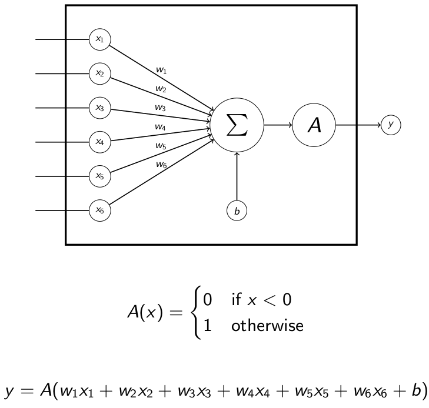

A neuron can be seen as a small machine learning model. In the
previous figure the *inputs* or *features* are
_x<sub>1</sub>,...,x<sub>6</sub>_, the *parameters* or *weights* of
the neuron are _w<sub>1</sub>,...,w<sub>6</sub>_ and the *output* or
*prediction* of the model is `y`.

`A` is called the *activation function* of the neuron, in the previous
figure we see a very simple *threshold* activation function. If its
input is negative it outputs 0, if its input is positive is
outputs 1. This component is there to mimic the behavior of biological
neurons [firing or
not](https://en.wikipedia.org/wiki/Neuron#All-or-none_principle)
depending on the electrical current of their incoming
[synapses](https://en.wikipedia.org/wiki/Synapse). The activation
functions used in neural networks are *[non
linear](https://en.wikipedia.org/wiki/Linear_function)* in order to
allow neural networks to approximate non linear functions.

However, there is a problem with the previous definition. As we will
see later, we want to use some sort of *gradient descent* algorithm to
train our neural networks. These algorithms requires the function we
are trying to optimize to be *differentiable* according to the
parameters of the model. The thresholding activation function that we
saw is not differentiable so we need to replace it by something else.

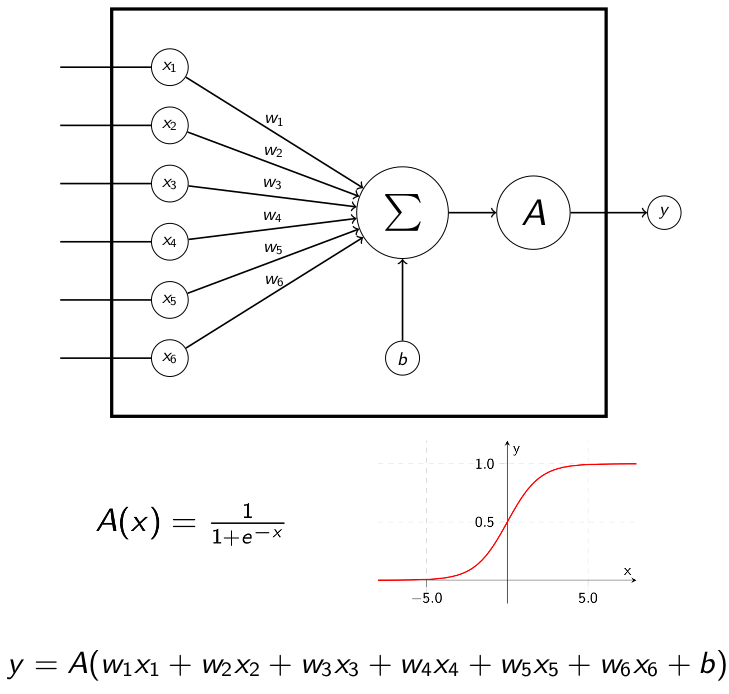

Here, `A` is the [sigmoid
function](https://en.wikipedia.org/wiki/Sigmoid_function). It
approximates the behavior of the thresholding activation while being
differentiable.

There are many different [activation
functions](https://towardsdatascience.com/activation-functions-neural-networks-1cbd9f8d91d6)
that can be used when building neural networks, the sigmoid function
being only one example.

#### Neural networks

Now that we have defined what *neurons* are, let's see how to assemble
them together to form a *neural network*.

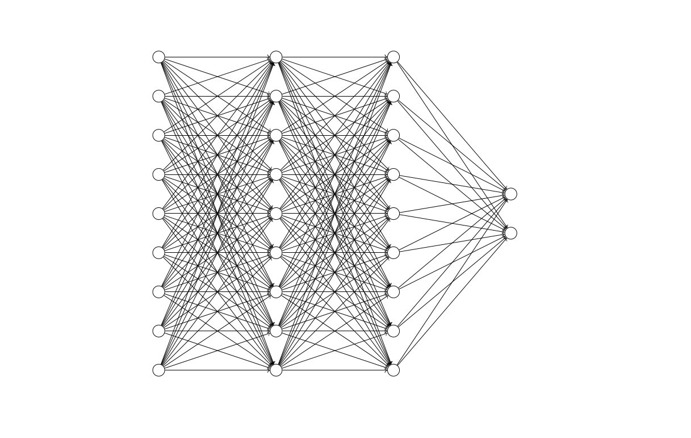

The previous figure shows what we call a *Fully Connected neural
Network* (*FCN*) or *MultiLayer Perceptron* (*MLP*). In this section,
we will describe each of its component.

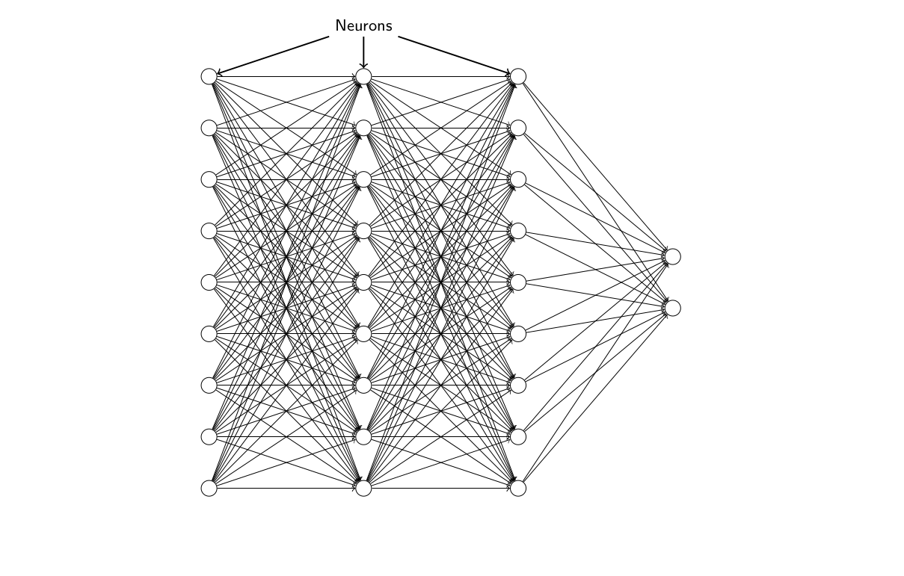

Each of the node in the previous graph is a *neuron*. All the incoming
connections are its *inputs* (the `x`s in the previous section). All
the outgoing connections are *copies of its output* (copies of `y` in
the previous section). We can see that the outputs of neurons on the
left hand size of the network are used as inputs of neurons on the
right hand side.

A column of neurons is called a *layer*. In the example of this
network all the layers are *linear* or *fully connected* as every
output of the layer `t` is used as input for every neuron of the layer
`t + 1`. There are multiple kinds of neural network layers that we
will see later.

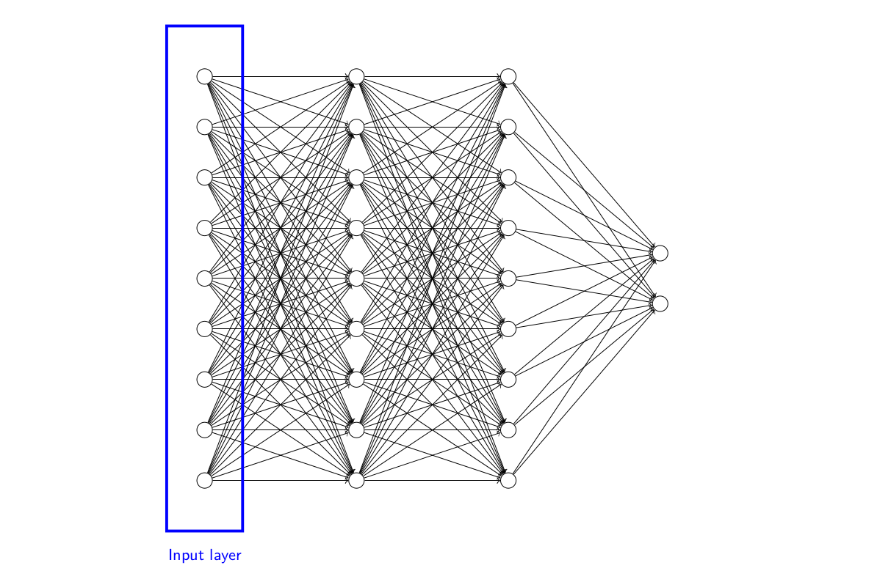

When we use a neural network as a predictive model, we feed it our
*inputs* on the leftmost layer, the *input layer*. Let's say we build
a neural network predicts whether an image depicts a cat or a dog, we
would feed the pixel values of the image to the input layer.

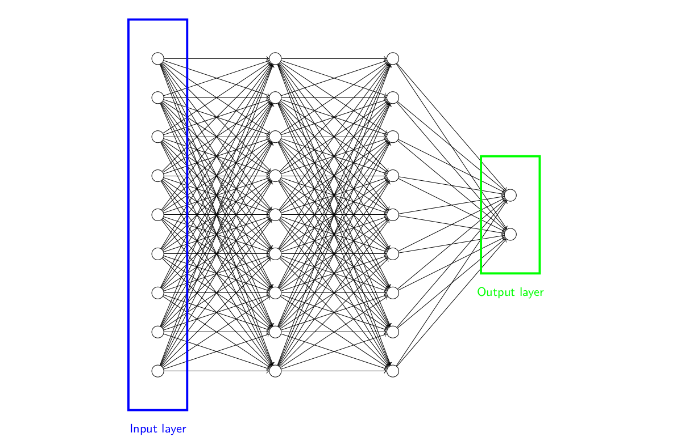

To read the *prediction* or *output* of the neural network, we look at
the values it outputs on the rightmost layer, the *output layer*. In
our previous cat and dog image classifier example, each neuron would
contain a value that represents the confidence of the model that the
image contains a cat or dog. If we had 3 classes of image, we would
have 3 neurons in the output layer.

The input and output layers are what the user of the model has access
to. The user plugs its data as input on the input layer and get the
prediction on the output layer.

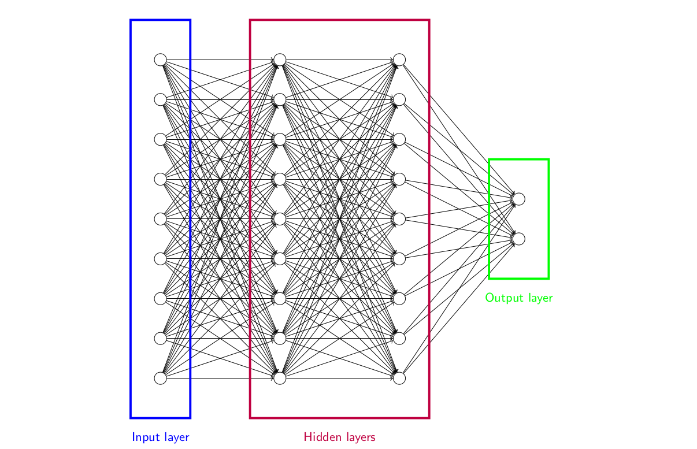

The third type of layer contains neurons in the middle of the network,
these are *hidden layers*. These layers are used by the network to
refine its understanding of the input and analyse the hierarchical
structure of the data.

The "deep" word in "deep learning" comes from "deep neural networks",
neural networks with many hidden layers.

Now that we have defined what a neural network is, let's build one
that computes a simple function. The network will be composed of a
single neuron and we want to make it compute the binary AND function.

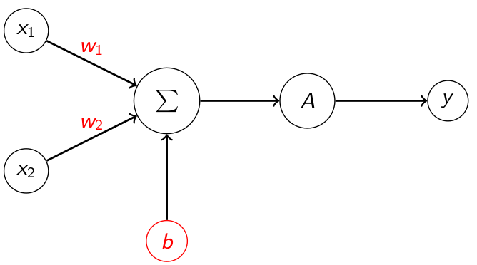

We want to find _w<sub>1</sub>, w<sub>2</sub>_ and _b_ such that

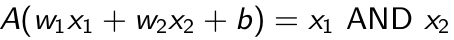

The solution to this exercice is available
[here](appendix/nn_and_solution.md).

#### Softmax activation

In order to apply the classification loss that we will see in the next
section, we need a way to convert a list of outputs from a neural
network into a probability distribution. To do this, we will use an
activation function called the *softmax function*.

The [softmax](https://en.wikipedia.org/wiki/Softmax_function)
is defined as follows:

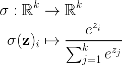

where `k` is the number of classes of our problem and `z` is the list
of `k` values that we want to normalize.

Let's apply the softmax function to a vector to get a sense of how it
works.

```python
>>> model_output = torch.tensor([0.3, -16.2, 5.3, 0.7])
>>> model_output
tensor([  0.3000, -16.2000,   5.3000,   0.7000])

>>> model_output_exp = model_output.exp()
>>> model_output_exp
tensor([1.3499e+00, 9.2136e-08, 2.0034e+02, 2.0138e+00])

>>> model_output_softmax = model_output_exp / model_output_exp.sum()
>>> print(*[f'{value:5.3f}' for value in model_output_softmax], sep = ', ')
0.007, 0.000, 0.983, 0.010
```

We see that the softmax values sum to 1 with one being much larger
than the others.

The softmax function gives us a *differentiable* way to convert our
model outputs into something we can use to compute the *cross entropy
loss*. It quantifies the confidences the network associates to each of
the class relatively to all the others.

#### Cross entropy loss

In the previous lesson, we saw the MSE loss as a way to evaluate the
quality of our model approximations on a *regression* task. This loss
is not suitable for *classification* problems. To evaluate and train
models on classification tasks, we use the *cross entropy* loss:

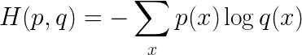

The [cross entropy](https://en.wikipedia.org/wiki/Cross_entropy)
quantifies the difference between two probability distributions `p`
and `q`. An in-depth explanation of the information theory underlying
concepts can be found in the [Stanford CS231n
course](http://cs231n.github.io/linear-classify/). As with the MSE
loss, the ideal value for the cross entropy loss is `0`.

Let's try this formula on an example to get more familiar with
it. Let's say we have a classifier that tries to predict what animal
is in a picture, the classes are `cat`, `dog` and `snake`. We want to
compute the loss value for a specific sample that contains a
`snake`. Our target probability `p` is defined as follow:

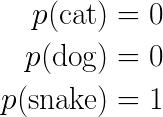

We know that the image contains a `snake` the probability of the
`snake` class is `1` and the probabilities for the other classes are
`0`

When working with classification problems, neural networks attribute a
probability value for each class of the problem. We note this
probability distribution `q`.

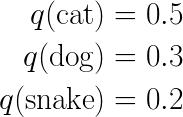

In this first example, the model have a 50% confidence that the image
contains a `cat`, 30% that it contains a `dog` and 20% that is
contains a `snake`. Let's now compute the value of the cross entropy
between `p` and `q`.

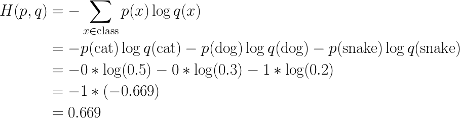

The value of the cross entropy is `0.669`. In this case, the model was
wrong: the highest confidence was on `cat` although the image
contained a `snake`. Let's try again with another model output.

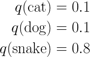

Now the model prediction is correct as the highest confidence is on
`snake`. Let's compute the cross entropy.

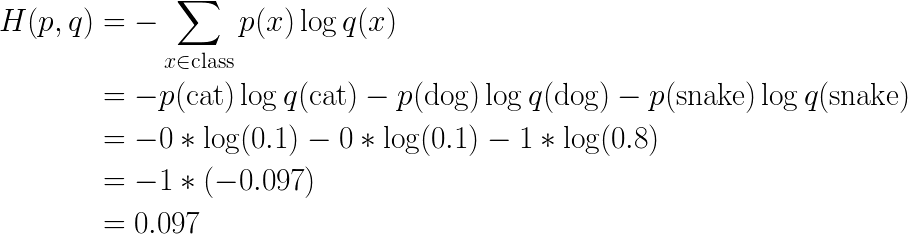

The value of the cross entropy is `0.097` which is much lower than in
the previous case. We can also see that, even though the model
prediction was correct, the loss value is not `0`. The model could
have improved the loss value even further by being more confident in
its prediction.

When performing a training step on a batch of samples, the value that
we are trying to optimize is the *mean cross entropy loss* between the
model predictions and correct labels.

#### PyTorch neural network example

Let's now see how to define and train a neural network using
PyTorch. There is still a few tools missing to understand the whole
process that we will get to study in the following courses. The
complete runable code for the example described in this section is
available [here](src/basic_neural_network_example.py) with a lot of
commentaries.

The task we want to learn in this example is really simple, we want to
determine whether a point `(x, y)` with `-1 <= x, y < 1` is in a
disk. Visually, we want to discriminate between red and violet point
in the following figure.

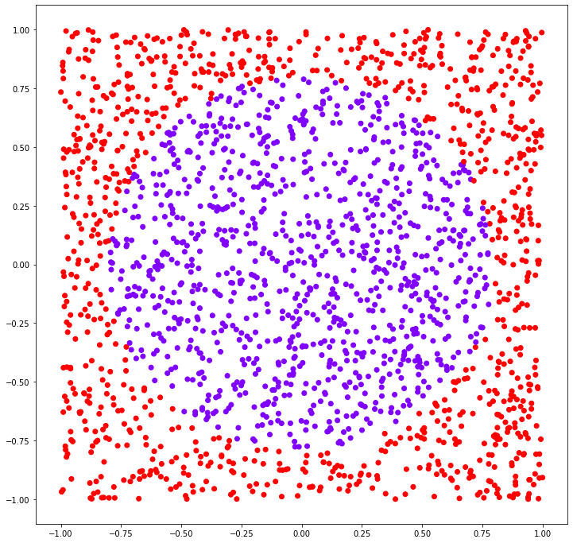

This problem is a classification task, we want the model to output 1
for points inside the disk and 0 for points outside. We will set the
radius of the disk in order to have as many points inside than outside
in our dataset.

First let's write a function that will generate our dataset.

```python
def generate_data(n_samples):
    # We randomly generate points (x, y) with -1 <= x, y < 1
    X              = torch.rand(n_samples, 2) * 2 - 1
    # We compute the Euclidean distance between the origin (0, 0) and
    # each sample
    dist_to_origin = (X ** 2).sum(axis = 1).sqrt()
    # radius value in order to have as many samples inside than
    # outside
    radius         = math.sqrt(2 / math.pi)
    # label is 1 for samples inside the disk and 0 for samples outside
    y              = (dist_to_origin < radius).long()

    return X, y
```

Now let's create our neural network.

```python
import torch
import torch.nn as nn
import torch.nn.functional as F

class SimpleLinearNetwork(nn.Module):
    def __init__(self):
        super(SimpleLinearNetwork, self).__init__()
        self.input_layer  = nn.Linear(2, 64)
        self.hidden_layer = nn.Linear(64, 64)
        self.output_layer = nn.Linear(64, 2)

    def forward(self, x):
        x = self.input_layer(x)
        x = F.relu(x)
        x = self.hidden_layer(x)
        x = F.relu(x)
        x = self.output_layer(x)
        x = torch.log_softmax(x, dim = 1)

        return x
```

In PyTorch, neural networks inherit from `nn.Module`, this
automatically enables mechanisms that we will see later like parameter
registering with the optimizer and automatic differentiation.

In the `__init__` method, we call the parent object (`nn.Module`)
`__init__` method to initialize our network module. We then declare
the layers of our neural network. In this case we will three layers:
- one input layer with two inputs (the coordinates of our points) and
  64 outputs (the size of our hidden layer).
- one hidden layer with 64 inputs and 64 outputs
- one output layer with 64 inputs (the size of our hidden layer) and 2
  outputs (the number of classes of our problem, inside or outside the
  disk).

In this method, we just declare the list of layers that we will use,
how we use them will be declared in the `forward` method.

The `forward` method takes `x` as parameter, `x` is a *batch* of
samples. As our samples are two dimensional, `x` will be of shape
`[batch size, 2]`. It is much faster to perform computations on
batches of samples rather than one by one. In this method we will make
the information *flow* through the network by sequentially applying
our layer computations. Let's take a look at the first layer
application.

```python
x = self.input_layer(x)
x = F.relu(x)
```

`x = self.input_layer(x)` will compute the activation of all the 64
neurons of our input layer for each sample of the batch. After this
line, the shape of `x` will be `[batch size, 64]`, for each element of
the batch, we have the result of the computation for each of the 64
neurons. In PyTorch, applying the activation is done after performing
the layer computations. Here we apply a Rectified Linear Unit
([ReLU](https://en.wikipedia.org/wiki/Rectifier_(neural_networks)))
activation. The activation does not change the shape of our tensor.

```
x = self.hidden_layer(x)
x = F.relu(x)
```

Similarly, we compute the result of the application of our hidden
layer. As our hidden layer takes 64 inputs and outputs 64 values, the
shape of `x` does not change, it is still `[batch size, 64]`.

```
x = self.output_layer(x)
x = torch.log_softmax(x, dim = 1)
```

We now take the output of our hidden layer and pass it through our
output layer. After `x = self.output_layer(x)`, `x` is of shape
`[batch size, 2] = [batch size, number of class]`. In order to compute
the cross entropy to evaluate the performance of our model, we need to
normalize the output of the model using a softmax activation. Just as
when we compute the sum along the lines of a 2D tensor, we have to
precise along which dimension we want to perform the sum operation of
the softmax function. After the line `x = torch.log_softmax(x, dim =
1)` the shape of `x` is `[batch size, 2]` we the sum of values being 1
along the lines of the tensor. The first column corresponds to the
confidence of the model in the class `0` (outside the disk) and the
second column corresponds to the confidence of the model in the class
`1` (inside the disk). Notice that we compute the `log` of the
`softmax` values instead of simply the `softmax`, this is because we
will use the [Negative Log Likelihood Loss
(NLLLoss)](https://pytorch.org/docs/stable/nn.html#nllloss) of PyTorch
that requires this type of normalized inputs.

Let's write the main function of our project.

```python
import torch.optim as optim

def main():
    n_samples     = 3000
    epochs        = 300
    batch_size    = 32
    learning_rate = 1e-3
    X, y          = generate_data(n_samples)
    dataset       = TensorDataset(X, y)
    model         = SimpleLinearNetwork()
    criterion     = nn.NLLLoss()
    optimizer     = optim.SGD(
        params = model.parameters(),
        lr     = learning_rate
    )
    train(model, criterion, optimizer, dataset, epochs, batch_size)
```

The beginning of the function is explicit enough, we generate our
dataset and set the `epochs` (number of times that we will use the
whole dataset to perform parameters update during training),
`learning_rate` and `batch_size` *hyperparameters*.

`dataset = TensorDataset(X, y)` wraps our dataset into the PyTorch
`Dataset` interface. It will later provide us a very simple way to
generate random batches of samples.

We then instanciate our neural network with `model =
SimpleLinearNetwork()`. It is at this point that the weights of all
the neurons will be initialized according to the algorithm specified
in the [documentation](https://pytorch.org/docs/stable/nn.html#linear).

We then create the loss function that we will use to evaluate and
train our model with `criterion = nn.NLLLoss()`. The negative log
likelihood loss corresponds to the cross entropy loss that we have
seen in the previous section.

After this, we create our optimizer. Here we choose to use a simple
Stochastic Gradient Descent (SGD) algorithm, there are many more
available in the [`optim`](https://pytorch.org/docs/stable/optim.html)
module of PyTorch. The first argument `params = model.parameters()`
declares the list of parameters that the optimizer will be allowed to
modify to lower the loss. During the creation of our network, all the
weights of the linear layers have been *registered* as its
*parameters*. The `lr = learning_rate` parameter defines the size of
the steps the optimizer will take in the direction of the gradient.

Once everything is setup, we can call our training function. Let's
define it.

```python
def train(model, criterion, optimizer, dataset, epochs, batch_size):
    dataloader = DataLoader(dataset, batch_size = batch_size, shuffle = True)

    for epoch in range(epochs):
        for X, y in dataloader:
            y_pred = model(X)
            loss   = criterion(y_pred, y)
            loss.backward()
            optimizer.step()
            optimizer.zero_grad()
```

First we create our batch generator. PyTorch provides us with the
`DataLoader` class to create batches of data from a PyTorch
`Dataset`. It is a very powerful tools that is almost always used to
write training or evaluation loops. When using `shuffle = True` the
elements of the dataset will be shuffle everytime we create an
iterator on the `DataLoader` (here, at every epoch).

The first loop `for epoch in range(epochs)` defines the number of
times we will iterate over the dataset.

The second loop `for X, y in dataloader` iterates over batches of the
dataset. Typically, the input `X` will be of shape `[batch size, 2] =
[32, 2]` and the corresponding output `y` will be of shape `[32]`. The
batch size may not be respected for the last batch if the size of the
dataset is not a multiple of the batch size.

The first step of the training loop is to compute the model
predictions on a batch of sample with `y_pred = model(X)`. When using
`model(X)` the `forward` method of the network is called. `y_pred`
will be of shape `[batch size, 2]` with each column corresponding in
the confidence in each of the classes.

Now that we have the model's predictions, we can compute the loss
between these predictions `y_pred` and the target `y` with `loss =
criterion(y_pred, y)`. `loss` will be a single value, the average
cross entropy loss for all the samples in the batch.

Now that we have the loss value on the batch, we want to perform a
weight update using gradient descent. To do this, we need the gradient
of the loss function with respect to the *parameters* of the neural
network. This is done with `loss.backward()`. This computation is done
using the
[*Backpropagation*](https://en.wikipedia.org/wiki/Backpropagation)
algorithm that we will study later in the course. For now let's just
assume that this computation is done and the gradients are stored in
the neural networks right next their corresponding parameters values.

To perform a parameter update using the gradient descent algorithm and
the gradients that we have just computed, we use
`optimizer.step()`. The optimizer already knows what it is allowed to
modify as we have precised the `params` argument during its creation
and, as we just explained, the gradients computed using the `backward`
method are stored next to the parameters their correspond to.

The last step of the training loop is to clean the gradient
computations that we have just did in order to perform the next
optimization step independently of this one. In very specific cases we
do not want to clear the gradients after the end of the loop but this
kind of use is beyond the scope of this course.

Now that we have the training loop for our model, we would like to
evaluate it to know the proportion of correct answer that it outputs.

```python
def evaluate(model, dataset, batch_size):
    dataloader = DataLoader(dataset, batch_size = batch_size, shuffle = False)

    correct_pred = 0
    total_pred   = 0
    with torch.no_grad():
        for X, y in dataloader:
            y_pred        = model(X)
            y_pred_class  = y_pred.argmax(dim = 1)
            correct_pred += (y_pred_class == y).sum().item()
            total_pred   += len(y)

    return correct_pred / total_pred
```

This function looks very similar to the training loop as we are also
iterating over batches to evaluate our model performances. We use the
context `torch.no_grad()` to specify that we will not compute the
gradients in this block, because of the backpropagation algorithm this
speeds up the computation and reduce the memory consumption.

```python
y_pred       = model(X)
y_pred_class = y_pred.argmax(dim = 1)
```

With these two lines, we compute the network predicted class for each
sample of the batch. `argmax` returns the index of the maximum along
the dimension `1`, the index of the class with the greatest
confidence.

With `(y_pred_class == y).sum().item()` we get the number of times the
model prediction corresponds to the label `y`. We use `.item()` to
extract the result from the PyTorch `tensor` into a simple Python
`int`. We also could the total number of prediction done by the model
with `total_pred += len(y)`. The *accuracy* of the model is the
proportion of correct predictions it makes, `correct_pred /
total_pred`.

If we launch the [program](src/basic_neural_network_example.py)
containing all this code with a call to the evaluation function every
10 epochs we get the following output.

```shell
> python basic_neural_network_example.py 
Initial accuracy 49.033%
  0 -> 49.033% accuracy
 10 -> 75.767% accuracy
 20 -> 67.400% accuracy
 30 -> 68.900% accuracy
 40 -> 72.367% accuracy
 50 -> 76.267% accuracy
 60 -> 78.933% accuracy
 70 -> 81.567% accuracy
 80 -> 83.767% accuracy
 90 -> 85.600% accuracy
100 -> 87.267% accuracy
110 -> 88.033% accuracy
120 -> 89.267% accuracy
130 -> 90.000% accuracy
140 -> 91.067% accuracy
150 -> 91.967% accuracy
160 -> 93.200% accuracy
170 -> 94.000% accuracy
180 -> 94.667% accuracy
190 -> 95.167% accuracy
200 -> 95.567% accuracy
210 -> 95.900% accuracy
220 -> 96.267% accuracy
230 -> 96.633% accuracy
240 -> 96.967% accuracy
250 -> 97.033% accuracy
260 -> 97.433% accuracy
270 -> 97.467% accuracy
280 -> 97.533% accuracy
290 -> 97.800% accuracy
```

### Practical work

In this practical work, we will build a linear neural network that
will classify MNIST digits.

#### Dataset downloading and loading

Create a new notebook and, in a new cell, download the dataset using
the following commands:

```shell
!wget http://igm.univ-mlv.fr/~gchatel/ml/mnist_train.pt
!wget http://igm.univ-mlv.fr/~gchatel/ml/mnist_test.pt
```

By using `!` at the beginning of the line, we can use shell commands
in the notebook.

To load the dataset, use `torch.load`

```python
>>> X_train, y_train = torch.load('mnist_train.pt')
>>> X_train.shape, y_train.shape
(torch.Size([60000, 28, 28]), torch.Size([60000]))
```

```python
>>> X_test, y_test = torch.load('mnist_test.pt')
>>> X_test.shape, y_test.shape
(torch.Size([10000, 28, 28]), torch.Size([10000]))
```

We can see that the dataset have two distinct parts. The *training
set* `(X_train, y_train)` composed a 60000 28x28 pixels images that we
will use to train our model and the *test set* `(X_test, y_test)`
composed of 10000 images that we will use to evaluate the
*generalization capabilities* of our model.


#### Visualize images

Import `matplotlib` using the following commands

```python
import matplotlib.pyplot as plt
```

Visualize a few training images using the function
[`plt.imshow`](https://matplotlib.org/3.1.1/api/_as_gen/matplotlib.pyplot.imshow.html)
along with their corresponding labels.

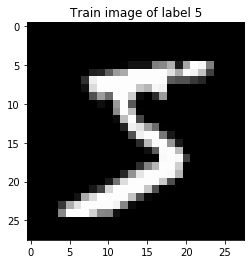

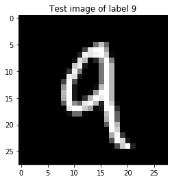

#### Data reshaping

Once the data is loaded, reshape the tensors in order to consider the
images as 1D `float` tensors.

#### Data normalization

The first step of the machine learning process consists in normalizing
our data. We want to transform the images in a way that the pixel
values such that the mean is 0 and the standard deviation is 1. We
have seen this procedure in the previous practical work.

As we do not want to *cheat* we will standardize the *test set* using
the mean and the standard deviation of the *training set* as the test
set is supposed to represent new data which could not have been used
to compute the mean and the standard deviation.

#### Model building

Create a neural network that takes the 1D representation of the images
and outputs confidence levels for the the 10 digit classes. The number
of layers and the number of neurons in each layer is up to you. Use
the neural network presented during the course as a base.

#### Training and evaluation code

Write a training function and an evalution function inspired by the
ones we have seen in the course.

The training function takes both the training and testing datasets as
input. At regular intervals (for example every 500 batches), perform
an evaluation of the model on just a few batches (for example 150) of
the training set and of the testing set to check that our model is
indeed learning something.

The execution of your code should display something like this:

```
[  0][    0] -> 10.208% training accuracy 10.052% testing accuracy
[  0][  500] -> 11.010% training accuracy 11.135% testing accuracy
[  1][    0] -> 15.958% training accuracy 15.937% testing accuracy
[  1][  500] -> 29.531% training accuracy 30.531% testing accuracy
[  2][    0] -> 40.302% training accuracy 40.260% testing accuracy
[  2][  500] -> 50.958% training accuracy 50.833% testing accuracy
[  3][    0] -> 54.490% training accuracy 53.885% testing accuracy
[  3][  500] -> 54.333% training accuracy 54.667% testing accuracy
[  4][    0] -> 58.396% training accuracy 59.396% testing accuracy
[  4][  500] -> 68.510% training accuracy 68.594% testing accuracy
[  5][    0] -> 73.562% training accuracy 74.042% testing accuracy
[  5][  500] -> 77.000% training accuracy 77.417% testing accuracy
[  6][    0] -> 79.167% training accuracy 79.865% testing accuracy
[  6][  500] -> 80.688% training accuracy 81.500% testing accuracy
[  7][    0] -> 82.917% training accuracy 83.042% testing accuracy
[  7][  500] -> 83.396% training accuracy 84.604% testing accuracy
[  8][    0] -> 85.458% training accuracy 85.542% testing accuracy
[  8][  500] -> 86.333% training accuracy 86.625% testing accuracy
[  9][    0] -> 86.865% training accuracy 87.094% testing accuracy
[  9][  500] -> 87.781% training accuracy 87.646% testing accuracy
[ 10][    0] -> 87.802% training accuracy 88.094% testing accuracy
[ 10][  500] -> 87.917% training accuracy 88.615% testing accuracy
[ 11][    0] -> 88.833% training accuracy 88.812% testing accuracy
[ 11][  500] -> 88.865% training accuracy 88.990% testing accuracy
[ 12][    0] -> 88.771% training accuracy 89.344% testing accuracy
[ 12][  500] -> 89.562% training accuracy 89.635% testing accuracy
[ 13][    0] -> 89.531% training accuracy 89.740% testing accuracy
[ 13][  500] -> 89.656% training accuracy 89.833% testing accuracy
[ 14][    0] -> 89.458% training accuracy 89.844% testing accuracy
[ 14][  500] -> 89.844% training accuracy 90.260% testing accuracy
[ 15][    0] -> 90.198% training accuracy 90.385% testing accuracy
[ 15][  500] -> 90.531% training accuracy 90.562% testing accuracy
[ 16][    0] -> 90.552% training accuracy 90.490% testing accuracy
[ 16][  500] -> 90.406% training accuracy 90.844% testing accuracy
[ 17][    0] -> 90.469% training accuracy 90.844% testing accuracy
[ 17][  500] -> 90.562% training accuracy 90.969% testing accuracy
[ 18][    0] -> 90.906% training accuracy 91.104% testing accuracy
[ 18][  500] -> 90.969% training accuracy 91.281% testing accuracy
[ 19][    0] -> 91.312% training accuracy 91.260% testing accuracy
[ 19][  500] -> 90.844% training accuracy 91.521% testing accuracy
```

#### Visualize errors

Write a function that allows you to visualize the images on which the
model predictions were wrong. In order to visualize these images using
`plt.imshow` you will have to undo the normalization that we performed
earlier.

## Lesson 3

### Course

### Practical work

## Lesson 4

### Course

### Practical work

## Lesson 5

### Course

### Practical work

## Lesson 6

### Course

### Practical work

## References

- [Google machine learning crash course](https://developers.google.com/machine-learning/crash-course)
- [Python Data Science Handbook](https://nbviewer.jupyter.org/github/jakevdp/PythonDataScienceHandbook/blob/master/notebooks/Index.ipynb) by Jake VanderPlas
- [PyTorch tutorials](https://pytorch.org/tutorials/)
- [Oxford Deep NLP course](https://github.com/oxford-cs-deepnlp-2017/lectures)
