# Deep Natural Language Processing

## Summary

- [Lesson 1](#lesson-1)
- [Lesson 2](#lesson-2)
- [Lesson 3](#lesson-3)
- [Lesson 4](#lesson-4)
- [Lesson 5](#lesson-5)
- [Lesson 6](#lesson-6)

## Lesson 1

### Course

#### General presentation of Data Science

General concept of data science: Extracting *knowledge* and *insights*
from data. There is a huge variety of methods to do it, ranging from
basic statistics to deep neural networks.

Machine learning systems learn how to combine *input* to produce
useful *predictions* on *never-before-seen* data.

General concepts of machine learning:
  - Labels: A *label* is the thing we're predicting - the `y` variable
    in simple linear regression (_y = ax + b_). The label could be the
    future price of wheat, the kind of animal shown in a picture, the
    meaning of an audio clip, or just about anything.
  - Features: A *feature* is an input variable - the `x` variable in a
    simple linear regression (_y = ax + b_). A simple machine learning
    project might use a single feature, while a more sophisticated
    machine learning project could use millions of features, specified
    as: _x<sub>1</sub>_,_x<sub>2</sub>_, ..., _x<sub>n</sub>_.
  - Models: A *model* defines the relationship between features and
    label - `ax + b` in a simple linear regression (_y = ax + b_). For
    example, a spam detection model might associate certain features
    strongly with "spam". Let's highlight two phases of a model's
    life. *Training* means creating or *learning* the model. That is,
    you show the model labeled examples and enable the model to
    gradually learn the relationship between features and label. In
    the case of a linear regression, it consists in finding "good"
    values for `a` and `b`, the *parameters* of the model. *Inference*
    means applying the trained model to unlabeled examples. That is,
    you use the trained model to make useful predictions (`y'`). For
    example, during inference, you can predict for a new incoming mail
    whether it is spam or not.
  - Supervised learning: In *supervised* learning, we model the
    relationship input and output. Depending on the type of
    values predicted by the model, we call it either a
    *regression* model or a *classification* model. A regression
    model predicts continuous values. For example, regression
    models make predictions that answer questions like "What is
    the value of a house in California?" or "What is the
    probability that a user will click on this ad?". A
    classification model predicts discrete values. For example,
    classification models make predictions that answer questions
    like "Is a given message spam or not spam?" or "Is this an
    image of a dog, a cat, or a hamster?".
  - Unsupervised learning: In *unsupervised* learning, we model
    the features of a dataset without reference to any label. It
    is often described as "letting the dataset speak for
    itself". These type of machine learning model include tasks
    such as *clustering* or *dimensionality
    reduction*. Clustering algorithms identify distinct groups
    of data while dimensionality reduction algorithms search for
    a more succinct representations of the data.
  - There exist more learning paradigms such as [Reinforcement
    learning](https://en.wikipedia.org/wiki/Reinforcement_learning)
    (AlphaGo), [Semi-supervised
    learning](https://en.wikipedia.org/wiki/Semi-supervised_learning)
    (hybrid between supervised and unsupervised) and
    [Self-supervised
    learning](https://lilianweng.github.io/lil-log/2019/11/10/self-supervised-learning.html)
    (a kind of unsupervised learning in which we use the data
    itself to create a "virtual" supervision, an example of
    self-supervised model would be a learned
    compressor-decompressor).

#### Deep learning

Deep learning is a part of machine learning methods based on
*artificial neural networks*. Artificial neural networks are a family
of computation models _vaguely_ inspired by the biological neural
networks that constitute animal brains. We will go briefly over the
history of this discipline and then study the example of the linear
regression. While not a neural network per se, understanding all its
concepts should give a very solid base for studying deep neural
networks.

##### History

A short history of deep learning (from
[Wikipedia](https://en.wikipedia.org/wiki/Timeline_of_machine_learning)):
- 1951: First neural network machine by Marvin Minsky
- 1957: Invention of the
  [Perceptron](https://en.wikipedia.org/wiki/Perceptron) by Frank
  Rosenblatt
- 1970: [Automatic
  differentiation](https://en.wikipedia.org/wiki/Automatic_differentiation)
  by Seppo Linnainmaa
- 1980: [Neocognitron](https://en.wikipedia.org/wiki/Neocognitron),
  the inspiration for [convolutional neural
  networks](https://en.wikipedia.org/wiki/Convolutional_neural_network)
  by Kunihiko Fukushima
- 1982: [Hopfield
  networks](https://en.wikipedia.org/wiki/Hopfield_network), a type of
  recurrent neural network
- 1997: [Long short-term
  memory](https://en.wikipedia.org/wiki/Long_short-term_memory)
  recurrent neural networks by Sepp Hochreiter and Jürgen Schmidhuber
- 1998: Neural networks on [MNIST](http://yann.lecun.com/exdb/mnist/),
  an digit image classification dataset

##### Linear regression

Inspired by [ML crash course](https://developers.google.com/machine-learning/crash-course/descending-into-ml/training-and-loss)

Finding "good" parameters `a` and `b` of a line `y = ax + b` to
approximate a set of point is an example of machine learning. The set
of points `(x, y)` is the *dataset* or *training data* of the
problem. In this case, the *model* is a Linear Regression (a line of
equation `y = ax + b`).  Finding "good" parameters for `a` and `b`
using labelled examples is the *training process*, *optimization* or
*learning* of the model and to define what being a "good model" means
we will need a *loss function*.

#### Loss function

The *loss function* used to evaluate a model. It penalizes bad
prediction. If the model's prediction is perfect, the loss is zero
otherwise, the loss is greater. The goal of *training* model is to
find a set of parameters (in our case `a` and `b`) that have low loss,
on average, across all examples.


Notice that the arrows in the left plot are much longer than their
counterparts in the right plot. Clearly, the line in the right plot is
a much better predictive model than the line in the left plot.

You might be wondering whether you could create a mathematical
function - a loss function - that would aggregate the individual
losses in a meaningful fashion.

The linear regression models we'll examine here use a loss function
called *squared loss* (also known as *L<sub>2</sub> loss*). The
squared loss of a model `y' = ax + b` for a single example `(x, y)` is
as follows:

- = the square of the difference between the label and the prediction
- = (observation - prediction(x))<sup>2</sup>
- = (y - y')<sup>2</sup>
- = (y - (ax + b))<sup>2</sup>
- = (y - ax - b) <sup>2</sup>

*Mean square error (MSE)* is the average squared loss per example over
the whole dataset. To calculate MSE, sum up all the squared losses for
individual examples and then divide by the number of examples:


where:
- `(x, y)` is an example in which
    - `x` is the set of features (for example, chirps / minute, age,
      gender) that the model uses to make predictions.
    - `y` is the example's label (for example, temperature).
- `prediction(x)` is a function of the weights and bias in combination
  with the set of features `x`. In our case case `prediction(x) = ax +
  b`.
- `D` is a data set containing many labeled examples, which are `(x,
  y)` pairs.
- `N` is the number of examples in `D`.

Although MSE is commonly-used in machine learning, it is neither the
only practical loss function nor the best loss function for all
circumstances. Because of the squaring operation, a single *large*
difference between a prediction and a label will be penalized more
than many smaller ones.

A *high loss value* signifies that the models' predictions are poor
approximation of the labels. Conversely a *small loss value* means
that our model captures the structure of the data. Now that we know
that, we will take a look at algorithms designed to lower the loss of
a specific model on a specific dataset by modifying its parameters.

#### Training algorithms

##### Iterative approach

The procedure that we will use to learn our model is *iterative*. We
start with a random guess for each parameter of our model (here `a`
and `b`), we compute the loss to evaluate how good our current
parameters are and, using this loss, we will compute an update hoping
to lower the loss on the next iteration.

The following figure summarizes the process:


To be able to apply this procedure to our problem, we have to find a
way to compute parameters updates.

##### Gradient descent

Suppose we had the time and the computing resources to calculate the
loss for all possible values of `a` (w<sub>1</sub> in the
figures). For the kind of regression problems we have been examining,
the resulting plot of loss vs `a` will always be *convex*. In other
words, the plot will always be bowl-shaped, kind of like this:


Convex problems have only one minimum; that is, only one place where
the *slope* is exactly 0. The minimum is where the loss function
converges.

As computing the loss function for all values of `a` to find its
minimum would be extremely inefficient we need a better
mechanism. Let's examine such an algorithm, the *gradient descent*.

As explained in the previous section, we start with a random guess for
our parameter.


Now that we have an initial value for our parameter `a`, we can
compute the loss value for our linear regression. Next, we would like
to know whether we should *increase* or *decrease* the value of `a` to
make the loss decrease.

To get this information, the gradient descent algorithm calculates the
*gradient* of the loss curve at the current point. In the next Figure,
the gradient of the loss is equal to the derivative (slope) of the
curve and tells you that you should *increase* the value of `a` to
make the loss value decrease.


As the gradient of a curve approximates it well in a very small
neighborhood, we add a small fraction (this fraction is called
*learning rate*) of the gradient magnitude to the starting point.


Now that we have a new (and hopefully better) value for `a`, we
iterate the previous process to improve it even further.

##### Learning rate

The *learning rate* is an *hyperparameter* in this problem, a
*parameter of the training process*, not of the model. It is important
to note that the learning rate (which determines the size of the steps
during the descent process) should neither be too small (otherwise the
training process will take very long to converge) nor too big (which
can lead to the process not converging at all).

[Interactive graph of the learning rate
importance](https://developers.google.com/machine-learning/crash-course/fitter/graph)

##### Gradient descent on many parameters

In the example that we have seen earlier we used the gradient descent
to find the correct value for a single parameter. In cases where we
have more parameters (`a` and `b` for a line equation), we compute the
gradient of the loss function (the derivatives according to each of
the variable) and update them all at once.

Let's compute the gradients of `a` and `b` in our example. First lets
recall and develop the MSE loss formula in our case.


Now we want to differentiate this function according to `a` and `b`
separately. Let's start with `a`. In order to simplify the
computation we factor the previous formula by `a`.


from there we easily compute the derivative of the loss according to
`a`.


Now onto `b`, we follow a similar process. First we factor by `b`.


from there we compute the derivative of `l` according to `b`.


An animation of an application of the gradient descent algorithm on a
linear regression problem can be found [here](../figures/anim_gd.pdf).

##### Stochastic version

In real problems, it is often not practical to compute the value of
the average loss across all of the training set as it often contains a
huge quantity of data.

To deal with this problem, we run the gradient descent using
*batches*. A batch is a subset of the training set (usually 10 to 1000
examples) that we use to compute an approximation of the gradient. The
larger the size of the batches the better the gradient approximation,
the more robust the training procedure is. By using this algorithm, we
trade robustness for efficiency.

##### Takeaways

The main takeaways of this section are the following:
- Artificial neural network have existed for a long time.
- The two main components that made them "work" were the
  backpropagation algorithm (automatic differentiation) and the advent
  of more powerful computers.
- Artificial Neural Networks are huge derivable functions that we
  optimize using a variant of the Stochastic gradient descent
  algorithm.

### Practical work

PyTorch tensor practical work, inspired from [Python Data Science
Handbook](https://nbviewer.jupyter.org/github/jakevdp/PythonDataScienceHandbook/blob/master/notebooks/02.00-Introduction-to-NumPy.ipynb)

In this practical work, we will setup a Python environment and
discover PyTorch tensors. Tensors are the PyTorch version of NumPy
[ndarray](https://docs.scipy.org/doc/numpy/reference/generated/numpy.ndarray.html)
with additional capabilities specific to GPU use and automatic
differentiation. Most the methods available on NumPy arrays have an
equivalent with PyTorch tensors but the name may be different.


#### Anaconda setup

[Anaconda](https://www.anaconda.com/distribution/): Anaconda is a
Python distribution with great machine learning integration working on
Linux, Windows and Mac OS X. Using it instead of the default Python
distribution of the OS will allow us to have a finer control without
the need for administrator privileges.

During this course, we will a *virtual environments*. A virtual
environment is a tool that helps to keep dependencies required by
different projects separate by creating isolated Python *virtual*
environments for them. It also provides a way to easily reproduce the
environment required to run a specific piece of code. This is one of
the most important tools that most of the developers use, even outside
of the data science world. In this course we will use Anaconda virtual
environments instead of `virtualenv` or `pipenv` because Anaconda
environments are able to keep track of packages installed with
`conda` (Anaconda package manager).

Downloading the Python 3.7 version of Anaconda from [this
address](https://www.anaconda.com/distribution/)

Launch the installation shell script.

```shell
> chmod u+x Anaconda3-2019.10-Linux-x86_64.sh
> ./Anaconda3-2019.10-Linux-x86_64.sh
```

The installer will ask you if it should modify your `.bashrc` to add
the anaconda folders to the `PATH`, answer yes.

Now that anaconda in installed, we will create a virtual environment
in which we will setup all our libraries. The documentation for the
anaconda virtual environment management is available
[here](https://docs.conda.io/projects/conda/en/latest/user-guide/tasks/manage-environments.html).

I have already created a virtual environment containing all the
libraries that we will use during this course. Download the export
file [here](../env_files/deep_nlp.yml) and import the environment using
the following command:

```shell
conda env create -f deep_nlp.yml
```

#### Creation of PyTorch tensors

We can use `torch.tensor` to create tensors (arrays) from Python
lists:

```python
>>> import torch
>>> torch.tensor([1,2,3,4,5])
tensor([1, 2, 3, 4, 5])
```

All the values in a PyTorch tensor have to contain the same type or be
compatible via up-cast:

```python
>>> torch.tensor([3.14, 2, 3, 4])
tensor([3.1400, 2.0000, 3.0000, 4.0000])
```

NumPy arrays can be multi-dimensional. Here we create a 2 dimensional
array using a list of lists.

```python
>>> a = torch.tensor([range(i, i + 3) for i in [2, 4]])
>>> a
tensor([[2, 3, 4],
        [4, 5, 6]])

>>> a.ndim
2

>>> a.shape
torch.Size([2, 3])

>>> a.dtype
torch.int64
```

`a.ndim` tells us that we have created a 2D tensor. `a.shape` tells us
that the first dimension being of length 2 (rows) and the second one
being of length 3 (columns). `a.dtype` tells us that the tensor
contains integers stored on 64 bytes. It is important to note that
these are not Python arbitrary precision integers. In order to perform
fast computations on a large quantity of data PyTorch uses internally
low level types (more explanations on this subject
[here](https://pytorch.org/docs/stable/tensors.html)).

There are many efficient ways to create a variety of PyTorch tensors,
most of them identical to the NumPy counterparts described
[here](https://nbviewer.jupyter.org/github/jakevdp/PythonDataScienceHandbook/blob/master/notebooks/02.01-Understanding-Data-Types.ipynb#Creating-Arrays-from-Scratch). The
official documentation for PyTorch tensor creation is available
[here](https://pytorch.org/docs/stable/torch.html#creation-ops)

Exercises, from
[ML+](https://www.machinelearningplus.com/python/101-numpy-exercises-python/):
- Create a 1D array of numbers from 0 to 9

```python
tensor([0, 1, 2, 3, 4, 5, 6, 7, 8, 9])
```

- Create a 3×3 PyTorch tensor of all True’s

```python
tensor([[True, True, True],
        [True, True, True],
        [True, True, True]])
```

#### Indexing

Now that we can create NumPy arrays, let's learn how to access
the values they contain.

For 1D tensors, indexing elements can be done similarly to Python
lists:

```python
>>> a = torch.tensor([5, 0, 3, 3, 7, 9])
>>> a
tensor([5, 0, 3, 3, 7, 9])

>>> a[0]
tensor(5)

>>> a[2]
tensor(3)

>>> a[-1]
tensor(9)

>>> a[-2]
tensor(7)
```

In a multi-dimensional tensors, items can be accessed using a
comma-separated tuple of indices:

```python
>>> a = torch.tensor([[3, 5, 2, 4], [7, 6, 8, 8], [1, 6, 7, 7]])
>>> a
tensor([[3, 5, 2, 4],
        [7, 6, 8, 8],
        [1, 6, 7, 7]])

>>> a[0]
tensor([3, 5, 2, 4])

>>> a[0][2]
tensor(2)

>>> a[0, 2]
tensor(2)

>>> a[-1, -2]
tensor(7)

>>> a[-1, -2] = 10
>>> a
tensor([[ 3,  5,  2,  4],
        [ 7,  6,  8,  8],
        [ 1,  6, 10,  7]])
```

#### Slicing

Like with usual Python lists, we can create subtensors using the
*slice* notation. The PyTorch slicing follows that of the standard
Python list; to access a slice of an array `x`, use this:

```python
x[start:stop:step]
```

If any of these are unspecified, they default to the values `start =
0`, `stop = size of dimension`, `step = 1`.

```python
>>> x = torch.arange(10)
>>> x
tensor([0, 1, 2, 3, 4, 5, 6, 7, 8, 9])
>>> x[:5] # first five elements
tensor([0, 1, 2, 3, 4])
>>> x[5:] # elements after index 5
tensor([5, 6, 7, 8, 9])
>>> x[4:7] # middle sub-array
tensor([4, 5, 6])
>>> x[::2] # every other element
tensor([0, 2, 4, 6, 8])
>>> x[1::2] # every other element, starting at index 1
tensor([1, 3, 5, 7, 9])
```

As of today, PyTorch does not support using a [negative step
size](https://github.com/pytorch/pytorch/issues/229) to flip a
tensor. The same behavior can be obtained by using `torch.flip`
although this operation creates a copy of the tensor and not a view
(this will be explained later).

```python
>>> torch.flip(x, dims = (0,))
tensor([9, 8, 7, 6, 5, 4, 3, 2, 1, 0])
```

We can also slice multidimensional arrays. Like with indexing, we will
specify the slicing indices for each dimension separated by `,`.

```python
>>> x = torch.tensor([[12,  5,  2,  4], [ 7,  6,  8,  8], [ 1,  6,  7,  7]])
>>> x
tensor([[12,  5,  2,  4],
        [ 7,  6,  8,  8],
        [ 1,  6,  7,  7]])

>>> x[:2, :3] # first two rows, first three columns
tensor([[12,  5,  2],
        [ 7,  6,  8]])

>>> x[:, ::2] # all rows (: is a slicing with default start and stop), every other column
tensor([[12,  2],
        [ 7,  8],
        [ 1,  7]])
```

An _extremely important_ concept to keep in mind when working with
tensor slices is that they return *views* rather than *copies* of the
array data. When slicing Python lists, the slice is a copy of the
original array, this is not the case with `torch.tensor` slices.

```python
>>> x = torch.tensor([[12,  5,  2,  4], [ 7,  6,  8,  8], [ 1,  6,  7,  7]])
>>> x
tensor([[12,  5,  2,  4],
        [ 7,  6,  8,  8],
        [ 1,  6,  7,  7]])

>>> x2 = x[:2, :2]
>>> x2
tensor([[12,  5],
        [ 7,  6]])

>>> x2[0, 0] = 99
>>> x2
tensor([[99,  5],
        [ 7,  6]])

>>> x
tensor([[99,  5,  2,  4],
        [ 7,  6,  8,  8],
        [ 1,  6,  7,  7]])
```

Keeping this fact in mind will spare you from terrible debugging
sessions.

Exercises:
All the exercises use the following array:

```python
>>> x = torch.tensor([[12,  5,  2,  4], [ 7,  6,  8,  8], [ 1,  6,  7,  7]])
>>> x
tensor([[12,  5,  2,  4],
        [ 7,  6,  8,  8],
        [ 1,  6,  7,  7]])
```

1. Select the last line of `x`

```python
tensor([1, 6, 7, 7])
```

2. Slice the two sevens on the last line of `x`

```python
tensor([7, 7])
```

3. (_harder_) Slice and reverse the lines and the columns of the top right rectangle

```python
tensor([[8, 8, 6],
        [4, 2, 5]])
```

#### Shape manipulation

Another useful type of operation is reshaping of arrays. The most
flexible way of doing this is with the `reshape` method. For example,
if you want to put the number `1` through `9` in a `3x3` grid, you can
do the following:

```python
>>> torch.arange(1, 10).view(3, 3)
tensor([[1, 2, 3],
        [4, 5, 6],
        [7, 8, 9]])
```

You can use `-1` as a joker when reshaping, PyTorch will deduce the
correct value from the number of elements of the array.

```python
>>> torch.arange(1, 10).view(3, -1)
tensor([[1, 2, 3],
        [4, 5, 6],
        [7, 8, 9]])
```

A common thing to do when working with tensors is to flatten them
using `.view(-1)`.

```python
>>> x = torch.arange(1, 10).view(3, -1)
>>> x
tensor([[1, 2, 3],
        [4, 5, 6],
        [7, 8, 9]])

>>> x.view(-1)
tensor([1, 2, 3, 4, 5, 6, 7, 8, 9])
```

Another common reshaping pattern is the conversion of a
one-dimensional array into a two-dimensional row or column
matrix. This can be done with the view method, or more easily by
making use of `None` keyword within a slice operation:

```python
>>> x = torch.tensor([1, 2, 3])

>>> x.view(1, 3) # Row vector via view
tensor([[1, 2, 3]])

>>> x[None, :] # Row vector via None
tensor([[1, 2, 3]])

>>> x.view(3, 1) # Column vector via view
tensor([[1],
        [2],
        [3]])

>>> x[:, None] # Column vector via None
tensor([[1],
        [2],
        [3]])
```

Exercises:
1. Create a 3D tensor containing the numbers from `1` to `27` with shape
  `(3, 3, 3)`

```python
tensor([[[ 1,  2,  3],
         [ 4,  5,  6],
         [ 7,  8,  9]],

        [[10, 11, 12],
         [13, 14, 15],
         [16, 17, 18]],

        [[19, 20, 21],
         [22, 23, 24],
         [25, 26, 27]]])
```

2. Create the following tensor

```python
tensor([[ 0,  2],
        [ 4,  6],
        [ 8, 10],
        [12, 14],
        [16, 18]])
```

3. Using the answer to question 2, create the following tensor

```python
tensor([[16, 18],
        [12, 14],
        [ 8, 10],
        [ 4,  6],
        [ 0,  2]])
```

4. Using the answer to question 2, create the following tensor

```python
tensor([[18, 16],
        [14, 12],
        [10,  8],
        [ 6,  4],
        [ 2,  0]])
```

5. (_harder_) Create the following tensor
```python
tensor([ 2,  1,  4,  3,  6,  5,  8,  7, 10,  9, 12, 11])
```

#### Combination

It is possible to combine multiple tensors into one, and to conversely
split a single tensor into multiple tensors.

First, to concatenate multiple 1D tensors, we can simply do the
following:

```python
>>> x = torch.tensor([1, 2, 3])
>>> y = torch.tensor([4, 5, 6])

>>> torch.cat([x, y])
tensor([1, 2, 3, 4, 5, 6])

>>> torch.cat([x, y, x])
tensor([1, 2, 3, 4, 5, 6, 1, 2, 3])
```

We can also concatenate multidimensional arrays by precising the axis
(dimension) along which we want to perform the concatenation:

```python
>>> y = torch.arange(6, 12).view(2, 3)
>>> x = torch.arange(6).view(2, 3)
>>> x
tensor([[0, 1, 2],
        [3, 4, 5]])

>>> y = torch.arange(6, 12).view(2, 3)
>>> y
tensor([[ 6,  7,  8],
        [ 9, 10, 11]])

>>> torch.cat([x, y], dim = 0) # Concatenate along dimension 0 (rows)
tensor([[ 0,  1,  2],
        [ 3,  4,  5],
        [ 6,  7,  8],
        [ 9, 10, 11]])

>>> torch.cat([x, y]) # The default concatenation dimension is 0
tensor([[ 0,  1,  2],
        [ 3,  4,  5],
        [ 6,  7,  8],
        [ 9, 10, 11]])

>>> torch.cat([x, y], dim = 1) # Concatenate along dimension 1 (columns)
tensor([[ 0,  1,  2,  6,  7,  8],
        [ 3,  4,  5,  9, 10, 11]])
```

Exercises:
All the exercises use the following tensors:

```python
>>> x = torch.tensor([1, 2, 3])
>>> y = torch.arange(6).view(2, 3)
>>> y
tensor([[0, 1, 2],
        [3, 4, 5]])
```

1. Concatenate `x` and `y` to create the following tensor. Be careful
   of the shapes of the array you are manipulating.

```python
tensor([[1, 2, 3],
        [0, 1, 2],
        [3, 4, 5]])
```

2. (_harder_) Using `x`, `y` and `torch.cat` create the following array

```python
tensor([[0, 1, 2, 1, 2, 3],
        [3, 4, 5, 1, 2, 3]])
```

#### Aggregations

Multiple aggregations methods are available in NumPy. Here are a few
examples:

```python
>>> x = torch.arange(10, dtype = torch.float32) # Have to precise floating type to compute mean and std
>>> x
tensor([0., 1., 2., 3., 4., 5., 6., 7., 8., 9.])

>>> x.sum()
tensor(45.)

>>> x.mean()
tensor(4.5000)

>>> x.std()
tensor(3.0277)

>>> x.min()
tensor(0.)

>>> x.max()
tensor(9.)
```

Similarly to the `torch.cat` function, we can precise along which axis
we want to perform the computation.

```python
>>> x = torch.arange(12, dtype = torch.float32).reshape(3, 4)
>>> x
tensor([[ 0.,  1.,  2.,  3.],
        [ 4.,  5.,  6.,  7.],
        [ 8.,  9., 10., 11.]])

>>> x.sum(dim = 0) # Sum along the rows, we have one result by column
tensor([12., 15., 18., 21.])

>>> x.sum(dim = 1) # Sum along the columns, we have one result by row
tensor([ 6., 22., 38.])

>>> x.mean(dim = 0) # Mean along the rows, we have one result by column
tensor([4., 5., 6., 7.])

>>> x.mean(dim = 1) # Mean long the columns, we have one result by row
tensor([1.5000, 5.5000, 9.5000])

>>> x.min(dim = 0) # Minimum along the rows, we get two tensors, the first one with
                   # the value of the min for each column, the second one with the
                   # index of the row in which the minimum is.
torch.return_types.min(
values=tensor([0., 1., 2., 3.]),
indices=tensor([0, 0, 0, 0]))

>>> x.min(dim = 1) # Minimum along the columns, we get two tensors, the first one with
                   # the value of the min for each row, the second one with the
                   # index of the column in which the minimum is.
torch.return_types.min(
values=tensor([0., 4., 8.]),
indices=tensor([0, 0, 0]))
```

Exercise:

1. Compute, for each column, the mean of the values of the rows of
   even index in the following tensor.

```python
>>> x = torch.arange(49, dtype = torch.float32).view(7, 7)
>>> x
tensor([[ 0.,  1.,  2.,  3.,  4.,  5.,  6.],
        [ 7.,  8.,  9., 10., 11., 12., 13.],
        [14., 15., 16., 17., 18., 19., 20.],
        [21., 22., 23., 24., 25., 26., 27.],
        [28., 29., 30., 31., 32., 33., 34.],
        [35., 36., 37., 38., 39., 40., 41.],
        [42., 43., 44., 45., 46., 47., 48.]])
```

The result should be

```python
tensor([21., 22., 23., 24., 25., 26., 27.])
```

#### Broadcasting

Now that we know basic manipulations on PyTorch tensors, we can start
making operations between them.

When arrays have identical sizes, binary operations are performed on
an element-by-element basis:

```python
>>> a = torch.tensor([1, 2, 3])
>>> b = torch.tensor([5, 5, 5])
>>> a + b
tensor([6, 7, 8])
```

*Broadcasting* allows these types of binary operations to be performed
on arrays of different sizes. For example, we can just add a scalar
(think of it as a zero-dimensional tensor) to a tensor:

```python
>>> a + 5
tensor([6, 7, 8])
```

You can think of this as an operation that stretches or duplicates the
value `5` into the tensor `[5, 5, 5]`, and adds the results. The
advantage of PyTorch's broadcasting is that this duplication of values
does not actually take place, but it is a useful mental model as we
think about broadcasting.

```python
>>> a
tensor([1, 2, 3])

>>> M = torch.ones((3, 3))
>>> M
tensor([[1., 1., 1.],
        [1., 1., 1.],
        [1., 1., 1.]])

>>> M + a
tensor([[2., 3., 4.],
        [2., 3., 4.],
        [2., 3., 4.]])
```

Here the one-dimensional tensor `a` is stretched, or *broadcast*
across the dimension in order to match the shape of `M`.

Broadcasting is a powerful tool that follows precise rules. An
in-depth explanation of these rules can be found
[here](https://nbviewer.jupyter.org/github/jakevdp/PythonDataScienceHandbook/blob/master/notebooks/02.05-Computation-on-arrays-broadcasting.ipynb#Rules-of-Broadcasting).

A typical use case of broadcasting is to normalize the values of an
array by subtracting the mean and dividing by the standard
deviation. In the following example, let's assume that the values of
each column are observation of a different variable. We would like to
compute the mean and standard deviation for each column and then
perform the normalization.

```python
>>> x = torch.randn(3, 5) # Randomly generate x using a normal distribution
>>> x
tensor([[-1.6168,  0.4247,  0.6664, -0.9946, -1.7289],
        [ 0.9720, -0.7299,  0.7018,  0.7963, -1.0579],
        [ 0.0678, -0.3628,  0.5733, -0.7313,  0.2808]])

>>> x.mean(dim = 0) # Compute the mean for each column
tensor([-0.1923, -0.2227,  0.6472, -0.3099, -0.8353])

>>> x.std(dim = 0) # Compute the standard deviation for each column
tensor([1.3139, 0.5899, 0.0663, 0.9670, 1.0232])

>>> (x - x.mean(dim = 0)) / x.std(dim = 0) # Standardize each column with its own
                                           # mean and standard deviation
tensor([[-1.0842,  1.0974,  0.2900, -0.7081, -0.8733],
        [ 0.8862, -0.8599,  0.8230,  1.1440, -0.2175],
        [ 0.1980, -0.2375, -1.1129, -0.4358,  1.0909]])
```

Exercises:

All the exercises use the following array:

```python
>>> a = torch.arange(10).view(-1, 2)
>>> a
tensor([[0, 1],
        [2, 3],
        [4, 5],
        [6, 7],
        [8, 9]])
```

1. Add `2` to the first column and `-1` to the second column of `a`

```python
tensor([[ 2,  0],
        [ 4,  2],
        [ 6,  4],
        [ 8,  6],
        [10,  8]])
```

2. Multiply the values of the first column of `a` by the maximum of
   the values of the second column. The result should be:

```python
tensor([[ 0,  1],
        [18,  3],
        [36,  5],
        [54,  7],
        [72,  9]])
```

#### Comparisons, Masks and Boolean logic

PyTorch also provides binary comparison operators that output boolean
arrays:

```python
>>> a = torch.tensor([1, 2, 3, 4])
>>> b = torch.tensor([3, 2, 1, 4])
>>> a == b
tensor([False,  True, False,  True])

>>> a != b
tensor([ True, False,  True, False])

>>> a > b
tensor([False, False,  True, False])

>>> a <= b
tensor([ True,  True, False,  True])
```

These operators support the broadcasting:

```python
>>> a = torch.tensor([1, 2, 3, 4])
>>> a == 2
tensor([False,  True, False, False])

>>> a % 2 == 0
tensor([False,  True, False,  True])
```

We can also combine boolean arrays using boolean operators

```python
>>> a = torch.arange(1, 11)
>>> a
tensor([ 1,  2,  3,  4,  5,  6,  7,  8,  9, 10])

>>> a % 2 == 0
tensor([False,  True, False,  True, False,  True, False,  True, False,  True])

>>> a % 5 == 0
tensor([False, False, False, False,  True, False, False, False, False,  True])

>>> ~(a % 5 == 0)
tensor([ True,  True,  True,  True, False,  True,  True,  True,  True, False])

>>> (a % 2 == 0) | (a % 5 == 0)
tensor([False,  True, False,  True,  True,  True, False,  True, False,  True])

>>> (a % 2 == 0) & (a % 5 == 0)
tensor([False, False, False, False, False, False, False, False, False,  True])
```

A very powerful PyTorch feature is the ability to select elements of
an array using *boolean masks*. The mask should have the same shape
(or compatible) as the tensor.

```python
>>> a = torch.arange(10)
>>> a
tensor([0, 1, 2, 3, 4, 5, 6, 7, 8, 9])

>>> a % 3 == 0 # Multiples of 3 mask
tensor([ True, False, False,  True, False, False,  True, False, False,  True])

>>> a[a % 3 == 0] # Select the multiples of 3 using the mask
tensor([0, 3, 6, 9])

>>> a % 2 == 0 # Multiples of 2 mask
tensor([ True, False,  True, False,  True, False,  True, False,  True, False])

>>> ~(a % 2 == 0) # Numbers that are not multiples of 2
tensor([False,  True, False,  True, False,  True, False,  True, False,  True])

>>> a[(a % 3 == 0) & ~(a % 2 == 0)] # Select the elements that are multiple of 3
                                    # but not of 2
tensor([3, 9])
```

Boolean masking also works in multiple dimensions:

```python
>>> a = torch.arange(12).reshape(3, 4)
>>> a
tensor([[ 0,  1,  2,  3],
        [ 4,  5,  6,  7],
        [ 8,  9, 10, 11]])

>>> a >= 2
tensor([[False, False,  True,  True],
        [ True,  True,  True,  True],
        [ True,  True,  True,  True]])

>>> a[a >= 2]
tensor([ 2,  3,  4,  5,  6,  7,  8,  9, 10, 11])

>>> a < 10
tensor([[ True,  True,  True,  True],
        [ True,  True,  True,  True],
        [ True,  True, False, False]])

>>> a[a < 10]
tensor([0, 1, 2, 3, 4, 5, 6, 7, 8, 9])

>>> a[(a >= 2) & (a < 10)]
tensor([2, 3, 4, 5, 6, 7, 8, 9])
```

Exercises:
All the exercises use the following arrays:

```python
>>> a = torch.arange(16).reshape(4, 4)
>>> a
tensor([[ 0,  1,  2,  3],
        [ 4,  5,  6,  7],
        [ 8,  9, 10, 11],
        [12, 13, 14, 15]])
```

1. Select and sum the multiples of 3 in `a`, the result should be 45.

2. Subtract the mean of the values strictly greater than 8 not
   multiple of 4 to the whole array. The result should be:

```python
array([[-12., -11., -10.,  -9.],
       [ -8.,  -7.,  -6.,  -5.],
       [ -4.,  -3.,  -2.,  -1.],
       [  0.,   1.,   2.,   3.]])
```

## Lesson 2

### Course

In this course we will define what are *neurons* and *neural networks*
and how to train them.

#### Neuron

A neuron is a computation system that takes multiple inputs
_x<sub>1</sub>_,_x<sub>2</sub>_, ..., _x<sub>n</sub>_ and outputs a
single value _y_.


A neuron can be seen as a small machine learning model. In the
previous figure the *inputs* or *features* are
_x<sub>1</sub>,...,x<sub>6</sub>_, the *parameters* or *weights* of
the neuron are _w<sub>1</sub>,...,w<sub>6</sub>_ and the *output* or
*prediction* of the model is `y`.

`A` is called the *activation function* of the neuron, in the previous
figure we see a very simple *threshold* activation function. If its
input is negative it outputs 0, if its input is positive is
outputs 1. This component is there to mimic the behavior of biological
neurons [firing or
not](https://en.wikipedia.org/wiki/Neuron#All-or-none_principle)
depending on the electrical current of their incoming
[synapses](https://en.wikipedia.org/wiki/Synapse). The activation
functions used in neural networks are *[non
linear](https://en.wikipedia.org/wiki/Linear_function)* in order to
allow neural networks to approximate non linear functions.

However, there is a problem with the previous definition. As we will
see later, we want to use some sort of *gradient descent* algorithm to
train our neural networks. These algorithms requires the function we
are trying to optimize to be *differentiable* according to the
parameters of the model. The thresholding activation function that we
saw is not differentiable so we need to replace it by something else.


Here, `A` is the [sigmoid
function](https://en.wikipedia.org/wiki/Sigmoid_function). It
approximates the behavior of the thresholding activation while being
differentiable.

There are many different [activation
functions](https://towardsdatascience.com/activation-functions-neural-networks-1cbd9f8d91d6)
that can be used when building neural networks, the sigmoid function
being only one example.

#### Neural networks

Now that we have defined what *neurons* are, let's see how to assemble
them together to form a *neural network*.


The previous figure shows what we call a *Fully Connected neural
Network* (*FCN*) or *MultiLayer Perceptron* (*MLP*). In this section,
we will describe each of its component.


Each of the node in the previous graph is a *neuron*. All the incoming
connections are its *inputs* (the `x`s in the previous section). All
the outgoing connections are *copies of its output* (copies of `y` in
the previous section). We can see that the outputs of neurons on the
left hand size of the network are used as inputs of neurons on the
right hand side.

A column of neurons is called a *layer*. In the example of this
network all the layers are *linear* or *fully connected* as every
output of the layer `t` is used as input for every neuron of the layer
`t + 1`. There are multiple kinds of neural network layers that we
will see later.


When we use a neural network as a predictive model, we feed it our
*inputs* on the leftmost layer, the *input layer*. Let's say we build
a neural network predicts whether an image depicts a cat or a dog, we
would feed the pixel values of the image to the input layer.


To read the *prediction* or *output* of the neural network, we look at
the values it outputs on the rightmost layer, the *output layer*. In
our previous cat and dog image classifier example, each neuron would
contain a value that represents the confidence of the model that the
image contains a cat or dog. If we had 3 classes of image, we would
have 3 neurons in the output layer.

The input and output layers are what the user of the model has access
to. The user plugs its data as input on the input layer and get the
prediction on the output layer.


The third type of layer contains neurons in the middle of the network,
these are *hidden layers*. These layers are used by the network to
refine its understanding of the input and analyze the hierarchical
structure of the data.

The "deep" word in "deep learning" comes from "deep neural networks",
neural networks with many hidden layers.

Now that we have defined what a neural network is, let's build one
that computes a simple function. The network will be composed of a
single neuron and we want to make it compute the binary AND function.


We want to find _w<sub>1</sub>, w<sub>2</sub>_ and _b_ such that


The solution to this exercise is available
[here](appendix/nn_and_solution.md).

#### Softmax activation

In order to apply the classification loss that we will see in the next
section, we need a way to convert a list of outputs from a neural
network into a probability distribution. To do this, we will use an
activation function called the *softmax function*.

The [softmax](https://en.wikipedia.org/wiki/Softmax_function)
is defined as follows:


where `k` is the number of classes of our problem and `z` is the list
of `k` values that we want to normalize.

Let's apply the softmax function to a vector to get a sense of how it
works.

```python
>>> model_output = torch.tensor([0.3, -16.2, 5.3, 0.7])
>>> model_output
tensor([  0.3000, -16.2000,   5.3000,   0.7000])

>>> model_output_exp = model_output.exp()
>>> model_output_exp
tensor([1.3499e+00, 9.2136e-08, 2.0034e+02, 2.0138e+00])

>>> model_output_softmax = model_output_exp / model_output_exp.sum()
>>> print(*[f'{value:5.3f}' for value in model_output_softmax], sep = ', ')
0.007, 0.000, 0.983, 0.010
```

We see that the softmax values sum to 1 with one being much larger
than the others.

The softmax function gives us a *differentiable* way to convert our
model outputs into something we can use to compute the *cross entropy
loss*. It quantifies the confidences the network associates to each of
the class relatively to all the others.

#### Cross entropy loss

In the previous lesson, we saw the MSE loss as a way to evaluate the
quality of our model approximations on a *regression* task. This loss
is not suitable for *classification* problems. To evaluate and train
models on classification tasks, we use the *cross entropy* loss:


The [cross entropy](https://en.wikipedia.org/wiki/Cross_entropy)
quantifies the difference between two probability distributions `p`
and `q`. An in-depth explanation of the information theory underlying
concepts can be found in the [Stanford CS231n
course](http://cs231n.github.io/linear-classify/). As with the MSE
loss, the ideal value for the cross entropy loss is `0`.

Let's try this formula on an example to get more familiar with
it. Let's say we have a classifier that tries to predict what animal
is in a picture, the classes are `cat`, `dog` and `snake`. We want to
compute the loss value for a specific sample that contains a
`snake`. Our target probability `p` is defined as follow:


We know that the image contains a `snake` the probability of the
`snake` class is `1` and the probabilities for the other classes are
`0`

When working with classification problems, neural networks attribute a
probability value for each class of the problem. We note this
probability distribution `q`.


In this first example, the model have a 50% confidence that the image
contains a `cat`, 30% that it contains a `dog` and 20% that is
contains a `snake`. Let's now compute the value of the cross entropy
between `p` and `q`.


The value of the cross entropy is `0.669`. In this case, the model was
wrong: the highest confidence was on `cat` although the image
contained a `snake`. Let's try again with another model output.


Now the model prediction is correct as the highest confidence is on
`snake`. Let's compute the cross entropy.


The value of the cross entropy is `0.097` which is much lower than in
the previous case. We can also see that, even though the model
prediction was correct, the loss value is not `0`. The model could
have improved the loss value even further by being more confident in
its prediction.

When performing a training step on a batch of samples, the value that
we are trying to optimize is the *mean cross entropy loss* between the
model predictions and correct labels.

#### PyTorch neural network example

Let's now see how to define and train a neural network using
PyTorch. There is still a few tools missing to understand the whole
process that we will get to study in the following courses. The
complete runnable code for the example described in this section is
available [here](src/basic_neural_network_example.py) with a lot of
commentaries.

The task we want to learn in this example is really simple, we want to
determine whether a point `(x, y)` with `-1 <= x, y < 1` is in a
disk. Visually, we want to discriminate between red and violet point
in the following figure.


This problem is a classification task, we want the model to output 1
for points inside the disk and 0 for points outside. We will set the
radius of the disk in order to have as many points inside than outside
in our dataset.

First let's write a function that will generate our dataset.

```python
def generate_data(n_samples):
    # We randomly generate points (x, y) with -1 <= x, y < 1
    X              = torch.rand(n_samples, 2) * 2 - 1
    # We compute the Euclidean distance between the origin (0, 0) and
    # each sample
    dist_to_origin = (X ** 2).sum(axis = 1).sqrt()
    # radius value in order to have as many samples inside than
    # outside
    radius         = math.sqrt(2 / math.pi)
    # label is 1 for samples inside the disk and 0 for samples outside
    y              = (dist_to_origin < radius).long()

    return X, y
```

Now let's create our neural network.

```python
import torch
import torch.nn as nn
import torch.nn.functional as F

class SimpleLinearNetwork(nn.Module):
    def __init__(self):
        super(SimpleLinearNetwork, self).__init__()
        self.input_layer  = nn.Linear(2, 64)
        self.hidden_layer = nn.Linear(64, 64)
        self.output_layer = nn.Linear(64, 2)

    def forward(self, x):
        x = self.input_layer(x)
        x = F.relu(x)
        x = self.hidden_layer(x)
        x = F.relu(x)
        x = self.output_layer(x)
        x = torch.log_softmax(x, dim = 1)

        return x
```

In PyTorch, neural networks inherit from `nn.Module`, this
automatically enables mechanisms that we will see later like parameter
registering with the optimizer and automatic differentiation.

In the `__init__` method, we call the parent object (`nn.Module`)
`__init__` method to initialize our network module. We then declare
the layers of our neural network. In this case we will three layers:
- one input layer with two inputs (the coordinates of our points) and
  64 outputs (the size of our hidden layer).
- one hidden layer with 64 inputs and 64 outputs
- one output layer with 64 inputs (the size of our hidden layer) and 2
  outputs (the number of classes of our problem, inside or outside the
  disk).

In this method, we just declare the list of layers that we will use,
how we use them will be declared in the `forward` method.

The `forward` method takes `x` as parameter, `x` is a *batch* of
samples. As our samples are two dimensional, `x` will be of shape
`[batch size, 2]`. It is much faster to perform computations on
batches of samples rather than one by one. In this method we will make
the information *flow* through the network by sequentially applying
our layer computations. Let's take a look at the first layer
application.

```python
x = self.input_layer(x)
x = F.relu(x)
```

`x = self.input_layer(x)` will compute the activation of all the 64
neurons of our input layer for each sample of the batch. After this
line, the shape of `x` will be `[batch size, 64]`, for each element of
the batch, we have the result of the computation for each of the 64
neurons. In PyTorch, applying the activation is done after performing
the layer computations. Here we apply a Rectified Linear Unit
([ReLU](https://en.wikipedia.org/wiki/Rectifier_(neural_networks)))
activation. The activation does not change the shape of our tensor.

```
x = self.hidden_layer(x)
x = F.relu(x)
```

Similarly, we compute the result of the application of our hidden
layer. As our hidden layer takes 64 inputs and outputs 64 values, the
shape of `x` does not change, it is still `[batch size, 64]`.

```
x = self.output_layer(x)
x = torch.log_softmax(x, dim = 1)
```

We now take the output of our hidden layer and pass it through our
output layer. After `x = self.output_layer(x)`, `x` is of shape
`[batch size, 2] = [batch size, number of class]`. In order to compute
the cross entropy to evaluate the performance of our model, we need to
normalize the output of the model using a softmax activation. Just as
when we compute the sum along the lines of a 2D tensor, we have to
precise along which dimension we want to perform the sum operation of
the softmax function. After the line `x = torch.log_softmax(x, dim =
1)` the shape of `x` is `[batch size, 2]` with the sum of values being 1
along the lines of the tensor. The first column corresponds to the
confidence of the model in the class `0` (outside the disk) and the
second column corresponds to the confidence of the model in the class
`1` (inside the disk). Notice that we compute the `log` of the
`softmax` values instead of simply the `softmax`, this is because we
will use the [Negative Log Likelihood Loss
(NLLLoss)](https://pytorch.org/docs/stable/nn.html#nllloss) of PyTorch
that requires this type of normalized inputs.

Let's write the main function of our project.

```python
from torch.utils.data import TensorDataset
import torch.optim as optim

def main():
    n_samples     = 3000
    epochs        = 300
    batch_size    = 32
    learning_rate = 1e-3
    X, y          = generate_data(n_samples)
    dataset       = TensorDataset(X, y)
    model         = SimpleLinearNetwork()
    criterion     = nn.NLLLoss()
    optimizer     = optim.SGD(
        params = model.parameters(),
        lr     = learning_rate
    )
    train(model, criterion, optimizer, dataset, epochs, batch_size)
```

The beginning of the function is explicit enough, we generate our
dataset and set the `epochs` (number of times that we will use the
whole dataset to perform parameters update during training),
`learning_rate` and `batch_size` *hyperparameters*.

`dataset = TensorDataset(X, y)` wraps our dataset into the PyTorch
`Dataset` interface. It will later provide us a very simple way to
generate random batches of samples.

We then instantiate our neural network with `model =
SimpleLinearNetwork()`. It is at this point that the weights of all
the neurons will be initialized according to the algorithm specified
in the [documentation](https://pytorch.org/docs/stable/nn.html#linear).

We then create the loss function that we will use to evaluate and
train our model with `criterion = nn.NLLLoss()`. The negative log
likelihood loss corresponds to the cross entropy loss that we have
seen in the previous section.

After this, we create our optimizer. Here we choose to use a simple
Stochastic Gradient Descent (SGD) algorithm, there are many more
available in the [`optim`](https://pytorch.org/docs/stable/optim.html)
module of PyTorch. The first argument `params = model.parameters()`
declares the list of parameters that the optimizer will be allowed to
modify to lower the loss. During the creation of our network, all the
weights of the linear layers have been *registered* as its
*parameters*. The `lr = learning_rate` parameter defines the size of
the steps the optimizer will take in the direction of the gradient.

Once everything is setup, we can call our training function. Let's
define it.

```python
from torch.utils.data import DataLoader

def train(model, criterion, optimizer, dataset, epochs, batch_size):
    dataloader = DataLoader(dataset, batch_size = batch_size, shuffle = True)

    for epoch in range(epochs):
        for X, y in dataloader:
            y_pred = model(X)
            loss   = criterion(y_pred, y)
            loss.backward()
            optimizer.step()
            optimizer.zero_grad()
```

First we create our batch generator. PyTorch provides us with the
`DataLoader` class to create batches of data from a PyTorch
`Dataset`. It is a very powerful tools that is almost always used to
write training or evaluation loops. When using `shuffle = True` the
elements of the dataset will be shuffle every time we create an
iterator on the `DataLoader` (here, at every epoch).

The first loop `for epoch in range(epochs)` defines the number of
times we will iterate over the dataset.

The second loop `for X, y in dataloader` iterates over batches of the
dataset. Typically, the input `X` will be of shape `[batch size, 2] =
[32, 2]` and the corresponding output `y` will be of shape `[32]`. The
batch size may not be respected for the last batch if the size of the
dataset is not a multiple of the batch size.

The first step of the training loop is to compute the model
predictions on a batch of sample with `y_pred = model(X)`. When using
`model(X)` the `forward` method of the network is called. `y_pred`
will be of shape `[batch size, 2]` with each column corresponding in
the confidence in each of the classes.

Now that we have the model's predictions, we can compute the loss
between these predictions `y_pred` and the target `y` with `loss =
criterion(y_pred, y)`. `loss` will be a single value, the average
cross entropy loss for all the samples in the batch.

Now that we have the loss value on the batch, we want to perform a
weight update using gradient descent. To do this, we need the gradient
of the loss function with respect to the *parameters* of the neural
network. This is done with `loss.backward()`. This computation is done
using the
[*Backpropagation*](https://en.wikipedia.org/wiki/Backpropagation)
algorithm that we will study later in the course. For now let's just
assume that this computation is done and the gradients are stored in
the neural networks right next their corresponding parameters values.

To perform a parameter update using the gradient descent algorithm and
the gradients that we have just computed, we use
`optimizer.step()`. The optimizer already knows what it is allowed to
modify as we have precised the `params` argument during its creation
and, as we just explained, the gradients computed using the `backward`
method are stored next to the parameters their correspond to.

The last step of the training loop is to clean the gradient
computations that we have just done in order to perform the next
optimization step independently of this one. In very specific cases we
do not want to clear the gradients after the end of the loop but this
kind of use is beyond the scope of this course.

Now that we have the training loop for our model, we would like to
evaluate it to know the proportion of correct answer that it outputs.

```python
def evaluate(model, dataset, batch_size):
    dataloader = DataLoader(dataset, batch_size = batch_size, shuffle = False)

    correct_pred = 0
    total_pred   = 0
    with torch.no_grad():
        for X, y in dataloader:
            y_pred        = model(X)
            y_pred_class  = y_pred.argmax(dim = 1)
            correct_pred += (y_pred_class == y).sum().item()
            total_pred   += len(y)

    return correct_pred / total_pred
```

This function looks very similar to the training loop as we are also
iterating over batches to evaluate our model performances. We use the
context `torch.no_grad()` to specify that we will not compute the
gradients in this block, because of the backpropagation algorithm this
speeds up the computation and reduce the memory consumption.

```python
y_pred       = model(X)
y_pred_class = y_pred.argmax(dim = 1)
```

With these two lines, we compute the network predicted class for each
sample of the batch. `argmax` returns the index of the maximum along
the dimension `1`, the index of the class with the greatest
confidence.

With `(y_pred_class == y).sum().item()` we get the number of times the
model prediction corresponds to the label `y`. We use `.item()` to
extract the result from the PyTorch `tensor` into a simple Python
`int`. We also compute the total number of prediction done by the
model with `total_pred += len(y)`. The *accuracy* of the model is the
proportion of correct predictions it makes, `correct_pred /
total_pred`.

If we launch the [program](src/basic_neural_network_example.py)
containing all this code with a call to the evaluation function every
10 epochs we get the following output.

```shell
> python basic_neural_network_example.py
Initial accuracy 49.033%
  0 -> 49.033% accuracy
 10 -> 75.767% accuracy
 20 -> 67.400% accuracy
 30 -> 68.900% accuracy
 40 -> 72.367% accuracy
 50 -> 76.267% accuracy
 60 -> 78.933% accuracy
 70 -> 81.567% accuracy
 80 -> 83.767% accuracy
 90 -> 85.600% accuracy
100 -> 87.267% accuracy
110 -> 88.033% accuracy
120 -> 89.267% accuracy
130 -> 90.000% accuracy
140 -> 91.067% accuracy
150 -> 91.967% accuracy
160 -> 93.200% accuracy
170 -> 94.000% accuracy
180 -> 94.667% accuracy
190 -> 95.167% accuracy
200 -> 95.567% accuracy
210 -> 95.900% accuracy
220 -> 96.267% accuracy
230 -> 96.633% accuracy
240 -> 96.967% accuracy
250 -> 97.033% accuracy
260 -> 97.433% accuracy
270 -> 97.467% accuracy
280 -> 97.533% accuracy
290 -> 97.800% accuracy
```

### Practical work

In this practical work, we will build a linear neural network that
will classify MNIST digits.

#### Dataset downloading and loading

Create a new notebook and, in a new cell, download the dataset using
the following commands:

```shell
!rm mnist_*
!wget https://github.com/rodgzilla/teaching_public/blob/master/datasets/mnist_train.pt?raw=true -O mnist_train.pt
!wget https://github.com/rodgzilla/teaching_public/blob/master/datasets/mnist_test.pt?raw=true -O mnist_test.pt
```

By using `!` at the beginning of the line, we can use shell commands
in the notebook.

To load the dataset, use `torch.load`

```python
>>> X_train, y_train = torch.load('mnist_train.pt')
>>> X_train.shape, y_train.shape
(torch.Size([60000, 28, 28]), torch.Size([60000]))
```

```python
>>> X_test, y_test = torch.load('mnist_test.pt')
>>> X_test.shape, y_test.shape
(torch.Size([10000, 28, 28]), torch.Size([10000]))
```

We can see that the dataset have two distinct parts. The *training
set* `(X_train, y_train)` composed a 60000 28x28 pixels images that we
will use to train our model and the *test set* `(X_test, y_test)`
composed of 10000 images that we will use to evaluate the
*generalization capabilities* of our model.


#### Visualize images

Import `matplotlib` using the following commands

```python
import matplotlib.pyplot as plt
```

Visualize a few training images using the function
[`plt.imshow`](https://matplotlib.org/3.1.1/api/_as_gen/matplotlib.pyplot.imshow.html)
along with their corresponding labels.


#### Data reshaping

Once the data is loaded, reshape the tensors in order to consider the
images as 1D `float` tensors.

#### Data normalization

The first step of the machine learning process consists in normalizing
our data. We want to transform the images in a way that the pixel
values such that the mean is 0 and the standard deviation is 1. We
have seen this procedure in the previous practical work.

As we do not want to *cheat* we will standardize the *test set* using
the mean and the standard deviation of the *training set* as the test
set is supposed to represent new data which could not have been used
to compute the mean and the standard deviation.

#### Model building

Create a neural network that takes the 1D representation of the images
and outputs confidence levels for the the 10 digit classes. The number
of layers and the number of neurons in each layer is up to you. Use
the neural network presented during the course as a base.

#### Training and evaluation code

Write a training function and an evaluation function inspired by the
ones we have seen in the course.

The training function takes both the training and testing datasets as
input. At regular intervals (for example every 500 batches), perform
an evaluation of the model on just a few batches (for example 150) of
the training set and of the testing set to check that our model is
indeed learning something.

The execution of your code should display something like this:

```
[  0][    0] -> 10.208% training accuracy 10.052% testing accuracy
[  0][  500] -> 11.010% training accuracy 11.135% testing accuracy
[  1][    0] -> 15.958% training accuracy 15.937% testing accuracy
[  1][  500] -> 29.531% training accuracy 30.531% testing accuracy
[  2][    0] -> 40.302% training accuracy 40.260% testing accuracy
[  2][  500] -> 50.958% training accuracy 50.833% testing accuracy
[  3][    0] -> 54.490% training accuracy 53.885% testing accuracy
[  3][  500] -> 54.333% training accuracy 54.667% testing accuracy
[  4][    0] -> 58.396% training accuracy 59.396% testing accuracy
[  4][  500] -> 68.510% training accuracy 68.594% testing accuracy
[  5][    0] -> 73.562% training accuracy 74.042% testing accuracy
[  5][  500] -> 77.000% training accuracy 77.417% testing accuracy
[  6][    0] -> 79.167% training accuracy 79.865% testing accuracy
[  6][  500] -> 80.688% training accuracy 81.500% testing accuracy
[  7][    0] -> 82.917% training accuracy 83.042% testing accuracy
[  7][  500] -> 83.396% training accuracy 84.604% testing accuracy
[  8][    0] -> 85.458% training accuracy 85.542% testing accuracy
[  8][  500] -> 86.333% training accuracy 86.625% testing accuracy
[  9][    0] -> 86.865% training accuracy 87.094% testing accuracy
[  9][  500] -> 87.781% training accuracy 87.646% testing accuracy
[ 10][    0] -> 87.802% training accuracy 88.094% testing accuracy
[ 10][  500] -> 87.917% training accuracy 88.615% testing accuracy
[ 11][    0] -> 88.833% training accuracy 88.812% testing accuracy
[ 11][  500] -> 88.865% training accuracy 88.990% testing accuracy
[ 12][    0] -> 88.771% training accuracy 89.344% testing accuracy
[ 12][  500] -> 89.562% training accuracy 89.635% testing accuracy
[ 13][    0] -> 89.531% training accuracy 89.740% testing accuracy
[ 13][  500] -> 89.656% training accuracy 89.833% testing accuracy
[ 14][    0] -> 89.458% training accuracy 89.844% testing accuracy
[ 14][  500] -> 89.844% training accuracy 90.260% testing accuracy
[ 15][    0] -> 90.198% training accuracy 90.385% testing accuracy
[ 15][  500] -> 90.531% training accuracy 90.562% testing accuracy
[ 16][    0] -> 90.552% training accuracy 90.490% testing accuracy
[ 16][  500] -> 90.406% training accuracy 90.844% testing accuracy
[ 17][    0] -> 90.469% training accuracy 90.844% testing accuracy
[ 17][  500] -> 90.562% training accuracy 90.969% testing accuracy
[ 18][    0] -> 90.906% training accuracy 91.104% testing accuracy
[ 18][  500] -> 90.969% training accuracy 91.281% testing accuracy
[ 19][    0] -> 91.312% training accuracy 91.260% testing accuracy
[ 19][  500] -> 90.844% training accuracy 91.521% testing accuracy
```

#### Visualize errors

Write a function that allows you to visualize the images on which the
model predictions were wrong. In order to visualize these images using
`plt.imshow` you will have to undo the normalization that we performed
earlier.

## Lesson 3

### Course

#### Backpropagation

In this section, we will study the backpropagation algorithm used to
compute the gradients during the training process of neural
networks. The following explanation and pictures are largely based on
the content of [Stanford CS231n
course](http://cs231n.github.io/optimization-2/), for more detailed
explanations please refer to it.

First let's recall the [chain
rule](https://en.wikipedia.org/wiki/Chain_rule) formula used to
compute the derivative of a composite function.

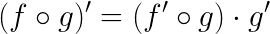

This formula can be written in another form using the [Leibniz's
notation](https://en.wikipedia.org/wiki/Leibniz%27s_notation). In the
following equation, `z` depends on the variable `y` which itself
depends on the variable `x`. `z`, via the intermediate variable of `y`
depends on `x` as well. The chain rule states that:

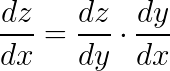

Intuitively, it tells us that the impact of `x` on the value of `z` is
the product of the impact of `x` on `y` and of `y` on `z`.

The [*backpropagation*](https://en.wikipedia.org/wiki/Backpropagation)
is algorithm used to compute gradients in neural network by applying
the chain rule in a clever way. It is important to note that the
output of the backpropagation is not the *formal expression* of the
gradients but their *values*.

We will run the algorithm on a toy example in order to get an
intuitive understanding of the way it works but it works exactly the
same way on neural networks which are simply huge differentiable
functions.

Let's define the function that we are going to work with.

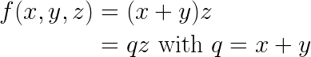

`f` is a function of three variables `x, y, z` but can also be seen as
a composite function in the second line. We will mostly use this
second version in the following explanation.

Now let's write the [gradient](https://en.wikipedia.org/wiki/Gradient)
of `f`, which is a vector of all the partial derivatives of `f` for
each of its variable `x, y, z`.


The first line of the previous formula is the definition of the
gradient. The second line is obtained using the chain rule. Let's take
the first gradient component `df/dx`, the second line tells us that
the impact of `x` on `f` is the product of the impact of `x` on `q`
and the impact of `q` on `f` as `x` is used in `q` which is itself
used in `f`.

In the example we are going to detail, `x = -2`, `y = 5` and `z = -4`.

The first step of the algorithm is to compute the result of the
function by creating its *computation graph* which is just a fancy
term for a visualization of how we get our result. We compute the
result of the innermost function first.

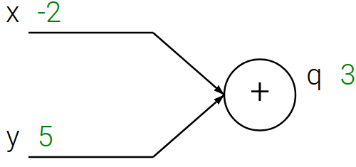

In this picture the two *leaves* correspond to our input variables `x`
and `y` and contain their respective values `-2` and `5`. Our
*internal node* correspond to `q` and contain its value `3`. We also
remember that the value of the internal node has been obtained by
adding two values.

We then go on to the next computation

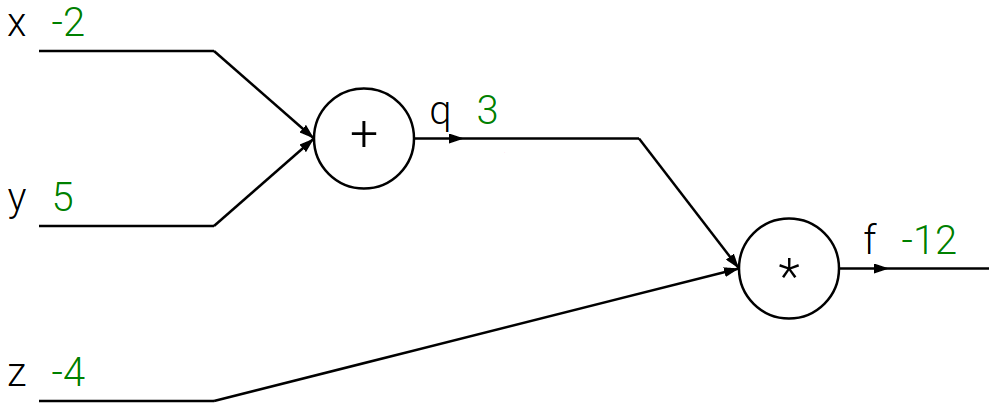

Similarly, we create a new internal node that corresponds to the
result of our computation `f`. This node is obtained by multiplying
our intermediate result `q` by a new input variable `z`.

We have computed the value of our function for specific values of its
input variable. To do this, we have made the values of the
computations propagate *forward* (from left to right in our
computation graph representation). This process is called the *forward
pass*, it is what we do when we perform an inference of neural
network.

We are now ready to perform the *backward pass* in which we
*backpropagate* the gradients from the result of the function to its
input variables. We will perform this process from right to left in
our representation.

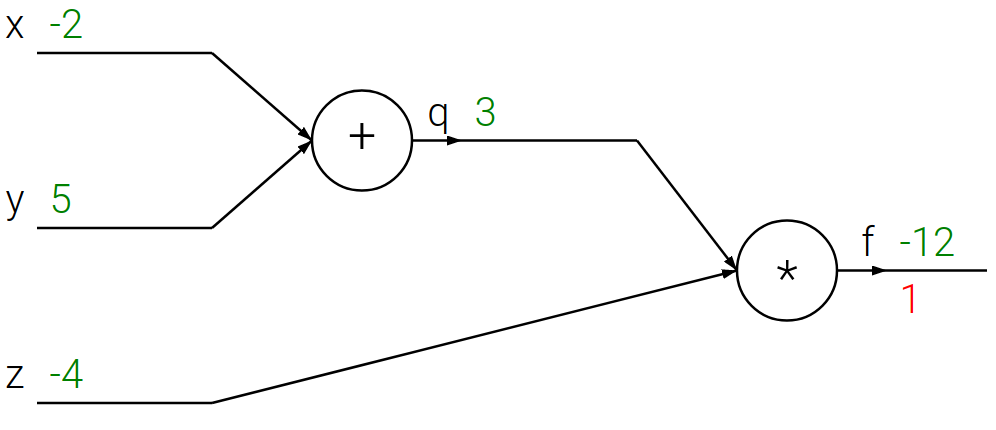

The derivative of `f` according to `f` is 1, nothing to compute there.

The computation graph tells us that `f` has been obtained by a
product. To compute the gradients for `q` and `z` we have to use
the formula that tells us how to differentiate of a product of two
variables.

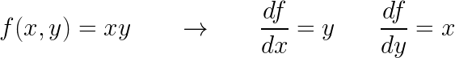

By using this formula, we know that the derivative of `f` according to
`q` is the value of `z` and the derivative of `f` according to `z` is
the value of `q`.

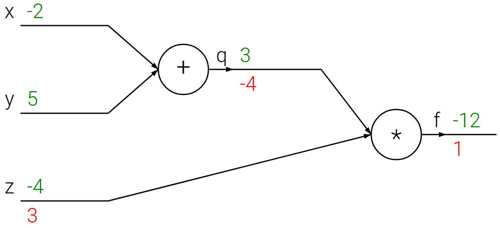

Now we want to backpropagate the gradients to `x` and `y`. The
computation graph tells us that `q` has been obtained by an
addition. To compute the derivative of `q` according to `x` and `y`,
we have to use the formula that tells us how to differentiate a sum.

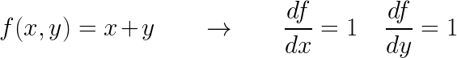

This formula tells us the following:

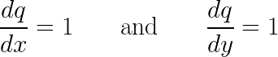

Now to compute the derivative of `f` according to `x` and `y` we have
to use the chain rule. As we have seen earlier, it tells us the
following:

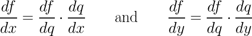

"Luckily" for us, the value of derivative of `f` according to `q` is
right there in the graph for us to use.


We now have finished our computation and the gradient vector is `[-4,
-4, 3]`.

One thing that is important to notice is that during the computation
of the forward and the backward pass, we have only used very *local*
values stored on the computation graph. It is this point that makes
the backpropagation such an efficient algorithm.

Let's now see how we access this algorithm in PyTorch. First we define
our input variables

```python
>>> x = torch.tensor(-2., requires_grad = True)
>>> y = torch.tensor(5. , requires_grad = True)
>>> z = torch.tensor(-4., requires_grad = True)
>>> x, y, z
(tensor(-2., requires_grad=True), tensor(5., requires_grad=True), tensor(-4., requires_grad=True))
```

While defining each tensor, we precise `requires_grad = True` to
inform PyTorch that we will be computing gradients using this
variables. To allow gradient computation, PyTorch will now create the
*computation graph* while we are using our variables in
computations. This type of behavior is called the *define-by-run*
methodology, we *define* our computation graph as we *run* our
computations. Historically this was an advantage of PyTorch over
TensorFlow which used to use the *define-then-run* methodology in
which you had to generate your whole computation graph before starting
computing your forward pass. Since then a [define-by-run
mode](https://ai.googleblog.com/2017/10/eager-execution-imperative-define-by.html)
has been introduced to TensorFlow.

Now that we have our base variables, let's compute our function `f`.

```python
>>> q = x + y
>>> f = q * z
>>> q, f
(tensor(3., grad_fn=<AddBackward0>), tensor(-12., grad_fn=<MulBackward0>))
```

We see that PyTorch memorized that `q` has been obtained by adding
values and the function that should be used to compute the gradients
is `AddBackward0`. Similarly, `f` has been obtained by multiplying two
values and the function that should be used to compute the gradients
is `MulBackward0`.

Now that we have our result `f`, we can apply the backpropagation
algorithm to compute backpropagate the gradients to all the *leaf*
tensors which have `requires_grad = True`.

```python
>>> f.backward()
>>> x.grad, y.grad, z.grad
(tensor(-4.), tensor(-4.), tensor(3.))
```

As explained in the previous course, the gradient values are stored in
the tensors, right next to their values. This allows the optimizers to
know where to find them.

When defining a neural network all the *parameters* of the layers (its
weights) are defined as tensors with `requires_grad = True`. This is
how PyTorch knows what tensors to compute the gradients of.

```python
>>> import torch.nn as nn
>>> lin = nn.Linear(3, 5)
>>> lin.weight
Parameter containing:
tensor([[-0.0033,  0.5535,  0.1779],
        [ 0.3713, -0.0790,  0.1122],
        [-0.0505,  0.1339, -0.5534],
        [ 0.3604,  0.5361,  0.1966],
        [-0.1884, -0.4768,  0.0522]], requires_grad=True)

>>> lin.bias
Parameter containing:
tensor([-0.0224,  0.2585,  0.4717,  0.1976, -0.4478], requires_grad=True)
```

This is also why with we use the `torch.no_grad` context when we know
we will not use backpropagation. It sets the `requires_grad` of every
tensor to `False`.

Now that we have everything we need to understanding the way neural
networks computes their function and are trained, let's see some other
types of layer.

#### Convolution layer

Until now, we have only seen one type of layer, the *linear* or *fully
connected* layer. Although the [universal approximation
theorem](https://en.wikipedia.org/wiki/Universal_approximation_theorem)
tells us that a neural network with a single hidden linear layer
containing a finite number of neurons is able to approximate most
functions that could be interesting to us it has multiple caveats:

- It does not give a bound on the number of neurons necessary
- It does not take into account the generalization potential of the model
- It does take into account the number of training steps required to
  reach the parameter set necessary for the approximation or whether
  it is even
  [possible](https://en.wikipedia.org/wiki/Computational_learning_theory)
  using learning algorithms such as the Gradient Descent.

To remedy these problems, deep learning practitioners use other kind of
layers in order to "help" the neural network be able to learn the
target function.

One of these is the [*Convolution
layer*](https://en.wikipedia.org/wiki/Convolutional_neural_network). Neural
networks that use convolution layers are called Convolutional Neural
Networks (CNNs).

A
[convolution](https://en.wikipedia.org/wiki/Convolution#Discrete_convolution)
is a mathematical operation that consists in taking a *convolution
filter* or *kernel* and applying it to some input. In the following
figure, we have a `3x3` convolution kernel that we apply to a 2D array
of shape `[7, 7]`. The figure only presents the computation of 1 value
of the result.


(image from
[here](https://medium.com/@bdhuma/6-basic-things-to-know-about-convolution-daef5e1bc411))

To compute the whole result, we will make the convolution filter
"slide" across our image. This operation is illustrated in the
following animation.


(This animation is from this
[page](https://github.com/vdumoulin/conv_arithmetic) which is a
brilliant resource to get your head around convolution operations)

At the bottom of the previous animation, you have the input of the
convolution operation. At the top you have the result of the
convolution. This animation shows, for each cell of the output, which
input pixels have been used in the computation.

As you can see, the shape of the output of the process is different
from the shape of the input. We have applied what is called a *strict
convolution* which consists in computing output values only at place
for which the convolution kernel "fits" in the input. In this example,
we loose a 1 pixel band on each side: top, bottom, left and right.

Before digging deeper into convolutions, let's try to get an intuition
of why they are used. Let's apply two different convolutions filters
to the same image and take a look at the output.

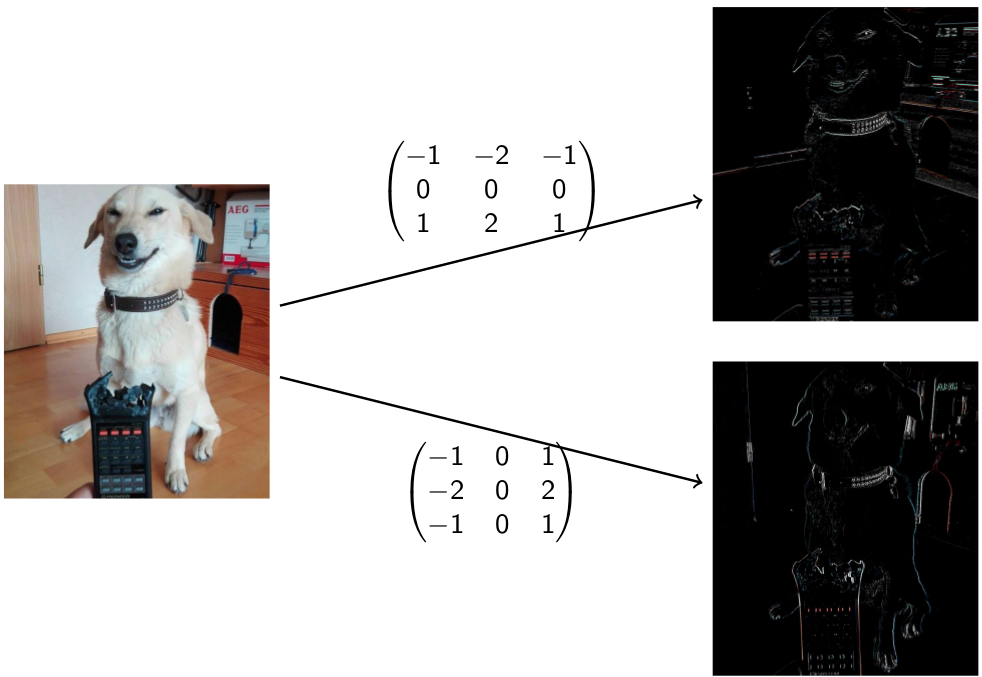

These two convolutions are examples of [Sobel
operator](https://en.wikipedia.org/wiki/Sobel_operator), a classical
technique in image processing and computer vision used to *detect
edges*. We notice that each filter generates an output highlighting a
specific piece of information about the input. The top and bottom
outputs, emphasize respectively *horizontal* edges and *vertical*
edges.

Generally, the goal of convolution filters is to extract a specific
piece of information about their input. Historically, the weight and
combination of filters used to detect something specific were created
by researchers. In a way, this process corresponds to [what we
did](appendix/nn_and_solution.md) when we found weights for the neural
network to compute the AND boolean function.

Similarly to fully connected neural networks, we would prefer not to
set the parameters ourselves but find good values using an
optimization algorithm such as the stochastic gradient descent. In the
convolution filter application that we described earlier, we have only
used additions and multiplications which are differentiable
operations. The parameters that we want to optimize are the values
contained in the convolution filters.

The only point slightly different than before is that the same
convolution filter value is used to compute every value of the output
but that does not cause any problem to the backpropagation
algorithm. The function that is computed by the convolution layer
simply uses each of its parameters many times in its formula.

In all the convolution examples that we have seen until now, we only
have considered cases in which the input had only 1 *channel*. Our
data was two dimensional and we had for each cell of this 2D grid a
*single value*. When working with color images, we will typically have
a 3 values by pixel: a red, a green and a blue component. This data
have 3 *channels*. When we apply convolution filters to multi-channel
inputs, each channel will have its own weight matrix and we will
simply *add* the convolution output for each channel. Take a look at
the animation available
[here](http://cs231n.github.io/convolutional-networks/).

In order to consolidate these ideas, let's build a quick PyTorch example.

```python
>>> img_batch = torch.randn(5, 3, 50, 50)
>>> img_batch.shape
torch.Size([5, 3, 50, 50])
```

This tensor represents a batch of data that we want to pass through a
convolution layer. Let's study its shape: we have a batch of `5`
images (or samples), with `3` channels and each image is of shape
`[50, 50]`. This is the standard shape of image batches.

Now let's create our convolution.

```python
>>> convolution = nn.Conv2d(
  in_channels = 3,
  out_channels = 7,
  kernel_size = (3, 3)
)
>>> convolution
Conv2d(3, 7, kernel_size=(3, 3), stride=(1, 1))
```

This convolution layer takes input with `3` channels and is composed
of `7` kernels of shape `(3, 3)`. The `stride` parameter specifies by
how many pixels the kernel is shifted during the sliding operation.

There are a few things to notice with this layer. First, the number of
`in_channels` is `3` which means that for each of the `7` kernels of
the layer we will have `3` `3x3` weight matrices as shown in the
[CS231n
animation](http://cs231n.github.io/convolutional-networks/). Secondly,
we see that we do not specify the *shape* of images that the layer
will take as input, only their number of channels. This is a
specificity of convolutions, the sliding operation does not depends on
the size of the input. Only the shape of the output will depend on it.

```python
>>> convolution_output = convolution(img_batch)
>>> convolution_output.shape
torch.Size([5, 7, 48, 48])
```

Now let's explain the shape of the output. Remember that we started
with an input shape of `[5, 3, 50, 50]`. In the output, we still have
`5` samples. Now each sample is a 3D tensor, as our convolution layer
have 7 `out_channels`, we have computed for (almost) every input pixel
`(R, G, B)` of the input image `7` different values, one for each
kernel of the layer. In the previous sentence, we mentioned that we
have performed computation for "almost" every input pixel because, as
mentioned earlier, we are applying *strict convolutions*. This
implies that we lose a "1 pixel band" around each images, explained
the `[48, 48]` output shape.

In order to fix the *strict convolution* behavior, we often use
*convolution padding*.


When performing convolution operations with padding, we simply perform
our computations "as if" our input were bigger. The non-existent value
are replaced by `0`s.

```python
>>> img_batch = torch.randn(5, 3, 50, 50)
>>> img_batch.shape
torch.Size([5, 3, 50, 50])

>>> convolution = nn.Conv2d(
  in_channels = 3,
  out_channels = 7,
  kernel_size = (3, 3),
  padding = (1, 1)
)
>>> convolution
Conv2d(3, 7, kernel_size=(3, 3), stride=(1, 1), padding=(1, 1))

>>> convolution_output = convolution(img_batch)
>>> convolution_output.shape
torch.Size([5, 7, 50, 50])
```

As we can see in this code, the padding mechanism allows us to keep
the last two dimensions of our input and output tensors identical.

#### Pooling layers

The last tool that we need to build convolutional neural networks is a
[*pooling
layer*](https://en.wikipedia.org/wiki/Convolutional_neural_network#Pooling_layer). A
pooling layer is function that we use reduce the quantity of
information (or *down-sample*) that goes through the network.


(image from
[Wikipedia](https://en.wikipedia.org/wiki/Convolutional_neural_network#Pooling_layer))

In the previous figure, we have a `4x4` array on which we apply a
`2x2` *maximum pooling* (max pooling for short) operation. It consists
in diving the original array in 2x2 sections and replacing each
section by its maximum. We effectively loose 75% of the information (3
values for each 2x2 square).

We use pooling layers for multiple reasons:
- It greatly reduces the quantity of computation necessary to apply
  convolutions.
- It improves the
  [translation-invariance](https://arxiv.org/abs/1801.01450) of the
  model. Intuitively, a translation-invariant neural network that
  tries to classify object pictures should output the same prediction
  wherever the object is located is the picture.

Let's write and study a max pooling example in PyTorch.

```python
>>> import torch.nn.functional as F
>>> img_batch = torch.arange(16).float().view(1, 1, 4, 4)
>>> img_batch.requires_grad = True
>>> img_batch
tensor([[[[ 0.,  1.,  2.,  3.],
          [ 4.,  5.,  6.,  7.],
          [ 8.,  9., 10., 11.],
          [12., 13., 14., 15.]]]], requires_grad=True)

>>> max_pooling_output = F.max_pool2d(img_batch, kernel_size = [2, 2])
>>> max_pooling_output
tensor([[[[ 5.,  7.],
          [13., 15.]]]], grad_fn=<MaxPool2DWithIndicesBackward>)

>>> max_pooling_output.shape
torch.Size([1, 1, 2, 2])
```

In this example `img_batch` is a batch of `1` image with `1` channel
and the size of the image is `4x4`.

We apply a max pooling operation using the `max_pool2d` function of
the [functional](https://pytorch.org/docs/stable/nn.functional.html)
interface of PyTorch. This operation is also available as a
`nn.Module` but a good habit to take is mainly use `nn.Module`s for
object with *parameters*, as the max pooling operation does not have
parameter, we use its functional version.

We can also see that the output of the max pooling operation have a
`grad_fn`, which is important as it means it is differentiable.

The output contains `1` sample, with `1` channel and the size of the
image is `2x2` as the pooling operation had a kernel size of `[2, 2]`
just as in earlier figure.

#### CNN example

We now have all the tools required to deeply understand the state of
the art model of 2014, [VGG16](https://arxiv.org/abs/1409.1556) (a
model with `16` layers from the Oxford's Visual Geometry Group
(`VGG`)).

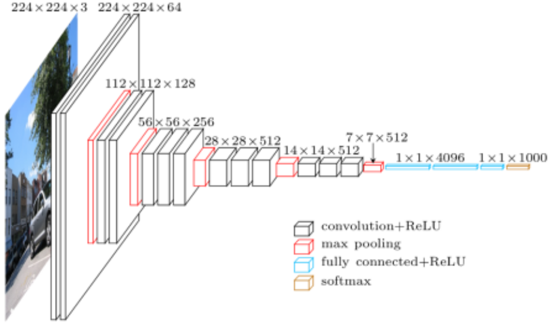

(Image from https://www.cs.toronto.edu/~frossard/post/vgg16/)

Let's describe what we can see in this figure. The task that this
model is solving is image classification. It takes `224x224` RGB pixel
images (input shape of `224x224x3`) as input and outputs a probability
distribution of `1000` classes.

This model is composed of two blocks, a *convolutional* one and a fully
connected *one*.

Let's take a look at the convolutional part. This figures illustrates
a very common design choice for convolutional neural networks. The
authors of the paper alternate sequences of convolution layers with
pooling layers. The number of convolution layers along with their
number of filters increases after each max pooling operation. This
increases both the *depth* of hierarchical information captured by
each filter (number of convolution layers) along with the variety of
pattern recognized by the model (number of filter in each layer) while
progressively loosing information of the specific location of each
pattern occurrence.

At the end of the convolutional part of the model, the tensors are
*flattened* (just as we did in the previous practical work) in order
to be given as input to linear layers. The "job" of these linear
layers is to decide what the picture depicts using the "list" of
patterns detected by the convolution layers.

### Practical work

The goal of this practical work is to build convolutional neural
networks to complete two image classification tasks,
[MNIST](http://yann.lecun.com/exdb/mnist/), on which we worked during
the previous course, and
[CIFAR-10](https://www.cs.toronto.edu/~kriz/cifar.html), a 32x32 RGB
image classication task.

#### MNIST

##### Data loading

During the last practical we did the data loading an normalization
ourselves in order to get familiar with tensor manipulations. During
this course, we will do it the "right" way by using `torchvision`
which is PyTorch library specialized in image dataset manipulations.

First, let's start with the usual imports plus a few new ones for
torchvision.

```python
import torch
import torch.nn as nn
import torch.nn.functional as F
import torch.optim as optim
from torchvision import datasets, transforms
```

We then download, standardize and create loaders for the MNIST dataset
with the following code:

```python
mnist_transform = transforms.Compose([
  transforms.ToTensor(),
  transforms.Normalize((0.1307,), (0.3081,))
])

train_dataset = datasets.MNIST(
    root      = '../data',
    train     = True,
    download  = True,
    transform = mnist_transform
)

test_dataset = datasets.MNIST(
    root      = '../data',
    train     = False,
    download  = True,
    transform = mnist_transform
)

train_loader = DataLoader(train_dataset, batch_size = 64, shuffle = True)
test_loader  = DataLoader(train_dataset, batch_size = 64, shuffle = True)
```

[`transforms.Normalize`](https://pytorch.org/docs/stable/torchvision/transforms.html#torchvision.transforms.Normalize)
performs the mean subtraction and standard deviation division that we
coded last week.

##### Training loop and evaluation loop

Using code from the previous practical work, create a training and
evaluation functions. The evaluation function takes the number of
batches used for evaluation as an optional argument. If no value is
given the whole dataloader is use otherwise we stop the evaluation
after the specified number of batches.

You can use the following code as inspiration

```python
>>> s = 'who you gonna call ?'.split()
>>> s
['who', 'you', 'gonna', 'call', '?']

>>> for word_index, word in enumerate(s):
        if word_index == 3:
            break
        print(word_index, word)
0 who
1 you
2 gonna
```

##### Neural network

Create a convolutional neural network using the one we created during
the last course and the convolutional layers example of this course.

The following architecture choice is reasonable, you are not
forced to used it:
- Convolution (convolution with a padding parameter in order to not
  lose a pixel band on this outside of the picture) with `32` filters
  of size `3x3` and a padding of `1`,
- ReLU activation,
- Convolution layer with `64` filters of size `3x3` and a padding of
  `1`,
- ReLU activation,
- `2x2` max pooling
- Tensor flattening in order to be able to use linear layers. You can
  either use `tensor.view` or `torch.flatten` to do this.
- Linear layer with `128` outputs
- ReLU activation
- Linear layer (output) with 10 outputs
- `log_softmax` activation

This model architecture is essentially a miniature version of the
VGG16 network.

##### Main function

Write a main function that instantiate the model, the optimizer, the
loss and calls the training and evaluation methods.

##### Optimizer modification

Try to change the optimizer in your code from `SGD` to
`torch.optim.Adagrad`, `torch.optim.RMSprop` or `torch.optim.Adam` and
analyze the impact.

#### CIFAR-10

Repeat the whole process with the CIFAR-10 dataset. You should only
have to change a few lines from the loading code and the architecture
of your model. This dataset is also available through the
`torchvision.datasets` interface. You have to adapt the normalization
code to take into account the three channels of CIFAR-10 images (RGB).

## Lesson 4

### Course

#### CIFAR-10 convolutional neural network

In this section, we will explain the code of the convolutional neural
network of the previous practical work.

```python
class ConvNet(nn.Module):
  def __init__(self):
    super(ConvNet, self).__init__()
    self.conv1 = nn.Conv2d(
        in_channels  = 3,
        out_channels = 32,
        kernel_size  = 3,
        padding      = 1
    )
    self.conv2 = nn.Conv2d(
        in_channels  = 32,
        out_channels = 64,
        kernel_size  = 3,
        padding      = 1
    )
    self.fc1 = nn.Linear(
        in_features  = 8 * 8 * 64,
        out_features = 128
    )
    self.fc2 = nn.Linear(
        in_features  = 128,
        out_features = 10
    )

  def forward(self, x):
    x      = self.conv1(x)
    x      = F.relu(x)
    x      = F.max_pool2d(x, 2)
    x      = self.conv2(x)
    x      = F.relu(x)
    x      = F.max_pool2d(x, 2)
    x      = x.view(x.shape[0], -1)
    x      = self.fc1(x)
    x      = F.relu(x)
    x      = self.fc2(x)
    output = F.log_softmax(x, dim=1)

    return output
```

When sizing the first linear layer that will be applied right after
the flattening step `self.fc1` we have to compute the number of
features it takes as input. The number of features is computed as
follows:

```
in_features = height of feature map * width of feature map * number of
              channel of the last convolution layer
            = 8 * 8 * 64
```

The height and width of the feature maps are both `8` because we
started with an input shape of `[3, 32, 32]` and applied two
`max_pool2d` operations: `[32, 32] -> [16, 16] -> [8, 8]`. The shapes
are simply divided by 2 at each maximum pooling operation because we
apply *padded convolutions*.

Now for the flattening operation.

```python
x = x.view(x.shape[0], -1)
```

The input of the flattening operation will be a vector of shape
`[batch_size, 64, 8, 8]` and we would like to transform it to the
shape `[batch_size, 64 * 8 * 8]`. Even if we know the batch size that
we specified during the creation of the `DataLoader`, we are not able
to use it directly there. Our training dataset contains 50000 images
and our batch size is 64, we can't divide the dataset in equal size
batches. The dataloader will create size 64 batches as long as
possible and create a last one with what is left at the end. This
means that our last batch will contain 16 images (`50000 % 64 = 16`).

Another way to perform this operation would be to use the
`torch.flatten` operator.

```python
>>> t = torch.arange(96).view(2, 3, 4, 4)
>>> t # 2 images, 3 channel, 4 * 4 pixels
tensor([[[[ 0,  1,  2,  3],
          [ 4,  5,  6,  7],
          [ 8,  9, 10, 11],
          [12, 13, 14, 15]],

         [[16, 17, 18, 19],
          [20, 21, 22, 23],
          [24, 25, 26, 27],
          [28, 29, 30, 31]],

         [[32, 33, 34, 35],
          [36, 37, 38, 39],
          [40, 41, 42, 43],
          [44, 45, 46, 47]]],


        [[[48, 49, 50, 51],
          [52, 53, 54, 55],
          [56, 57, 58, 59],
          [60, 61, 62, 63]],

         [[64, 65, 66, 67],
          [68, 69, 70, 71],
          [72, 73, 74, 75],
          [76, 77, 78, 79]],

         [[80, 81, 82, 83],
          [84, 85, 86, 87],
          [88, 89, 90, 91],
          [92, 93, 94, 95]]]])
>>> torch.flatten(t, start_dim = 1)
tensor([[ 0,  1,  2,  3,  4,  5,  6,  7,  8,  9, 10, 11, 12, 13, 14, 15, 16, 17,
         18, 19, 20, 21, 22, 23, 24, 25, 26, 27, 28, 29, 30, 31, 32, 33, 34, 35,
         36, 37, 38, 39, 40, 41, 42, 43, 44, 45, 46, 47],
        [48, 49, 50, 51, 52, 53, 54, 55, 56, 57, 58, 59, 60, 61, 62, 63, 64, 65,
         66, 67, 68, 69, 70, 71, 72, 73, 74, 75, 76, 77, 78, 79, 80, 81, 82, 83,
         84, 85, 86, 87, 88, 89, 90, 91, 92, 93, 94, 95]])
>>> torch.flatten(t, start_dim = 1).shape
torch.Size([2, 48])
```

Now let's take a look at how to perform the training on GPU rather
than on CPU.

The first thing we need to do is to declare a `torch.device`.

```python
device    = torch.device('cuda')
model     = ConvNet().to(device)
```

The
[`tensor.to`](https://pytorch.org/docs/stable/tensors.html#torch.Tensor.to)
is used to transfer a tensor for RAM to GPU memory. Once this
operation is done, the computations will performed and their result
stored on GPU. You cannot mix CPU tensors with GPU tensors when
applying your neural network so you either have to transfer the model
back to CPU (for example after the training is completed) or transfer
its input to GPU (what we do while training and evaluating).

Let's take a look at how the training function is modified.

```python
def train(model, device, train_loader, optimizer, epoch):
  model.train()
  for batch_idx, (data, target) in enumerate(train_loader):
      data, target = data.to(device), target.to(device)
      optimizer.zero_grad()
      output = model(data)
      loss = F.nll_loss(output, target)
      loss.backward()
      optimizer.step()
      if batch_idx % 350 == 0:
        print('Train Epoch: {} [{:5}/{:5} ({:.0f}%)]\tLoss: {:.6f}'.format(
              epoch, batch_idx * len(data), len(train_loader.dataset),
              100. * batch_idx / len(train_loader), loss.item()))
```

This function runs the training for a single epoch, it will be called
in a loop. As we want to perform our computations on the GPU and we
already have our model on the device, we have to transfer our batch
data on it too. Just as we did with the model, we perform this
transfer by writing

```python
for batch_idx, (data, target) in enumerate(train_loader):
    data, target = data.to(device), target.to(device)
```

We are usually not able to store the whole dataset on the GPU due to
memory limitations, that's why we transfer the data batch by batch. As
we do not keep any reference to it, it will be garbage collected at
some point after we have performed our training step.

You can also notice the line at the beginning of the function

```python
model.train()
```

This
[method](https://pytorch.org/docs/stable/nn.html#torch.nn.Module.train)
is used to set the model in *training mode* (it is its default
mode). Some layers (we will see one later in this course) have a
different behavior during their training and evaluation phase, to
indicate that we are going to train the model we use this function.

Let's now take a look at the evaluation function

```python
def test(model, device, loader, prefix, n_batch = None):
  model.eval()
  loss       = 0
  correct    = 0
  total_pred = 0
  with torch.no_grad():
      for batch_idx, (data, target) in enumerate(loader):
          if n_batch is not None and batch_idx == n_batch:
            break
          data, target = data.to(device), target.to(device)
          output       = model(data)
          loss        += F.nll_loss(output, target, reduction='sum').item()  # sum up batch loss
          pred         = output.argmax(dim=1, keepdim=True)  # get the index of the max log-probability
          correct     += pred.eq(target.view_as(pred)).sum().item()
          total_pred  += len(target)

  loss /= total_pred

  print('\n' + prefix + ' set: Average loss: {:.4f}, Accuracy: {}/{} ({:.0f}%)\n'.format(
      loss, correct, total_pred,
      100. * correct / total_pred))
```

Similarly to `model.train`, to specify that we are going to evaluate
the model we use `model.eval`.

As explained in the practical work, we do not want to evaluate on the
*whole* `DataLoader` every time as it takes a significant amount of
time. We limit the number of batches used to evaluate the model using
the following mechanism

```python
for batch_idx, (data, target) in enumerate(loader):
  if n_batch is not None and batch_idx == n_batch:
      break
```

If we do not specify the `n_batch` parameter to the function, the
whole `DataLoader` will be used, otherwise we stop after `n_batches`
iterations.

We use the `reduction = 'sum'` parameter to the loss to not compute
the mean of the loss during this step. We compute the sum of the loss
over all the batches and then only we divide by the number of
predictions. If we did not, the computation would have given a bigger
weight to the losses of the last smaller batch.

Let's now take a look a the data loading code.

```python
def create_loaders():
  cifar_transform = transforms.Compose([
    transforms.ToTensor(),
    transforms.Normalize((0.5, 0.5, 0.5), (0.5, 0.5, 0.5))
  ])

  train_dataset = datasets.CIFAR10(
    root      = '../data',
    train     = True,
    download  = True,
    transform = cifar_transform
  )

  test_dataset = datasets.CIFAR10(
    root      = '../data',
    train     = False,
    download  = True,
    transform = cifar_transform
  )

  train_loader = DataLoader(train_dataset, batch_size = 64, shuffle = True)
  test_loader  = DataLoader(test_dataset, batch_size = 64, shuffle = True)

  return train_loader, test_loader
```

It is important to remember that if you want to test your model on new
samples after you are done with its training, you have to apply
exactly the same normalization steps you applied on your training
data.

Let's now combine everything in a main function.

```python
def main():
  (
    train_loader,
    test_loader
  )         = create_loaders()
  device    = torch.device('cuda')
  model     = ConvNet().to(device)
  optimizer = optim.Adam(model.parameters(), lr=1e-3)

  for epoch in range(1, 15):
    train(model, device, train_loader, optimizer, epoch)
    test(model, device, train_loader, 'Train', 20)
    test(model, device, test_loader, 'Test')
```

When we run it we get the following output

```python
Train Epoch: 1 [    0/50000 (0%)]	Loss: 2.300201
Train Epoch: 1 [22400/50000 (45%)]	Loss: 1.493223
Train Epoch: 1 [44800/50000 (90%)]	Loss: 1.182059

Train set: Average loss: 0.9930, Accuracy: 826/1280 (65%)
Test set: Average loss: 1.0527, Accuracy: 6293/10000 (63%)

[...]

Train Epoch: 6 [    0/50000 (0%)]	Loss: 0.426290
Train Epoch: 6 [22400/50000 (45%)]	Loss: 0.376126
Train Epoch: 6 [44800/50000 (90%)]	Loss: 0.287188

Train set: Average loss: 0.3822, Accuracy: 1111/1280 (87%)
Test set: Average loss: 0.8457, Accuracy: 7245/10000 (72%)

[...]

Train Epoch: 10 [    0/50000 (0%)]	Loss: 0.178617
Train Epoch: 10 [22400/50000 (45%)]	Loss: 0.201108
Train Epoch: 10 [44800/50000 (90%)]	Loss: 0.385630

Train set: Average loss: 0.1913, Accuracy: 1191/1280 (93%)
Test set: Average loss: 1.1805, Accuracy: 7089/10000 (71%)

[...]

Train Epoch: 14 [    0/50000 (0%)]	Loss: 0.032493
Train Epoch: 14 [22400/50000 (45%)]	Loss: 0.035444
Train Epoch: 14 [44800/50000 (90%)]	Loss: 0.162892

Train set: Average loss: 0.0820, Accuracy: 1240/1280 (97%)
Test set: Average loss: 1.6143, Accuracy: 7109/10000 (71%)
```

We notice during the logging steps a very big difference between the
metrics on the training set and on the test set. At the end of the
training procedure the average loss is 20 times bigger on the test set
and accuracy difference is 26%. We are very clearly in a case of
*overfitting*. The model has *memorized* the training samples instead
of understanding the structure of the information.

This phenomenon is a lot more common in the deep learning field than
in the machine learning field in general. To prevent this problem, we
will use yet another family of layers called *normalization layers*.

#### Normalization layers: Dropout

There exist many different normalization methods. One of them,
specific to neural networks is called
[*Dropout*](https://arxiv.org/abs/1207.0580).

The algorithm itself is very simple. We chose a probability `p` and
"drop" a value (replace it with a `0`) with this probability `p`. We
then scale all the remaining values by `1 / (1 - p)`. The scaling term
is there to compensate for the fact that a proportion of neurons are
inactive. Once the training is done, we deactivate stopping to drop
values and removing the scaling of the values.

```python
>>> dropout = nn.Dropout(p = .5) # p = .5 -> 1 / (1 - p) = 2.
>>> t = torch.arange(10).float()
>>> t
tensor([0., 1., 2., 3., 4., 5., 6., 7., 8., 9.])

>>> dropout(t)
tensor([ 0.,  0.,  0.,  0.,  8.,  0., 12.,  0.,  0., 18.])

>>> dropout(t)
tensor([ 0.,  0.,  0.,  6.,  0., 10.,  0.,  0.,  0.,  0.])

>>> dropout(t)
tensor([ 0.,  2.,  0.,  0.,  8.,  0.,  0., 14., 16.,  0.])

>>> dropout(t)
tensor([ 0.,  0.,  0.,  6.,  0., 10.,  0.,  0.,  0., 18.])

>>> dropout(t)
tensor([ 0.,  2.,  4.,  6.,  0.,  0., 12.,  0., 16., 18.])

>>> dropout(t)
tensor([ 0.,  2.,  0.,  0.,  8., 10.,  0.,  0., 16.,  0.])
```

As explained in the research article, the dropout works by
"encouraging" each neuron to learn features that are generally helpful
for producing correct answers. It prevents complex co-adaptations in
which a feature detector is only helpful in the context of several
other specific feature detectors.

Another way to view this procedure is as a very efficient way to
perform [model
ensembling](https://en.wikipedia.org/wiki/Ensemble_learning), an
algorithm which combines multiples different models by averaging their
prediction (you can see this a vote).

Let's add some dropout layers on our CIFAR-10 CNN.

```python
class ConvNet(nn.Module):
  def __init__(self):
    super(ConvNet, self).__init__()
    self.conv1 = nn.Conv2d(
    in_channels  = 3,
        out_channels = 32,
        kernel_size  = 3,
        padding      = 1
    )
    self.dropout1 = nn.Dropout(
        p = 0.6
    )
    self.conv2 = nn.Conv2d(
        in_channels  = 32,
        out_channels = 64,
        kernel_size  = 3,
        padding      = 1
    )
    self.dropout2 = nn.Dropout(
        p = 0.6
    )
    self.fc1 = nn.Linear(
        in_features  = 8 * 8 * 64,
        out_features = 128
    )
    self.dropout3 = nn.Dropout(
        p = .5
    )
    self.fc2 = nn.Linear(
        in_features  = 128,
        out_features = 10
    )

    def forward(self, x):
        x      = self.conv1(x)
        x      = self.dropout1(x)
        x      = F.relu(x)
        x      = F.max_pool2d(x, 2)
        x      = self.conv2(x)
        x      = self.dropout2(x)
        x      = F.relu(x)
        x      = F.max_pool2d(x, 2)
        x      = x.view(x.shape[0], -1)
        x      = self.fc1(x)
        x      = self.dropout3(x)
        x      = F.relu(x)
        x      = self.fc2(x)
        output = F.log_softmax(x, dim=1)

        return output
```

Let's launch it and study the output.

```python
Train Epoch: 1 [    0/50000 (0%)]	Loss: 2.330966
Train Epoch: 1 [22400/50000 (45%)]	Loss: 1.564563
Train Epoch: 1 [44800/50000 (90%)]	Loss: 1.210437

Train set: Average loss: 1.6368, Accuracy: 732/1280 (57%)
Test set: Average loss: 1.6530, Accuracy: 5616/10000 (56%)

[...]

Train Epoch: 10 [    0/50000 (0%)]	Loss: 1.047794
Train Epoch: 10 [22400/50000 (45%)]	Loss: 0.776986
Train Epoch: 10 [44800/50000 (90%)]	Loss: 0.909246

Train set: Average loss: 1.0388, Accuracy: 967/1280 (76%)
Test set: Average loss: 1.1059, Accuracy: 7028/10000 (70%)

[...]

Train Epoch: 20 [    0/50000 (0%)]	Loss: 0.949350
Train Epoch: 20 [22400/50000 (45%)]	Loss: 0.718932
Train Epoch: 20 [44800/50000 (90%)]	Loss: 0.823930

Train set: Average loss: 0.8870, Accuracy: 1024/1280 (80%)
Test set: Average loss: 0.9860, Accuracy: 7292/10000 (73%)

[...]

Train Epoch: 29 [    0/50000 (0%)]	Loss: 0.733138
Train Epoch: 29 [22400/50000 (45%)]	Loss: 0.886871
Train Epoch: 29 [44800/50000 (90%)]	Loss: 0.755015

Train set: Average loss: 0.8390, Accuracy: 1022/1280 (80%)
Test set: Average loss: 0.9645, Accuracy: 7274/10000 (73%)
```

We see that the metrics are now much closer between the training set
and the test set. We have also increased the accuracy of the model on
its training set, which tells us that we have increased its
*generalization capabilities*.

There exist many [normalization
layers](https://pytorch.org/docs/stable/nn.html#normalization-layers)
in the literature with different use cases, dropout was only one
example. Some of the most used ones are [Batch
Normalization](https://arxiv.org/abs/1502.03167)
([`nn.BatchNorm2d`](https://pytorch.org/docs/stable/nn.html#batchnorm2d))
and [Layer Normalization](https://arxiv.org/abs/1607.06450)
([`nn.LayerNorm`](https://pytorch.org/docs/stable/nn.html#layernorm)).

#### Modular PyTorch code

As we have seen in the previous section, the internal code of a neural
network can get big quite fast. To deal with this problem, neural
network in PyTorch are usually created in a modular fashion. We will
rewrite the code of the previous section using this idea.

We are starting with the following class.

```python
class ConvNet(nn.Module):
  def __init__(self):
    super(ConvNet, self).__init__()
    self.conv1 = nn.Conv2d(
        in_channels  = 3,
        out_channels = 32,
        kernel_size  = 3,
        padding      = 1
    )
    self.dropout1 = nn.Dropout(
        p = 0.6
    )
    self.conv2 = nn.Conv2d(
        in_channels  = 32,
        out_channels = 64,
        kernel_size  = 3,
        padding      = 1
    )
    self.dropout2 = nn.Dropout(
        p = 0.6
    )
    self.fc1 = nn.Linear(
        in_features  = 8 * 8 * 64,
        out_features = 128
    )
    self.dropout3 = nn.Dropout(
        p = .5
    )
    self.fc2 = nn.Linear(
        in_features  = 128,
        out_features = 10
    )

    def forward(self, x):
        x      = self.conv1(x)
        x      = self.dropout1(x)
        x      = F.relu(x)
        x      = F.max_pool2d(x, 2)
        x      = self.conv2(x)
        x      = self.dropout2(x)
        x      = F.relu(x)
        x      = F.max_pool2d(x, 2)
        x      = x.view(x.shape[0], -1)
        x      = self.fc1(x)
        x      = self.dropout3(x)
        x      = F.relu(x)
        x      = self.fc2(x)
        output = F.log_softmax(x, dim=1)

        return output
```

We have clear code repetitions for the convolution part and the fully
connected part of our model. In our example, each convolution has a
corresponding dropout rate and is always followed by a max pooling
operation.

We can isolate this pattern in a new class.

```python
class ConvBlock(nn.Module):
  def __init__(self, in_channels, out_channels, kernel_size, padding, dropout_p):
    super(ConvBlock, self).__init__()
    self.conv_layer = nn.Conv2d(
        in_channels  = in_channels,
        out_channels = out_channels,
        kernel_size  = kernel_size,
        padding      = padding
    )
    self.dropout = nn.Dropout(dropout_p)

  def forward(self, x):
    x = self.conv_layer(x)
    x = self.dropout(x)
    x = F.relu(x)
    x = F.max_pool2d(x, 2)

    return x
```

`ConvBlock` is a new neural network that simply computes a
convolution, followed by a dropout, followed by a relu activation and
a max pooling operation. It is short and easy to understand.

We can do the same thing for the linear layers.

```python
class LinearBlock(nn.Module):
  def __init__(self, in_features, out_features, dropout_p, activation):
    super(LinearBlock, self).__init__()
    self.linear_layer = nn.Linear(
        in_features  = in_features,
        out_features = out_features
    )
    self.dropout = nn.Dropout(dropout_p)
    self.activation = activation

  def forward(self, x):
    x = self.linear_layer(x)
    x = self.dropout(x)
    x = self.activation(x)

    return x
```

Each linear layer is followed by a dropout layer (the probability may
be 0 for the last one) and a activation. As the activation may vary
(`F.relu` for the first one and `F.log_softmax` for the output layer),
we take it as a parameter.

Now that we have our building blocks for the convolutional and linear
parts, let's put them together.

```python
from functools import partial

class ConvNet(nn.Module):
    def __init__(self):
        super(ConvNet, self).__init__()
        self.conv_part = nn.Sequential(
          ConvBlock(
              in_channels  = 3,
              out_channels = 32,
              kernel_size  = 3,
              padding      = 1,
              dropout_p    = .6
          ),
          ConvBlock(
              in_channels  = 32,
              out_channels = 64,
              kernel_size  = 3,
              padding      = 1,
              dropout_p    = .6
          )
        )

        self.linear_part = nn.Sequential(
          LinearBlock(
              in_features  = 8 * 8 * 64,
              out_features = 128,
              dropout_p    = .5,
              activation   = F.relu
          ),
          LinearBlock(
              in_features  = 128,
              out_features = 10,
              dropout_p    = 0,
              activation   = partial(F.log_softmax, dim = 1)
          )
        )

    def forward(self, x):
      x = self.conv_part(x)
      x = torch.flatten(x, start_dim = 1)
      x = self.linear_part(x)

      return x
```

In this class, we declare that our neural network will be composed of
two sequences of blocks, the first ones being convolutional and the
latter ones being linear. `nn.Sequential` simply chains a list of
`nn.Module`s sequentially.

As the activation of the last layer takes an extra parameter (`dim =
1` to indicate the dimension along which we compute the softmax), we
have to wrap it to set this parameter using `partial(F.log_softmax,
dim = 1)`. It performs the same function as `lambda x:
F.log_softmax(x, dim = 1)`. It is a
[*partial*](https://en.wikipedia.org/wiki/Partial_application)
function application.

By writing our neural network code in this modular fashion, our
`forward` method gets extremely simple and clear.

```python
def forward(self, x):
  x = self.conv_part(x)
  x = torch.flatten(x, start_dim = 1)
  x = self.linear_part(x)

  return x
```

Most advanced neural network are written this way as their computation
sequences can be very complex.

#### Building "real" neural networks

For now we have only built neural networks working on toy datasets in
order to understand their mechanisms.

When working on real world problems, there are two main problems we
face when training a neural network from scratch: the amount of data
required and the computation power necessary.

The amount of data required to properly train a neural network from
scratch is usually extremely big. For example, the
[ImageNet](http://www.image-net.org/) dataset contains 14M images and
requires around 300GB of storage space to work with.

The computation power is also often extremely large. For example
reproducing the training procedure of the
[Meena](https://ai.googleblog.com/2020/01/towards-conversational-agent-that-can.html)
chatbot created in 2020 by Google would cost around $1.4M in cloud
computing cost only.

To deal with these problems, machine learning practitioners use a
variety of methods. In this section we will go over three of the main
ones.

##### Learning rate decay

Training a neural network on a huge dataset usually requires to run a
lots of epochs (usually in the hundreds). As we have seen while
studying the gradient descent algorithm, as we get close to minimum of
the function we are optimizing, the optimizer may oscillate around the
correct values of the parameters but not reach them. As explained in
[this
video](https://www.coursera.org/lecture/deep-neural-network/learning-rate-decay-hjgIA),
this behavior may be due to learning rate that is too big. The obvious
solution to this problem would be to start the training process with a
smaller learning rate from the beginning but, as we have seen,
lowering this hyperparameter can greatly increase the time required
for the weights of the model to converge to a value minimizing the
loss.

A compromise between these approaches would be to start with a "big"
learning rate value and steadily decrease it along the training
process, this is called [*Learning rate
decay*](https://en.wikipedia.org/wiki/Learning_rate#Learning_rate_schedule).

In PyTorch, these mechanisms are implemented in the
`optim.lr_scheduler` module. In this example, the learning is
multiplied by `0.1` (`gamma`) every `7` steps (`step_size`).

```python
optimizer        = optim.SGD(
    [torch.randn(1, requires_grad=True)],
    lr=1e-3
)
exp_lr_scheduler = optim.lr_scheduler.StepLR(
    optimizer,
    step_size = 7,
    gamma     = 0.1
)

for epoch in range(1, 25):
    exp_lr_scheduler.step()
    print(f'Epoch {epoch:2}, lr {optimizer.param_groups[0]["lr"]}')
```

```
Epoch 1, lr 0.001
Epoch 2, lr 0.001
Epoch 3, lr 0.001
Epoch 4, lr 0.001
Epoch 5, lr 0.001
Epoch 6, lr 0.001
Epoch 7, lr 0.0001
Epoch 8, lr 0.0001
Epoch 9, lr 0.0001
Epoch 10, lr 0.0001
Epoch 11, lr 0.0001
Epoch 12, lr 0.0001
Epoch 13, lr 0.0001
Epoch 14, lr 1.0000000000000003e-05
Epoch 15, lr 1.0000000000000003e-05
Epoch 16, lr 1.0000000000000003e-05
Epoch 17, lr 1.0000000000000003e-05
Epoch 18, lr 1.0000000000000003e-05
Epoch 19, lr 1.0000000000000003e-05
Epoch 20, lr 1.0000000000000003e-05
Epoch 21, lr 1.0000000000000002e-06
Epoch 22, lr 1.0000000000000002e-06
Epoch 23, lr 1.0000000000000002e-06
Epoch 24, lr 1.0000000000000002e-06
```

The training function usually takes the scheduler in addition to the
optimizer and performs both steps on after the other.

```python
def train(model, dataset, optimizer, scheduler, ...):
   ...
   for X, y in dataloader:
       ...
       optimizer.step()
       scheduler.step()
```

To get more detailed explanations, you can take a look at [this blog
post](https://towardsdatascience.com/learning-rate-schedules-and-adaptive-learning-rate-methods-for-deep-learning-2c8f433990d1)
which compares different learning rate schedules on CIFAR-10.

##### Data augmentation

[*Data
augmentation*](https://en.wikipedia.org/wiki/Convolutional_neural_network#Artificial_data)
consists in artificially increasing the size of the dataset by adding
a random noise to each sample during the training process.


(image from
[medium.com](https://medium.com/@thimblot/data-augmentation-boost-your-image-dataset-with-few-lines-of-python-155c2dc1baec))

For example when we perform image classification of objects, we know
that if an image contains a dog, then its horizontal flip also
contains a dog. By randomly flipping samples while training the model,
we encourage it to develop this kind of invariance. There exist many
different kinds of augmentation methods including:

- Random cropping
- Horizontal or vertical flipping
- Color jittering

Data augmentation strategies are *domain specific*. For example, when
working with textual data, a common augmentation strategy consists in
applying the following translation `initial language -> other language
-> initial language` using an external system. The idea behind this
augmentation strategy is that, if the translation system is good
enough, the *semantic information* (its meaning) of the text should be
preserved by translation while its *lexical composition* (the precise
sequence of words) should change.

Let's now write some Python code using the `torchvision` data
augmentation methods.


(image from [wagwalking](https://wagwalking.com/condition/hanging-tongue-syndrome))

```python
augmentations = [
   transforms.RandomRotation(30),
   transforms.RandomHorizontalFlip(),
   transforms.ColorJitter(brightness=1., contrast = 1.),
   transforms.RandomResizedCrop(1400)
]

fig, ax = plt.subplots(3, 4, figsize = (15, 15))
for row in range(3):
  for col in range(4):
    transformation = random.choice(augmentations)
    ax[row][col].imshow(transformation(img))
    ax[row][col].axis('off')
plt.tight_layout()
```

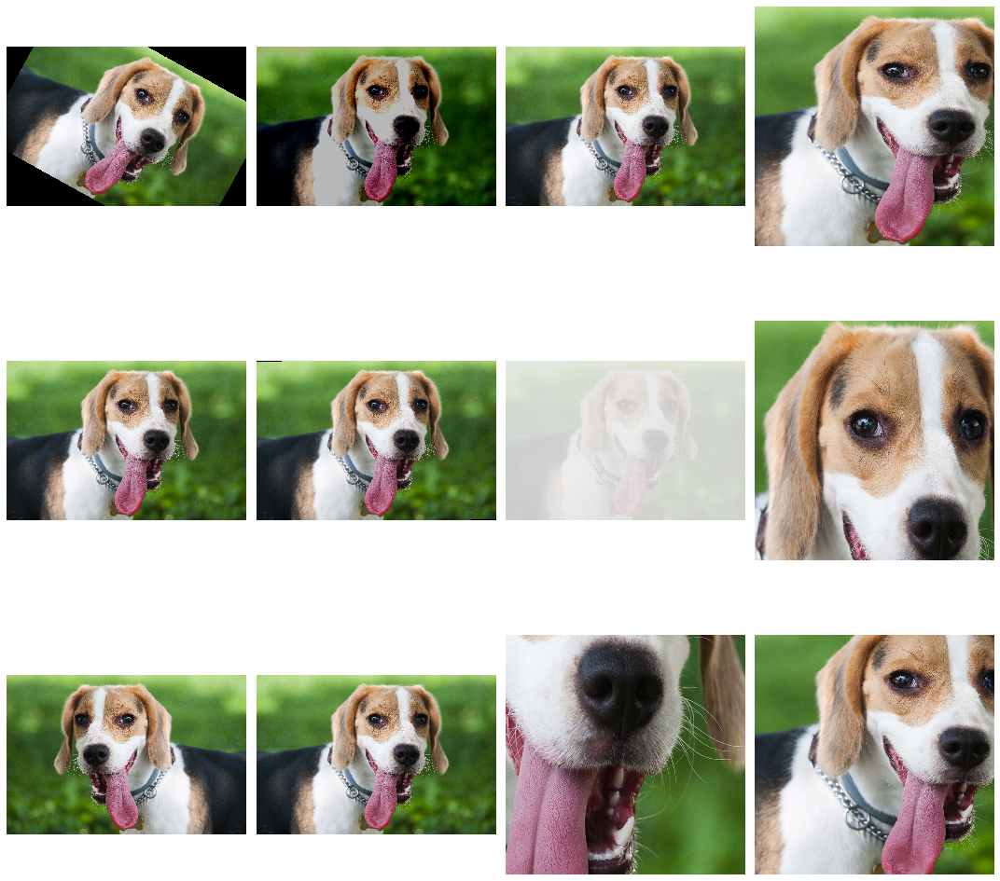

These transforms are most often used when working with the rest of the
torchvision pipeline which we already used while normalizing input
images.

```python
img_transforms = transforms.Compose([
  transforms.RandomHorizontalFlip(),
  transforms.ToTensor(),
  transforms.Normalize([0.5, 0.5, 0.5], [0.5, 0.5, 0.5])
])

train_dataset = datasets.CIFAR10(
      root      = '../data',
      train     = True,
      download  = True,
      transform = img_transform
)
```

When fetching an element from `train_dataset`, a new set of
transformation will be applied. This mechanism allows to perform data
augmentation without changing the rest of your training loop. You also
want to create a different set of transforms *without augmentations*
for your test set.

##### Transfer learning

Another very popular strategy to deal with the lack of data is to use
[*Transfer
Learning*](https://en.wikipedia.org/wiki/Transfer_learning). In this
method, we use a neural network that have been trained on another
(similar enough) task as a base to train our model for our task. We
want to *transfer* its knowledge to the new task.

The idea behind this method is that the *features* (the successive
internal representations of data) the model has learned on the base
task will probably be useful for the new one. This is where the
*similar enough* criterion between tasks comes into play. Train a
classifier to discriminate between cats and dogs will probably work a
lot better than doing the same thing starting from a galaxy image
classifier.

This methodology has been used for a long time in the field of
computer vision. It is the case because we had access to very generic
models working with real world images like ImageNet. For other fields
of deep learning like NLP, the use of transfer learning has only
started producing great results recently. The last lesson of this
course will be focused on this topic.

A lot of pretrained models weights have been released over the years
for both [PyTorch](https://pytorch.org/hub/) and
[TensorFlow](https://www.tensorflow.org/hub). These models constitute
a great toolbox for deep learning practitioners to apply transfer
learning.

Let's say we want to apply transfer learning starting from a VGG16
network trained on ImageNet to an image classification problem with 5
classes.


To apply transfer learning, we usually *freeze* most the weights of
the network (making it not trainable) in order to preserve what has
been learned on the initial task.

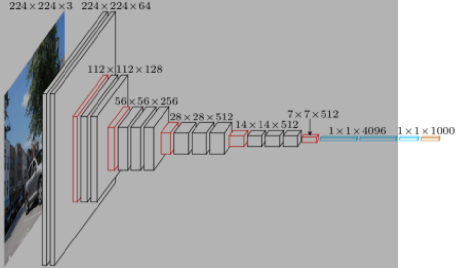

We then replace the last linear layer by a new untrained one (with the
correct number of outputs for our task). If our task is very different
from the initial one it is also possible to unfreeze more layers
starting from the last ones.

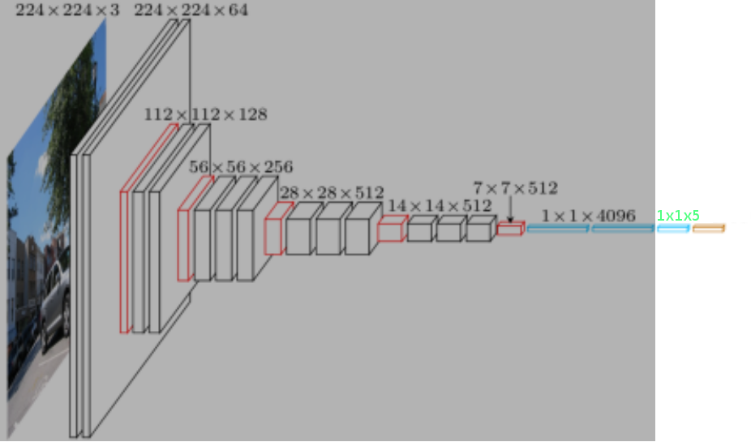

After the model is setup, we start the training process as usual. As
we have frozen most of the network, the only parameters that will be
trained will be the ones specific to our task, located at the end of
the model.

### Practical work

#### CIFAR-10

Create a convolutional neural network to complete the CIFAR-10
task. The neural network have to be:
- Modular (using multiple `nn.Module` for different parts)
- Use dropout to prevent overfitting
- Use data augmentation to improve performances
- Trained with a scheduled decrease of its learning rate

#### Transfer learning

Once you are done with the neural network of the previous section, you
can go on and apply the [Transfer learning for Computer Vision
Tutorial](https://pytorch.org/tutorials/beginner/transfer_learning_tutorial.html)
of the PyTorch documentation. Be careful to understand every step of
the tutorial.

To get the dataset in Google Colab, you can paste and run this code
and it will download and extract the data required for this model.

```shell
!wget https://download.pytorch.org/tutorial/hymenoptera_data.zip
!mkdir data
!unzip -q hymenoptera_data.zip -d data
```

The model used as a base in this tutorial is a deep residual neural
network. You can complete the tutorial without knowing how it works
but getting an intuition of the concept of *skip connection* will be
useful for following courses.


This figure and the description of the model architecture are
available at here: [Deep Residual Learning for Image
Recognition](https://arxiv.org/abs/1512.03385).

## Lesson 5

### Course

#### Transfer learning

Content mostly taken from PyTorch tutorial on [transfer
learning](https://pytorch.org/tutorials/beginner/transfer_learning_tutorial.html)

To load a pretrained ImageNet classification model, we can simply use
the torchvision module as follow

```python
from torchvision import models

model_conv = models.resnet18(pretrained = True)
print(model_conv)
```

By printing a model, we recursively list all of its components. It is
important to note that, except when in `nn.Sequential` block, we do
not know how these layers are used during the forward pass of the
model.

```
ResNet(
  (conv1): Conv2d(3, 64, kernel_size=(7, 7), stride=(2, 2), padding=(3, 3), bias=False)
  (bn1): BatchNorm2d(64, eps=1e-05, momentum=0.1, affine=True, track_running_stats=True)
  (relu): ReLU(inplace=True)
  (maxpool): MaxPool2d(kernel_size=3, stride=2, padding=1, dilation=1, ceil_mode=False)
  (layer1): Sequential(
    (0): BasicBlock(
      (conv1): Conv2d(64, 64, kernel_size=(3, 3), stride=(1, 1), padding=(1, 1), bias=False)
      (bn1): BatchNorm2d(64, eps=1e-05, momentum=0.1, affine=True, track_running_stats=True)
      (relu): ReLU(inplace=True)
      (conv2): Conv2d(64, 64, kernel_size=(3, 3), stride=(1, 1), padding=(1, 1), bias=False)
      (bn2): BatchNorm2d(64, eps=1e-05, momentum=0.1, affine=True, track_running_stats=True)
    )
    (1): BasicBlock(
      (conv1): Conv2d(64, 64, kernel_size=(3, 3), stride=(1, 1), padding=(1, 1), bias=False)
      (bn1): BatchNorm2d(64, eps=1e-05, momentum=0.1, affine=True, track_running_stats=True)
      (relu): ReLU(inplace=True)
      (conv2): Conv2d(64, 64, kernel_size=(3, 3), stride=(1, 1), padding=(1, 1), bias=False)
      (bn2): BatchNorm2d(64, eps=1e-05, momentum=0.1, affine=True, track_running_stats=True)
    )
  )
  (layer2): Sequential(
    (0): BasicBlock(
      (conv1): Conv2d(64, 128, kernel_size=(3, 3), stride=(2, 2), padding=(1, 1), bias=False)
      (bn1): BatchNorm2d(128, eps=1e-05, momentum=0.1, affine=True, track_running_stats=True)
      (relu): ReLU(inplace=True)
      (conv2): Conv2d(128, 128, kernel_size=(3, 3), stride=(1, 1), padding=(1, 1), bias=False)
      (bn2): BatchNorm2d(128, eps=1e-05, momentum=0.1, affine=True, track_running_stats=True)
      (downsample): Sequential(
        (0): Conv2d(64, 128, kernel_size=(1, 1), stride=(2, 2), bias=False)
        (1): BatchNorm2d(128, eps=1e-05, momentum=0.1, affine=True, track_running_stats=True)
      )
    )
    (1): BasicBlock(
      (conv1): Conv2d(128, 128, kernel_size=(3, 3), stride=(1, 1), padding=(1, 1), bias=False)
      (bn1): BatchNorm2d(128, eps=1e-05, momentum=0.1, affine=True, track_running_stats=True)
      (relu): ReLU(inplace=True)
      (conv2): Conv2d(128, 128, kernel_size=(3, 3), stride=(1, 1), padding=(1, 1), bias=False)
      (bn2): BatchNorm2d(128, eps=1e-05, momentum=0.1, affine=True, track_running_stats=True)
    )
  )
  (layer3): Sequential(
    (0): BasicBlock(
      (conv1): Conv2d(128, 256, kernel_size=(3, 3), stride=(2, 2), padding=(1, 1), bias=False)
      (bn1): BatchNorm2d(256, eps=1e-05, momentum=0.1, affine=True, track_running_stats=True)
      (relu): ReLU(inplace=True)
      (conv2): Conv2d(256, 256, kernel_size=(3, 3), stride=(1, 1), padding=(1, 1), bias=False)
      (bn2): BatchNorm2d(256, eps=1e-05, momentum=0.1, affine=True, track_running_stats=True)
      (downsample): Sequential(
        (0): Conv2d(128, 256, kernel_size=(1, 1), stride=(2, 2), bias=False)
        (1): BatchNorm2d(256, eps=1e-05, momentum=0.1, affine=True, track_running_stats=True)
      )
    )
    (1): BasicBlock(
      (conv1): Conv2d(256, 256, kernel_size=(3, 3), stride=(1, 1), padding=(1, 1), bias=False)
      (bn1): BatchNorm2d(256, eps=1e-05, momentum=0.1, affine=True, track_running_stats=True)
      (relu): ReLU(inplace=True)
      (conv2): Conv2d(256, 256, kernel_size=(3, 3), stride=(1, 1), padding=(1, 1), bias=False)
      (bn2): BatchNorm2d(256, eps=1e-05, momentum=0.1, affine=True, track_running_stats=True)
    )
  )
  (layer4): Sequential(
    (0): BasicBlock(
      (conv1): Conv2d(256, 512, kernel_size=(3, 3), stride=(2, 2), padding=(1, 1), bias=False)
      (bn1): BatchNorm2d(512, eps=1e-05, momentum=0.1, affine=True, track_running_stats=True)
      (relu): ReLU(inplace=True)
      (conv2): Conv2d(512, 512, kernel_size=(3, 3), stride=(1, 1), padding=(1, 1), bias=False)
      (bn2): BatchNorm2d(512, eps=1e-05, momentum=0.1, affine=True, track_running_stats=True)
      (downsample): Sequential(
        (0): Conv2d(256, 512, kernel_size=(1, 1), stride=(2, 2), bias=False)
        (1): BatchNorm2d(512, eps=1e-05, momentum=0.1, affine=True, track_running_stats=True)
      )
    )
    (1): BasicBlock(
      (conv1): Conv2d(512, 512, kernel_size=(3, 3), stride=(1, 1), padding=(1, 1), bias=False)
      (bn1): BatchNorm2d(512, eps=1e-05, momentum=0.1, affine=True, track_running_stats=True)
      (relu): ReLU(inplace=True)
      (conv2): Conv2d(512, 512, kernel_size=(3, 3), stride=(1, 1), padding=(1, 1), bias=False)
      (bn2): BatchNorm2d(512, eps=1e-05, momentum=0.1, affine=True, track_running_stats=True)
    )
  )
  (avgpool): AdaptiveAvgPool2d(output_size=(1, 1))
  (fc): Linear(in_features=512, out_features=1000, bias=True)
)
```

You should by now be familiar with most of the layer types used in
this architecture.

We can notice that in the `layerX` subnetworks of this model, the
downsampling operation (usually performed by a maximum pooling
operation) is done using *strided convolution*:

```python
(downsample): Sequential(
  (0): Conv2d(64, 128, kernel_size=(1, 1), stride=(2, 2), bias=False)
  (1): BatchNorm2d(128, eps=1e-05, momentum=0.1, affine=True, track_running_stats=True)
)
```


(Once again, animation from
[vdumoulin](https://github.com/vdumoulin/conv_arithmetic))

Keep this detail in mind as it will be used during the practical work.

We then freeze all the layers of the model to set the finetuning
procedure up.

```python
for param in model_conv.parameters():
    param.requires_grad = False
```

By doing this, we say to the optimizer that we do not want these
parameters to be modified during the training procedure.

As the classification task we are dealing with has two classes, we
have to change the last linear layer of the model to output two
values. To properly size it, we first fetch the `in_features`
parameter of the current last layer.

```python
num_ftrs = model_conv.fc.in_features
model_conv.fc = nn.Linear(
    in_features  = num_ftrs,
    out_features = 2
)
```

We then setup the rest of the training as usual.

```python
model_conv       = model_conv.to(device)
criterion        = nn.CrossEntropyLoss()
optimizer_conv   = optim.SGD(model_conv.fc.parameters(), lr=1e-3, momentum=0.9)
exp_lr_scheduler = lr_scheduler.StepLR(optimizer_conv, step_size=7, gamma=0.1)
```

The training loop stays the same as usual.

```python
train_model(model_ft, device, criterion, optimizer_ft, exp_lr_scheduler,
            num_epochs=25)
```

By using this transfer learning logic, we are able to solve a lot of
different computer vision problem.

This PyTorch tutorial is well written and I would strongly encourage
the students to complete it and try to apply it to their own problem
or Kaggle competitions such as [Dogs vs. Cats
Redux](https://www.kaggle.com/c/dogs-vs-cats-redux-kernels-edition). By
applying methods presented in tutorials to new problems, one generally
learns a tons of new information.

Recently, a small revolution has been happening in the machine
learning world with the discovery of very powerful transfer learning
method for Natural Language Processing (NLP) tasks. These advances are
mainly explained in the following research articles [Universal
Language Model Fine-tuning for Text
Classification](https://arxiv.org/abs/1801.06146), [Improving Language
Understanding by Generative
Pre-Training](https://openai.com/blog/language-unsupervised/) and
[BERT: Pre-training of Deep Bidirectional Transformers for Language
Understanding](https://arxiv.org/abs/1810.04805). Before taking a look
at these articles, we have to study the fundamentals of applying deep
learning to NLP tasks.

#### NLP methods

##### Embedding

Words are not continuous values which is the type of inputs neural
networks accept. In order to apply deep learning algorithms to textual
data, we have to transform the sequences of words into numerical
tensors. To do this, we will associate to each word of the vocabulary
a *vector* that will encode various information relevant to the task
we are solving, the vector corresponding to a word is called its
[*Embedding*](https://en.wikipedia.org/wiki/Word_embedding).

An [embedding
layer](https://pytorch.org/docs/stable/nn.html#torch.nn.Embedding) is
simply a lookup table of the embeddings. It is a tensor of shape
`[number of word in vocabulary, embedding dimension]`

```python
>>> embedding_layer = nn.Embedding(num_embeddings = 5, embedding_dim = 2)
>>> embedding_layer.weight
Parameter containing:
tensor([[-0.2029,  0.9372],
        [-0.5283, -0.6736],
        [ 1.4233,  0.7148],
        [ 0.2876,  0.6953],
        [ 1.1457,  1.0806]], requires_grad=True)

>>> embedding_layer.weight.shape
torch.Size([5, 2])

>>> word_index_sequence = torch.tensor([[0, 1, 0, 2]])
>>> word_index_sequence.shape
torch.Size([1, 4])

>>> embedded_sequence = embedding_layer(word_index_sequence)
>>> embedded_sequence
tensor([[[-0.2029,  0.9372],
         [-0.5283, -0.6736],
         [-0.2029,  0.9372],
         [ 1.4233,  0.7148]]], grad_fn=<EmbeddingBackward>)

>>> embedded_sequence.shape
torch.Size([1, 4, 2])
```

The embedding vectors of each word of the vocabulary are initialized
randomly. As you can notice, the weights of the embedding layer have
`requires_grad = True` which mean that they will be trained during the
whole model training procedure.

The vectors associated to each of the words will evolve during the
training to *encode* useful information about the words relative to
the task at hand. The word embeddings learned on a specific task may
be completely different to the ones trained on another unrelated task
even though they encode the same words.

Historically, when deep learning practitioners wanted to use neural
networks to solve NLP tasks, they used pre-trained embeddings. Using
these general purpose embeddings was the NLP version of *transfer
learning*.

There exist various tasks that have been used in the literature, for
example the Continuous Bag-of-Words model.

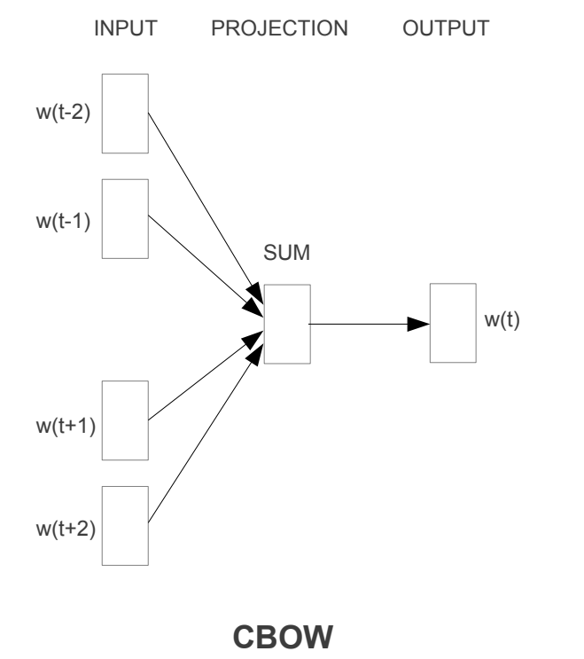

In this model, we train a model to predict the word in the middle of a
window using the embeddings of its surrounding words as input. This
task encourages the model to create word embeddings that encode
information about their *context*. The goal is to exploit the idea
that "You shall know a word by the company it keeps" by [John Rupert
Firth](https://en.wikipedia.org/wiki/John_Rupert_Firth).

Another similar method is the Continuous Skip-gram model.

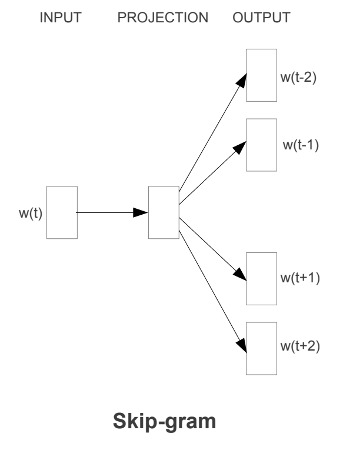

In this model, we use the embedding word as input to a model trying to
predict its *context*.

After the training procedure, we can analyze the word embeddings that
we obtain to get a sense of the information and relations between
concepts that they encode.


In the previous figure, we choose a set of words corresponding to
countries and their respective capitals. We then select from our
embedding matrix the set of vectors corresponding to these words. As
these vectors have 1000 dimensions, we reduce their dimensionality by
computing linear combinations of their coordinates using a [Principal
component
analysis](https://en.wikipedia.org/wiki/Principal_component_analysis). The
type of relation appears without additional supervision. The model has
learned the concept of country as `China` and `Russia` often appear in
the same *contexts*, the concept of capital as `Berlin` and `Paris`
often appear in the same contexts.

When trained on a sufficiently big corpus, word embeddings contained a
lot of different information on the words they are associated to.

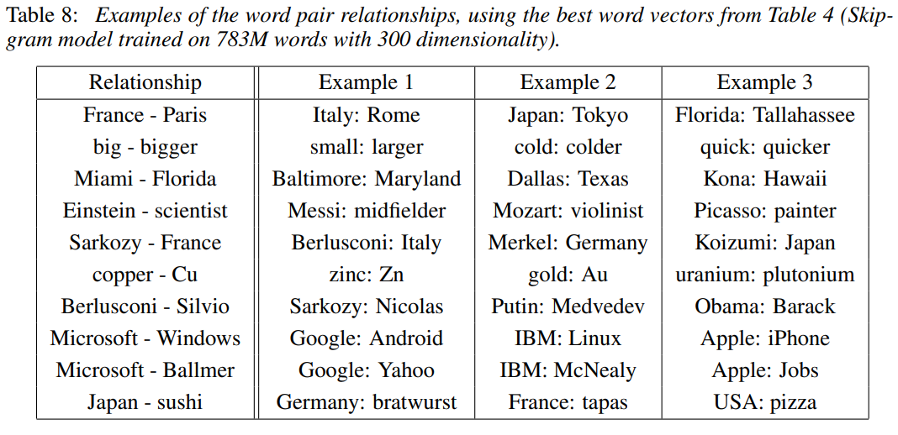

Pretrained word embeddings matrices include
[word2vec](https://en.wikipedia.org/wiki/Word2vec) and
[GloVe](https://nlp.stanford.edu/projects/glove/).

The source of these figures and more information on these methods can
be found in the articles in which they were defined: [Efficient
Estimation of Word Representations in Vector
Space](https://arxiv.org/abs/1301.3781) and [Distributed
Representations of Words and Phrases and their
Compositionality](https://arxiv.org/abs/1310.4546).

Much more information on word level semantics learning is available in
the Oxford Deep NLP course at [Lecture 2a- Word Level
Semantics](https://github.com/oxford-cs-deepnlp-2017/lectures#3-lecture-2a--word-level-semantics-ed-grefenstette)
([here for the lecture
video](http://media.podcasts.ox.ac.uk/comlab/deep_learning_NLP/2017-01_deep_NLP_2a_lexical_semantics.mp4))
and in the Christopher Olah's blog post [Deep Learning, NLP, and
Representations](http://colah.github.io/posts/2014-07-NLP-RNNs-Representations/).

##### Text preprocessing

Now that we *theorically* know how to transform a sequence of words
into a valid neural network input, let's see how to do it in practice.

In this section and the following ones, we will use a small sentiment
classification dataset from University of California Irvine. The raw
version of the dataset is available
[here](https://archive.ics.uci.edu/ml/datasets/Sentiment+Labelled+Sentences)
and a preprocessed version is available in this repository
[here](../datasets/comments.txt).

To load this dataset, we will use
[pandas](https://pandas.pydata.org/), a very popular data manipulation
tool. Getting in-depth knowledge of pandas is not part of the course,
more information on how to use it are available in the "Introduction
to Data Science Course" in this repository.

```python
import pandas as pd

df            = pd.read_csv('comments.txt', sep = '\t', names = ['comment', 'label'])
df['comment'] = df.comment.str.lower()

for _, row in df.head().iterrows():
  print(f'Label {row.label}, Comment "{row.comment}"')
```

```
Label 0, Comment "so there is no way for me to plug it in here in the us unless i go by a converter."
Label 1, Comment "good case, excellent value."
Label 1, Comment "great for the jawbone."
Label 0, Comment "tied to charger for conversations lasting more than 45 minutes.major problems!!"
Label 1, Comment "the mic is great."
```

Next, we need to split the comments into words and take a look at the
number of words repartition. The operation of splitting a text into a
sequence of words or *tokens* is called *tokenization*. It is usually
performed using much more advanced algorithms than simply cutting
whenever we see a space character. We use this method just to build a
minimal example.

```python
df['split_comment'] = df.comment.str.split()
df['n_tokens']      = df.split_comment.apply(len)
print(*df.head().split_comment, sep = '\n')
```

```
['so', 'there', 'is', 'no', 'way', 'for', 'me', 'to', 'plug', 'it', 'in', 'here', 'in', 'the', 'us', 'unless', 'i', 'go', 'by', 'a', 'converter.']
['good', 'case,', 'excellent', 'value.']
['great', 'for', 'the', 'jawbone.']
['tied', 'to', 'charger', 'for', 'conversations', 'lasting', 'more', 'than', '45', 'minutes.major', 'problems!!']
['the', 'mic', 'is', 'great.']
```

```python
print(*df.head().n_tokens, sep = ', ')
```

```
21, 4, 4, 11, 4
```

```python
df.n_tokens.hist(bins = 20)
```


As we can see, there is a great variability in the number of tokens in
each comment. There exist some model architectures that are able to
deal with variable length inputs but we have not seen them yet. We are
going to preprocess the data so that all comments have the same number
of tokens.

```python
def pad_comment(token_list, final_len, pad_token = '<pad>'):
  if len(token_list) > final_len:
    return token_list[:final_len]
  return token_list + [pad_token] * (final_len - len(token_list))
```

This function truncates the token list if it is too long and add
`<pad>` until `final_len` is reached otherwise. Let's apply it to our
comments.

```python
from functools import partial

max_token_comment = df.n_tokens.max()
df['padded_comment'] = df.split_comment.apply(
    partial(
        pad_comment,
        final_len = max_token_comment if max_token_comment % 2 == 0 else (max_token_comment + 1)
    )
)

print(df.padded_comment.iloc[1])
```

```
['good', 'case,', 'excellent', 'value.', '<pad>', '<pad>', '<pad>',
 '<pad>', '<pad>', '<pad>', '<pad>', '<pad>', '<pad>', '<pad>',
 '<pad>', '<pad>', ..., ]
```
We pad the sequences to an even length for reasons we will see later.

Now that our sequences are preprocessed, we need to build our
*vocabulary*, the set of words that can appear in comments.

```python
vocabulary = set()
for comment in df.split_comment:
  vocabulary.update(set(comment))
print(*list(vocabulary)[:5], sep = '\n')
```

```
boiled
happy,
think
world,
perplexing.
```

Now that we have our vocabulary, we need to create two mappings: one
from tokens to vocabulary index and another one from vocabulary index
to tokens.

```python
token_to_idx = {
    '<oov>': 0,
    '<pad>': 1,
    **{
        token: (idx + 2)
        for idx, token in enumerate(vocabulary)
    }
}

print('Number of words in the vocabulary:', len(token_to_idx))
print(token_to_idx['<pad>'])
print(token_to_idx['the'])
print(token_to_idx['happy'])
```

```
Number of words in the vocabulary: 7352
1
6477
7176
```

You can notice that we added two special tokens to our vocabulary,
`<pad>` and `<oov>`. We have already what `<pad>` is used for. The
`<oov>` will be used at test time to indicate the presence of Out Of
Vocabulary (OOV) words.

To generate the second mapping, we simply reverse this one.

```python
idx_to_token = {
    idx: token
    for token, idx in token_to_idx.items()
}
print(idx_to_token[6477])
print(idx_to_token[1234])
```

```
the
wash
```

We will use these two mappings to encode comments that we want to feed
to the model and decode comments that have been given as input to the
model. Let's encode our comment dataset.

```python
def encode(comment_tokens, token_to_idx):
  return [token_to_idx.get(token, 0) for token in comment_tokens]

def decode(comment_token_indices, idx_to_token):
  try:
    first_pad_index = comment_token_indices.index(1)
  except:
    first_pad_index = len(comment_token_indices)
  return ' '.join(idx_to_token[token_id] for token_id in comment_token_indices[:first_pad_index])
```

Let's now test these functions.

```python
comment = df.padded_comment.iloc[3]
print(comment[:15])
encoded_comment = encode(comment, token_to_idx)
print(encoded_comment[:15])
print(decode(encoded_comment, idx_to_token))
```

```
['tied', 'to', 'charger', 'for', 'conversations', 'lasting', 'more', 'than', '45', 'minutes.major', 'problems!!', '<pad>', '<pad>', '<pad>', '<pad>']
[257, 5192, 313, 645, 4893, 6427, 4619, 3652, 3156, 4918, 6922, 1, 1, 1, 1]
tied to charger for conversations lasting more than 45 minutes.major problems!!
```

Now that we know that our functions work, let's encode the whole dataset.

```python
df['encoded_comment'] = df.padded_comment.apply(
    partial(
        encode,
        token_to_idx = token_to_idx
    )
)
```

Now that our comments are in a proper format, we can convert them into
PyTorch objects.

```python
X = torch.tensor(df.encoded_comment)
y = torch.tensor(df.label)
print(X.shape, y.shape)
dataset = TensorDataset(X, y)
```

```
torch.Size([3000, 72]) torch.Size([3000])
```

We have `3000` comments and each of them is a sequence of `72` tokens
(a lot of them being padding tokens). For each comment, the label `y`
tells us whether is is positive `1` or negative `0`.

To evaluate our model, we are going to split the dataset into two
parts, a *training set* that will be used to train it, and a *test
set* that will not be seen during training that will be used to
*evaluate* the model's *generalization capabilities*.

```python
test_prop = .1
test_size = int(len(dataset) * test_prop)
train_dataset, test_dataset = random_split(dataset, [len(dataset) - test_size, test_size])
len(train_dataset), len(test_dataset)
```

```
(2700, 300)
```

Finally, we create our dataloaders that we will use to iterate through
the two datasets.

```python
train_loader = DataLoader(train_dataset, batch_size = 32, shuffle = True)
test_loader  = DataLoader(test_dataset, batch_size = 32, shuffle = True)
```

##### Training and evaluation functions

Our problem is a simple classification task. As we have properly
plugged our data into the PyTorch framework, the training and
evaluation loop does not differ from what we have seen until now.

```python
def eval(model, loader):
  model.eval()
  correct_pred = 0
  total_pred   = 0
  with torch.no_grad():
    for X, y in loader:
      y_pred        = model(X)
      y_pred_class  = y_pred.argmax(dim = 1)
      correct_pred += (y == y_pred_class).sum().item()
      total_pred   += len(y)

  return correct_pred / total_pred

def train(model, epochs, optimizer, criterion, train_loader, test_loader):
  for epoch in range(epochs):
    model.train()
    for batch_id, (X, y) in enumerate(train_loader):
      optimizer.zero_grad()
      y_pred = model(X)
      loss   = criterion(y_pred, y)
      loss.backward()
      optimizer.step()
    if epoch % 5 == 0:
    print(f'[{epoch:4}] Train eval {100 * eval(model, train_loader):5.3f}%, Test eval {100 * eval(model, test_loader):5.3f}%')
```

##### MLP for NLP

Now that our data are properly formatted, we can create our first
neural network. In this section, the neural network will be a
multilayer perceptron.

```python
class MLPCommentClassifier(nn.Module):
  def __init__(self, emb_dim, voc_size, seq_len):
    super(MLPCommentClassifier, self).__init__()
    self.emb      = nn.Embedding(voc_size, emb_dim)
    self.lin1     = nn.Linear(seq_len * emb_dim, 64)
    self.dropout1 = nn.Dropout(.7)
    self.lin2     = nn.Linear(64, 64)
    self.dropout2 = nn.Dropout(.4)
    self.lin3     = nn.Linear(64, 2)

  def forward(self, x):                 # [batch, 72]
    x = self.emb(x)                     # [batch, 72, emb_dim]
    x = torch.flatten(x, start_dim = 1) # [batch, 72 * emb_dim]
    x = self.lin1(x)                    # [batch, 64]
    x = self.dropout1(x)                # [batch, 64]
    x = F.relu(x)                       # [batch, 64]
    x = self.lin2(x)                    # [batch, 64]
    x = self.dropout2(x)                # [batch, 64]
    x = F.relu(x)                       # [batch, 64]
    x = self.lin3(x)                    # [batch, 2]
    x = torch.log_softmax(x, dim = 1)   # [batch, 2]

    return x
```

In the forward method, `self.emb(x)` will replace each token index by
its corresponding embedding vector. The shape is then `[batch size,
sequence length, embedding dimension]`. As we have seen before, linear
layers only work on 1D inputs, because of this, we flatten the
sequence of embedding vectors to obtain a 1D array with `x =
torch.flatten(x, start_dim = 1)`.

The rest of the model is a very usual fully connected network. Let's
now instantiate the model and train it.

```python
model = MLPCommentClassifier(
    emb_dim  = 5,
    voc_size = len(token_to_idx),
    seq_len  = train_dataset[0][0].shape[0]
)
print(model)
```

```
MLPCommentClassifier(
  (emb): Embedding(7352, 5)
  (lin1): Linear(in_features=360, out_features=64, bias=True)
  (dropout1): Dropout(p=0.7, inplace=False)
  (lin2): Linear(in_features=64, out_features=64, bias=True)
  (dropout2): Dropout(p=0.4, inplace=False)
  (lin3): Linear(in_features=64, out_features=2, bias=True)
)
```

```python
optimizer = optim.Adam(model.parameters())
criterion = nn.NLLLoss()
train(model, 151, optimizer, criterion, train_loader, test_loader)
```

```
[   0] Train eval 49.852%, Test eval 52.333%
[   5] Train eval 50.074%, Test eval 52.333%
[  10] Train eval 50.630%, Test eval 47.667%
[  15] Train eval 50.630%, Test eval 48.000%
[  20] Train eval 52.296%, Test eval 52.333%
[  25] Train eval 52.741%, Test eval 53.000%
[  30] Train eval 53.704%, Test eval 53.000%
[  35] Train eval 53.556%, Test eval 52.000%
[  40] Train eval 56.000%, Test eval 50.333%
[  45] Train eval 59.037%, Test eval 49.333%
[  50] Train eval 61.741%, Test eval 49.667%
[  55] Train eval 64.185%, Test eval 53.667%
[  60] Train eval 68.704%, Test eval 59.000%
[  65] Train eval 73.037%, Test eval 59.333%
[  70] Train eval 75.444%, Test eval 59.667%
[  75] Train eval 80.259%, Test eval 60.333%
[  80] Train eval 82.593%, Test eval 58.333%
[  85] Train eval 84.926%, Test eval 61.667%
[  90] Train eval 87.963%, Test eval 60.000%
[  95] Train eval 88.963%, Test eval 59.333%
[ 100] Train eval 90.444%, Test eval 60.333%
[ 105] Train eval 91.556%, Test eval 61.667%
[ 110] Train eval 92.037%, Test eval 60.333%
[ 115] Train eval 93.148%, Test eval 59.667%
[ 120] Train eval 92.667%, Test eval 61.667%
[ 125] Train eval 93.889%, Test eval 61.333%
[ 130] Train eval 94.481%, Test eval 60.667%
[ 135] Train eval 94.667%, Test eval 62.667%
[ 140] Train eval 94.778%, Test eval 63.000%
[ 145] Train eval 95.741%, Test eval 61.333%
[ 150] Train eval 95.852%, Test eval 61.333%
```

We see that this model *overfits* the training data quite a lot, while
not giving very good performances (63% accuracy at most compared to a
model always answering 1 that would have 50% accuracy). The dataset
available for this task is very small (only 3000 comments) so we will
probably not be able to fix all the overfitting using
regularization. There is still room for improvement by using models
able to use the *spacial* nature of textual data, Convolutional neural
networks.

##### 1D convolutions for NLP

When we worked on image data, we used 2D convolutional networks
because pictures are two dimensional inputs, each pixel have neighbors
in two directions, above, below and on its sides.

In the world of NLP, inputs are sequences of words. Each word only has
neighbors on its sides, it is a *1 dimensional signal*. To work with
this kind of signal, we use *1D convolutions*. A 1D convolution is
applied to a 1D signal and is parametrized by 1D kernels.

```python
class CNNCommentClassifier(nn.Module):
  def __init__(self, emb_dim, voc_size, seq_len):
    super(CNNCommentClassifier, self).__init__()
    self.emb      = nn.Embedding(voc_size, emb_dim)
    self.conv1    = nn.Conv1d(emb_dim, 32, 3, padding = 1)
    self.dropout1 = nn.Dropout(.7)
    self.conv2    = nn.Conv1d(32     , 32, 3, padding = 1)
    self.dropout2 = nn.Dropout(.6)
    self.conv3    = nn.Conv1d(32     , 64, 3, padding = 1)
    self.dropout3 = nn.Dropout(.5)
    self.conv4    = nn.Conv1d(64     , 64, 3, padding = 1)
    self.dropout4 = nn.Dropout(.3)
    self.lin1     = nn.Linear((seq_len // 4) * 64, 64)
    self.lin2     = nn.Linear(64, 2)

  def forward(self, x):                 # [batch, 72]
    x = self.emb(x)                     # [batch, 72, 5]
    x = torch.transpose(x, 1, 2)        # [batch, 5, 72]
    x = self.conv1(x)                   # [batch, 32, 72]
    x = self.dropout1(x)                # [batch, 32, 72]
    x = F.relu(x)                       # [batch, 32, 72]
    x = self.conv2(x)                   # [batch, 32, 72]
    x = self.dropout2(x)                # [batch, 32, 72]
    x = F.relu(x)                       # [batch, 32, 72]
    x = F.max_pool1d(x, 2)              # [batch, 32, 36]
    x = self.conv3(x)                   # [batch, 64, 36]
    x = self.dropout3(x)                # [batch, 64, 36]
    x = F.relu(x)                       # [batch, 64, 36]
    x = self.conv4(x)                   # [batch, 64, 36]
    x = self.dropout4(x)                # [batch, 64, 36]
    x = F.relu(x)                       # [batch, 64, 36]
    x = F.max_pool1d(x, 2)              # [batch, 64, 18]
    x = torch.flatten(x, start_dim = 1) # [batch, 64 * 18]
    x = self.lin1(x)                    # [batch, 64]
    x = F.relu(x)                       # [batch, 64]
    x = self.lin2(x)                    # [batch, 2]
    x = torch.log_softmax(x, dim = 1)   # [batch, 2]

    return x
```

When working with convolutions in PyTorch, we want inputs of the shape
`[batch, channel, signal dimensions]`. When we worked with 2D signals
this was `[batch, channel, height, width]` and now, with token
sequences, it is `[batch, channel, token index]`. When we want to
apply a convolution after an embedding layer, the *embedding dimensions*
play the role of *channels*.

As we have seen previously, PyTorch embeddings output are of the shape
`[batch, token index, embedding dimension]` as this is not what we
want, we have to
[*transpose*](https://en.wikipedia.org/wiki/Transpose) the last two
dimensions. We perform this operation using `torch.transpose(x, 1,
2)`.

Just as we use `nn.Conv1d` in place of `nn.Conv2d`, we use
`F.max_pool1d` in place of `F.max_pool2d`.

```python
model = CNNCommentClassifier(
    emb_dim = 5,
    voc_size = len(token_to_idx),
    seq_len = train_dataset[0][0].shape[0]
)
print(model)
```

```
CNNCommentClassifier(
  (emb): Embedding(7352, 5)
  (conv1): Conv1d(5, 32, kernel_size=(3,), stride=(1,), padding=(1,))
  (dropout1): Dropout(p=0.7, inplace=False)
  (conv2): Conv1d(32, 32, kernel_size=(3,), stride=(1,), padding=(1,))
  (dropout2): Dropout(p=0.6, inplace=False)
  (conv3): Conv1d(32, 64, kernel_size=(3,), stride=(1,), padding=(1,))
  (dropout3): Dropout(p=0.5, inplace=False)
  (conv4): Conv1d(64, 64, kernel_size=(3,), stride=(1,), padding=(1,))
  (dropout4): Dropout(p=0.3, inplace=False)
  (lin1): Linear(in_features=1152, out_features=64, bias=True)
  (lin2): Linear(in_features=64, out_features=2, bias=True)
)
```

```python
optimizer = optim.Adam(model.parameters())
criterion = nn.NLLLoss()
train(model, 151, optimizer, criterion, train_loader, test_loader)
```

```
[   0] Train eval 49.815%, Test eval 51.667%
[   5] Train eval 58.889%, Test eval 54.333%
[  10] Train eval 65.519%, Test eval 58.667%
[  15] Train eval 67.815%, Test eval 62.000%
[  20] Train eval 77.593%, Test eval 63.000%
[  25] Train eval 81.519%, Test eval 64.333%
[  30] Train eval 86.889%, Test eval 66.000%
[  35] Train eval 89.037%, Test eval 66.333%
[  40] Train eval 92.370%, Test eval 67.667%
[  45] Train eval 93.778%, Test eval 66.667%
[  50] Train eval 94.630%, Test eval 67.667%
[  55] Train eval 96.593%, Test eval 69.667%
[  60] Train eval 97.148%, Test eval 69.667%
[  65] Train eval 97.630%, Test eval 69.667%
[  70] Train eval 97.593%, Test eval 67.667%
[  75] Train eval 98.667%, Test eval 69.667%
[  80] Train eval 98.444%, Test eval 68.667%
[  85] Train eval 99.185%, Test eval 70.667%
[  90] Train eval 98.889%, Test eval 69.000%
[  95] Train eval 98.481%, Test eval 68.667%
[ 100] Train eval 99.556%, Test eval 70.667%
[ 105] Train eval 99.630%, Test eval 71.667%
[ 110] Train eval 99.222%, Test eval 68.333%
[ 115] Train eval 99.815%, Test eval 70.000%
[ 120] Train eval 99.778%, Test eval 70.333%
[ 125] Train eval 99.741%, Test eval 69.333%
[ 130] Train eval 99.593%, Test eval 69.667%
[ 135] Train eval 99.852%, Test eval 71.000%
[ 140] Train eval 99.741%, Test eval 68.667%
[ 145] Train eval 99.889%, Test eval 71.000%
[ 150] Train eval 99.889%, Test eval 71.333%
```

Once again, we see a big overfit but the accuracy on the test set is
much better.

##### Recurrent neural network

*Recurrent neural networks* (RNNs) are another family of neural
network. They are specifically designed to work with sequences.


(Image from [Chris Olah's
blog](https://colah.github.io/posts/2015-08-Understanding-LSTMs/))

A recurrent neural network can be thought of as multiple copies of the
same network, each passing a message to a successor (citation from
Olah's blog). For each token of the sequence, the neural network is
applied and takes two inputs: the token itself and the hidden output
computed by the RNN on the previous token. You can take a look at
PyTorch
[tutorial](https://pytorch.org/tutorials/intermediate/char_rnn_classification_tutorial.html)
on recurrent neural network from scratch to get a sense of how they
work.

In the code of this section, we will use a Long Short-Term Memory
network (from [this
article](http://web.eecs.utk.edu/~ielhanan/courses/ECE-692/Bobby_paper1.pdf))
which is a more "robust" version of the simple RNN. A precise
explanation of its inner working is beyond the scope of this
course. The architecture of this model is described in the following
diagram.


```python
class RNNCommentClassifier(nn.Module):
  def __init__(self, emb_dim, voc_size, seq_len):
    super(RNNCommentClassifier, self).__init__()
    self.emb = nn.Embedding(voc_size, emb_dim)
    self.rnn = nn.LSTM(
        input_size    = emb_dim,
        hidden_size   = 64,
        bidirectional = True, # We look at the sequence from start to end and from
                              # end to start at the same type. It is a typical "hack"
                              # of RNN to make them more powerful
        dropout       = .3
    )
    self.dropout = nn.Dropout(.2)
    # 2 directions
    self.lin     = nn.Linear(64 * 2, 2)

  def forward(self, x):                                    # [batch, 72]
    x                      = self.emb(x)                   # [batch, 72, 5]
    x                      = torch.transpose(x, 0, 1)      # [72, batch, 5]
    output, (hidden, cell) = self.rnn(x)                   # output = [72, batch, 64]
                                                           # hidden = [layers (1) * num directions (2) = 2, batch, 64]
                                                           # cell   = [layers (1) * num_directions (2) = 2, batch, 64]
    hidden                 = torch.transpose(hidden, 0, 1) # hidden = [batch, layers (1) * num_directions (2) = 2, 64]
    hidden                 = torch.cat((
        hidden[:, 0, :],
        hidden[:, 1, :]
        ),
        dim = -1
    )                                                      # hidden = [batch, hidden (64) * num_directions (2) = 128]
    hidden                 = self.dropout(hidden)          # [batch, 128]
    x                      = self.lin(hidden)              # [batch, 2]
    x                      = torch.log_softmax(x, dim = 1) # [batch, 2]

    return x
```

In PyTorch, RNNs take inputs of shape `[sequence length, batch size,
embedding dimension]` as inputs for subtle computation efficiency
reasons.

After applying the model from left to right and right to left
(`bidirectional = True`), we get the output of the RNN in `hidden`. We
reshape it in order to feed it to a linear layer to obtain our final
predictions.

```
[   0] Train eval 50.259%, Test eval 47.667%
[   5] Train eval 67.444%, Test eval 60.000%
[  10] Train eval 77.111%, Test eval 64.333%
[  15] Train eval 83.519%, Test eval 66.333%
[  20] Train eval 89.556%, Test eval 69.333%
[  25] Train eval 93.815%, Test eval 69.333%
[  30] Train eval 93.852%, Test eval 67.333%
[  35] Train eval 98.778%, Test eval 71.667%
[  40] Train eval 99.333%, Test eval 72.000%
[  45] Train eval 94.556%, Test eval 65.333%
[  50] Train eval 99.704%, Test eval 71.333%
[  55] Train eval 99.889%, Test eval 70.667%
[  60] Train eval 100.000%, Test eval 70.667%
[  65] Train eval 100.000%, Test eval 70.333%
[  70] Train eval 100.000%, Test eval 70.667%
[  75] Train eval 100.000%, Test eval 71.000%
[  80] Train eval 100.000%, Test eval 70.000%
[  85] Train eval 100.000%, Test eval 70.000%
[  90] Train eval 99.815%, Test eval 73.667%
[  95] Train eval 100.000%, Test eval 72.667%
[ 100] Train eval 100.000%, Test eval 72.667%
[ 105] Train eval 100.000%, Test eval 73.000%
[ 110] Train eval 100.000%, Test eval 72.667%
[ 115] Train eval 100.000%, Test eval 72.000%
[ 120] Train eval 100.000%, Test eval 72.000%
[ 125] Train eval 100.000%, Test eval 72.333%
[ 130] Train eval 100.000%, Test eval 72.667%
[ 135] Train eval 100.000%, Test eval 72.000%
[ 140] Train eval 100.000%, Test eval 72.333%
[ 145] Train eval 100.000%, Test eval 72.333%
[ 150] Train eval 100.000%, Test eval 72.667%
```

We can see that these models are very powerful. They still overfit
strongly to the training data because of the dataset size but they
also achieve the best accuracies on the test set.

### Practical work

The goal of this practical is to build an
[autoencoder](https://en.wikipedia.org/wiki/Autoencoder) for the
dataset MNIST.

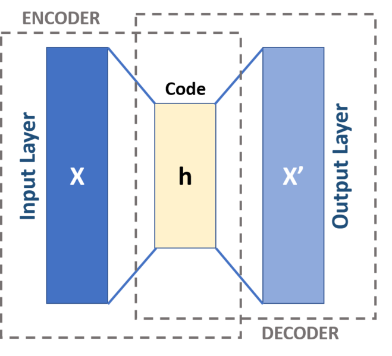

(image from Wikipedia.org)

An autoencoder is a neural network composed of two smaller models: an
encoder and a decoder. The encoder takes the input data and process it
to reduce the number of values it is stored on, it *compresses* the
data. The decoder takes the code that was produced by the encoder and
expand it to increase the number of values it is stored on, it
*decompresses* the data. You will find below a simple multilayer
perceptron autoencoder. The loss used to train such a model is the
Mean Squared Error loss that we have seen while studying the linear
regression.

You have to build most of the code by yourself using pieces from
previous practical work and the documentation. The first goal is to
write all the code required to train the following model:

```python
class MLPAutoencoder(nn.Module):
    def __init__(self, encoding_size):
        super(MLPAutoencoder, self).__init__()
        self.encoder = nn.Sequential(
            nn.Linear(784, 300),
            nn.ReLU(),
            nn.Linear(300, 100),
            nn.ReLU(),
            nn.Linear(100, encoding_size),
            nn.ReLU()
        )
        self.decoder = nn.Sequential(
            nn.Linear(encoding_size, 100),
            nn.ReLU(),
            nn.Linear(100, 300),
            nn.ReLU(),
            nn.Linear(300, 784),
            nn.Sigmoid()
        )

    def forward(self, x):
        x_flat       = torch.flatten(x, start_dim = 1)
        encoded_x    = self.encoder(x_flat)
        decoded_x    = self.decoder(encoded_x)
        decoded_x_2d = decoded_x.view(x.shape[0], 1, 28, 28)

        return decoded_x_2d
```

Once this model works, the goal is create another autoencoder using
convolution layers.

#### Dataset loading

Load the MNIST training and test data. You want to load the data in
such a way that the values of the pixels are in the interval `[0,
1]`. Verify that you have loaded data properly by:

- Looking at the minimum and maximum pixel values for a few images
- Displaying a few images using `plt.imshow`

#### Training and evaluation code

Write the training and evaluation function. Their prototype should be
the following ones:

```python
def train(model, epochs, optimizer, criterion, device, train_loader, test_loader)

def eval(ae, criterion, device, loader, n_batch = -1)
```

The task might be different from what we have seen until now but the
training loop should look very similar to the ones of the previous
courses.

#### Main function

Write the main function combining everything you wrote and the given
autoencoder architecture.

The pseudocode is the following one:

```
Create device
Create model
Put model on device
Create optimizer (Use Adam)
Create criterion (Use nn.MSELoss())
Call the training function
```

Once your function training procedure is working, you can take a look
at your results by using `plt.imshow`.

You can find below a few images you should get during the training
process. Left column is the source image, right column is the result
of the compression-decompression process. All the images in this
section and the CNN section have been obtained with an encoding size
of 10, resulting in a compression factor of 98.7% (10 / 784).

0% training

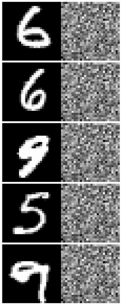

50% training

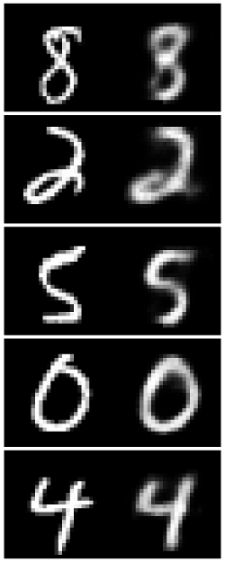

100% training

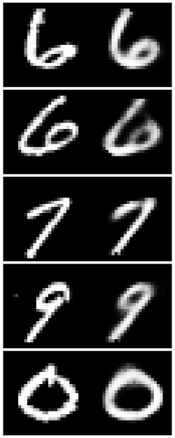

#### Convolutional autoencoder

First, create the build blocks of our convolutional autoencoder using
this kind of design.

```python
class ConvBlock(nn.Module):
    def __init__(self, in_channels, out_channels, kernel_size = 3,
                 stride = 1, padding = 1, act = F.relu):
        super(ConvBlock, self).__init__()
        self.conv = nn.Conv2d(
            in_channels  = in_channels,
            out_channels = out_channels,
            kernel_size  = kernel_size,
            stride       = stride,
            padding      = padding,
        )
        self.act = act

    def forward(self, x):
        x = self.conv(x)
        x = self.act(x)

        return x
```

I cannot stress this enough: **test systematically each of block right
after creating it**. You do not have to create a complicated model
just to test a single module, just randomly create some inputs using
`torch.randn` and check the shapes.

For example, to test `ConvBlock` that we have just defined, we can
write the following test:

```python
conv_block = ConvBlock(in_channels = 32, out_channels = 64)
img_batch  = torch.randn(16, 32, 50, 50)
output     = conv_block(img_batch)
print(output.shape)
```

```
torch.Size([16, 64, 50, 50])
```

The batch size did not change, the number of channels of the output is
`64` as we asked and the images are still `50x50` because `ConvBlock`
uses padding by default. This module works.

The blocks that you have to build are the following ones (remember the
strided convolution from the course):

```python
class ConvDownsample(nn.Module):
    '''
    A strided convolution and a relu activation, the height and width of
    its inputs should be divided by 2.
    '''
    def __init__(self, ...):
        super(ConvDownsample, self).__init__()
        pass

    def forward(self, x):
        pass
```

Using
[`nn.ConvTranspose2d`](https://pytorch.org/docs/stable/nn.html#convtranspose2d)
build the following block. Pay very close attention to the examples in
the documentation. You can also take a look at the "Transposed
convolution animations section" of
[vdumoulin](https://github.com/vdumoulin/conv_arithmetic#transposed-convolution-animations)
repository.

```python
class ConvUpsample(nn.Module):
    '''
    Opposite of a downsample, the height and width of its inputs should
    be multiplied by 2. This class takes `output_size` as parameter. This
    parameter will be given to the ConvTranspose2d layer as in the
    documentation.
    '''
    def __init__(self, output_size, ...):
        super(ConvUpsample, self).__init__()
        pass

    def forward(self, x):
        pass
```

The following block will be located at the very end of the encoder.

```python
class ArrayToEncoding(nn.Module):
    '''
    Transforms the output of the last convolution of the encoder
    into a 1D array and make it pass through a linear layer with
    out_features = encoding_size.
    '''
    def __init__(self, encoding_size, ...):
        super(ArrayToEncoding, self).__init__()
        pass

    def forward(self, x):
        pass
```

The following block will be located at the very beginning of the
decoder.

```python
class EncodingToArray(nn.Module):
    '''
    Transforms the output of the encoder (the code) into something
    that a convolution can take as input, a 2D array. This layer
    should be composed of a linear layer with the correct number
    of out_features followed by a `view` operation.
    '''
    def __init__(self, encoding_size, ...):
        super(EncodingToArray, self).__init__()
        pass

    def forward(self, x):
        pass
```

Once all the building blocks are created and **tested**, build your
convolutional autoencoder. The skeleton should look something like
this:

```python
class ConvAutoencoder(nn.Module):
    def __init__(self, encoding_size):
        super(ConvAutoencoder, self).__init__()
        self.encoder = nn.Sequential(
            ConvBlock(...),
            ConvBlock(..),
            ConvDownsample(...),
            ConvBlock(...),
            ConvBlock(...),
            ConvDownsample(...),
            ArrayToEncoding(encoding_size)
        )

        self.decoder = nn.Sequential(
            EncodingToArray(encoding_size),
            ConvUpsample(...),
            ConvBlock(...),
            ConvBlock(...),
            ConvUpsample(...),
            ConvBlock(..),
            ConvBlock(...) # Remember to use sigmoid as activation here
        )

    def forward(self, x):
        encoded_x = self.encoder(x)
        decoded_x = self.decoder(encoded_x)

        return decoded_x
```

0% training

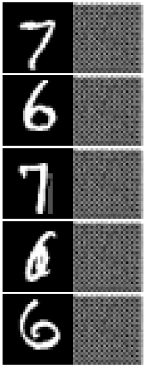

The pattern that we see in this picture is called a [checkerboard
artifact](https://distill.pub/2016/deconv-checkerboard/) and it is due
to the use of transposed convolutions.

50% training

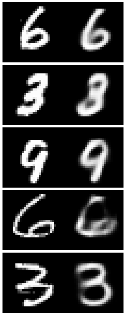

100% training


## Lesson 6

### Course

#### NLP Pre-training tasks

##### Language modeling

As mentioned earlier in the course, a small revolution has been
happening in the machine learning world with the discovery of very
powerful transfer learning method for Natural Language Processing
(NLP) tasks. These advances are mainly explained in the following
research articles

- [Universal Language Model Fine-tuning for Text
  Classification](https://arxiv.org/abs/1801.06146),
- [Improving Language Understanding by Generative
  Pre-Training](https://openai.com/blog/language-unsupervised/)
- [BERT: Pre-training of Deep Bidirectional Transformers for Language
  Understanding](https://arxiv.org/abs/1810.04805).

All advances have in common the kind of task used to pretrained
model. When we performed transfer learning in computer vision, we used
an ImageNet network such as *VGG16* or *ResNet* as a starting
point. This worked pretty well because ImageNet classification is a
task for which we have a huge amount of training data and involves a
wide variety of real word patterns. The task used in the research
article mentioned above has the same property.

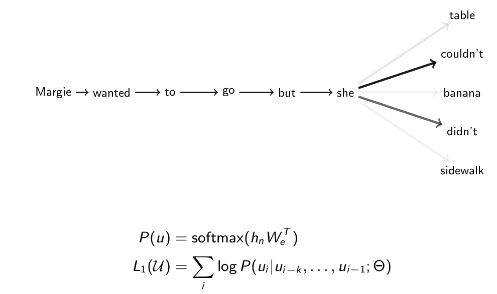

The *language modeling* task consists in taking a sequence of words as
input and to predict the most likely following word. It can be seen as
a *classification task*, the number of classes being the number of words
in the vocabulary.

The figure presented above shows a basic example of language modeling
in which the model has to predict a single words using only words that
appeared in the "past" (to its left). More advanced techniques such as
the *masked language modeling* task used to pretrain the BERT model
make the model predict a variable number of words, using context from
the left and the right (bidirectional property).

This task is very choice for multiple reasons:

- We have nearly unlimited training data for it, (inputs, output)
  couples can be extracted for every texts in the correct language.
- Performing this task correctly requires to have at least some
  semantic understanding of all the concepts mentioned in the
  context. In the figure above, we can see that understanding the
  meaning and the context in which the term `but` is used is necessary
  to produce the right prediction.

##### Next sentence prediction

In the [BERT](https://arxiv.org/abs/1810.04805) article, the authors
also use the *next sentence prediction* task. This task consists in
taking a pair sentences and predicting whether they appear next to
other in a text. Once again, we have huge amount of training data for
this task.

The language modeling task is great to force the model to capture
*word-level semantics* but it does not focus a lot on relationship
between two sentences. Capturing this kind of *sentence-level
semantics* is very useful for many downstream tasks such as Question
Answering (QA) and Natural Language Inference (NLI).

#### BERT

##### Theory

###### Attention mechanism

The model architecture used in the BERT article is called a
*Transformer Network*. This family of models have been introduced in
the article [Attention Is All You
Need](https://arxiv.org/abs/1706.03762) so, in order to study how this
model works, we first have to look at *Attention Mechanisms*.

Attention mechanisms are inspired by the idea that, when humans take
decisions based on visual information, they focus most of their
*attention* on a specific portion of the available information. Let's
take a look at a result of such mechanism being implemented in a
neural network. This example is from the article [Show, Attend and
Tell: Neural Image Caption Generation with Visual
Attention](https://arxiv.org/abs/1502.03044) in which the authors
create a neural network which generates captions for images using
an attention mechanism.


This figures shows for the underlined word the parts of the image on
which the neural networks *focused* its attention to choose this
word. By allowing a model to choose the weight it will give to each
part of its inputs in its computations, we greatly improve its
computing power.

The same concept applies to natural language processing tasks.

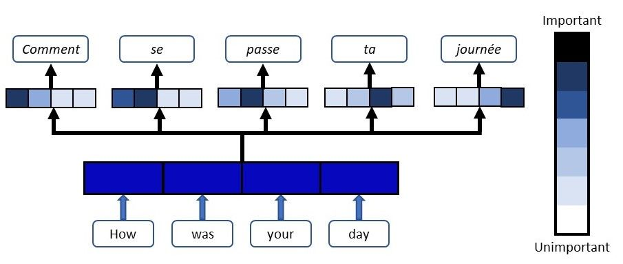

(image from [Floydhub](https://blog.floydhub.com/attention-mechanism/))

Let's go over an example of *Scaled Dot-Product Attention*

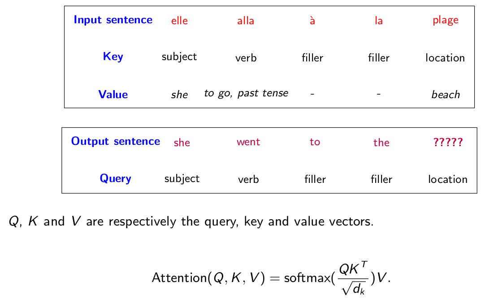

In this example, we are translating a sentence from french to
English. The french sentence is "Elle alla à la plage" and so far our
model have generated the following output sentence "She went to
the". The model now has to choose what the next word should be.

The model has an internal representation of each of the token in the
input and in the output, we can think of this representation as an
*embedding* of the token that has been computed by the model. Now
using this embedding, the *attention layer* will use three linear
layers to produced three tensors, a *query* tensor, a *key* tensor and
a *value* tensor.

The *query* tensor is computed using the translation. It represents
what *type* of information we are looking for to generate the next
word. Based on the beginning of the sentence "She went to the", the
*query layer* have computed that we want a *location* information.

The *key* tensor is computed using the input sentence. It represents the
*type* of information each of the input token represents. The *key
layer* have computed that the token "plage" contains a location
information.

The *value* tensor is computed using the input sentence. It represents
the *semantic information* contained in each token. For example, the
*value layer* have computed that the token "alla" refers to the
concept of the verb "to go" and is conjugated to the past tense and
that "plage" refers to the concept of "beach".

Now, to compute how much the model should focus on each part of the
input, `Attention(Q, K, V)`. To find what kind is the information that
we need, we compute the dot-product between the query (what we look
for) and the key tensor (what kind of information is available). Then,
to focus the attention mainly on a single place, we apply a softmax
activation. Now that we know *where* is the information we want, we
fetch its value by multiplying the result of the previous computation
to the value tensor. The scaling factor in the softmax layer is very
important theorically, you can find an explanation for its presence in
the section 3.2.1 of the "Attention is all you need" article.

You can take a look at
[this](https://distill.pub/2016/augmented-rnns/) distil.pub
publication to get more details on how the attention mechanism
functions on RNNs or
[this](http://akosiorek.github.io/ml/2017/10/14/visual-attention.html)
blog post from Adam Kosiorek.

###### BERT embeddings

The BERT model uses three different kinds of embeddings.

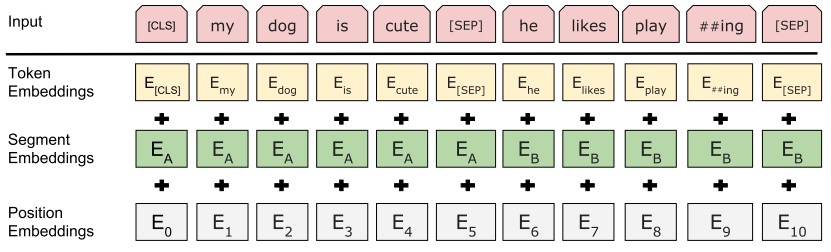

The *token embeddings* corresponds to classical word embeddings as we
have seen in the previous course. These are 768 dimensional vectors
associated to each token of the vocabulary encoding its *semantic
meaning*.

The BERT architecture is applicable to many tasks, some of them
taking more than one sequence as input. Some examples include the
"Next sentence prediction" task and the Textual semantic similarly task
(quantifying how much two sentences are semantically similar). In
order to allow the model to treat the first and the second sequence
differently, we add *segment embeddings* indicating to what sequence
belongs the current token.

Because all the internal layers of the BERT model are *linear* and
uses attention layer, the model looses by default information about
the *order* of the tokens in the input. As the token order information
is very important, we add *position embeddings*. Each position of the
input has a specific embedding that have been trained during the
pre-training phase. The model has learned to encode the position of
the words in the sequences in order to use it to improve its
performances.

Let's take an example in the figure above. We have two sentences `my
dog is cute` and `he likes playing` and we want to predict if the
second comes after the first one in a text. When we encode the token
`likes`, we fetch three embeddings:
- The *token embedding* _E<sub>likes</sub>_ of `likes`, containing
  semantic information about this token
- `likes` comes from the second sentences so we fetch the segment
  embedding _E<sub>B</sub>_ of the second sentence
- `likes` is located at the position `7` in the input so we fetch the
  position encoding of the position `7`, _E<sub>7</sub>_

Once we have these three embeddings, we simply add them and pass the
result as input to the network.

###### Multi-task model

As explained before, BERT has been created to allow it to perform many
different kinds of tasks.

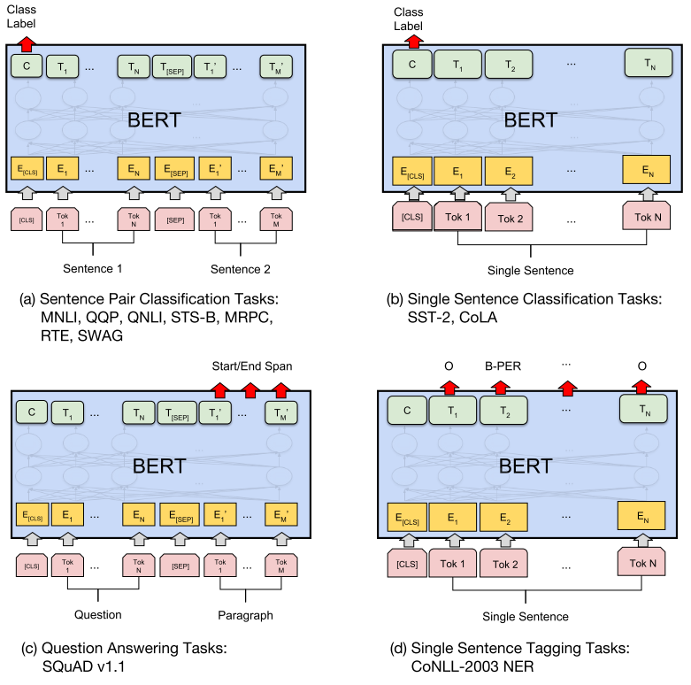

Depending on the task we want to perform, we will feed the data and
read the predictions differently from the model.

In this course, we will only see the simplest case, the single
sentence classification tasks. To use BERT to perform this kind of
task, we first add the `[CLS]` token at the beginning of our
sequence. We then compute the embedding of our input as explained in
the previous section. As we only have a single sentence, all the
segment embeddings will be identical. BERT outputs a tensor for each
of the tokens of our input. To get a single representation of our
sequence, we select the tensor corresponding the the `[CLS]` token
(the first one) and feed it to a linear layer performing our
classification task.

##### Model architecture

The BERT architecture is a bidirectional Transformer encoder from the
[Attention Is All You Need](https://arxiv.org/abs/1706.03762).

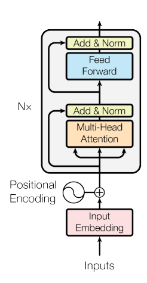

Let's examine the output we get when we print the architecture of our
BERT model.

```python
BertForSequenceClassification(
  (bert): BertModel(
    (embeddings): BertEmbeddings(
      (word_embeddings): Embedding(30522, 768, padding_idx=0)
      (position_embeddings): Embedding(512, 768)
      (token_type_embeddings): Embedding(2, 768)
      (LayerNorm): LayerNorm((768,), eps=1e-12, elementwise_affine=True)
      (dropout): Dropout(p=0.1, inplace=False)
    )
    (encoder): BertEncoder(
      (layer): ModuleList(
        (0): BertLayer(
          (attention): BertAttention(
            (self): BertSelfAttention(
              (query): Linear(in_features=768, out_features=768, bias=True)
              (key): Linear(in_features=768, out_features=768, bias=True)
              (value): Linear(in_features=768, out_features=768, bias=True)
              (dropout): Dropout(p=0.1, inplace=False)
            )
            (output): BertSelfOutput(
              (dense): Linear(in_features=768, out_features=768, bias=True)
              (LayerNorm): LayerNorm((768,), eps=1e-12, elementwise_affine=True)
              (dropout): Dropout(p=0.1, inplace=False)
            )
          )
          (intermediate): BertIntermediate(
            (dense): Linear(in_features=768, out_features=3072, bias=True)
          )
          (output): BertOutput(
            (dense): Linear(in_features=3072, out_features=768, bias=True)
            (LayerNorm): LayerNorm((768,), eps=1e-12, elementwise_affine=True)
            (dropout): Dropout(p=0.1, inplace=False)
          )
        )

        [...]

        (11): BertLayer(
          (attention): BertAttention(
            (self): BertSelfAttention(
              (query): Linear(in_features=768, out_features=768, bias=True)
              (key): Linear(in_features=768, out_features=768, bias=True)
              (value): Linear(in_features=768, out_features=768, bias=True)
              (dropout): Dropout(p=0.1, inplace=False)
            )
            (output): BertSelfOutput(
              (dense): Linear(in_features=768, out_features=768, bias=True)
              (LayerNorm): LayerNorm((768,), eps=1e-12, elementwise_affine=True)
              (dropout): Dropout(p=0.1, inplace=False)
            )
          )
          (intermediate): BertIntermediate(
            (dense): Linear(in_features=768, out_features=3072, bias=True)
          )
          (output): BertOutput(
            (dense): Linear(in_features=3072, out_features=768, bias=True)
            (LayerNorm): LayerNorm((768,), eps=1e-12, elementwise_affine=True)
            (dropout): Dropout(p=0.1, inplace=False)
          )
        )
      )
    )
    (pooler): BertPooler(
      (dense): Linear(in_features=768, out_features=768, bias=True)
      (activation): Tanh()
    )
  )
  (dropout): Dropout(p=0.1, inplace=False)
  (classifier): Linear(in_features=768, out_features=2, bias=True)
)
```

##### Code example

Let's finetune a BERT model to the sentiment classification that we
worked on during the previous course.

First we start by installing the `transformers` module.

```
pip install transformers
```

We then import everything we will need for our task.

```python
import pandas as pd

import torch
from torch.utils.data import TensorDataset, DataLoader, random_split

from transformers import BertForSequenceClassification, BertTokenizer, BertConfig
from transformers.optimization import AdamW, get_linear_schedule_with_warmup
from transformers.data.processors.utils import InputExample, InputFeatures
```

We are going to create all the functions we will need to apply to our
task.

First we need to load a pre-trained version of the BERT model. There
exist a [large
variety](https://huggingface.co/transformers/pretrained_models.html)
of pre-trained BERT models, here are some of them:

- `bert-base-uncased`: 12-layer, 768-hidden, 12-heads, 110M
  parameters. Trained on lower-cased English text.
- `bert-large-uncased`: 24-layer, 1024-hidden, 16-heads, 340M
  parameters.  Trained on lower-cased English text.
- `bert-base-chinese`: 12-layer, 768-hidden, 12-heads, 110M parameters.
  Trained on cased Chinese Simplified and Traditional text.
- `bert-base-multilingual-cased`: 12-layer, 768-hidden, 12-heads, 110M
  parameters.  Trained on cased text in the top 104 languages with the
  largest Wikipedias.

For our task, we will use `bert-base-uncased`.

```python
def load_pretrained_model(pretrained_model_name, num_labels = 2):
  config = BertConfig.from_pretrained(
    pretrained_model_name,
    do_lower_case = True,
    num_labels    = num_labels
  )
  tokenizer = BertTokenizer.from_pretrained(
      pretrained_model_name,
      do_lower_case = True
  )
  model = BertForSequenceClassification.from_pretrained(
      pretrained_model_name,
      from_tf = False,
      config  = config
  )

  return config, tokenizer, model
```

We now write a function to load our dataset into the `transformers`
preferred format. No preprocessing is applied at this step, it will
come when we transform our *raw inputs* into *features*.

```python
def load_examples(filename):
  df            = pd.read_csv(filename, sep = '\t', names = ['comment', 'label'])
  df['comment'] = df.comment.str.lower()

  examples = [
      InputExample(
          guid   = sample_id,
          text_a = row.comment,
          label  = row.label
      )

      for sample_id, row in df.iterrows()
  ]

  return examples
```

Transformer network can take variable size inputs but just as with the
CNNs, every sequence in a batch must have the same size in order to be
able to wrap it with `torch.tensor`s. We will pad (add `[PAD]` tokens)
to every sequence of the dataset to fix this problem.

The feature generation step when using this library is very similar to
what we did during the previous course:

Let's recall the preprocessing steps we applied in the last course:

- First we split our sequences into list of tokens during the
  *tokenization* phase
- We truncate the sequences whose length are bigger than the maximum
  length that we have fixed.
- We padded the sequences to make them all have the same length.
- We created a *vocabulary*, the set of tokens that can appear in our
  inputs
- We *encoded* our sequences by replacing each token by its index in
  the vocabulary

These steps are also required when working with BERT, except that some
of them are done by the library and others have been done during the
pre-trained of the model.

```python
def convert_examples_to_features(examples, tokenizer, max_length):
  features = []
  for ex_index, example in enumerate(examples):
    inputs = tokenizer.encode_plus(
        text               = example.text_a,
        add_special_tokens = True,
        max_length         = max_length
    )
    input_ids, token_type_ids = inputs['input_ids'], inputs['token_type_ids']
    # The attention mask is used to forbid BERT to focus its attention
    # on the padding tokens representations.
    attention_mask            = [1] * len(input_ids)

    # Padding everything
    pad_token            = tokenizer.convert_tokens_to_ids([tokenizer.pad_token])[0]
    pad_token_segment_id = 0
    padding_length       = max_length - len(input_ids)
    input_ids            = input_ids      + [pad_token]            * padding_length
    token_type_ids       = token_type_ids + [pad_token_segment_id] * padding_length
    attention_mask       = attention_mask + [0]                    * padding_length

    features.append(
        InputFeatures(
            input_ids      = input_ids,
            attention_mask = attention_mask,
            token_type_ids = token_type_ids,
            label          = example.label
        )
    )

  return features
```

The tokenization, truncation and encoding of the sequences are all
done by the call to `tokenizer.encode_plus`. The vocabulary of tokens
have already been created during the pre-training phase of the model.

As BERT takes 3 sequences as input (token ids, attention mask and
segment id), we have to pad all of them. An `InputFeatures` instance
simply is a class that groups together the tokens ids, attention mask,
segment ids and label of a sample.

Now that we have an `InputFeatures` instance for each sample of the
dataset, let's create a `TensorDataset` to wrap all the information.

```python
def create_dataset(features):
  all_input_ids      = torch.tensor([f.input_ids for f in features], dtype = torch.long)
  all_attention_mask = torch.tensor([f.attention_mask for f in features], dtype = torch.long)
  all_token_type_ids = torch.tensor([f.token_type_ids for f in features], dtype = torch.long)
  all_labels         = torch.tensor([f.label for f in features], dtype = torch.long)

  dataset = TensorDataset(
      all_input_ids,
      all_attention_mask,
      all_token_type_ids,
      all_labels
  )

  return dataset
```

As usual, we will split our dataset into a training set and and
evaluation set to properly assess the quality of our model
predictions.

```python
def split_dataset(dataset, test_prop):
  test_size = int(len(dataset) * test_prop)
  (
      train_dataset,
      test_dataset
  )         = random_split(dataset, [len(dataset) - test_size, test_size])

  return train_dataset, test_dataset
```

The evaluation function should look very similar to the one of every
classification problems we have seen until now. The only difference is
that the loss computation is taken care of by the model itself. It
knows what type of loss should be applied (`nn.NLLLoss`) because we
have loaded a `transformers.BertForSequenceClassification` pretrained
instance.

```python
def evaluate(model, device, loader, n_batch = 20):
  losses       = []
  correct_pred = 0
  total_pred   = 0
  model.eval()
  with torch.no_grad():
      for step, (input_ids, attention_mask, token_type_ids, labels) in enumerate(loader):
        if step == n_batch:
          break
        input_ids      = input_ids.to(device)
        attention_mask = attention_mask.to(device)
        token_type_ids = token_type_ids.to(device)
        labels         = labels.to(device)

        loss, preds = model(
            input_ids      = input_ids,
            attention_mask = attention_mask,
            token_type_ids = token_type_ids,
            labels         = labels
        )
        correct_pred += (preds.argmax(axis = 1) == labels).sum().item()
        total_pred   += len(labels)
        losses.append(loss.item())

  mean_loss = sum(losses) / len(losses)
  accuracy  = correct_pred / total_pred

  return mean_loss, accuracy
```

The training function also looks very similar to what we have seen in
the past. Once again, the model computes its loss by itself.

```python
def train(model, device, epochs, optimizer, scheduler, train_loader, test_loader):
  for epoch in range(epochs):
    for step, (input_ids, attention_mask, token_type_ids, labels) in enumerate(train_loader):
      model.train()
      input_ids      = input_ids.to(device)
      attention_mask = attention_mask.to(device)
      token_type_ids = token_type_ids.to(device)
      labels         = labels.to(device)

      outputs = model(
          input_ids      = input_ids,
          attention_mask = attention_mask,
          token_type_ids = token_type_ids,
          labels         = labels
      )
      loss = outputs[0]

      loss.backward()
      optimizer.step()
      scheduler.step()
      model.zero_grad()

      if step % 50 == 0:
        train_mean_loss, train_accuracy = evaluate(model, device, train_loader)
        eval_mean_loss, eval_accuracy   = evaluate(model, device, test_loader)
        print(
            f'[{epoch:2d}, {step:5d}]'
            f' Train: loss {train_mean_loss:6.3f}, '
            f'accuracy {100 * train_accuracy:5.2f}%    '
            f'|| Eval: loss {eval_mean_loss:6.3f}, '
            f'accuracy {100 * eval_accuracy:6.2f}%'
        )
```

The main function calls all the functions that we defined earlier in
order to run the model finetuning procedure.

```python
def main():
  # Hyperparameters setting
  pretrained_model_name = 'bert-base-uncased'
  device                = torch.device('cuda')
  batch_size            = 8
  lr                    = 2e-5
  adam_eps              = 1e-8
  epochs                = 3
  warmup_steps          = 0
  test_prop             = .1

  # Pretrained model loading
  (
    config,
    tokenizer,
    model
  )     = load_pretrained_model(pretrained_model_name)
  model = model.to(device)

  # Dataset loading
  examples         = load_examples('comments.txt')
  features         = convert_examples_to_features(examples, tokenizer, 75)
  dataset          = create_dataset(features)
  (
      train_dataset,
      test_dataset
  )                = split_dataset(dataset, test_prop)
  train_loader = DataLoader(train_dataset, batch_size = batch_size, shuffle = True)
  test_loader  = DataLoader(test_dataset, batch_size = batch_size, shuffle = True)

  # Setup optimizer and learning rate scheduler
  optimizer            = AdamW(
      params = model.parameters(),
      lr     = lr,
      eps    = adam_eps
  )
  total_training_steps = len(train_loader) * epochs
  scheduler            = get_linear_schedule_with_warmup(
      optimizer          = optimizer,
      num_warmup_steps   = warmup_steps,
      num_training_steps = total_training_steps
  )

  train(model, device, epochs, optimizer, scheduler, train_loader, test_loader)

  return device, model, tokenizer, train_loader, test_loader
```

```
[ 0,     0] Train: loss  0.702, accuracy 53.75%    || Eval: loss  0.688, accuracy  55.62%
[ 0,    50] Train: loss  0.311, accuracy 92.50%    || Eval: loss  0.331, accuracy  93.12%
[ 0,   100] Train: loss  0.215, accuracy 93.75%    || Eval: loss  0.218, accuracy  93.12%
[ 0,   150] Train: loss  0.186, accuracy 92.50%    || Eval: loss  0.188, accuracy  93.75%
[ 0,   200] Train: loss  0.136, accuracy 95.00%    || Eval: loss  0.211, accuracy  91.88%
[ 0,   250] Train: loss  0.081, accuracy 98.12%    || Eval: loss  0.208, accuracy  92.50%
[ 0,   300] Train: loss  0.037, accuracy 99.38%    || Eval: loss  0.126, accuracy  95.00%
[ 1,     0] Train: loss  0.059, accuracy 98.75%    || Eval: loss  0.140, accuracy  96.25%
[ 1,    50] Train: loss  0.055, accuracy 98.12%    || Eval: loss  0.203, accuracy  95.00%
[ 1,   100] Train: loss  0.086, accuracy 97.50%    || Eval: loss  0.198, accuracy  94.38%
[ 1,   150] Train: loss  0.047, accuracy 98.12%    || Eval: loss  0.164, accuracy  95.62%
[ 1,   200] Train: loss  0.067, accuracy 98.12%    || Eval: loss  0.175, accuracy  93.75%
[ 1,   250] Train: loss  0.092, accuracy 98.12%    || Eval: loss  0.136, accuracy  94.38%
[ 1,   300] Train: loss  0.048, accuracy 98.75%    || Eval: loss  0.155, accuracy  95.00%
[ 2,     0] Train: loss  0.038, accuracy 99.38%    || Eval: loss  0.150, accuracy  92.50%
[ 2,    50] Train: loss  0.028, accuracy 99.38%    || Eval: loss  0.226, accuracy  93.12%
[ 2,   100] Train: loss  0.009, accuracy 100.00%   || Eval: loss  0.229, accuracy  92.50%
[ 2,   150] Train: loss  0.040, accuracy 99.38%    || Eval: loss  0.223, accuracy  93.12%
[ 2,   200] Train: loss  0.008, accuracy 100.00%   || Eval: loss  0.164, accuracy  94.38%
[ 2,   250] Train: loss  0.023, accuracy 98.75%    || Eval: loss  0.166, accuracy  93.12%
[ 2,   300] Train: loss  0.005, accuracy 100.00%   || Eval: loss  0.124, accuracy  95.00%
```

When finetuning BERT models, the learning rate and number of epochs
are both very low (`3` epochs and a learning rate of `2e-5` in our
case) as advised in the research article. Running more training epochs
usually does not improve the performances beyond what is reached
during the first few.

### Practical work

#### Apply BERT to horoscope classification

Apply the BERT model to [this
dataset](../datasets/horoscope_dataset.csv). The task consists in
determining the sign to which an horoscope is about. The horoscope are
evenly spread among 12 signs giving a baseline accuracy of 8.3%. Using
BERT you should get an accuracy of around 35 to 40%.

```
SIGN       DATE        TEXT
cancer     2013-04-03  You gain strength as the day progresses now th...
pisces     2011-07-19  The Moon's monthly visit to your sign usually ...
gemini     2011-03-08  You might have a lot on your mind today, makin...
libra      2014-10-09  An unresolved emotional issue may stubbornly w...
virgo      2012-03-02  You want to be more involved with everyone at ...
cancer     2013-01-21  Sharing your emotions can be a challenge now, ...
aries      2014-09-14  Your intuition tells you to follow your feelin...
taurus     2010-08-21  You are very aware of the difference between h...
virgo      2017-05-06  You don't like being pushed to the edge becaus...
capricorn  2014-08-23  You can see a relationship meltdown in the mak...
```

#### Language model

Using the [dataset](../datasets/horoscope_dataset.csv) presented
above, build an automatic horoscope generator using the language
modeling task.

Let's consider the following horoscope dataset:

```
["Although you may have looked forward to doing something special today, it may not sound so good as the time approaches. There's a part of you that just feels lazy and would rather be a couch potato. But even if it takes a while to get going, you'll feel better about everything once you are in motion. Give yourself enough time to rest, but don't let the day pass you by without burning off a bit of physical energy.",
 "You are eager to kick back and indulge yourself today, but it may turn into a much more active day than you expected. A flash of inspiration could set you on a path toward a simple goal. But once you get started your project begins to grow. Be careful, for it's easy to think you are being practical when you are actually making your life more complicated than necessary.",
 "You may want to get a jump-start on financial planning for the year ahead, especially if you just need some time to reevaluate your goals. But instead of dreaming about how you can make more money, it's smarter to consider ways to limit excess spending. Creating a budget based upon known expenses can help you figure out what your options actually are now. Even if you are only guessing at this point, it's still a great exercise to get you thinking in a more responsible manner.",
 "If you want some peace and quiet today, you might have to come right out and tell someone to leave you alone. But how you deliver the message can be just as important as what you say. Make it clear that you are not rejecting others, because you may not get your much-needed silence if they take your request personally. You'll have more to give those you love once you get some rest.",
 "This can be a great day to do something special for yourself that establishes a pattern for a new daily routine. Keep in mind that your gift doesn't have to be extravagant; it only needs to be healthy. Consider a small step that's related to exercise or diet that you can take now. You might be pleasantly surprised at how a little change can make such a big difference.",
 "If you are feeling restricted by someone in your life today, an unexpected turn of events can release a bit of tension and loosen the reins. Paradoxically, this surprising twist might be provoked by a misunderstanding that forces you to talk about what's happening. Even if you are uncomfortable with where the conversation is going at first, stick with it. Luckily, unforeseen relief is on the way.",
 "Normally, you're a better team player than a solo act, but today you may be driven to show everyone how capable you are of managing things. Others might not realize what you're doing now, for you can be quite subtle as you exercise control over what's happening. Keep in mind that you can make it much easier on yourself once you realize that you don't have to take charge of everything.",
 "You can make it appear as if you don't want to participate in the activities of the day, yet you might still be hurt if you are not included. You cannot blame others if they believe they are doing what you prefer by leaving you alone. Fortunately, you can control the outcome by being very clear about what you want.",
 "It's difficult for you to establish healthy limits today as the Sun activates your key planet Jupiter. You mistakenly believe that if a small quantity is good then a larger amount is even better. But this kind of logic will land you in a heap of trouble if you have to deal with the consequences of overindulgence later in the day. Be smart and stop before it's too late.",
 "You have some serious magic working in your favor today, but you must figure out how to harness it. If you cannot find something constructive to do with all your energy, your frustration could build until you lose your temper at someone who probably isn't even the real source of your annoyance. Remember that others are relaxing on this holiday, so don't try to impose your ambitious plans on them just yet."]
```

The steps are the following ones:

- Concatenate all the horoscope together to form a large text.

```
"Although you may have looked forward to doing something special today, it may not sound so good as the time approaches. There's a part of you that just feels lazy and would rather be a couch potato. But even if it takes a while to get going, you'll feel better about everything once you are in motion. Give yourself enough time to rest, but don't let the day pass you by without burning off a bit of physical energy. You are eager to kick back and indulge yourself today, but it may turn into a much more active day than you expected. A flash of inspiration could set you on a path toward a simple goal. But once you get started your project begins to grow. Be careful, for it's easy to think you are being practical when you are actually making your life more complicated than necessary. You may want to get a jump-start on financial planning for the year ahead, especially if you just need some time to reevaluate your goals. But instead of dreaming about how you can make more money, it's smarter to consider ways to limit excess spending. Creating a budget based upon known expenses can help you figure out what your options actually are now. Even if you are only guessing at this point, it's still a great exercise to get you thinking in a more responsible manner. If you want some peace and quiet today, you might have to come right out and tell someone to leave you alone. But how you deliver the message can be just as important as what you say. Make it clear that you are not rejecting others, because you may not get your much-needed silence if they take your request personally. You'll have more to give those you love once you get some rest. This can be a great day to do something special for yourself that establishes a pattern for a new daily routine. Keep in mind that your gift doesn't have to be extravagant; it only needs to be healthy. Consider a small step that's related to exercise or diet that you can take now. You might be pleasantly surprised at how a little change can make such a big difference. If you are feeling restricted by someone in your life today, an unexpected turn of events can release a bit of tension and loosen the reins. Paradoxically, this surprising twist might be provoked by a misunderstanding that forces you to talk about what's happening. Even if you are uncomfortable with where the conversation is going at first, stick with it. Luckily, unforeseen relief is on the way. Normally, you're a better team player than a solo act, but today you may be driven to show everyone how capable you are of managing things. Others might not realize what you're doing now, for you can be quite subtle as you exercise control over what's happening. Keep in mind that you can make it much easier on yourself once you realize that you don't have to take charge of everything. You can make it appear as if you don't want to participate in the activities of the day, yet you might still be hurt if you are not included. You cannot blame others if they believe they are doing what you prefer by leaving you alone. Fortunately, you can control the outcome by being very clear about what you want. It's difficult for you to establish healthy limits today as the Sun activates your key planet Jupiter. You mistakenly believe that if a small quantity is good then a larger amount is even better. But this kind of logic will land you in a heap of trouble if you have to deal with the consequences of overindulgence later in the day. Be smart and stop before it's too late. You have some serious magic working in your favor today, but you must figure out how to harness it. If you cannot find something constructive to do with all your energy, your frustration could build until you lose your temper at someone who probably isn't even the real source of your annoyance. Remember that others are relaxing on this holiday, so don't try to impose your ambitious plans on them just yet."
```

- Choose a context size slide a window of that size on your text to
  generate your dataset.

```python
>>> window_size = 10
...
>>> inputs, outputs = split_text(text, window_size)
>>> inputs[0]
['Although',
 'you',
 'may',
 'have',
 'looked',
 'forward',
 'to',
 'doing',
 'something',
 'special']

>>> outputs[0]
'today,'

>>> inputs[-1]
["don't",
 'try',
 'to',
 'impose',
 'your',
 'ambitious',
 'plans',
 'on',
 'them',
 'just']

>>> outputs[-1]
'yet.'
```

- Build a vocabulary, a token to id and an id to token correspondence as
  we did during the previous course.

```python
>>> list(vocabulary)[:10]
['forces', "it's", 'You', 'Luckily,', 'careful,', 'but', 'great', 'over', 'with', 'hurt']

>>> token_to_idx['subtle']
332

>>> token_to_idx['life']
302

>>> idx_to_token[302]
'life'

>>> idx_to_token[332]
'subtle'
```

- Encode the inputs and the outputs.

```python
>>> encoded_inputs[0]
[142, 15, 289, 223, 155, 143, 147, 33, 40, 333]

>>> ' '.join(idx_to_token[idx] for idx in encoded_inputs[0])
'Although you may have looked forward to doing something special'

>>> encoded_outputs[0]
237

>>> idx_to_token[237]
'today,'

>>> outputs[0]
'today,'
```

- Wrap your encoded inputs and outputs into a `TensorDataset`.

- Split your dataset into a training and evaluation set.

- Build a convolutional text classifier with the correct number of
  output classes that you will use to model the language.

- Train and evaluate your model.

- Build a function that generates a fake horoscope word by word
  starting with a prefix given as argument. The final length of the
  sequence is given as argument to the function.

## References

- [Google machine learning crash course](https://developers.google.com/machine-learning/crash-course)
- [Python Data Science Handbook](https://nbviewer.jupyter.org/github/jakevdp/PythonDataScienceHandbook/blob/master/notebooks/Index.ipynb) by Jake VanderPlas
- [PyTorch tutorials](https://pytorch.org/tutorials/)
- [Deep Learning, NLP, and
 Representations](http://colah.github.io/posts/2014-07-NLP-RNNs-Representations/)
 by Christopher Olah
- [Oxford Deep NLP course](https://github.com/oxford-cs-deepnlp-2017/lectures)
- [University of Illinois CS 521: Statistical Natural Language
  Processing](http://www.natalieparde.com/teaching/cs521_spring2020.html)
- [Stanford CS224n: Natural Language Processing with Deep
  Learning](http://web.stanford.edu/class/cs224n/)
- [Carnegie Mellon University CS11-747: Neural networks for
  NLP](http://phontron.com/class/nn4nlp2020/index.html)
