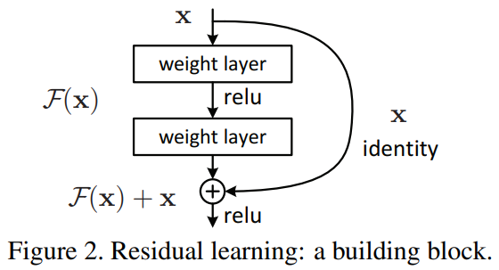

# Practical work 4

## CIFAR-10

Create a convolutional neural network to complete the CIFAR-10
task. The neural network have to be:
- Modular (using multiple `nn.Module` for different parts)
- Use dropout to prevent overfitting
- Use data augmentation to improve performances
- Trained with a scheduled decrease of its learning rate

## Transfer learning

Once you are done with the neural network of the previous section, you
can go on and apply the [Transfer learning for Computer Vision
Tutorial](https://pytorch.org/tutorials/beginner/transfer_learning_tutorial.html)
of the PyTorch documentation. Be careful to understand every step of
the tutorial.

To get the dataset in Google Colab, you can paste and run this code
and it will download and extract the data required for this model.

```shell
!wget https://download.pytorch.org/tutorial/hymenoptera_data.zip
!mkdir data
!unzip -q hymenoptera_data.zip -d data
```

The model used as a base in this tutorial is a deep residual neural
network. You can complete the tutorial without knowing how it works
but getting an intuition of the concept of *skip connection* will be
useful for following courses.



This figure and the description of the model architecture are
available at here: [Deep Residual Learning for Image
Recognition](https://arxiv.org/abs/1512.03385).
