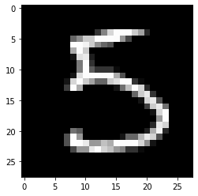
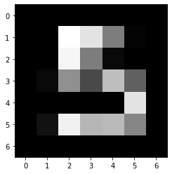
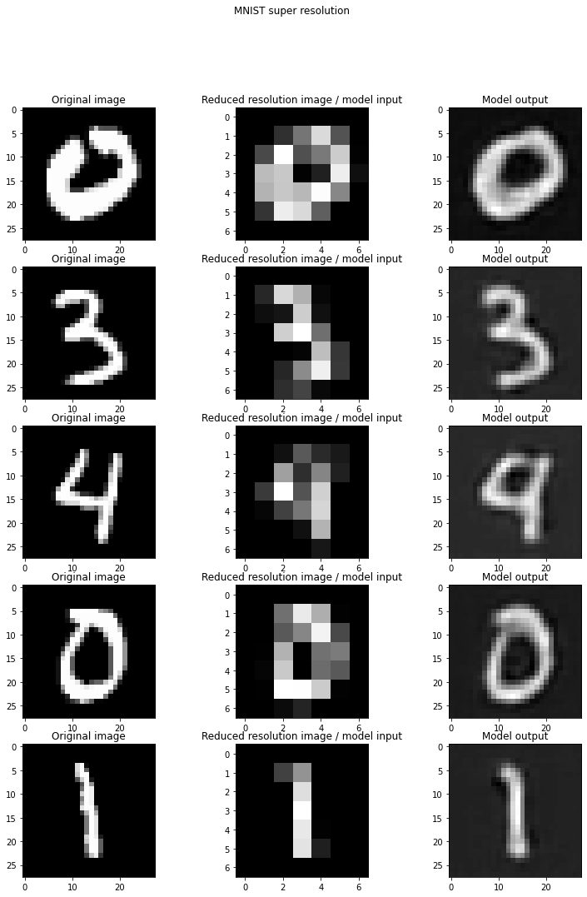
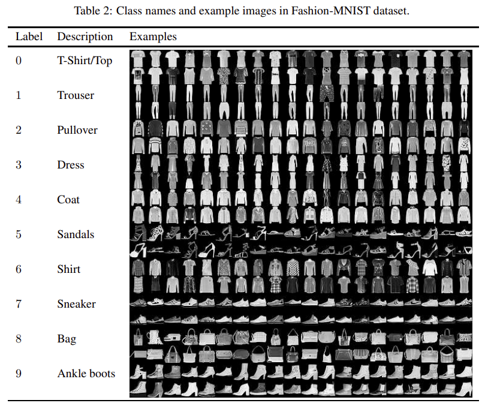
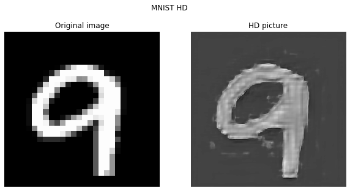
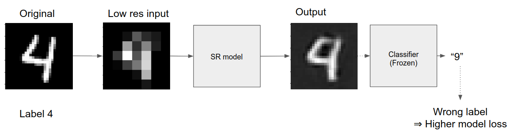

# Image super resolution

## Project goal

Have you ever dreamed of building image enhancement softwares like the
one they use in the video above? Today's your chance to actually do
it!

The goal of this project is to build a [*super
resolution*](https://en.wikipedia.org/wiki/Super-resolution_imaging)
deep learning model trained on the MNIST dataset. The Super Resolution
(SR) task consists in increasing the resolution of a given image by
learning what bigger image usually look like.

___

## Description

### Core

The goal of this level it to build a convolutional super resolution
network. This network takes inputs small images that have been
obtained by reducing the resolution of MNIST pictures. For example if
we reduce the resolution of the following 28x28 image

by a factor of 4 (by averaging blocks of 4x4 pixels), we get the
following image

.

The network outputs images with a resolution 4 times greater
than the ones of its inputs. For example if we feed a 7x7 images to the
model, it should output 28x28 images.

The network is trained to minimize the difference between its output
images and the MNIST images before the resolution reduction.

The model should produce outputs that look like the following ones
(and hopefully better)

You can use PyTorch tools such as `nn.ConvTranspose2d`, `nn.Upsample`
or `nn.functional.interpolate` in your model to increase the size of
the images.

___

### Bonuses

You are free to try any number the bonus objectives, in the order you
want.

#### 1. Fashion MNIST

Adapt the code you used to produce your MNIST super resolution model
on the [Fashion MNIST dataset](https://arxiv.org/abs/1708.07747).

___

#### 2. HD MNIST

Find a way to use your model to obtain high definition images of MNIST
digits.

___

#### 3. Additional supervision

To increase the quality of the super resolution process, you can
create a new training loss that is a weighted sum of two metrics:
 1. The usual super resolution loss that you used to train your base
    model in the core section of this project
 2. A classification loss obtained by feeding the output of the super
    resolution process to a MNIST classifier and checking whether our
    upsampled image is classified correctly.

When coding this bonus, be careful to NOT modify the weights of the
MNIST classifier during the super resolution model training
process. The classifier should have been trained before the super
resolution model training process starts.

___

#### 4. Meta bonus

Combine any number of the previous bonuses.

___

## Project delivery

Your project should be delivered as a single Google colaboratory
notebook. The notebook will be executed by running `Runtime -> Run
all`. It should run in a *reasonable* amount of time.

The notebook **must** contain commentaries and textual explanation
cells. The quality of the explanations will be judged for the
notation.
