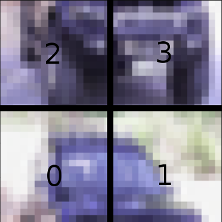

# Deep Puzzle solving


## Project goal

The goal of this project is to use neural networks to solve
puzzles. We will see this problem as an image classification in
multiple ways. To be able to train models quickly, we will use the
[CIFAR10 dataset](https://pytorch.org/vision/0.8/datasets.html#cifar).

___

## Level 1

The goal of this level is to build a CNN classifier that predicts
whether an image has been scrambled or not.


To perform this shuffling, write a class `RandomTileShuffler` that
looks like this.

```python
class RandomTileShuffler():
    def __init__(self, n_tile, p = .5):
        self.n_tile = n_tile
        self.p = p

    [...]

    def __call__(self, img):
        # If we do not shuffle, we return 0 and the raw image
        if torch.rand(1) >= self.p:
            return img, 0

        # If we do shuffle, we return 1 and the shuffled image
        [...]

        return shuffled_img, 1
```

This class shuffles an image with probability `p`. When shuffling, it
decomposes the image into an array of `n` x `n` tiles, shuffles them
and reassembles the tiles into an image of the same shape as the
input. It is highly recommended to build an array of shape `[3, 2, 2,
16, 16]` that represents the `2x2` array of tiles in which each tile
is a `16 x 16` array

You can use the following image manipulations as a guide. Let's load
an image:


Now using a simple reshaping operation, we can partition it in four
blocks of rows:


Or four blocks of columns:


The idea is to use the `RandomTileShuffler` class as a data
augmentation in the PyTorch pipeline. The images of the cars at the
beggining of this section have been produced using the following code
and repeatedly loading the same image.

```
transform = transforms.Compose(
    [
     transforms.RandomHorizontalFlip(),
     transforms.ToTensor(),
     RandomTileShuffler(2),
    ]
)

train_dataset = torchvision.datasets.CIFAR10(
    root='./data',
    train=True,
    download=True,
    transform=transform
)
```

Once this code is written, you can train a CNN to predict whether an
image has been shuffled or not. When the model is trained, you can use
it to unshuffle an image by iterating over all its tile permutation
and looking at the model confidence.

For example, if we take the following image:


We iterate over all the 24 permutations and compute the model
prediction on each one.


We see that the model has confidence 91.3% that the third image of the
first row is not shuffled, therefore it should be our solution.

## Level 2

Instead of simply predicting whether an image has been shuffled or
not, predict directly which permutation has been applied to the tiles.

This allows you to solve a puzzle instance without iterating over all
the permutations. The downside is that there are a **lot** of
different classes: `n!`

Let's visualize an example. We take this picture of a car


we divide it into tiles


then we shuffle the tiles



The permutation we have applied to the tile is `2301`. That is the
class the model is trying to predict. The number of classes is `4! =
1 * 2 * 3 * 4 = 24`

Once the model is able to predict the permutation that has been
applied, the goal is to produce the following graphs:


The first column is the shuffled image, the second column represents
the model confidence over the 24 permutations and the third column
represents the first image on which we have applied the
[inverse](https://www.geeksforgeeks.org/inverse-of-permutation-group/)
of the permutation with the highest confidence.

## Level 3 (Bonus ++ / open question)

Do not even try working on this level unless the rest of your code
works perfectly and you want some challenge (because you are having a
lot of fun).

Up until this point, we were limited to very small puzzles because we
had to iterate over all the permutations. You may even have been able
to solve the instances we were working with by hand. This level is
about tackling larger puzzle instances (larger number of tiles).

To work with a larger number of tiles, we build two neural networks
each taking two images `a` and `b`. The first model predicts whether
`a` appears directly at the left of `b` in the image. The second model
predicts whether `a` directly over `b` in the image.

Using these two models, we can build two arrays `over` and `left` in
which `over[a][b]` (resp. `left[a][b]`) contains the probability
predicted the model that `a` is over (resp. to the left of) `b`. By
using these arrays and a search algorithm like [Beam
search](https://en.wikipedia.org/wiki/Beam_search), we can look for
the solution without looking at every possible permutation. We start
by choosing a piece as the top left corner of our puzzle, then, using
`left`, we look for the most likely piece to appear on its right. We
then look for the third piece of the row the same way.


In the picture above, the violet tile corresponds to our starting
choice (we will have to try every possible block as starting block).
The cyan tiles are chosen based on the values of the `left` arary as
no tile is above. The gold tiles are chosen based on the values of the
`over` array as no tile are on their left. The red tiles are chosen
using both the `left` and `over` arrays.

By performing this process with every tile as the top left one, we
choose our solution based on the product of the confidences of each
adjacency.

Trained on a huge dataset (not in the context of this project), this
algorithm should be able to produce this kind of outputs.


## Project delivery

Your project should be delivered as a single Google colaboratory
notebook. The notebook will be executed by running `Runtime -> Run
all`. It should run in a *reasonable* amount of time.

The notebook **must** contain commentaries and textual explanation
cells for all the processing. Go in depth on all the explanations,
especially about the data processing and model architecture. A
**large** amount of the final grade will depend on these
explanations. Explain the concepts in a way someone not familiar with
deep learning will understand.
