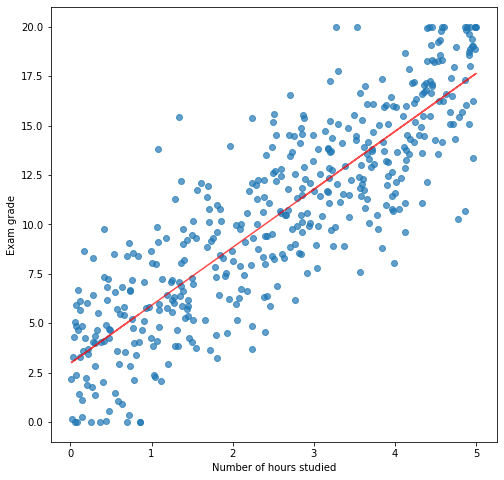

# Introduction to Data Science

## Summary

- [Lesson 1](#course-1)
- [Lesson 2](#course-2)

## Course 1

### Course part - Course introduction

- General concept of data science: Extracting *knowledge* and
  *insights* from data. There is a huge variety of methods to do it,
  ranging from basic statistics to deep neural networks.
- Machine learning systems learn how to combine *input* to produce
  useful *predictions* on *never-before-seen* data.
- General concepts of machine learning:
  - Labels: A *label* is the thing we're predicting - the `y` variable
    in simple linear regression (_y = ax + b_). The label could be the
    future price of wheat, the kind of animal shown in a picture, the
    meaning of an audio clip, or just about anything.
  - Features: A *feature* is an input variable - the `x` variable in a
    simple linear regression (_y = ax + b_). A simple machine learning
    project might use a single feature, while a more sophisticated
    machine learning project could use millions of features, specified
    as: _x<sub>1</sub>_,_x<sub>2</sub>_, ..., _x<sub>n</sub>_.
  - Models: A *model* defines the relationship between features and
    label - `ax + b` in a simple linear regression (_y = ax + b_). For
    example, a spam detection model might associate certain features
    strongly with "spam". Let's highlight two phases of a model's
    life. *Training* means creating or *learning* the model. That is,
    you show the model labeled examples and enable the model to
    gradually learn the relationship between features and label. In
    the case of a linear regression, it consists in finding "good"
    values for `a` and `b`, the *parameters* of the model. *Inference*
    means applying the trained model to unlabeled examples. That is,
    you use the trained model to make useful predictions (`y'`). For
    example, during inference, you can predict for a new incoming mail
    whether it is spam or not.
  - Supervised learning: In *supervised* learning, we model the
    relationship input and output. Depending on the type of
    values predicted by the model, we call it either a
    *regression* model or a *classification* model. A regression
    model predicts continuous values. For example, regression
    models make predictions that answer questions like "What is
    the value of a house in California?" or "What is the
    probability that a user will click on this ad?". A
    classification model predicts discrete values. For example,
    classification models make predictions that answer questions
    like "Is a given message spam or not spam?" or "Is this an
    image of a dog, a cat, or a hamster?".
  - Unsupervised learning: In *unsupervised* learning, we model
    the features of a dataset without reference to any label. It
    is often described as "letting the dataset speak for
    itself". These type of machine learning model include tasks
    such as *clustering* or *dimensionality
    reduction*. Clustering algorithms identify distinct groups
    of data while dimensionality reduction algorithms search for
    a more succinct representations of the data.
  - There exist more learning paradigms such as [Reinforcement
    learning](https://en.wikipedia.org/wiki/Reinforcement_learning)
    (AlphaGo), [Semi-supervised
    learning](https://en.wikipedia.org/wiki/Semi-supervised_learning)
    (hybrid between supervised and unsupervised) and
    [Self-supervised
    learning](https://lilianweng.github.io/lil-log/2019/11/10/self-supervised-learning.html)
    (a kind of unsupervised learning in which we use the data
    itself to create a "virtual" supervision, an example of
    self-supervised model would be a learned
    compressor-decompressor).

### Practical work part / Environment setup

- [Anaconda](https://www.anaconda.com/distribution/): Anaconda is a
  Python distribution with great machine learning integration working
  on Linux, Windows and Mac OS X. Using it instead of the default
  Python distribution of the OS will allow us to have a finer control
  without the need for administrator privileges.
- [Setting up a virtual
      environment](https://docs.conda.io/projects/conda/en/latest/user-guide/tasks/manage-environments.html):
      A virtual environment is a tool that helps to keep dependencies
      required by different projects separate by creating isolated
      python *virtual* environments for them. It also provides a way
      to easily reproduce the environment required to run a specific
      piece of code. This is one of the most important tools that most
      of the developers use, even outside of the data science
      world. In this course we will use Anaconda virtual environments.

### Numpy

Numpy practical work, mostly from [Python Data Science
Handbook](https://nbviewer.jupyter.org/github/jakevdp/PythonDataScienceHandbook/blob/master/notebooks/02.00-Introduction-to-NumPy.ipynb)

### Creation of NumPy arrays

We can use `np.array` to create arrays from Python lists:

```python
>>> import numpy as np # Standard way to import NumPy
>>> a = np.array([1, 2, 3, 4, 5])
>>> a
array([1, 2, 3, 4, 5])
```

All the values in a NumPy array have to contain the same type or be
compatible via up-cast:

```python
>>> np.array([3.14, 2, 3, 4])
array([ 3.14, 2. , 3. , 4. ])
```

NumPy arrays can be multi-dimensional. Here we create a 2 dimensional
array using a list of lists.

```python
>>> a = np.array([range(i, i + 3) for i in [2, 4]])
>>> a
array([[2, 3, 4],
       [4, 5, 6]])

>>> a.ndim
2

>>> a.shape
(2, 3)

>>> a.size
6

>>> a.dtype
dtype('int64')
```

`a.ndim` tells us that we have created a 2D array. `a.shape` tells us
that the first dimension being of length 2 (rows) and the second one
being of length 3 (columns). `a.size` tells that the array contains a
total of `6` values. `a.dtype` tells us that the array contains
integers. It is important to note that these are not Python arbitrary
precision integers. In order to perform fast computations on a large
quantity of data NumPy (which is written in C) uses internally low
level types (more explanations on this subject
[here](https://nbviewer.jupyter.org/github/jakevdp/PythonDataScienceHandbook/blob/master/notebooks/02.01-Understanding-Data-Types.ipynb)).

There are many efficient ways to create a variety of NumPy arrays, you
can take a look at some of them
[here](https://nbviewer.jupyter.org/github/jakevdp/PythonDataScienceHandbook/blob/master/notebooks/02.01-Understanding-Data-Types.ipynb#Creating-Arrays-from-Scratch).

Exercises, from [ML+](https://www.machinelearningplus.com/python/101-numpy-exercises-python/):
- Create a 1D array of numbers from 0 to 9

```python
array([0, 1, 2, 3, 4, 5, 6, 7, 8, 9])
```

- Create a 3×3 NumPy array of all True’s

```python
array([[ True,  True,  True],
       [ True,  True,  True],
       [ True,  True,  True]])
```

### Indexing

Now that we can create NumPy arrays, let's learn how to access
the values they contain.

For 1D NumPy arrays, indexing elements can be done similarly to Python
lists:

```python
>>> a = np.array([5, 0, 3, 3, 7, 9])
>>> a
array([5, 0, 3, 3, 7, 9])

>>> a[0]
5

>>> a[2]
3

>>> a[-1]
9

>>> a[-2]
7
```

In a multi-dimensional array, items can be accessed using a
comma-separated tuple of indices:

```python
>>> a = np.array([[3, 5, 2, 4], [7, 6, 8, 8], [1, 6, 7, 7]])

>>> a
array([[3, 5, 2, 4],
       [7, 6, 8, 8],
       [1, 6, 7, 7]])

>>> a[0]
array([3, 5, 2, 4])

>>> a[0][2]
2

>>> a[0, 2]
2

>>> a[-1, -2]
7

>>> a[-1, -2] = 10
>>> a
array([[ 3,  5,  2,  4],
       [ 7,  6,  8,  8],
       [ 1,  6, 10,  7]])
```

### Slicing

Like with usual Python lists, we can create subarrays using the
*slice* notation. The NumPy slicing follows that of the standard
Python list; to access a slice of an array `x`, use this:

```python
x[start:stop:step]
```

If any of these are unspecified, they default to the values `start =
0`, `stop = size of dimension`, `step = 1`.

```python
>>> x = np.arange(10)
>>> x
array([0, 1, 2, 3, 4, 5, 6, 7, 8, 9])

>>> x[:5] # first five elements
array([0, 1, 2, 3, 4])

>>> x[5:] # elements after index 5
array([5, 6, 7, 8, 9])

>>> x[4:7] # middle sub-array
array([4, 5, 6])

>>> x[::2] # every other element
array([0, 2, 4, 6, 8])

>>> x[1::2] # every other element, starting at index 1
array([1, 3, 5, 7, 9])
```

When `step` value is negative, the defaults for `start` and `stop` are
swapped. This becomes a convenient way to reverse an array:

```python
>>> x[::-1]
array([9, 8, 7, 6, 5, 4, 3, 2, 1, 0])

>>> x[5::-2]
array([5, 3, 1])
```

We can also slice multidimensional arrays. Like with indexing, we will
specify the slicing indices for each dimension separated by `,`.

```python
>>> x = np.array([[12,  5,  2,  4], [ 7,  6,  8,  8], [ 1,  6,  7,  7]])
>>> x
array([[12,  5,  2,  4],
       [ 7,  6,  8,  8],
       [ 1,  6,  7,  7]])

>>> x[:2, :3] # first two rows, first three columns
array([[12,  5,  2],
       [ 7,  6,  8]])

>>> x[:, ::2] # all rows (: is a slicing with default start and stop), every other column
array([[12,  2],
       [ 7,  8],
       [ 1,  7]])
```

An _extremely important_ concept to keep in mind when working with
NumPy slices is that they return *views* rather than *copies* of the
array data. When slicing Python lists, the slice is a copy of the
original array, this is not the case with `np.array` slices.

```python
>>> x = np.array([[12,  5,  2,  4], [ 7,  6,  8,  8], [ 1,  6,  7,  7]])
>>> x
array([[12,  5,  2,  4],
       [ 7,  6,  8,  8],
       [ 1,  6,  7,  7]])

>>> x2 = x[:2, :2]
>>> x2
array([[12,  5],
       [ 7,  6]])

>>> x2[0, 0] = 99
>>> x2
array([[99,  5],
       [ 7,  6]])

>>> x
array([[99,  5,  2,  4],
       [ 7,  6,  8,  8],
       [ 1,  6,  7,  7]])
```

Keeping this fact in mind will spare you from terrible debugging
sessions.

Exercises:
All the exercises use the following array:

```python
>>> x = np.array([[12,  5,  2,  4], [ 7,  6,  8,  8], [ 1,  6,  7,  7]])
>>> x
array([[12,  5,  2,  4],
       [ 7,  6,  8,  8],
       [ 1,  6,  7,  7]])
```

1. Select the last line of `x`

```
array([1, 6, 7, 7])
```

2. Slice the two sevens on the last line of `x`

```python
array([7, 7])
```

3. (_harder_) Slice and reverse the lines and the columns of the top right rectangle

```python
array([[8, 8, 6],
       [4, 2, 5]])
```

### Shape manipulation

Another useful type of operation is reshaping of arrays. The most
flexible way of doing this is with the `reshape` method. For example,
if you want to put the number `1` through `9` in a `3x3` grid, you can
do the following:

```python
>>> np.arange(1, 10).reshape(3, 3)
array([[1, 2, 3],
       [4, 5, 6],
       [7, 8, 9]])
```

You can use `-1` as a joker when reshaping, NumPy will deduce the
correct value from the number of elements of the array.

```python
>>> np.arange(1, 10).reshape(3, -1)
array([[1, 2, 3],
       [4, 5, 6],
       [7, 8, 9]])
```

A common thing to do when working with arrays is to flatten them using
`.reshape(-1)`.

```python
>>> x = np.arange(1, 10).reshape(3, -1)
>>> x
array([[1, 2, 3],
       [4, 5, 6],
       [7, 8, 9]])

>>> x.reshape(-1)
array([1, 2, 3, 4, 5, 6, 7, 8, 9])
```

Another common reshaping pattern is the conversion of a
one-dimensional array into a two-dimensional row or column
matrix. This can be done with the reshape method, or more easily by
making use of the `np.newaxis` keyword within a slice operation:

```python
>>> x = np.array([1, 2, 3])
>>> x.reshape((1, 3)) # row vector via reshape
array([[1, 2, 3]])

>>> x[np.newaxis, :] # row vector via newaxis
array([[1, 2, 3]])

>>> x.reshape((3, 1)) # column vector via reshape
array([[1],
       [2],
       [3]])

>>> x[:, np.newaxis] # column vector via newaxis
array([[1],
       [2],
       [3]])
```

Exercises:
1. Create a 3D array containing the numbers from `1` to `27` with shape
  `(3, 3, 3)`

```python
array([[[ 1,  2,  3],
      [ 4,  5,  6],
      [ 7,  8,  9]],

     [[10, 11, 12],
      [13, 14, 15],
      [16, 17, 18]],

     [[19, 20, 21],
      [22, 23, 24],
      [25, 26, 27]]])
```

2. Create the following array

```python
array([[ 0,  2],
       [ 4,  6],
       [ 8, 10],
       [12, 14],
       [16, 18]])
```

3. Using the answer to question 2, create the following array

```python
array([[16, 18],
       [12, 14],
       [ 8, 10],
       [ 4,  6],
       [ 0,  2]])
```

4. Using the answer to question 2, create the following array

```python
array([[18, 16],
       [14, 12],
       [10,  8],
       [ 6,  4],
       [ 2,  0]])
```

5. (_harder_) Create the following array

```python
array([ 2,  1,  4,  3,  6,  5,  8,  7, 10,  9, 12, 11])
```

### Combination

It is possible to combine multiple arrays into one, and to conversely
split a single array into multiple arrays.

First, to concatenate multiple 1D arrays, we can simply do the following:

```python
>>> x = np.array([1, 2, 3])
>>> y = np.array([4, 5, 6])
>>> np.concatenate([x, y])
array([1, 2, 3, 4, 5, 6])
>>> np.concatenate([x, y, x])
array([1, 2, 3, 4, 5, 6, 1, 2, 3])
```

We can also concatenate multidimensional arrays by precising the axis
(dimension) along which we want to perform the concatenation:

```python
>>> x = np.arange(6).reshape(2, 3)
>>> x
array([[0, 1, 2],
       [3, 4, 5]])

>>> y = np.arange(6, 12).reshape(2, 3)
>>> y
array([[ 6,  7,  8],
       [ 9, 10, 11]])

>>> np.concatenate([x, y], axis = 0) # Concatenate along dimension 0 (rows)
array([[ 0,  1,  2],
       [ 3,  4,  5],
       [ 6,  7,  8],
       [ 9, 10, 11]])

>>> np.concatenate([x, y]) # The default concatenation axis is 0
array([[ 0,  1,  2],
       [ 3,  4,  5],
       [ 6,  7,  8],
       [ 9, 10, 11]])

>>> np.concatenate([x, y], axis = 1) # Concatenate along dimension 1 (columns)
array([[ 0,  1,  2,  6,  7,  8],
       [ 3,  4,  5,  9, 10, 11]])
```

When working with array of mixed dimensions, it can be clearer to use
[np.vstack](https://docs.scipy.org/doc/numpy/reference/generated/numpy.vstack.html)
and
[np.hstack](https://docs.scipy.org/doc/numpy/reference/generated/numpy.hstack.html#numpy.hstack).

Exercises:
All the exercises use the following arrays:

```python
>>> x = np.array([1, 2, 3])
>>> y = np.arange(6).reshape(2, 3)
>>> y
array([[0, 1, 2],
       [3, 4, 5]])
```

1. Concatenate `x` and `y` to create the following array. Be careful
   of the shapes of the array you are manipulating.

```python
array([[1, 2, 3],
       [0, 1, 2],
       [3, 4, 5]])
```

2. (_harder_) Using `x`, `y` and `np.concatenate` create the following array

```python
array([[0, 1, 2, 1, 2, 3],
       [3, 4, 5, 1, 2, 3]])
```

### Aggregations

Multiple aggregations methods are available in NumPy. Here are a few examples:

```python
>>> x = np.arange(10)
>>> x
array([0, 1, 2, 3, 4, 5, 6, 7, 8, 9])

>>> x.sum()
45

>>> x.mean()
4.5

>>> x.std() # Standard deviation
2.8722813232690143

>>> x.min()
0

>>> x.max()
9
```

Similarly to the `np.concatenate` function, we can precise along which
axis we want to perform the computation.

```python
>>> x = np.arange(12).reshape(3, 4)
>>> x
array([[ 0,  1,  2,  3],
       [ 4,  5,  6,  7],
       [ 8,  9, 10, 11]])

>>> x.sum(axis = 0) # Sum along the rows, we have one result by column
array([12, 15, 18, 21])

>>> x.sum(axis = 1) # Sum along the columns, we have one result by row
array([ 6, 22, 38])

>>> x.mean(axis = 0) # Mean along the rows, we have one result by column
array([4., 5., 6., 7.])

>>> x.mean(axis = 1) # Mean along the columns, we have one result by row
array([1.5, 5.5, 9.5])

>>> x.min(axis = 0) # Minimum along the rows, we have one result by column
array([0, 1, 2, 3])

>>> x.min(axis = 1) # Minimum long the columns, we have one result by row
array([0, 4, 8])
```

Exercise:
1. Compute, for each column, the mean of the values of the rows of even index in
   the following array.

```python
>>> x = np.arange(49).reshape(7, 7)
>>> x
array([[ 0,  1,  2,  3,  4,  5,  6],
       [ 7,  8,  9, 10, 11, 12, 13],
       [14, 15, 16, 17, 18, 19, 20],
       [21, 22, 23, 24, 25, 26, 27],
       [28, 29, 30, 31, 32, 33, 34],
       [35, 36, 37, 38, 39, 40, 41],
       [42, 43, 44, 45, 46, 47, 48]])
```

The result should be

```python
array([21., 22., 23., 24., 25., 26., 27.])
```

### Broadcasting

Now that we know basic manipulations on NumPy arrays, we can start
making operations between them.

When arrays have identical sizes, binary operations are performed on
an element-by-element basis:

```python
>>> a = np.array([1, 2, 3])
>>> b = np.array([5, 5, 5])
>>> a + b
array([6, 7, 8])
```

*Broadcasting* allows these types of binary operations to be performed
on arrays of different sizes. For example, we can just add a scalar
(think of it as a zero-dimensional array) to an array:

```python
>>> a + 5
array([6, 7, 8])
```

You can think of this as an operation that stretches or duplicates the
value `5` into the array `[5, 5, 5]`, and adds the results. The
advantage of NumPy's broadcasting is that this duplication of values
does not actually take place, but it is a useful mental model as we
think about broadcasting.

```python
>>> a
array([1, 2, 3])

>>> M = np.ones((3, 3))
>>> M
array([[1., 1., 1.],
       [1., 1., 1.],
       [1., 1., 1.]])

>>> M + a
array([[2., 3., 4.],
       [2., 3., 4.],
       [2., 3., 4.]])
```

Here the one-dimensional array `a` is stretched, or *broadcast* across
the dimension in order to match the shape of `M`.

Broadcasting is a powerful tool that follows precise rules. An
in-depth explanation of these rules can be found
[here](https://nbviewer.jupyter.org/github/jakevdp/PythonDataScienceHandbook/blob/master/notebooks/02.05-Computation-on-arrays-broadcasting.ipynb#Rules-of-Broadcasting).

A typical use case of broadcasting is to normalize the values of an
array by subtracting the mean and dividing by the standard
deviation. In the following example, let's assume that the values of
each column are observation of a different variable. We would like to
compute the mean and standard deviation for each column and then
perform the normalization.

```python
>>> x = np.random.randn(3, 5) # Randomly generate x using a normal distribution
>>> x
array([[-0.59859761,  1.3957146 ,  0.77132016,  0.80628127,  1.23405505],
       [-0.20710744,  0.13401764,  0.60230327,  0.47255149,  0.94740413],
       [-0.52074332,  0.84169282, -2.00490693,  0.82329957,  0.25557519]])

>>> x.mean(axis = 0) # Compute the mean for each column
array([-0.44214946,  0.79047502, -0.21042783,  0.70071078,  0.81234479])

>>> x.std(axis = 0) # Compute the standard deviation for each column
array([0.16921167, 0.51635727, 1.27076305, 0.16148251, 0.41072008])

>>> (x - x.mean(axis = 0)) / x.std(axis = 0) # Standardize each column with its own
                                             # mean and standard deviation
array([[-0.9245707 ,  1.17213335,  0.77256574,  0.65375807,  1.02675831],
       [ 1.38904139, -1.27132397,  0.63956149, -1.41290403,  0.3288355 ],
       [-0.46447069,  0.09919062, -1.41212722,  0.75914596, -1.35559381]])
```

Exercises:
All the exercises use the following array:

```python
>>> a = np.arange(10).reshape(5, 2)
>>> a
array([[0, 1],
       [2, 3],
       [4, 5],
       [6, 7],
       [8, 9]])
```

1. Add `2` to the first column and `-1` to the second column of `a`

```python
array([[ 2,  0],
       [ 4,  2],
       [ 6,  4],
       [ 8,  6],
       [10,  8]])
```

2. Multiply the values of the first column of `a` by the maximum of
   the values of the second column. The result should be:

```python
array([[ 0,  1],
       [18,  3],
       [36,  5],
       [54,  7],
       [72,  9]])
```

### Comparisons, Masks and Boolean logic

NumPy also provides binary comparison operators that output boolean
arrays:

```python
>>> a = np.array([1, 2, 3, 4])
>>> b = np.array([3, 2, 1, 4])
>>> a == b
array([False,  True, False,  True])

>>> a != b
array([ True, False,  True, False])

>>> a > b
array([False, False,  True, False])

>>> a <= b
array([ True,  True, False,  True])
```

These operators support the broadcasting:

```python
>>> a = np.array([1, 2, 3, 4])
>>> a == 2
array([False,  True, False, False])

>>> a % 2 == 0
array([False,  True, False,  True])
```

We can also combine boolean arrays using boolean operators

```python
>>> a = np.arange(1, 11)
>>> a
array([ 1,  2,  3,  4,  5,  6,  7,  8,  9, 10])

>>> a % 2 == 0
array([False,  True, False,  True, False,  True, False,  True, False, True])

>>> a % 5 == 0
array([False, False, False, False,  True, False, False, False, False, True])

>>> ~(a % 5 == 0) # Unary not
array([ True,  True,  True,  True, False,  True,  True,  True,  True, False])

>>> (a % 2 == 0) | (a % 5 == 0) # Binary or
array([False,  True, False,  True,  True,  True, False,  True, False, True])

>>> (a % 2 == 0) & (a % 5 == 0) # Binary and
array([False, False, False, False, False, False, False, False, False, True])
```

A very powerful NumPy feature is the ability to select elements of an
array using *boolean masks*. The mask should have the same shape (or
compatible) as the array.

```python
>>> a = np.arange(10)
>>> a
array([0, 1, 2, 3, 4, 5, 6, 7, 8, 9])

>>> a % 3 == 0 # Multiples of 3 mask
array([ True, False, False,  True, False, False,  True, False, False, True])

>>> a[a % 3 == 0] # Select the multiples of 3 using the mask
array([0, 3, 6, 9])

>>> a % 2 == 0 # Multiples of 2 mask
array([ True, False,  True, False,  True, False,  True, False,  True, False])

>>> ~(a % 2 == 0) # Numbers that are not multiples of 2
array([False,  True, False,  True, False,  True, False,  True, False, True])

>>> a[(a % 3 == 0) & ~(a % 2 == 0)] # Select the elements that are multiple
                                    # of 3 but not of 2
array([3, 9])
```

Boolean masking also works in multiple dimensions:

```python
>>> a = np.arange(12).reshape(3, 4)
>>> a
array([[ 0,  1,  2,  3],
       [ 4,  5,  6,  7],
       [ 8,  9, 10, 11]])

>>> a >= 2
array([[False, False,  True,  True],
       [ True,  True,  True,  True],
       [ True,  True,  True,  True]])

>>> a[a >= 2]
array([ 2,  3,  4,  5,  6,  7,  8,  9, 10, 11])

>>> a < 10
array([[ True,  True,  True,  True],
       [ True,  True,  True,  True],
       [ True,  True, False, False]])

>>> a[a < 10]
array([0, 1, 2, 3, 4, 5, 6, 7, 8, 9])

>>> a[(a >= 2) & (a < 10)]
array([2, 3, 4, 5, 6, 7, 8, 9])
```

Exercises:
All the exercises use the following arrays:

```python
>>> a = np.arange(16).reshape(4, 4)
>>> a
array([[ 0,  1,  2,  3],
       [ 4,  5,  6,  7],
       [ 8,  9, 10, 11],
       [12, 13, 14, 15]])
```

1. Select and sum the multiples of 3 in `a`, the result should be 45.

2. Subtract the mean of the values strictly greater than 8 not
   multiple of 4 to the whole array. The result should be:

```python
array([[-12., -11., -10.,  -9.],
       [ -8.,  -7.,  -6.,  -5.],
       [ -4.,  -3.,  -2.,  -1.],
       [  0.,   1.,   2.,   3.]])
```

## Course 2

Pandas practical work, inspired by [Python Data Science
Handbook](https://nbviewer.jupyter.org/github/jakevdp/PythonDataScienceHandbook/blob/master/notebooks/03.00-Introduction-to-Pandas.ipynb)
and [10 minutes to
pandas](https://pandas.pydata.org/pandas-docs/stable/getting_started/10min.html)

*Pandas objects* can be thought of as enhanced versions of NumPy
structured arrays in which the rows and columns are identified with
labels rather than simple integer indices.

As pandas capabilities are extremely vast we will only go over a few
of the main ones in this course. For more in depth explanations about
this library please take a look at the references.

### Pandas `Series`

A pandas `Series` is a one dimensional array with axis labels.

```python
>>> import pandas as pd # Standard way to import Pandas
>>> s = pd.Series([1, 3, 5, np.nan, 6, 8])
>>> s
0    1.0
1    3.0
2    5.0
3    NaN
4    6.0
5    8.0
dtype: float64

>>> s.values
array([ 1.,  3.,  5., nan,  6.,  8.])

>>> type(s.values)
numpy.ndarray

>>> s.index
RangeIndex(start=0, stop=6, step=1)

>>> s[1]
3.0

>>> s[1:3]
1    3.0
2    5.0
dtype: float64
```

We can see multiples things in this first example. The output contains
two columns, the first one corresponds to the `index` of the `Series`
and the second one corresponds to the `values` of the `Series`. We can
also see that the values are actually stored in a NumPy `ndarray`
which type has been set to `float64` because of the `NaN` presence
("_Not a number_" is a commonly used float value to indicate missing
values). We can also use standard 1D NumPy indexing to access the
values.

The `index` used in the previous example was simply a range of
integers. We can use other types of index to work with our data in a
more explicit manner.

```python
>>> s = pd.Series([1, 3, 5, np.nan, 6, 8], index = ['a', 'b', 'c', 'd', 'e', 'f'])
>>> s
Out[235]:
a    1.0
b    3.0
c    5.0
d    NaN
e    6.0
f    8.0
dtype: float64

>>> s['b']
3.0

>>> s['b': 'e'] # The elements from the index b to the index e
b    3.0
c    5.0
d    NaN
e    6.0
dtype: float64
```

### Pandas `DataFrame`

The Pandas `DataFrame` is probably the object that you will manipulate
the most while doing Data Science using Python. Like `Series`,
`DataFrame` can be thought of as a generalization of NumPy arrays.

There are multiple ways of creating a new `DataFrame`, the most useful
ones are presented in [this
page](https://pbpython.com/pandas-list-dict.html). Let's use
`from_records` in the next example. When using this method, we give it
a list of rows which are tuples of values.

```python
>>> states = pd.DataFrame.from_records([
    (38332521, 423967),
    (26448193, 695662),
    (19651127, 141297),
    (19552860, 170312),
    (12882135, 149995)
    ],
    index = [
        'California',
        'Texas',
        'New York',
        'Florida',
        'Illinois'
    ],
    columns = [
        'population',
        'area'
    ]
)
>>> states
            population    area
California    38332521  423967
Texas         26448193  695662
New York      19651127  141297
Florida       19552860  170312
Illinois      12882135  149995
```

Creating `DataFrame` by hand is actually quite rare when working with
pandas. Most often you will load a save file directly into a
`DataFrame`. Many [file
format](https://pandas.pydata.org/pandas-docs/stable/user_guide/io.html)
are available, with the most common one probably being *CSV*
([Comma-separated
values](https://en.wikipedia.org/wiki/Comma-separated_values)). For
example if we want to load the file [save.csv](http://igm.univ-mlv.fr/~gchatel/ml/save.csv):

```python
>>> df = pd.read_csv('save.csv')
>>> df
    a   b   c   d   e
0   0   1   2   3   4
1   5   6   7   8   9
2  10  11  12  13  14
3  15  16  17  18  19
4  20  21  22  23  24
```

### Indexing data

Once our data is loaded in our `DataFrame`, we can access it using a
[variety of
methods](https://pandas.pydata.org/pandas-docs/stable/user_guide/indexing.html#indexing).

```python
>>> df
    a   b   c   d   e
0   0   1   2   3   4
1   5   6   7   8   9
2  10  11  12  13  14
3  15  16  17  18  19
4  20  21  22  23  24

>>> df['a'] # Selecting the column 'a'
0     0
1     5
2    10
3    15
4    20
Name: a, dtype: int64

>>> df.a # Selecting the column 'a' using a notation shortcut
0     0
1     5
2    10
3    15
4    20
Name: a, dtype: int64

>>> df.loc[:, 'a': 'c'] # Selecting all the lines, with the columns from 'a' to 'c'
    a   b   c
0   0   1   2
1   5   6   7
2  10  11  12
3  15  16  17
4  20  21  22
```

There is multiple things to notice about the previous block of
code. The notation shortcut `df.a` to access `df['a']` is useful but
should be used carefully as column names may conflict with methods
name of the `DataFrame` class. The `loc` method is label based which
means that we can select elements based on the label of the
index. Another way to access your data is by using `iloc` which,
contrary to `loc`, is integer based. `iloc` is very similar to the
usual NumPy indexing behavior

```python
>>> df
    a   b   c   d   e
0   0   1   2   3   4
1   5   6   7   8   9
2  10  11  12  13  14
3  15  16  17  18  19
4  20  21  22  23  24

>>> df.iloc[2: 4, 1 : 3] # Selecting rows 2 to 4 and columns from
                         # the index 1 to the index 3
    b   c
2  11  12
3  16  17
```

Just like with NumPy, we can select rows and columns using boolean
arrays. This is extremely useful and is used a lot when performing
data analysis.

```python
>>> df
    a   b   c   d   e
0   0   1   2   3   4
1   5   6   7   8   9
2  10  11  12  13  14
3  15  16  17  18  19
4  20  21  22  23  24

>>> df[df.c >= 12] # Selecting the rows where the value in the column c is >= 12
    a   b   c   d   e
2  10  11  12  13  14
3  15  16  17  18  19
4  20  21  22  23  24

>>> df[(df.c >= 12) & (df.e % 2 == 0)] # Selecting the rows where the value
                                       # in the column c is >= 12 and the value in
                                       # the column e is even
    a   b   c   d   e
2  10  11  12  13  14
4  20  21  22  23  24
```

Exercises:
All the exercises use the following arrays:

```python
In [278]: df = pd.DataFrame(np.arange(25).reshape(5, 5), columns = ['a', 'b', 'c', 'd', 'e'])

In [279]: df
Out[279]:
    a   b   c   d   e
0   0   1   2   3   4
1   5   6   7   8   9
2  10  11  12  13  14
3  15  16  17  18  19
4  20  21  22  23  24
```

1. Select the rows where `d` is greater than or equal to `b + c`. The
   result should be

```python
   a  b  c  d  e
0  0  1  2  3  4
```

2. Compute the sum of the values in each column. The result should be

```python
a    50
b    55
c    60
d    65
e    70
dtype: int64
```

3. Select the columns `b` and `c` in two different ways. The result should be

```python
    b   c
0   1   2
1   6   7
2  11  12
3  16  17
4  21  22
```

2. (_harder_) Select the columns which sum is an even number. The result should be

```python
    a   c   e
0   0   2   4
1   5   7   9
2  10  12  14
3  15  17  19
4  20  22  24
```

### Handling missing data

A major part of data science is cleaning datasets in order to use them
as input to machine learning algorithms. One aspect of this cleaning
procedure is to ensure that the data does not contain missing values.

Let's take a look at the classical [Titanic
dataset](https://www.kaggle.com/c/titanic/overview) from Kaggle. This
dataset contains informations about Titanic passengers (such as name,
gender, age, ...) and whether they died during the crash. This dataset
is often used to build simple machine learning models to predict the
survival of passenger based on their information. We will come back to
it when we will build machine learning models, for now let's clean it.

First let's download the file [here](http://igm.univ-mlv.fr/~gchatel/ml/titanic.csv) 
and load it using pandas.

```python
>>> import pandas as pd
>>> df = pd.read_csv('titanic.csv')
>>> df.shape
(891, 12)

>>> df.columns
Index(['PassengerId', 'Survived', 'Pclass', 'Name', 'Sex', 'Age', 'SibSp',
       'Parch', 'Ticket', 'Fare', 'Cabin', 'Embarked'],
      dtype='object')

>>> df.head()
   PassengerId  Survived  Pclass                                               Name     Sex   Age  SibSp  Parch            Ticket     Fare Cabin Embarked
0            1         0       3                            Braund, Mr. Owen Harris    male  22.0      1      0         A/5 21171   7.2500   NaN        S
1            2         1       1  Cumings, Mrs. John Bradley (Florence Briggs Th...  female  38.0      1      0          PC 17599  71.2833   C85        C
2            3         1       3                             Heikkinen, Miss. Laina  female  26.0      0      0  STON/O2. 3101282   7.9250   NaN        S
3            4         1       1       Futrelle, Mrs. Jacques Heath (Lily May Peel)  female  35.0      1      0            113803  53.1000  C123        S
4            5         0       3                           Allen, Mr. William Henry    male  35.0      0      0            373450   8.0500   NaN        S

>>> df.describe()
       PassengerId    Survived      Pclass         Age       SibSp       Parch        Fare
count   891.000000  891.000000  891.000000  714.000000  891.000000  891.000000  891.000000
mean    446.000000    0.383838    2.308642   29.699118    0.523008    0.381594   32.204208
std     257.353842    0.486592    0.836071   14.526497    1.102743    0.806057   49.693429
min       1.000000    0.000000    1.000000    0.420000    0.000000    0.000000    0.000000
25%     223.500000    0.000000    2.000000   20.125000    0.000000    0.000000    7.910400
50%     446.000000    0.000000    3.000000   28.000000    0.000000    0.000000   14.454200
75%     668.500000    1.000000    3.000000   38.000000    1.000000    0.000000   31.000000
max     891.000000    1.000000    3.000000   80.000000    8.000000    6.000000  512.329200
```

The first things we usually do when discovering a new dataset is
getting to know it. The first thing we did is print its shape using
`df.shape`. The result is `(891, 12)` which tells us that we have 891
passengers and that we have 12 fields for each passenger. Then we take
a look at the kind of information we have access to by printing the
names of the columns using `df.columns`, a full description of each
column is available [here](https://www.kaggle.com/c/titanic/data). We
then take a look a the first 5 rows of the dataset using
`df.head()`. Finally, we use `df.describe` to print summary statistics
on the numerical fields of the dataset.

In this section, we focus on handling missing data. There are [many
ways](https://pandas.pydata.org/pandas-docs/stable/user_guide/missing_data.html)
to handle missing data using pandas, we will only take a look at few
in this section.

First, let's take a look at how many values are missing.

```python
In [10]: df.isnull()
Out[10]:
     PassengerId  Survived  Pclass   Name    Sex    Age  SibSp  Parch  Ticket   Fare  Cabin  Embarked
0          False     False   False  False  False  False  False  False   False  False   True     False
1          False     False   False  False  False  False  False  False   False  False  False     False
2          False     False   False  False  False  False  False  False   False  False   True     False
3          False     False   False  False  False  False  False  False   False  False  False     False
4          False     False   False  False  False  False  False  False   False  False   True     False
..           ...       ...     ...    ...    ...    ...    ...    ...     ...    ...    ...       ...
886        False     False   False  False  False  False  False  False   False  False   True     False
887        False     False   False  False  False  False  False  False   False  False  False     False
888        False     False   False  False  False   True  False  False   False  False   True     False
889        False     False   False  False  False  False  False  False   False  False  False     False
890        False     False   False  False  False  False  False  False   False  False   True     False

[891 rows x 12 columns]

In [11]: df.isnull().sum()
Out[11]:
PassengerId      0
Survived         0
Pclass           0
Name             0
Sex              0
Age            177
SibSp            0
Parch            0
Ticket           0
Fare             0
Cabin          687
Embarked         2
dtype: int64

In [12]: df.isnull().sum() / len(df)
Out[12]:
PassengerId    0.000000
Survived       0.000000
Pclass         0.000000
Name           0.000000
Sex            0.000000
Age            0.198653
SibSp          0.000000
Parch          0.000000
Ticket         0.000000
Fare           0.000000
Cabin          0.771044
Embarked       0.002245
dtype: float64
```

`df.isnull` return a boolean DataFrame with `True` values where values
are missing. To know how many values are missing by column we use
`sum` and finally to get the proportion of missing value in each
column we broadcast a division by the number of rows in the dataset
`len(df)`. We can see that the 19.9% of the `Age` values, 77.1% of the
`Cabin` values and 0.225% of the `Embarked` values are missing.

Know that we know where values are missing we have to decide how to
handle it. There are multiple strategies to deal with this situation:

- We can remove rows containing missing values. This is quite extreme
  as in this case we would lose 77.1% of our dataset because of the
  `Cabin` column. We could also only apply this strategy to the
  `Embarked` column.
- We can remove columns containing too many missing values. This might
  be suitable for the `Cabin` column.
- We can add a new special value indicating the absence of information.
- We can fill the missing values using a valid value like the median
  for numerical fields or the value that appears the most for
  categorical fields.

It is important to note that there is no "right" or "wrong" way to
handle missing value, it all depends on the use case and what we want
to use our data for later.

Now that we know the available strategies, let's deal with our missing
values. We start with the `Embarked` column. Let's take a look at the
values this column takes.

```python
>>> df.Embarked.value_counts()
S    644
C    168
Q     77
Name: Embarked, dtype: int64
```

As the values are quite spread out across the different ports of
embarkation, we chose to drop the rows for which we do not have the
`Embarked` information. Once again this is not necessarily the best
strategy to handle it, we could also have filled the missing values
with `S`.

```python
>>> df = df.dropna(subset = ['Embarked'])

>>> df.isnull().sum() / len(df)
PassengerId    0.000000
Survived       0.000000
Pclass         0.000000
Name           0.000000
Sex            0.000000
Age            0.199100
SibSp          0.000000
Parch          0.000000
Ticket         0.000000
Fare           0.000000
Cabin          0.772778
Embarked       0.000000
dtype: float64
```

[`dropna`](https://pandas.pydata.org/pandas-docs/stable/reference/api/pandas.DataFrame.dropna.html)
is a method that is used to drop rows or columns based on missing
values. In our case we would like to only drop the rows with the
`Embarked` information missing so we use the `subset` argument. If we
did not use it it would also have dropped all the rows with missing
`Cabin` number.

Now let's deal with the missing `Cabin` numbers. As 77.3% of the
column is missing we will just remove it.

```python
In [25]: df = df.drop(['Cabin'], axis = 1)

In [26]: df.isnull().sum() / len(df)
Out[26]:
PassengerId    0.0000
Survived       0.0000
Pclass         0.0000
Name           0.0000
Sex            0.0000
Age            0.1991
SibSp          0.0000
Parch          0.0000
Ticket         0.0000
Fare           0.0000
Embarked       0.0000
dtype: float64
```

We use the `drop` method to drop the column by precising that we drop
along the `axis` 1 (columns). We can also notice that by default most
`DataFrame` operation are not done in place but a new `DataFrame` is
created, we can alter this behavior by giving `inplace = True` to
modification methods.

Now let's deal with the Age column. We will fill the missing values
with the median age. We often use the median instead of the mean as it
is more robust to outliers (extremely small or big values) of the
dataset.

```python
>>> df.Age.fillna(df.Age.median(), inplace = True)
>>> df.isnull().sum() / len(df)
PassengerId    0.0
Survived       0.0
Pclass         0.0
Name           0.0
Sex            0.0
Age            0.0
SibSp          0.0
Parch          0.0
Ticket         0.0
Fare           0.0
Embarked       0.0
dtype: float64
```

We use `fillna` to fill the missing value with a specific one, in this
case `df.Age.median()`. Here we use `inplace = True` as, contrary to
`dropna`, `fillna` does not have a `subset` argument.

### Combining datasets

Similarly to NumPy, we can concatenate multiple `DataFrame`s:

```python
>>> df_rand = pd.DataFrame(np.random.randn(10, 4))
>>> df_rand
          0         1         2         3
0 -0.591078 -0.041216  0.245512 -1.241936
1  1.488797 -0.508046  0.666062  1.518212
2  0.227398 -1.641177  0.038620 -1.110990
3  0.205498 -0.505979  1.543662 -0.523256
4 -1.100840  0.606044  0.645516 -1.111447
5 -0.031574  1.539560 -0.283304  0.970026
6 -0.633329 -0.536459  0.874104  0.439670
7 -0.604515 -0.778099 -0.057865  0.189544
8 -0.030452 -0.954243 -0.097178 -0.283184
9 -0.075592 -1.962462  0.916878  0.689099

>>> pieces = [df_rand[:3], df_rand[3:7], df_rand[7:]]
>>> pd.concat(pieces)
          0         1         2         3
0 -0.591078 -0.041216  0.245512 -1.241936
1  1.488797 -0.508046  0.666062  1.518212
2  0.227398 -1.641177  0.038620 -1.110990
3  0.205498 -0.505979  1.543662 -0.523256
4 -1.100840  0.606044  0.645516 -1.111447
5 -0.031574  1.539560 -0.283304  0.970026
6 -0.633329 -0.536459  0.874104  0.439670
7 -0.604515 -0.778099 -0.057865  0.189544
8 -0.030452 -0.954243 -0.097178 -0.283184
9 -0.075592 -1.962462  0.916878  0.689099
```

We can add a new column to a dataset by performing an affectation

```python
>>> df_rand[5] = df_rand[0] + df_rand[2]
>>> df_rand
          0         1         2         3         5
0 -0.591078 -0.041216  0.245512 -1.241936 -0.345567
1  1.488797 -0.508046  0.666062  1.518212  2.154858
2  0.227398 -1.641177  0.038620 -1.110990  0.266018
3  0.205498 -0.505979  1.543662 -0.523256  1.749160
4 -1.100840  0.606044  0.645516 -1.111447 -0.455324
5 -0.031574  1.539560 -0.283304  0.970026 -0.314878
6 -0.633329 -0.536459  0.874104  0.439670  0.240775
7 -0.604515 -0.778099 -0.057865  0.189544 -0.662380
8 -0.030452 -0.954243 -0.097178 -0.283184 -0.127630
9 -0.075592 -1.962462  0.916878  0.689099  0.841287
```

We can also append new records to an existing `DataFrame`.

```python
>>> states = pd.DataFrame.from_records([
    (38332521, 423967),
    (26448193, 695662),
    (19651127, 141297),
    (19552860, 170312),
    (12882135, 149995)
    ],
    index = [
        'California',
        'Texas',
        'New York',
        'Florida',
        'Illinois'
    ],
    columns = [
        'population',
        'area'
    ]
)
>>> states
            population    area
California    38332521  423967
Texas         26448193  695662
New York      19651127  141297
Florida       19552860  170312
Illinois      12882135  149995

>>> new_hamphire = pd.Series(
    [1356458, 24214],
    index = ['population', 'area'],
    name = 'New Hampshire'
)
>>> states.append(new_hamphire)
               population    area
California       38332521  423967
Texas            26448193  695662
New York         19651127  141297
Florida          19552860  170312
Illinois         12882135  149995
New Hampshire     1356458   24214
```

And finally, we can combine two datasets together by performing a SQL
style merge. This kind of operation is very powerful and supports a
lot of different behaviors, for more informations refer to the
[official
documentation](https://pandas.pydata.org/pandas-docs/stable/user_guide/merging.html#merging-join).

```python
>>> left = pd.DataFrame({'key': ['foo', 'foo'], 'lval': [1, 2]})
>>> right = pd.DataFrame({'key': ['foo', 'foo'], 'rval': [4, 5]})
>>> left
   key  lval
0  foo     1
1  foo     2

>>> right
   key  rval
0  foo     4
1  foo     5

>>> pd.merge(left, right, on = 'key')
   key  lval  rval
0  foo     1     4
1  foo     1     5
2  foo     2     4
3  foo     2     5
```

### Groupby

By *group by* we are referring to a process involving one or more of
the following steps:

- Splitting the data into groups based on some criteria
- Applying a function to each group independently
- Combining the results into a data structure

The group by in pandas is used extremely often to perform various kind
of computations and explorations. Let's get back to the Titanic
dataset that we cleaned earlier and explore it using groupbys.

We can for example compute the average age of men and women:

```python
>>> df.groupby('Sex').Age.mean()
Sex
female    27.788462
male      30.140676
Name: Age, dtype: float64
```

With `df.groupby('Sex')` we choose to decompose our dataset according
to the `Sex` column. With `.Age` we select the `Age` column in each of
the groups and then we compute the `mean`. The result will be indexed
by all the possible values for the `groupby` key.

Now let's illustrate the groupby potential by performing a bit of
exploration. A question that we can ask is "Have the [Women and
children
first](https://en.wikipedia.org/wiki/Women_and_children_first) code of
conduct been applied during the Titanic crash?". Let's see.

When performing a group by operation, we are not limited to a single
key, we can separate groups according to multiple columns.

```python
>>> df.groupby(['Sex', 'Survived']).size()
Sex     Survived
female  0            81
        1           231
male    0           468
        1           109
dtype: int64
```

Here, we ask how many men and women have survived and died. The result
is a `Series` indexed by a [hierarchical
index](https://pandas.pydata.org/pandas-docs/stable/user_guide/advanced.html):
Each line corresponds to a couple `(Sex, Survived)`. A better way to
present this result would be to display the proportion of men and
women that died, we can use another groupby to perform this computation.

```python
>>> df.groupby('Sex').size()
Sex
female    312
male      577
dtype: int64

>>> df.groupby(['Sex', 'Survived']).size() / df.groupby('Sex').size()
Sex     Survived
female  0           0.259615
        1           0.740385
male    0           0.811092
        1           0.188908
dtype: float64
```

Here we can see that 74% of the women on the Titanic did survive
while only 18.9% of the men did.

Now let's take a look at the age repartition by
[quantiles](https://en.wikipedia.org/wiki/Quantile).

```python
>>> np.arange(0, 1.1, .1)
array([0. , 0.1, 0.2, 0.3, 0.4, 0.5, 0.6, 0.7, 0.8, 0.9, 1. ])

>>> df.Age.quantile(np.arange(0, 1.1, .1))
0.0     0.42
0.1    16.00
0.2    20.00
0.3    24.00
0.4    28.00
0.5    28.00
0.6    28.00
0.7    32.00
0.8    38.00
0.9    47.00
1.0    80.00
Name: Age, dtype: float64
```

We see that 10% of the people are 16 years old or younger. We will
consider all the passengers in this category as children. Let's add a
column to the dataset indicating whether a passenger is a child or
not.

```python
>>> df['IsChild'] = df.Age <= df.Age.quantile(0.1)
>>> df.IsChild.sum() / len(df)
0.1124859392575928
```

Now that we know which passengers are children, let's look at their
survival rate.

```python
>>> df.groupby(['IsChild', 'Survived']).size()
IsChild  Survived
False    0           504
         1           285
True     0            45
         1            55
dtype: int64

>>> df.groupby(['IsChild', 'Survived']).size() / df.groupby('IsChild').size()
IsChild  Survived
False    0           0.638783
         1           0.361217
True     0           0.450000
         1           0.550000
dtype: float64
```

We see that 55% of children have survived as opposed to 36.1% of
adults.

Exercises:
1. Compute the mean `Fare` by passenger class (`Pclass`).

2. Compute, by embarkation port the number of passenger in each passenger class.

3. Compute the survival rate by passenger class.

4. In order to test the "Women and children first" code of conduct,
  compute the survival rate of passengers that are children or female.

5. Compute the survival rate of people that are in the 20% oldest, are
   `male` and are not in the first passenger class.

## Course 3

### Model example: Linear Regression

Inspired by [ML crash course](https://developers.google.com/machine-learning/crash-course/descending-into-ml/training-and-loss)

Finding "good" parameters `a` and `b` of a line `y = ax + b` to
approximate a set of point is an example of machine learning. The set
of points `(x, y)` is the *dataset* or *training data* of the
problem. In this case, the *model* is a Linear Regression (a line of
equation `y = ax + b`).  Finding "good" parameters for `a` and `b`
using labelled examples is the *training process*, *optimization* or
*learning* of the model and to define what being a "good model" means
we will need a *loss function*.

### Loss function

The *loss function* used to evaluate a model. It penalizes bad
prediction. If the model's prediction is perfect, the loss is zero
otherwise, the loss is greater. The goal of *training* model is to
find a set of parameters (in our case `a` and `b`) that have low loss,
on average, across all examples.


Notice that the arrows in the left plot are much longer than their
counterparts in the right plot. Clearly, the line in the right plot is
a much better predictive model than the line in the left plot.

You might be wondering whether you could create a mathematical
function - a loss function - that would aggregate the individual
losses in a meaningful fashion.

The linear regression models we'll examine here use a loss function
called *squared loss* (also known as *L<sub>2</sub> loss*). The
squared loss of a model `y' = ax + b` for a single example `(x, y)` is
as follows:

- = the square of the difference between the label and the prediction
- = (observation - prediction(x))<sup>2</sup>
- = (y - y')<sup>2</sup>
- = (y - (ax + b))<sup>2</sup>
- = (y - ax - b) <sup>2</sup>

*Mean square error (MSE)* is the average squared loss per example over
the whole dataset. To calculate MSE, sum up all the squared losses for
individual examples and then divide by the number of examples:


where:
- `(x, y)` is an example in which
    - `x` is the set of features (for example, chirps / minute, age,
      gender) that the model uses to make predictions.
    - `y` is the example's label (for example, temperature).
- `prediction(x)` is a function of the weights and bias in combination
  with the set of features `x`. In our case case `prediction(x) = ax + b`.
- `D` is a data set containing many labeled examples, which are `(x, y)` pairs.
- `N` is the number of examples in `D`.

Although MSE is commonly-used in machine learning, it is neither the
only practical loss function nor the best loss function for all
circumstances. Because of the squaring operation, a single *large*
difference between a prediction and a label will be penalized more
than many smaller ones.

A *high loss value* signifies that the models' predictions are poor
approximation of the labels. Conversely a *small loss value* means
that our model captures the structure of the data. Now that we know
that, we will take a look at algorithms designed to lower the loss of
a specific model on a specific dataset by modifying its parameters.

### Training algorithms

#### Iterative approach

The procedure that we will use to learn our model is *iterative*. We
start with a random guess for each parameter of our model (here `a`
and `b`), we compute the loss to evaluate how good our current
parameters are and, using this loss, we will compute an update hoping
to lower the loss on the next iteration.

The following figure summarizes the process:


To be able to apply this procedure to our problem, we have to find a
way to compute parameters updates.

#### Gradient descent

Suppose we had the time and the computing resources to calculate the
loss for all possible values of `a` (w<sub>1</sub> in the
figures). For the kind of regression problems we have been examining,
the resulting plot of loss vs `a` will always be *convex*. In other
words, the plot will always be bowl-shaped, kind of like this:


Convex problems have only one minimum; that is, only one place where
the *slope* is exactly 0. The minimum is where the loss function
converges.

As computing the loss function for all values of `a` to find its
minimum would be extremely inefficient we need a better
mechanism. Let's examine such an algorithm, the *gradient descent*.

As explained in the previous section, we start with a random guess for
our parameter.


Now that we have an initial value for our parameter `a`, we can
compute the loss value for our linear regression. Next, we would like
to know whether we should *increase* or *decrease* the value of `a` to
make the loss decrease.

To get this information, the gradient descent algorithm calculates the
*gradient* of the loss curve at the current point. In the next Figure,
the gradient of the loss is equal to the derivative (slope) of the
curve and tells you that you should *increase* the value of `a` to
make the loss value decrease.


As the gradient of a curve approximates it well in a very small
neighborhood, we add a small fraction (this fraction is called
*learning rate*) of the gradient magnitude to the starting point.


Now that we have a new (and hopefully better) value for `a`, we
iterate the previous process to improve it even further.

#### Learning rate

The *learning rate* is an *hyperparameter* in this problem, a
*parameter of the training process*, not of the model. It is important
to note that the learning rate (which determines the size of the steps
during the descent process) should neither be too small (otherwise the
training process will take very long to converge) nor too big (which
can lead to the process not converging at all).

[Interactive graph of the learning rate importance](https://developers.google.com/machine-learning/crash-course/fitter/graph)

#### Gradient descent on many parameters

In the example that we have seen earlier we used the gradient descent
to find the correct value for a single parameter. In cases where we
have more parameters (`a` and `b` for a line equation), we compute the
gradient of the loss function (the derivatives according to each of
the variable) and update them all at once.

Let's compute the gradients of `a` and `b` in our example. First lets
recall and develop the MSE loss formula in our case.


Now we want to differentiate this function according to `a` and `b`
separately. Let's start with `a`. In order to simplify the
computation we factor the previous formula by `a`.


from there we easily compute the derivative of the loss according to
`a`.


Now onto `b`, we follow a similar process. First we factor by `b`.


from there we compute the derivate of `l` according to `b`.


An animation of an application of the gradient descent algorithm on a
linear regression problem can be found [here](../figures/anim_gd.pdf).

#### Stochastic version

In real problems, it is often not practical to compute the value of
the average loss across all of the training set as it often contains a
huge quantity of data.

To deal with this problem, we run the gradient descent using
*batches*. A batch is a subset of the training set (usually 10 to 1000
examples) that we use to compute an approximation of the gradient. The
larger the size of the batches the better the gradient approximation,
the more robust the training procedure is. By using this algorithm, we
trade robustness for efficiency.

### Linear regression in scikit-learn

The machine learning library that we are going to use in this course
is [*scikit-learn*](https://scikit-learn.org/stable/). It contains
many classical machine learning algorithms and useful utility
functions to work with data. In this section we will see how to use to
compute a simple linear regression.

First, we are going to generate a fake dataset to work on. The task
that we want to solve is to predict the grade a student will get at an
exam depending on the number of hours he studied. We begin by
generating our *inputs*, the number of hours the student spent
studying.

```python
import numpy as np

X = np.random.rand(500) * 5
print(f'First few values {X[:5]}')
print(f'Minimum hours studied {X.min()}, maximum hours studied {X.max()}')
print(f'Mean hours studied {X.mean()}')
print(f'Standard deviation of hours studied {X.std()}')
```

```
First few values [0.19118183 0.56694275 1.58207607 2.46631309 2.11416058]
Minimum hours studied 0.0035492909742873557, maximum hours studied 4.9925859313657455
Mean hours studied 2.531017537650044
Standard deviation of hours studied 1.4049403305247998
```

Now that we have our inputs, we want to generate the corresponding
*outputs*. Here we say that the relation between the number of hours
studied `x` and the exam grade `y` is given by `y = 3x + 3` to which
we add a random noise.

```python
y = ((3 * X + 3) + np.random.randn(len(X)) * 2.5).clip(0, 20)
print(f'Minimum grade {y.min()}')
print(f'Maximum grade {y.max()}')
print(f'Mean grade {y.mean()}')
print(f'Standard deviation of the grades {y.std()}')
```

```
First few values [ 5.10506587  4.48843178  5.08244973 12.72177363 12.49244945]
Minimum grade 0.0
Maximum grade 20.0
Mean grade 10.64681663733521
Standard deviation of the grades 4.824883337121375
```

Let's plot the values using
[*matplotlib*](https://matplotlib.org/). We will use this library a
lot during this course.

```python
plt.figure(figsize = (8, 8))
plt.xlabel('Number of hours studied')
plt.ylabel('Exam grade')
plt.scatter(X, y)
```


We can see that even if the data is quite noisy, there exist a clear
linear relationship between *inputs* and *outputs*. Visualizing data
in such a way is always a very good first in the data analysis
process.

As we *always* do while building machine learning models, we have to
separate our dataset into two distinct parts: the *training set* and
the *validation set*. The training set will contain the data we will
use to train our model. The validation set will contain data that the
model will not see during its training. We will use the validation set
to check whether our model have *memorized* its training data or if it
has understood its structure. If we have great performance on the
training data and very poor ones on the evaluation data, it is a very
strong indicator of memorization.

To compute this split, we will use the function `train_test_split` of
sklearn. We choose to separate 10% of the dataset for evaluation
purpose.

```python
from sklearn.model_selection import train_test_split

X_train, X_val, y_train, y_val = train_test_split(X, y, test_size = 0.1)
print(X_train.shape, X_val.shape, y_train.shape, y_val.shape)
```

```
(450,) (50,) (450,) (50,)
```

Now that our data is preprocessed, we are going to apply a linear
regression algorithm to it. We first create our model.

```python
from sklearn.linear_model import LinearRegression

linear_regression_model = LinearRegression()
```

We have just created our linear regression model, it is not trained
yet as we have not shown it any data.

A particularity of sklearn algorithm is that most of them require
their input to be of the shape `[n_samples, n_features]`. Our dataset
is not currently following this shape, `X_train` and `X_val` are 1D
arrays. We need to transform them into 2D arrays.

```python
print(X_train.shape, X_val.shape)
X_train = X_train.reshape(-1, 1)
X_val = X_val.reshape(-1, 1)
print(X_train.shape, X_val.shape)
```

```
(450,) (50,)
(450, 1) (50, 1)
```

We can now *learn* or *train* or *fit* our model to our dataset. This
will find the most likely *slope* and *intercept* of the linear model
regarding our dataset.

```python
linear_regression_model.fit(X_train, y_train)
```

That's all! The model is now trained and we can use it to predict
values.

```python
hours_studied = np.array([1, 2, 3]).reshape(-1, 1)
print(f'Input shape: {hours_studied.shape}')
y_pred = linear_regression_model.predict(hours_studied)
print(y_pred)
```

```
Input shape: (3, 1)
[ 5.90258231  8.83783841 11.77309452]
```

We can also access the *learned parameters* of the model, the slope
and the intercept. A sklearn convention is that parameters learned
during the `fit` of a model and suffixed with an underscore character.

```python
a = linear_regression_model.coef_
b = linear_regression_model.intercept_
print(a, b)
```

```
[2.9352561] 2.9673262019190787
```

Let's visualize our model using matplotlib.

```python
plt.figure(figsize = (8, 8))
plt.xlabel('Number of hours studied')
plt.ylabel('Exam grade')
plt.scatter(X_train, y_train, alpha = .7)
plt.plot(X_train, a * X_train + b, color = 'red', alpha = .7)
```



The model seem to approximate the function quite correctly. Let's
evaluate it using the mean squared error to precisely measure its
performances.

```python
from sklearn.metrics import mean_squared_error

train_error = mean_squared_error(y_train, linear_regression_model.predict(X_train))
val_error   = mean_squared_error(y_val, linear_regression_model.predict(X_val))
print(f'Training set mean squared error: {train_error}')
print(f'Validation set mean squared error: {val_error}')
```

```
Training set mean squared error: 6.634807122272552
Validation set mean squared error: 6.1336309680345575
```

We see that the mean squared is quite similar on the training and test
set. For this particular dataset, the error is even smaller on the
validation set, that is not usually the case.

## References

- [Machine learning crash
  course](https://developers.google.com/machine-learning/crash-course)
  by Google
- [Python Data Science Handbook](https://nbviewer.jupyter.org/github/jakevdp/PythonDataScienceHandbook/blob/master/notebooks/Index.ipynb) by Jake VanderPlas
