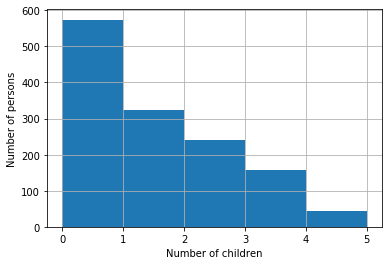
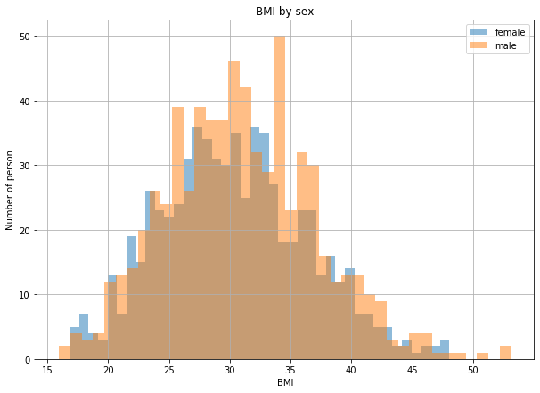
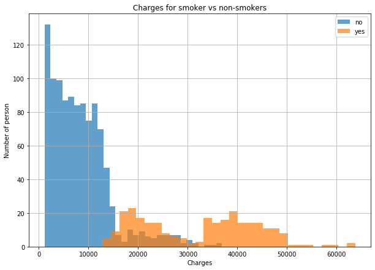
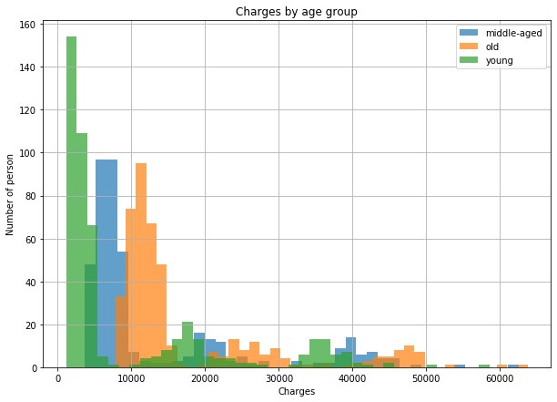
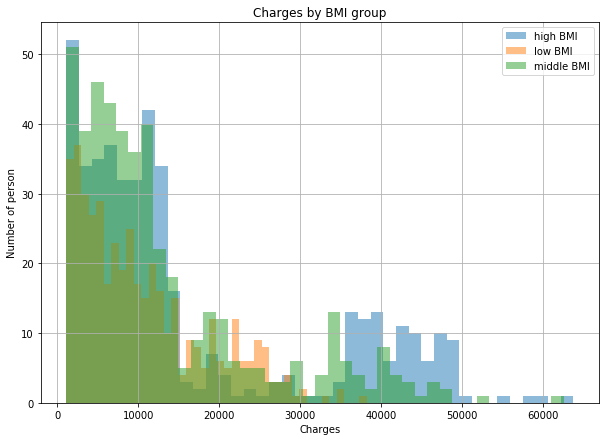
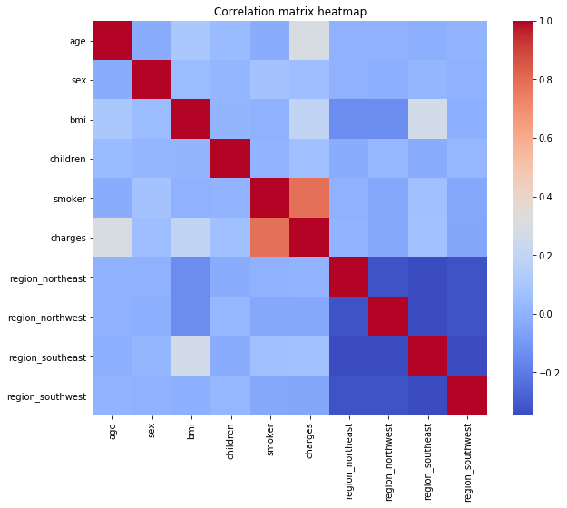

# Course 4

During this course, we will analyze a dataset and create regression
models.

## Setup

1. Download the dataset from [here](../datasets/insurance.csv) or
directly from [Kaggle](https://www.kaggle.com/mirichoi0218/insurance).
2. Load this `csv` file using pandas

```
   age     sex     bmi  children smoker     region      charges
0   19  female  27.900         0    yes  southwest  16884.92400
1   18    male  33.770         1     no  southeast   1725.55230
2   28    male  33.000         3     no  southeast   4449.46200
3   33    male  22.705         0     no  northwest  21984.47061
4   32    male  28.880         0     no  northwest   3866.85520
```

## Label encoding

Scikit-learn models work with arrays of numbers. Our dataset actually
contains textual columns (`sex`, `smoker` and `region`). These columns
contain *categorical* values with a finite number of valid values.

```python
df.sex.unique()
```

```
array(['female', 'male'], dtype=object)
```

```python
df.smoker.unique()
```

```
array(['yes', 'no'], dtype=object)
```

```python
df.region.unique()
```

```
array(['southwest', 'southeast', 'northwest', 'northeast'], dtype=object)
```

We will apply two different operations depending on whether a
categorical variable is binary or not.

### Integer encoding

To encode our binary variables, `sex` and `smoker`, we will use a
`LabelEncoder` from scikit-learn. Let's see how to use this class.

```python
from sklearn.preprocessing import LabelEncoder

animals         = pd.Series(['dog', 'cat', 'dog', 'dog', 'cat'])
label_encoder   = LabelEncoder()
label_encoder.fit(animals.unique())
print('Classes', label_encoder.classes_)
encoded_animals = label_encoder.transform(animals)
print('Original series\n', animals)
print('Encoded series', encoded_animals)
```

```
Classes ['cat' 'dog']
Original series
 0    dog
1    cat
2    dog
3    dog
4    cat
dtype: object
Encoded series [1 0 1 1 0]
```

A label encoder associates an integer value to each of the possible
categorical values. It is mostly used to encode binary variable.

3. Using `LabelEncoder`, encode the columns `sex` and `smoker` of the
dataset. Overwrite their content with the encoded values. Save the
encoders for later use.

```
   age  sex     bmi  children  smoker     region      charges
0   19    0  27.900         0       1  southwest  16884.92400
1   18    1  33.770         1       0  southeast   1725.55230
2   28    1  33.000         3       0  southeast   4449.46200
3   33    1  22.705         0       0  northwest  21984.47061
4   32    1  28.880         0       0  northwest   3866.85520
```

### One-hot encoding

Let's say we apply the same encoding as in the previous section to the
`region` column and then apply a regression algorithm. The encoding
will for example match `southwest` to 0, `northeast` to 1 and
`southeast` to 3. The linear regression will consider the `southwest`
category to be "*closer*" to the `northeast` category (difference of
`1`) than to the `southeast` one (difference of `3`). The behavior is
due to the fact that, when we use integer encoding, our feature
inherits the natural ordering of the integers that may be used by
models later in the process.

To encode categorical variables having more than 2 values, we
transform them into a *one-hot encoding* array using
`pandas.get_dummies`.

```python
animals = pd.Series(['dog', 'cat', 'dog', 'dog', 'cat', 'goat', 'cat', 'alligator'])
one_hot = pd.get_dummies(animals, prefix = 'animal')
print(one_hot)
```

```
   animal_alligator  animal_cat  animal_dog  animal_goat
0                0           0           1            0
1                0           1           0            0
2                0           0           1            0
3                0           0           1            0
4                0           1           0            0
5                0           0           0            1
6                0           1           0            0
7                1           0           0            0
```

To generate the one-hot encoding of a sequence, we create an array
`[n_samples, n_categories]`. If sample `i` is of class `j`, we put a
`1` in the column `j` of the row `i` and `0` in all its other columns.

This type of encoding does not suffers the same problem as the integer
encoding.

4. Using
[`pandas.get_dummies`](https://pandas.pydata.org/pandas-docs/stable/reference/api/pandas.get_dummies.html),
encode the columns `region` column of the dataset. Remove the old
`region` column and add the new columns of the one-hot encoding. You
can generate the one-hot encoding columns first and then concatenate
them to the dataset or read the documentation of `get_dummies` to let
`pandas` do it for you.

```
   age  sex     bmi  children  smoker      charges  region_northeast  region_northwest  region_southeast  region_southwest
0   19    0  27.900         0       1  16884.92400                 0                 0                 0                 1
1   18    1  33.770         1       0   1725.55230                 0                 0                 1                 0
2   28    1  33.000         3       0   4449.46200                 0                 0                 1                 0
3   33    1  22.705         0       0  21984.47061                 0                 1                 0                 0
4   32    1  28.880         0       0   3866.85520                 0                 1                 0                 0
```

## Exploratory data analysis (EDA)

The first step of the data science process is always to get to know
the dataset you are working with. Before you start applying models,
you want to check for very unusual samples, missing data and unusual
feature distribution. You also want to get an intuition on what
feature will be useful to the model.

For example to check the number of children the persons in the
database have, we can either count the values using `value_counts`

```python
df.children.value_counts()
```

```
0    574
1    324
2    240
3    157
4     25
5     18
Name: children, dtype: int64
```

Or we can draw an histogram using matplotlib.

```python
df.children.hist(bins = 5)
plt.xlabel('Number of children')
plt.ylabel('Number of persons')
```



You can also also draw histogram to compare the distribution in
separate groups. Let's say we want to plot the BMI for (body mass
index) for male versus female.

```python
plt.figure(figsize = (10, 7))
for sex_id, df_sex in df.groupby('sex'):
  label = col_to_encoder['sex'].classes_[sex_id]
  df_sex.bmi.hist(bins = 40, label = label, alpha = .5)
plt.title('BMI by sex')
plt.xlabel('BMI')
plt.ylabel('Number of person')
plt.legend()
```



5. Count the number of male and female in the dataset

```
1    676
0    662
Name: sex, dtype: int64
```

6. Compute by region, the mean charges.

```
region_northeast  region_northwest  region_southeast  region_southwest
0                 0                 0                 1                   12346.937377
                                    1                 0                   14735.411438
                  1                 0                 0                   12417.575374
1                 0                 0                 0                   13406.384516
Name: charges, dtype: float64
```

7. Plot the charges distribution


8. Plot the charges distribution for smoker versus non smokers with
   proper labels for the `x` and the `y` axis.



9. Analyze the charges repartition for young, middle aged people and
   old people.



10. Display the charges repartition for people with the 33% lowest, 33%
    middle and 33% highest body mass index




We can also plot the
[correlation](https://en.wikipedia.org/wiki/Correlation_and_dependence)
matrix of the dataset using seaborn which is a visualization library
built on top of matplotlib.

```python
import seaborn as sns

fig, ax     = plt.subplots(figsize = (10, 8))
plt.title('Correlation matrix heatmap')
correlation = df.corr()
sns.heatmap(
    data   = correlation,
    square = True,
    cmap   = 'coolwarm',
    ax     = ax
)
```



We can see that the region columns are absolutely not correlated which
is logical because they are the one-hot encoding of the initial
`region` column (they are mutually exclusive). We can also see that
the highest correlation (apart from trivial ones) is between `smoker`
and `charges` which confirmed what we noticed earlier.

## Regression

Now that we have properly formatted analyzed our dataset, we can begin
building models.

The first thing we have to do is to separate our dataset into
*features* and *labels*.

```python
X = df.drop(['charges'], axis = 1)
y = df.charges
print(X.head())
print(y.head())
```

```
   age  sex     bmi  children  smoker  region_northeast  region_northwest  region_southeast  region_southwest
0   19    0  27.900         0       1                 0                 0                 0                 1
1   18    1  33.770         1       0                 0                 0                 1                 0
2   28    1  33.000         3       0                 0                 0                 1                 0
3   33    1  22.705         0       0                 0                 1                 0                 0
4   32    1  28.880         0       0                 0                 1                 0                 0
0    16884.92400
1     1725.55230
2     4449.46200
3    21984.47061
4     3866.85520
Name: charges, dtype: float64
```

11. As we did during the previous, randomly split the dataset into two
    parts, a *training set* and a *test set*. The test set should
    represent 20% of the whole dataset.

```python
print(X_train.shape, y_train.shape)
print(X_test.shape, y_test.shape)
```

```
(1070, 9) (1070,)
(268, 9) (268,)
```

12. Build a linear regression model using the training dataset

13. Using
    [`r2_score`](https://scikit-learn.org/stable/modules/generated/sklearn.metrics.r2_score.html)
    (the [coefficient of
    determination](https://en.wikipedia.org/wiki/Coefficient_of_determination)),
    [`mean_squared_error`](https://scikit-learn.org/stable/modules/generated/sklearn.metrics.mean_squared_error.html)
    (that we saw in the previous course)
    and[`mean_absolute_error`](https://scikit-learn.org/stable/modules/generated/sklearn.metrics.mean_absolute_error.html),
    build a function that evaluates a scikit-learn model on a training
    and test set. Use this function to evaluate model performances.

```
Model score, train 0.7534590401619559, test 0.7369550545508227
Mean squared error, train 35322337.46772233, test 41961417.434258774
Mean absolute error, train 4099.768835420121, test 4426.46077850008
```

14. Create, train and evaluate a [random forest
    regressor](https://scikit-learn.org/stable/modules/generated/sklearn.ensemble.RandomForestRegressor.html)

```
Model score, train 0.9763573036691097, test 0.8341432181198647
Mean squared error, train 3464506.5912196347, test 24309150.502190832
Mean absolute error, train 1025.6678029129926, test 2918.4048859630357
```

15. Try adding the `age_group` and `bmi_group` column to the dataset
    (use a one-hot encoding) and run both models training and
    evaluation to see if we get improved performances.

A more robust way to evaluate a machine learning model is to perform
[k-fold
cross-validation](https://en.wikipedia.org/wiki/Cross-validation_(statistics)#k-fold_cross-validation). The
concept is simple, instead of splitting the dataset into a training
and evaluation set once and using the test set to evaluate the model's
generalization capabilities, we do it `k` times.


(image from [towardsdatascience](https://towardsdatascience.com/cross-validation-explained-evaluating-estimator-performance-e51e5430ff85))

16. Using [parameter forwarding](../misc/parameter_forwarding.md) and
    [KFold](https://scikit-learn.org/stable/modules/generated/sklearn.model_selection.KFold.html),
    write a function that performs a k-folds validation of a model
    with the following prototype:

```python
def evaluate_model_k_fold(model_class, X, y, n_splits, **kwargs):
```

This function can for example be called like this:

```python
evaluate_model_k_fold(RandomForestRegressor, X, y, 5, n_estimators = 100)
```

```
Train
	r2    -> 0.9765
	mse   -> 3447936.4480
	mae   -> 1010.8829
Test
	r2    -> 0.8395
	mse   -> 23269291.8712
	mae   -> 2687.0756
```

with `n_estimators` being a `RandomForestRegressor` argument.

17. Use the `evaluate_model_k_fold` you have built to evaluate the
    `LinearRegression` and `RandomForestRegressor` models you have
    created.

18. Reproduce this whole process on the [King County House house
    sales](https://www.kaggle.com/harlfoxem/housesalesprediction)
    dataset, available [here](../datasets/kc_house_data.csv).

    Hints:
    - The target is the `price` column.
    - Take a look at the distribution of the various numerical columns
      of the dataset and in particular to their smallest and biggest
      values. You can use `plt.scatter` as in [Lesson
      3](./lesson_03.md#linear-regression-in-scikit-learn) to plot
      the relationship between two continuous features.
    - A [polynomial
      regression](https://en.wikipedia.org/wiki/Polynomial_regression)
      is simply a linear regression whose variables are products of
      the base variables of the task. Using this algorithm *might*
      provide a performance boost on this task. Be *very* careful of
      overfitting when performing polynomial regression.

```python
>>> import numpy as np
>>> from sklearn.preprocessing import PolynomialFeatures
>>> poly_feat = PolynomialFeatures(degree = 2)
>>> x = np.arange(6).reshape(3, 2)
>>> x # [a, b]
array([[0, 1],
       [2, 3],
       [4, 5]])

>>> x_poly = poly_feat.fit_transform(x)
>>> x_poly # [1, a, b, a ^ 2, ab, b ^ 2]
array([[ 1.,  0.,  1.,  0.,  0.,  1.],
       [ 1.,  2.,  3.,  4.,  6.,  9.],
       [ 1.,  4.,  5., 16., 20., 25.]])
```
