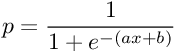
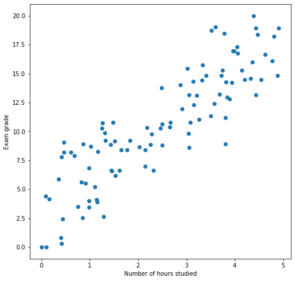
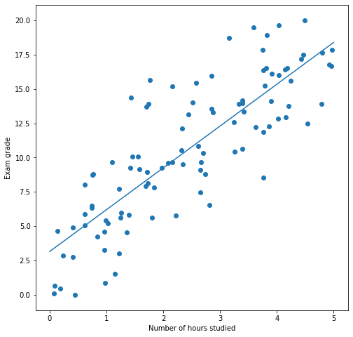
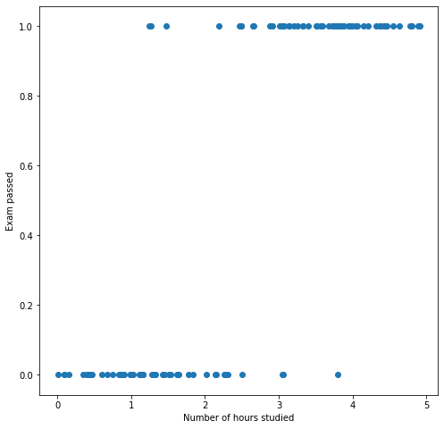
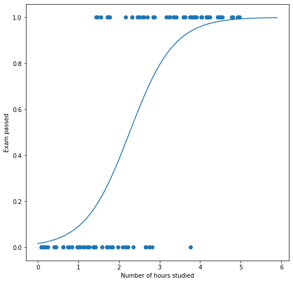
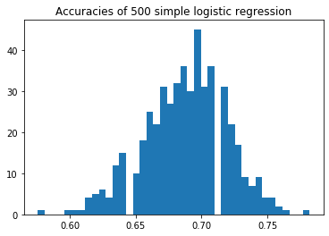
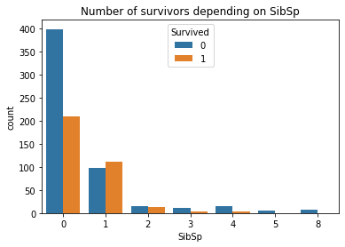
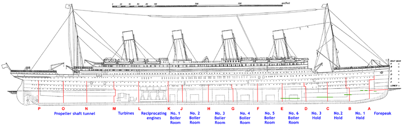
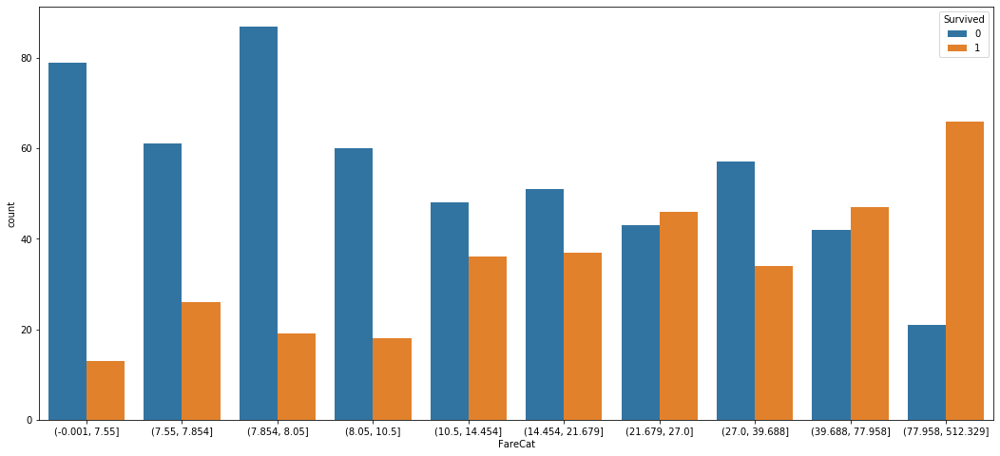

# Course 5

## Logistic regression

### Theory

The [Logistic
Regression](https://en.wikipedia.org/wiki/Logistic_regression) model
is quite similar to the Linear Regression model we worked with during
lesson 4. Despite its name, the logistic regression is actually a
*classification* model. Its goal is to predict a *categorical value*
based on its inputs.

When using the *linear regression* model to predict a continuous
value, the central assumption was that the relationship between the
features `X` and the target `y` can be approximated by *linear
combination* of the features. When using the *logistic regression*
model, the central assumption is that the relation between `X` and `y`
(`P(y|X)`) can be approximated as a [*sigmoid
function*](https://en.wikipedia.org/wiki/Sigmoid_function) applied to
a *linear combination* of the features. The sigmoid function is
defined as follows:


This function has the following shape:


The function computed by the logistic regression is the following one:



with `a` and `b` being the *model parameters*.

### Example

Let's build an logistic regression to get a sense of how it works. As
we did when we discovered the linear regression model in [Lesson
3](./lesson_03.md), we are going to work with students passing an exam
and study the impact of the numbers of hours studied on their success.

```python
import matplotlib.pyplot as plt
import numpy as np
from sklearn.linear_model import LinearRegression, LogisticRegression

X     = np.random.rand(100) * 5
grade = ((3 * X + 3) + np.random.randn(len(X)) * 2.5).clip(0, 20)
plt.figure(figsize = (8, 8))
plt.xlabel('Number of hours studied')
plt.ylabel('Exam grade')
plt.scatter(X, grade)
```



Remember that we built a linear regression to predict the grades using
the number of hours studied as input.

```python
lin_reg = LinearRegression()
lin_reg.fit(X.reshape(-1, 1), grade)
plt.figure(figsize = (8, 8))
X_plot = np.arange(0, 6)
plt.plot(X_plot, lin_reg.predict(X_plot.reshape(-1, 1)))
plt.scatter(X, grade)
plt.xlabel('Number of hours studied')
plt.ylabel('Exam grade')
```



Now let's say that instead of predicting the grade of student, we
tried to predict whether he or she passed the exam (having its
grade >= 10).

```python
y = grade >= 10
plt.figure(figsize = (8, 8))
plt.scatter(X, y)
plt.xlabel('Number of hours studied')
plt.ylabel('Exam passed')
```



We went from a *regression problem* (predicting a continuous value for
the grade) to a *classification problem* (predicting whether the
student passed the exam). To model our problem, we are going to use a
logistic regression model.

```python
log_reg = LogisticRegression()
log_reg.fit(X.reshape(-1, 1), y)
```

We can now use our model to make predictions.

```python
log_reg.predict(np.array([1, 2.5, 4]).reshape(-1, 1))
```

```
array([False,  True,  True])
```

We can actually get more information out of the model. The logistic
regression can provide us with an estimate of the probability for each
class. This tells us how *confident* the model is in its predictions.

```python
log_reg.predict_proba(np.array([1, 2.5, 4]).reshape(-1, 1))
```

```
array([[0.90887633, 0.09112367],
       [0.39279654, 0.60720346],
       [0.0402665 , 0.9597335 ]])
```

We can see in this output that the model is much more confident that
the student who studied 4 hours will pass the exam (96% confidence)
than the one who studied 2.5 hours (61% confidence).

We can also visualize the function that is use to compute the model
confidence.

```python
plt.figure(figsize = (8, 8))
X_plot = np.arange(0, 6, .1)
plt.scatter(X, y)
plt.plot(X_plot, log_reg.predict_proba(X_plot.reshape(-1, 1))[:, 1])
plt.xlabel('Number of hours studied')
plt.ylabel('Exam passed')
```



We can see that the function used is S-shaped because we use the
sigmoid function as explained above. This sigmoid function is applied
to a linear combination of the input features. Once the model is
fit, we can also visualize this combination.

```python
plt.figure(figsize = (8, 8))
X_plot = np.arange(0, 6, .1)
plt.scatter(X, y)
plt.plot(X_plot, log_reg.predict_proba(X_plot.reshape(-1, 1))[:, 1])
plt.plot(X_plot, log_reg.coef_.squeeze() * X_plot + log_reg.intercept_.squeeze())
plt.xlabel('Number of hours studied')
plt.ylabel('Exam passed')
```


### Details

Just as the linear regression, this model is trained using the
[gradient descent](https://en.wikipedia.org/wiki/Gradient_descent)
algorithm. Because it is a classification problem, we are not able to
use the mean squared error function anymore, we have to use a
*classification specific loss*. The one
[usually](https://en.wikipedia.org/wiki/Logistic_regression#Model_fitting)
used to optimize logistic regression is the [maximum log likelihood
estimation](https://en.wikipedia.org/wiki/Maximum_likelihood_estimation).

To get a deeper understanding of how logistic regression works, how to
train it and how to evaluate it, I would strongly suggest taking a
look at [this series of
videos](https://www.youtube.com/playlist?list=PLblh5JKOoLUKxzEP5HA2d-Li7IJkHfXSe)
from StatQuest with Josh Starmer and [these lecture
notes](https://web.stanford.edu/class/archive/cs/cs109/cs109.1178/lectureHandouts/220-logistic-regression.pdf)
from Stanford University.

## Practical work

The goal of this practical work is to build a model that predicts
whether a Titanic passenger will survive or die. Once a very basic
model is built, we will perform *feature engineering* to create new
features in order to improve our model predictions.

### Data loading

0. Let's download the file [Titanic](../datasets/titanic.csv) and load it
   using pandas.

```
   PassengerId  Survived  Pclass                                               Name     Sex   Age  SibSp  Parch            Ticket     Fare Cabin Embarked
0            1         0       3                            Braund, Mr. Owen Harris    male  22.0      1      0         A/5 21171   7.2500   NaN        S
1            2         1       1  Cumings, Mrs. John Bradley (Florence Briggs Th...  female  38.0      1      0          PC 17599  71.2833   C85        C
2            3         1       3                             Heikkinen, Miss. Laina  female  26.0      0      0  STON/O2. 3101282   7.9250   NaN        S
3            4         1       1       Futrelle, Mrs. Jacques Heath (Lily May Peel)  female  35.0      1      0            113803  53.1000  C123        S
4            5         0       3                           Allen, Mr. William Henry    male  35.0      0      0            373450   8.0500   NaN        S
```

The first model that we will build is a logistic regression on basic
features of the dataset. We are going to establish a *baseline
accuracy* for our problem by simply removing columns that require
processing to be useful.

### Baselines

1. Establish what is the accuracy (proportion of correct predictions)
   a model that always outputs the most target would get. All the
   accuracies of the models we will build will be compared to this
   value. If a model accuracy is equal to this value, this is a strong
   hint that there is something wrong.

### Model evaluation setup

2. Build a
   [LogisticRegression](https://scikit-learn.org/stable/modules/generated/sklearn.linear_model.LogisticRegression.html)
   model using the following features from the dataset: `Age`,
   `SibSp`, `Parch`, `Fare`. Deal with the missing values as we have
   seen in [Lesson 2](./lesson_02.md). Split the data into 80% for the
   training set and 20% for the test set. Evaluate the model on its
   training and testing data.

```
Training set accuracy: 0.6867977528089888
Test set accuracy: 0.6815642458100558
```

3. In a loop, split the dataset into a training and test set and train
   a logistic regression model as you did in the previous
   question. Store the test set accuracy in a list and draw an
   histogram of these values. We perform this operation to get a sense
   of how much our model performances are affected by the train / test
   split.



This figures tells us that are model is *very* dependent on the train
test split to achieve good performances. Accuracies of models trained
this way range from around 60% to around 80%, that a 20% gap!!!

To mitigate this problem, we will use
[KFold](https://scikit-learn.org/stable/modules/generated/sklearn.model_selection.KFold.html)
as we did in [lesson 4](./lesson_04.md).

4. Adapt your KFold evaluation from lesson 4 to work with a
   classification problems. The metrics we want to use to evaluate our
   models are
   [accuracy_score](https://scikit-learn.org/stable/modules/generated/sklearn.metrics.accuracy_score.html)
   and
   [balanced_accuracy_score](https://scikit-learn.org/stable/modules/generated/sklearn.metrics.balanced_accuracy_score.html#sklearn.metrics.balanced_accuracy_score).

5. Reproduce the experiment form question 3 using the accuracy
   obtained by KFold cross-validation. The spread of test set
   accuracies you should obtained is around 2.5%.

Now that we have a robust way of evaluating our models, we can start
to add features and analyze their impact on the model performances

### Feature engineering

6. Build a new dataset this time containing the columns `Age`,
   `SibSp`, `Parch`, `Fare`, `Pclass`, `Sex`, `Embarked`. Fill the
   missing values as we have seen in lesson 2 and encode the columns
   `Pclass`, `Sex` and `Embarked` as we have seen in lesson 4.

7. Train a new logistic regression model using this new dataset and
   evaluate it using k-fold.

```
Train
	acc   -> 0.8036
	bal_acc -> 0.7847
Test
	acc   -> 0.7969
	bal_acc -> 0.7769
```

That's almost a 10% gain in accuracy without doing much! As you might
except, the last percentages are the hardest to get. Let's see if we
can squeeze more structure from our training data.

We are going to use [Seaborn](https://seaborn.pydata.org/) to produce
some visualization to get a sense of the type of features we should
add to our dataset to help our models.

Let's say we are interested in the proportion of people that survived
depending on the number sibling or spouse on board (column `SibSp`). We
could use a pandas `groupby` as we have done many times in the course.

```python
df.groupby(['SibSp', 'Survived']).size()
```

```
SibSp  Survived
0      0           398
       1           210
1      0            97
       1           112
2      0            15
       1            13
3      0            12
       1             4
4      0            15
       1             3
5      0             5
8      0             7
dtype: int64
```

A more visual way to analyze this information is to generate a
`seaborn.countplot` to draw multiple histogram depending on a
categorical variable.

```python
import seaborn as sns

plt.title('Number of survivors depending on SibSp')
sns.countplot(x = 'SibSp', hue = 'Survived', data = df)
```



8. Generate a countplot showing the survival proportion for each
   `Parch` value.

9. Using the information we have seen in the two previous graphs,
   create two news columns `SibSpCat` and `Parch` containing three
   types of values `low`, `middle` and `high`. Decide how to choose
   the corresponding ranges for these tree values using the previous
   two countplots. It is the same process we applied in lesson 4 with
   the BMI.

10. Draw the countplots of the number of survivors for each values of
    the columns `SibSpCat` and `ParchCat` to check that the column you
    have added are like to help the model.

11. Encode the values of the columns `SibSpCat` and `ParchCat` and
    evaluate your model performances with this new dataset (once again
    using KFold).

```
Train
	acc   -> 0.8134
	bal_acc -> 0.7948
Test
	acc   -> 0.8081
	bal_acc -> 0.7904
```

That's another 0.5% of accuracy and 1.5% of balanced accuracy
gained! Let's continue.

To get further, we have to look into the columns that we left on the
side for now: `Ticket` and `Cabin`.

It appears that, in the Titanic, family members traveling together
were given the same ticket number.

```python
df.Ticket.value_counts().iloc[:5]
```

```
1601        7
CA. 2343    7
347082      7
CA 2144     6
3101295     6
Name: Ticket, dtype: int64
```

It may be interesting to take a look at the relationship between the
number of passengers having the same ticket number as one person and
their survival rate.

12. Add a new column `TicketFrequency` containing, for each passenger,
    the number of passengers having the same ticket. Once this column
    is created, take the look at its survival countplot as we did in
    the previous questions.

13. Just as in question 9, create 3 categories of `TicketFrequency`
    based on the output of the previous countplot designed to help the
    model make its decision. These categories will be stored in a new
    `TicketFreqCat` column.

There may be some useful information in the `Cabin` column. Let's take
a look at it.

```python
df.Cabin.unique()
```

```
array([nan, 'C85', 'C123', 'E46', 'G6', 'C103', 'D56', 'A6',
       'C23 C25 C27', 'B78', 'D33', 'B30', 'C52', 'B28', 'C83', 'F33',
       'F G73', 'E31', 'A5', 'D10 D12', 'D26', 'C110', 'B58 B60', 'E101',
       'F E69', 'D47', 'B86', 'F2', 'C2', 'E33', 'B19', 'A7', 'C49', 'F4',
       'A32', 'B4', 'B80', 'A31', 'D36', 'D15', 'C93', 'C78', 'D35',
       'C87', 'B77', 'E67', 'B94', 'C125', 'C99', 'C118', 'D7', 'A19',
       'B49', 'D', 'C22 C26', 'C106', 'C65', 'E36', 'C54',
       'B57 B59 B63 B66', 'C7', 'E34', 'C32', 'B18', 'C124', 'C91', 'E40',
       'T', 'C128', 'D37', 'B35', 'E50', 'C82', 'B96 B98', 'E10', 'E44',
       'A34', 'C104', 'C111', 'C92', 'E38', 'D21', 'E12', 'E63', 'A14',
       'B37', 'C30', 'D20', 'B79', 'E25', 'D46', 'B73', 'C95', 'B38',
       'B39', 'B22', 'C86', 'C70', 'A16', 'C101', 'C68', 'A10', 'E68',
       'B41', 'A20', 'D19', 'D50', 'D9', 'A23', 'B50', 'A26', 'D48',
       'E58', 'C126', 'B71', 'B51 B53 B55', 'D49', 'B5', 'B20', 'F G63',
       'C62 C64', 'E24', 'C90', 'C45', 'E8', 'B101', 'D45', 'C46', 'D30',
       'E121', 'D11', 'E77', 'F38', 'B3', 'D6', 'B82 B84', 'D17', 'A36',
       'B102', 'B69', 'E49', 'C47', 'D28', 'E17', 'A24', 'C50', 'B42',
       'C148'], dtype=object)
```

We can see that the Cabin numbers begin with a letter. After a bit of
research on the [Sinking of the RMS
Titanic](https://en.wikipedia.org/wiki/Sinking_of_the_RMS_Titanic)
wikipedia page, we find the following picture.



Apparently the first letter of the `Cabin` number is the name of the
deck in which this cabin is located. This could prove useful for the
model.

14. Create a column `CabinCat` containing for each passenger the deck
    in which its cabin is located and plot the corresponding
    countplot. Fill the missing Cabin numbers with a new unused value
    such as `Q`.

15. Transform the column `CabinCat` to group together decks having
    similar survival rates (for example the decks `D` and `E` both
    have a 75% survival rate, they should be in the same deck
    group). You can for example create 3 groups of decks, one that is
    positively correlated with survival, one negatively correlated
    with survival and not correlated with survival.

16. We can also dig a bit deep into the `Fare` column. Using the
    `pd.qcut` function, divide all the possible `Fare` values into 10
    buckets each containing 10% of the passengers. Display the
    corresponding countplot.



17. Build a new dataset with all the new columns that we have created
    encoded. Remove the columns which we used to create `SibSpCat`,
    `ParchCat`, `TicketFreqCat`, `CabinCat` and `FareCat`: `SibSp`,
    `Parch`, `TicketFrequency`, `Cabin` and `Fare`. Build a logistic
    regression model. Evaluate this model using k fold validation.

```python
Train
	acc   -> 0.8238
	bal_acc -> 0.8062
Test
	acc   -> 0.8182
	bal_acc -> 0.8003
```

That's yet another 1% of accuracy and 0.99% of balanced accuracy
gained.
