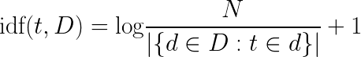
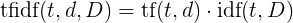
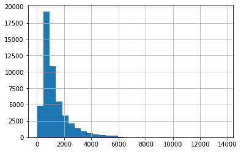

# Course 6

## Working with text

### Count vectorizer

There exist many different tasks on which we would like to apply data
science and machine learning for example automatic translation, text
classification (detecting spam, automatically tagging articles, ...),
information retrieval (search engine).

In order to work with textual data, we first have to encode it into
number arrays.

The easiest way to convert a sequence of words into a vector is to
*count the number of occurence* of each word.

Let's create a list of sentences that we want to encode.

```python
sentences = [
  'hello everyone',
  'hi everyone',
  'Hi Everyone!',
  'Hi charlie, hi marie, how is everyone doing?'
]
```

Now let's create our `CountVectorizer` which will create the vector
corresponding to each sentence.

```python
from sklearn.feature_extraction.text import CountVectorizer

count_vect = CountVectorizer()
count_vect.fit(sentences)
```

By fitting the `CountVectorizer`, we are building the *vocabulary*
that will be used to compute the sentence vectors. This vocabulary
have appeared as a field with an underscore in `count_vect`.

```python
print(count_vect.vocabulary_)
```

```
{'hello': 3, 'everyone': 2, 'hi': 4, 'charlie': 0, 'marie': 7, 'how': 5, 'is': 6, 'doing': 1}
```

We can notice a few things:
  - All the sentences have been split into lists of words.
  - The splitting is not simply cutting when there is a space
    character. We can for example see that "charlie" and "marie"
    appear in the vocabulary without ",".
  - All the sentences have been converted to lowercase, the vocabulary
    does not contain different entries for "Hi" and "hi".

All these behavior can be modified while initializing the
`CountVectorizer` but the default parameters are sensible.

Now that we have our vocabulary, let's use it to encode our sentences.

```python
encoded_sentences = count_vect.transform(sentences)
encoded_sentences
```

```
<4x8 sparse matrix of type '<class 'numpy.int64'>'
	with 13 stored elements in Compressed Sparse Row format>
```

The output of the encoding is a sparse array of 4 rows and 8
columns. The rows correspond to our sentences and the columns
correspond to our vocabulary words. The type used here is a *sparse*
matrix because in most usecases an extremely small proportion of the
vocabulary will be used in each input.

In order to visualize it better, let's convert it to a dense NumPy
array. **This should not be done when working with big datasets as the
memory consumption will explode**.

```python
encoded_sentences = encoded_sentences.toarray()
print(encoded_sentences)
```

```
[[0 0 1 1 0 0 0 0]
 [0 0 1 0 1 0 0 0]
 [0 0 1 0 1 0 0 0]
 [1 1 1 0 2 1 1 1]]
```

We can see that the first sentence (row 0) contains 2 words: the ones
at index 2 and 3 in the vocabulary. If we look up to when we have
printed the vocabulary we can see that these words are `everyone` and
`hello`. We can see that we lose the order of the words in the
sentence.

Let's write a small bit of code to better understand this matrix.

First, let's get the list of features that this transformation output.

```python
features = count_vect.get_feature_names()
features
```

```
['charlie', 'doing', 'everyone', 'hello', 'hi', 'how', 'is', 'marie']
```

Then we loop over our sentences and our encoding to display the number
of occurence of each word.

```python
for sentence, sentence_encoding in zip(sentences, encoded_sentences):
  sentence_words = [
    (n_occ, word)
    for n_occ, word in zip(sentence_encoding, features)
    if n_occ != 0
  ]
  print(sentence, sentence_words)
```

```
hello everyone [(1, 'everyone'), (1, 'hello')]
hi everyone [(1, 'everyone'), (1, 'hi')]
Hi Everyone! [(1, 'everyone'), (1, 'hi')]
Hi charlie, hi marie, how is everyone doing? [(1, 'charlie'), (1, 'doing'), (1, 'everyone'), (2, 'hi'), (1, 'how'), (1, 'is'), (1, 'marie')]
```

Transforming texts in this fashion allows us to apply machine learning
algorithms to textual data. The main downside of this encoding method
is that we lose the *word order* information, to help counteract this
phenomenon, we can choose to create a vocabulary composed of single
words AND sequences of two consecutive words
([bigrams](https://en.wikipedia.org/wiki/Bigram)).

```python
count_vect        = CountVectorizer(ngram_range = (1, 2))
count_vect.fit(sentences)
encoded_sentences = count_vect.transform(sentences).toarray()
features          = count_vect.get_feature_names()

for sentence, sentence_encoding in zip(sentences, encoded_sentences):
  sentence_words = [
    (n_occ, word)
    for n_occ, word in zip(sentence_encoding, features)
    if n_occ != 0
  ]
  print(sentence, sentence_words)
```

```
hello everyone [(1, 'everyone'), (1, 'hello'), (1, 'hello everyone')]
hi everyone [(1, 'everyone'), (1, 'hi'), (1, 'hi everyone')]
Hi Everyone! [(1, 'everyone'), (1, 'hi'), (1, 'hi everyone')]
Hi charlie, hi marie, how is everyone doing? [(1, 'charlie'), (1, 'charlie hi'), (1, 'doing'), (1, 'everyone'), (1, 'everyone doing'), (2, 'hi'), (1, 'hi charlie'), (1, 'hi marie'), (1, 'how'), (1, 'how is'), (1, 'is'), (1, 'is everyone'), (1, 'marie'), (1, 'marie how')]
```

As you can see, sentences are now encoded as sequences of words and
sequences of bigrams. While we can encode sentences using any size of
[n-grams](https://en.wikipedia.org/wiki/N-gram), we have to be careful
as the number of features grows exponentially quickly.

```python
encoded_sentences.shape
```

```
(4, 17)
```

With our tiny dataset we already have 17 features using words and bigrams.

The idea behind the count vectorizer method is that the more a term or
n-gram appears in a text, the more important its corresponding feature
is for later analysis. This method poses problems as some words such
as "the" and "a" appear extremely often and yet carry little
information.

### Term Frequency - Inverse Document Frequency

Another text vectorization algorithm used much more commonly is the
Term Frequency - Inverse Document Frequency method
([TFIDF](https://en.wikipedia.org/wiki/Tf%E2%80%93idf)).

The idea of TFIDF is to attribute to each word a value that reflect
how important this word to *a document in collection of
documents*. The tf–idf value increases proportionally to the number of
times a word appears in the document and is offset by the number of
documents in the corpus that contain the word, which helps to adjust
for the fact that some words appear more frequently in general.

The idf formula is the following one



where `t` is a *term* or word, `D` is the collection of documents and
`N` is the number of documents in the collection.

Let's fit a
[TfidfVectorizer](https://scikit-learn.org/stable/modules/generated/sklearn.feature_extraction.text.TfidfVectorizer.html)
on the same data as before and visualize the inverse document
frequencies. The hyperparameters used for the vectorizer are there to
simplify computations in examples, during the practical work, we will
use the default values.

```python
sentences = [
  'hello everyone',
  'hi everyone',
  'Hi Everyone!',
  'Hi charlie, hi marie, how is everyone doing?',
]
tfidf = TfidfVectorizer(norm = None, smooth_idf = False)
tfidf.fit(sentences)
print(*zip(tfidf.get_feature_names(), tfidf.idf_), sep = '\n')
```

```
('charlie', 2.386294361119891)
('doing', 2.386294361119891)
('everyone', 1.0)
('hello', 2.386294361119891)
('hi', 1.2876820724517808)
('how', 2.386294361119891)
('is', 2.386294361119891)
('marie', 2.386294361119891)
```

Let's compute by hand the inverse document frequencies for the terms
`everyone` and `hi`.


Now that we have our inverse document frequencies, we can compute the
tfidf formula.



`tf` the *term frequency* is simply the number of times the word `t`
appears in the document `d`.

```python
encoded_sentences = tfidf.transform(sentences).toarray()
encoded_sentences
```

```
array([[0.        , 0.        , 1.        , 2.38629436, 0.        ,        0.        , 0.        , 0.        ],
       [0.        , 0.        , 1.        , 0.        , 1.28768207,        0.        , 0.        , 0.        ],
       [0.        , 0.        , 1.        , 0.        , 1.28768207,        0.        , 0.        , 0.        ],
       [2.38629436, 2.38629436, 1.        , 0.        , 2.57536414,        2.38629436, 2.38629436, 2.38629436]])
```

Let's compute the tfidf value for the word `hello` (index 3 in
vocubulary) in the first the sentence. This term appears once in the
sentence so `tf("hello", d) = 1` and we already have computed
`idf("hello", D) = 2.386294361119891` so the tfidf value is `1 *
2.386294361119891 = 2.386294361119891`.

Let's do the same thing for the word `hi` (index 4 in vocabulary) in
the last sentence. This term appears twice to `tf("hi", d) = 2` and we
already have computed that `idf("hi", D) = 1.2876820724517808` so the
tfidf value is `2 * 1.2876820724517808 = 2.57536414`.

There exists many variants of the tfidf vectorization but this
sections contains the main ideas.

## Text classification

In this section we will build a movie review classifier. We are going
to download a dataset, process it, build a classifier, evaluate it and
test it with our own reviews.

0. Download the [IMDB movie review
   dataset](https://www.kaggle.com/lakshmi25npathi/imdb-dataset-of-50k-movie-reviews)
   from [here](../datasets/IMDB_reviews/imdb.csv) and load it into a
   pandas dataframe.

Now that the dataset is loaded, we are going to explore it.

1. Display entirely the first few reviews of the dataset.

```
One of the other reviewers has mentioned that after watching just 1 Oz episode you'll be hooked. They are right, as this is exactly what happened with me.<br /><br />The first thing that struck me about Oz was its brutality and unflinching scenes of violence, which set in right from the word GO. Trust me, this is not a show for the faint hearted or timid. This show pulls no punches with regards to drugs, sex or violence. Its is hardcore, in the classic use of the word.<br /><br />It is called OZ as that is the nickname given to the Oswald Maximum Security State Penitentary. It focuses mainly on Emerald City, an experimental section of the prison where all the cells have glass fronts and face inwards, so privacy is not high on the agenda. Em City is home to many..Aryans, Muslims, gangstas, Latinos, Christians, Italians, Irish and more....so scuffles, death stares, dodgy dealings and shady agreements are never far away.<br /><br />I would say the main appeal of the show is due to the fact that it goes where other shows wouldn't dare. Forget pretty pictures painted for mainstream audiences, forget charm, forget romance...OZ doesn't mess around. The first episode I ever saw struck me as so nasty it was surreal, I couldn't say I was ready for it, but as I watched more, I developed a taste for Oz, and got accustomed to the high levels of graphic violence. Not just violence, but injustice (crooked guards who'll be sold out for a nickel, inmates who'll kill on order and get away with it, well mannered, middle class inmates being turned into prison bitches due to their lack of street skills or prison experience) Watching Oz, you may become comfortable with what is uncomfortable viewing....thats if you can get in touch with your darker side.

A wonderful little production. <br /><br />The filming technique is very unassuming- very old-time-BBC fashion and gives a comforting, and sometimes discomforting, sense of realism to the entire piece. <br /><br />The actors are extremely well chosen- Michael Sheen not only "has got all the polari" but he has all the voices down pat too! You can truly see the seamless editing guided by the references to Williams' diary entries, not only is it well worth the watching but it is a terrificly written and performed piece. A masterful production about one of the great master's of comedy and his life. <br /><br />The realism really comes home with the little things: the fantasy of the guard which, rather than use the traditional 'dream' techniques remains solid then disappears. It plays on our knowledge and our senses, particularly with the scenes concerning Orton and Halliwell and the sets (particularly of their flat with Halliwell's murals decorating every surface) are terribly well done.

I thought this was a wonderful way to spend time on a too hot summer weekend, sitting in the air conditioned theater and watching a light-hearted comedy. The plot is simplistic, but the dialogue is witty and the characters are likable (even the well bread suspected serial killer). While some may be disappointed when they realize this is not Match Point 2: Risk Addiction, I thought it was proof that Woody Allen is still fully in control of the style many of us have grown to love.<br /><br />This was the most I'd laughed at one of Woody's comedies in years (dare I say a decade?). While I've never been impressed with Scarlet Johanson, in this she managed to tone down her "sexy" image and jumped right into a average, but spirited young woman.<br /><br />This may not be the crown jewel of his career, but it was wittier than "Devil Wears Prada" and more interesting than "Superman" a great comedy to go see with friends.

Basically there's a family where a little boy (Jake) thinks there's a zombie in his closet & his parents are fighting all the time.<br /><br />This movie is slower than a soap opera... and suddenly, Jake decides to become Rambo and kill the zombie.<br /><br />OK, first of all when you're going to make a film you must Decide if its a thriller or a drama! As a drama the movie is watchable. Parents are divorcing & arguing like in real life. And then we have Jake with his closet which totally ruins all the film! I expected to see a BOOGEYMAN similar movie, and instead i watched a drama with some meaningless thriller spots.<br /><br />3 out of 10 just for the well playing parents & descent dialogs. As for the shots with Jake: just ignore them.

Petter Mattei's "Love in the Time of Money" is a visually stunning film to watch. Mr. Mattei offers us a vivid portrait about human relations. This is a movie that seems to be telling us what money, power and success do to people in the different situations we encounter. <br /><br />This being a variation on the Arthur Schnitzler's play about the same theme, the director transfers the action to the present time New York where all these different characters meet and connect. Each one is connected in one way, or another to the next person, but no one seems to know the previous point of contact. Stylishly, the film has a sophisticated luxurious look. We are taken to see how these people live and the world they live in their own habitat.<br /><br />The only thing one gets out of all these souls in the picture is the different stages of loneliness each one inhabits. A big city is not exactly the best place in which human relations find sincere fulfillment, as one discerns is the case with most of the people we encounter.<br /><br />The acting is good under Mr. Mattei's direction. Steve Buscemi, Rosario Dawson, Carol Kane, Michael Imperioli, Adrian Grenier, and the rest of the talented cast, make these characters come alive.<br /><br />We wish Mr. Mattei good luck and await anxiously for his next work.
```

2. Establish a baseline accuracy but checking the class balance.

Pandas gives us a set of
[tools](https://pandas.pydata.org/pandas-docs/version/0.23.4/text.html)
for exploring strings.

For example let's use this functionalities to compute the number of
characters in each of the reviews.

```python
df['review_len'] = df.review.str.len()
df.review_len.hist(bins = 30)
```



3. Using this mechanism plot an histogram of the number of words in
   each review.

4. Write a function that displays the sentiment repartition depending
   on whether the reviews contains a certain word.


5. Encode the reviews using a `TfidfVectorizer` with default
   parameters, display the shape of the result.

```
(50000, 101895)
```

6. Encode the target of the model `df.sentiment`. `negative` sentiment
   should be encoded as `0`, positive sentiment should be encoded as
   `1`. Make sure that the result is a NumPy array of dtype
   `np.int32`.

7. Build and evaluate a `LogisticRegression` model on this dataset
   using KFold. You should obtain metrics similar to this:

```
Train accuracy 93.189%, test accuracy 89.598%
```

8. Write a function that takes as input a list of reviews, vectorize
   them using a tfidf vectorizer and run the model on it. The function
   should display the probability that a review is positive.

```python
our_reviews = [
  'This movie was literally the best thing that happened in my life',
  'I enjoyed the first part but the end was bad',
  'The first part of the movie was awesome but the end was simply ok',
  'The first part of the movie was awesome but the end was simply ok. Overall it was pretty cool',
  "If the actors were directed properly this movie wouldn't be this bad"
]

classify_reviews(our_reviews, tfidf, log_reg)
```

```
[Positive with 85.380% confidence] This movie was literally the best thing that happened in my life
[Negative with 66.345% confidence] I enjoyed the first part but the end was bad
[Positive with 51.191% confidence] The first part of the movie was awesome but the end was simply ok
[Positive with 62.013% confidence] The first part of the movie was awesome but the end was simply ok. Overall it was pretty cool
[Negative with 98.895% confidence] If the actors were directed properly this movie wouldn't be this bad
```

9. Extract for the trained logistic regression model the words most
   highly correlated with good reviews and with bad reviews. You can
   refer to [Lesson 5](./lesson_05.md) to remember how the logistic
   regression model works.

```
Words strongly indicative of negative comments:
	worst
	bad
	awful
	waste
	boring
	poor
	terrible
	nothing
	horrible
	worse
	dull
	fails
	poorly
	stupid
	minutes
Words strongly indicative of positive comments:
	highly
	fun
	favorite
	love
	enjoyed
	well
	brilliant
	today
	amazing
	loved
	wonderful
	perfect
	best
	excellent
	great
```

10. Build a DataFrame containing all the reviews of the dataset along
    with the *uncertainty* of the model prediction for each review. A
    model predicting that a review is positive with 99% confidence is
    much more *certain* of its decision than a model with 55%
    confidence. Create a formula that outputs a value of 1 where the
    model is very certain of its prediction and a value of 0 where the
    model is very uncertain.

    Use this dataframe to display the reviews with the
    most certain and uncertain predictions.

```
Top 5 most certain predictions:

I would have given it a one instead of a two, but I suppose it COULD have been worse. I
guess the acting isn't all that bad, but the plot lacks anything even remotely
close to interesting. It is a terrible movie!! TERRIBLE! Complete waste of time!
I strongly suggest you do not watch this
movie.!!!!!!!!!!!!!!!!!!!!!!!!!!!!!!!!!!!!!!!!!!!!!!!!!!!!!!!!!!!!!!!!!!

Terrible acting, lame plot, stupid story and just all around terrible movie sums
up this piece of junk. It was excruciating to sit through. Just awful. Do not waste
one penny on this. The movie theaters should feel bad about actually putting this
movie out there for people to watch. This "horror" film was not even in the least
bit scary, creepy or disturbing. It was in no way visually appealing. The acting
was so terrible by all of the actors that any attempt to draw you into the movie
through dialog are completely destroyed within moments of the actor/actress
opening their mouth. Plus the entire story, i don't know why someone would make a
movie with this story AGAIN. Do not waste your time or money. Even if it's a free
ticket don't waste one moment viewing this movie. You will feel dumber for
watching it.

This was truly horrible. Bad acting, bad writing, bad effects, bad scripting,
bad camera shots, bad filming, bad characters, bad music, bad editing, bad
casting, bad storyline, bad ... well, you get the idea. It was just, just ...
what's the word? Oh yeah ... BAD!

As you can tell from the other comments, this movie is just about the WORST film
ever made. Let me see how many different words I can use to describe it: Boring,
Unbearable, Laughable, Lousy, Stupid, Horrible.....<br /><br />I could go on
with such descriptions but you probably get the point.<br /><br />I would have
given this a 0, if possible--bad acting, bad directing, bad production, bad
plot.<br /><br />This was made in 2001 and it looks more like 1965. Very low
budget, boring plot, horrible acting, really bad special effects, etc...<br
/><br />I rarely ever see a Sci-Fi film I absolutely think is this bad. I mean this
is pure garbage. It has nothing going for it either. As far as a "B-movie" this is
the very bottom of the lot.<br /><br />I think I would be more entertained by
staring at a blank piece of paper for 90 minutes. Junk like this gives good
low-budget "B" movies a bad name. This makes Ed Wood movies look good.<br /><br
/>The thing about watching direct-to-video movies is, just when you think
you've seen the worst, you see something even worse!<br /><br />DJ Perry is a
horrible actor and has no individual characteristics that make him stand
out.<br /><br />Avoid this waste at all costs! Oh the humanity!

This is just the same old crap that is spewed from amateur idiots who have no clue
how to make a movie--gee maybe that's why it is a straight-to-video wanna-be
movie!<br /><br />I guess it is my fault for actually spending money to see it (one
of the worst decisions I have ever made). What a waste. I usually like B movies,
some of them are actually quite good--but this is just too ridiculous and stupid
to even be funny.<br /><br />The losers that made this junk deserve to be put out of
business for wasting everyone's time and money making a movie that obviously
doesn't even deserve to be on film! These so-called movie makers have absolutely
NO talent!<br /><br />Stupid plot, horrible acting (especially the drag
queens--what sicko would actually find that sexy?!), lame writing (if there
even was a script--seems like the kinda bull**** someone just made up on the
spot)<br /><br />What is stunning about this movie is its utter lack of anything
well-done at all.<br /><br />How much attention to detail would it take to insure
that every frame of a film would be so far below any reasonable standards? I don't
think it would be possible to make such a bad movie intentionally, and it is
inconceivable that sheer bad luck could produce such consistently awful
results.<br /><br />Anyway, avoid this stink bomb at all
costs!!!!!!!!!!!!!!!!


Top 5 most uncertain predictions

The Sea is Watching was an interesting film experience. First of all, the overall
feel was intense, internalized, claustrophobic, and small. Each frame seemed
to be a photograph of something inside, something very focused and not part of a
bigger picture. It was obvious what we were to look at in each frame. The
physicality of the set itself contributed to that feeling of smallness and
intensity. The lights along the middle of the road cut the road in half, and the
tiny gate to the tiny settlement followed by the tiny and few cubbyholes that
served as the establishments that made up what seemed to be the entire town. Even
the view of the ocean was framed by a tiny landing on which one can count the number
of longer grass swaying in the wind. No panoramic views. In fact, it reminded me of
the Montmarte sequence of Moulin Rouge where the camera sweepingly focuses in to
the windmill creating again a feeling of a small area where everything is
happening.<br /><br />While the acting was passable considering I really could
not discern how the lines were truly delivered, I felt that the actions were
overly melodramatic and nonsensical. Why Kikuno would continue carrying on the
way she did when Fusanosuke announced his impending marriage really didn't seem
true – people hadn't really changed that much, and the character Kikuno was so
strong and resilient that even if they were busy taking on O-shin's business for
naught, the reaction seemed out of character and unnecessary and distracting.
Another example of odd acting was when the drunk boyfriend of Kikuno showed up and
Ryosuke decided to intervene and was pushed down the stairs, the way in which he
got up and menacingly came up the stairs and the ensuing fight outside among the
reeds was simply unsatisfying. It wasn't that I like fight scenes – au contraire –
but it seemed a little stilted and again, overly dramatic.<br /><br
/>Otherwise, while not a beautiful movie to watch, it provided an interesting
glimpse into the darker side of prostitution (as opposed to the geisha).
Unfortunately, perhaps it fed into our expectations of wanton women (the "honey
– I'll give you a deal" comments supported by the over-stretched actions) and
seriously caused me to doubt whether indeed 19th century prostitutes really
acted in that way. But once inside the house, the inner workings became most
interesting, vivid and real and provided a scenario I never anticipated or
imagined in my romantic view of Japan in the 19th century.

The costumes are outrageous and the Australian outback scenery is fun to view,
but there is an edge to this story - a mean edge - about drag queens. I particularly
noticed that in Terrence Stamp's character, "Ralph Bernadette Bassenger."
Perhaps that was appropriate since there is nothing "good-guy- like" about
Ralph-Bernadette and his group of "queens." <br /><br />Once again, we get the
strong Liberal slant which says anything goes and if you're not "with it" - or in
this case, pro-homosexual, then you are a homophobe. (Gasp!)<br /><br />What's
really disturbing is the ending when a young boy goes off with his
"alternative-lifestyle" father and embraces his gay lifestyle, not because it
fit the story but because it fit the agenda of the people who wrote the script.
Pitiful.

Thats what this movie really takes. A big piece of cheeze. This movie is about a
sister and brother Bonnie and Clyde type of duo that creates their own party line
in order to lure their victims in and trap them and kill them. But for what reason?
Just for the fun of getting away with it? In comes Richard Hatch who comes across as
a wishy washy ladies man. A real BAD version of a ladies man. And he gets involved
with finding who's behind all the killings across LA. He finally meets a teenager
who helps him find the killer and rest is for your fun and amusement. But there are
parts in this film that really get me going like the scene with Lief Garret dressed
in his mothers wedding gown acting like a sissy in front of his sister telling her
that he needs her and can't live without her and watching as she slaps him across
the face dominateing him. I can't believe that was Lief!!! Well, I guess I could.
But it's worth watching but only to see one of Garrets worst films that he ever did.

Ahem.. I think I'll be the only one who's saying this but yes, I was a lil bored
during the film. Not to say that this is a bad movie, in fact it's a very good attempt
at portraying the innermost emotions - dilemma, sorrow, love.., esp it's the
director's debut (read from somewhere, is it true?). I felt that something's not
quite right, maybe it's just me, I'm not drawn to the characters enough to immerse
me in their world. This is a simple story, about ordinary people, ordinary lives.
Through simple and short dialogs, the director tries to relate a simple guy's
life, and how copes with the news of his illness by laughing it away every time. Oh
ya his laughter was kinda cute at first but gradually it gets to me, such a deep
hearty roar for a gentle man! I must say, I didn't feel the impact that most readers
felt, in fact I was more drawn to the trivial scenarios like spitting of
watermelon seeds with his sis that clearly shows that they're comfortable with
each other, the granny who came back for another shot - this is kinda melancholic,
the thoughtful gesture of writing down the procedures for his dad - hmm but this is
predictable.. Don't misunderstood that I'm an action-lover, independent
films are my cup of tea! Perhaps I just have a really high expectation after
watching many deep films that have stronger imagery. Some Asian films worth the
watch: <br /><br />Tony Takitani (depicts loneliness) Wayward Cloud (only 1
dialog) My Sassy Girl (I like it!) 4.30 (loneliness as well) 15 (gangsters lives
in local setting) Before sunrise and Before sunset (I just have to mention these
even though they are not Asian films. Fans will understand!)

I have watched THE ROOT OF ALL EVIL with the avowed object of refuting this so
called scientific atheist . I don't know where to start as he is such a rich source
of stupidity.<br /><br />He is obviously not a statistician else the odds of 2/1
of him burning for all eternity would have pushed him towards belief in God<br
/><br />He regards science as religion and expects us to believe him as we do God.
One has only to look at the language used in his postulations. <br /><br
/>Regarding Faith. This commodity is used extensively in everyday behaviour.
Just think about it. When he gets in an electrician be believes that it will be
wired correctly and trustfully turns on the switch. When he gets in a plumber he
pulls the chain in his bathroom and expects the water to flow in the right
direction. Regarding faith in science When I was in chemistry class I believed
and was taught that the atom was the smallest particle and the onion skin theory of
electrons both of which have now been discounted. I was taught this as the atomic
theory 'writ in stone' so to speak. So why should we believe any scientist
especially when he goes beyond the parameters of his field? Dawkins states that
religion will be the downfall of civilisation. Religion is civilisation. Can
he, or any other atheist, please tell us what civilisation was founded and
nurtured by atheism, barbarism or savagery please? He is now living in the last
stages of a Christian based civilisation and taking all the benefits from it
without any admission for its source. I found Dawkins to be arrogant,
dictatorial, judgmental, an obvious believer in eugenics and a Nazi in his
attitude towards the young. How dare he say what a parent can teach their child.
The child is theirs, not the nation's and as the parents bequeath to it their
genetics, so do they bequeath their beliefs. His dismissal of Adam as "he never
existed" as he has no proof was an example of this same attitude. So I have no proof
that Joe Blogs lives in New York but he well may do. I just haven't found the proof
yet. That does not negate his existence I note his argument with the Bishop of
Oxford that the prelate is selective with what he takes and believes in the Bible.
Well, Dawkins also does this. Where does he draw the line between it as a
historical document and a religious statement? He is also selective. I heard the
lot when Dawkins came up with the ALTRUISTIC gene. What a hoot. He is desperately
looking for proof for his wackiness and as the Piltdown Man was invented, so now we
have this so called ALTRUISTIC gene which predisposes us to looking after our
young and other members of our 'group' The trouble is that all animals do this - not
just apes, and with evolution it is survival of the fittest. not the kindest and if
he really thinks we are becoming kinder as a race he is not reading the same
newspapers as I am I found his arrogance beyond belief in declaiming that as we
only have this life, we should enjoy it to the full. So how does he equate this with
his obvious position as a well off European to a destitute person in Africa who has
had all her family wiped out and probably raped and is starving. Will he help her? I
note that all his opposition to religion is a) that they go to war. Well G K
Chesterton declared that the only war worth fighting was a war for religion b) we
are against using contraception and abortion and homosexuality. All sins
against the 6th commandment. Funny that.<br /><br />As a Catholic I find his
dismissal of Pius XII's pronouncement of the Dogma of the Assumption in 1958 to be
erroneous. He , Pius, never said that it was revealed to him while he was sitting
somewhere by himself. In case Dawkins does not know it, Revelation ended with the
last Apostle. Pius would have taken years of advice and studied documents handed
from down over the centuries to have come up with this pronouncement. Also as a
Catholic I find his dismissal of all religious people as satisfied. what utter
rubbish. We, everyday fight the world, the flesh and the devil. We are the Church
Militant. We are also able to glory at a sunset and admire the beauties of nature
even if we believe in God. The trouble with Dawkins was that he interviewed whacky
zealots and extrapolated them to all of us.
```
