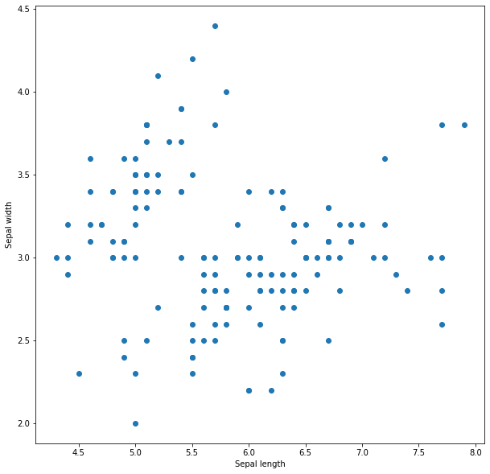
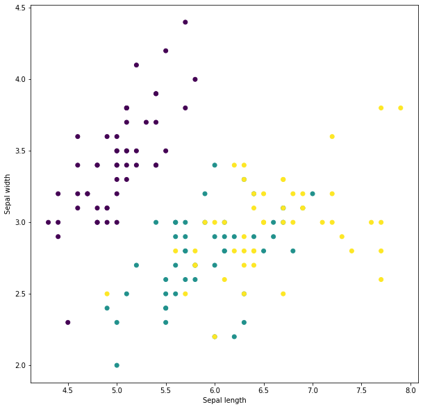
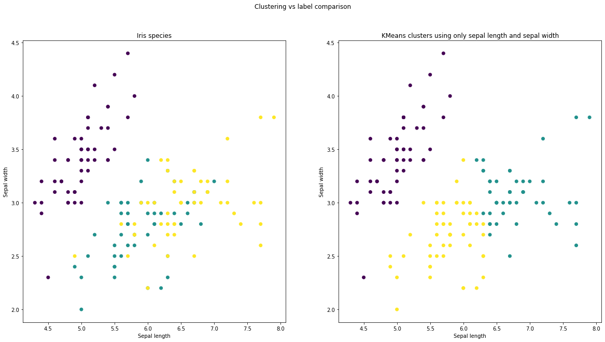
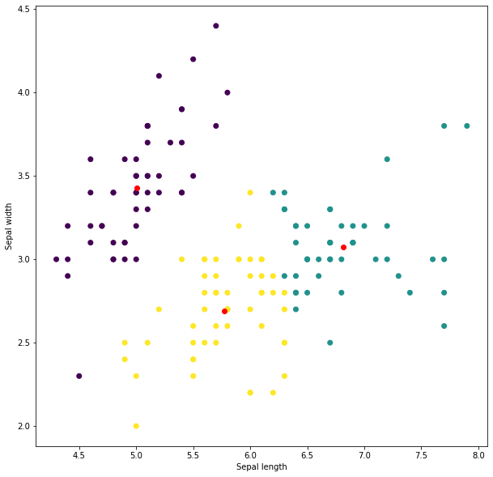
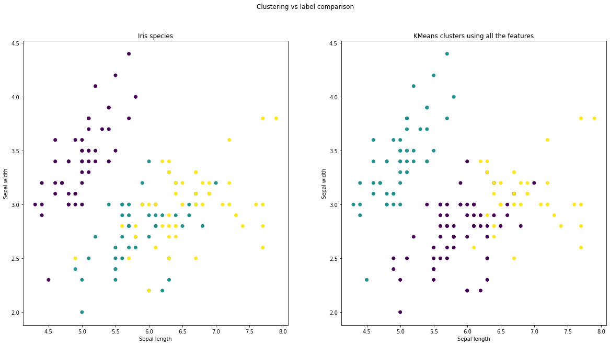
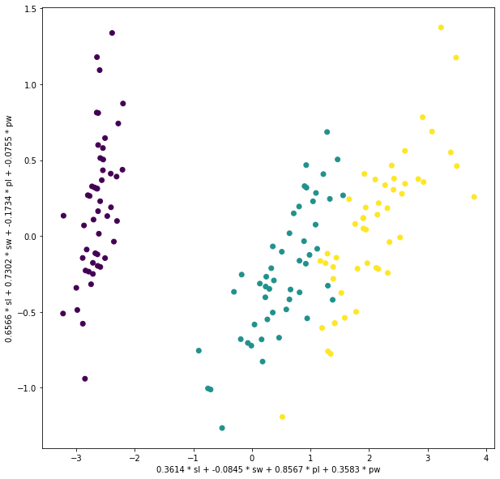
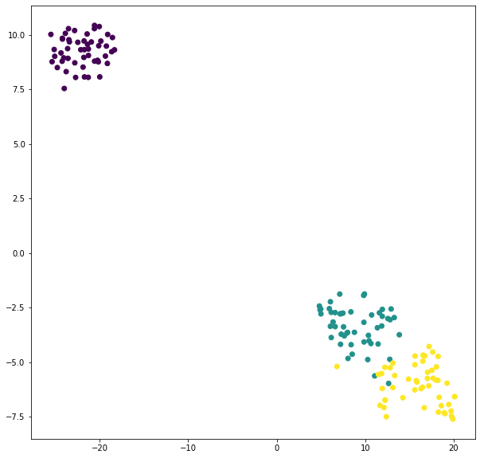
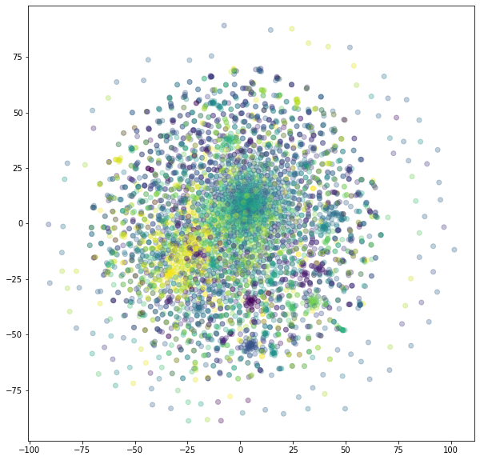

# Course 7

## Unsupervised learning

Until now we have only worked with [supervised
learning](https://en.wikipedia.org/wiki/Supervised_learning) in which
we wanted to *learn* to map an *input* to an *output* from a set of
example couples of *input*/*output*.

In [unsupervised
learning](https://en.wikipedia.org/wiki/Unsupervised_learning), we are
using machine learning algorithms to look for *patterns* and
*structures* in the data *without* any label. Typical unsupervised
learning applications include:

- [Clustering](https://en.wikipedia.org/wiki/Cluster_analysis) in
  which we try to group together similar samples.
- [Dimensionality
  reduction](https://en.wikipedia.org/wiki/Dimensionality_reduction)
  in which we try to discover what features or combination of features
  contains the most *information*.

## Iris dataset

The [Iris flower
dataset](https://en.wikipedia.org/wiki/Iris_flower_data_set) is a very
popular learning tool for data science.


(image from [Machine Learning in
R](https://www.datacamp.com/community/tutorials/machine-learning-in-r))

For each flower of the dataset we know the following attributes :
petal length, petal width, sepal length, sepal width and species.

Let's load it using `sklearn.datasets`.

```python
from sklearn.datasets import load_iris

iris = load_iris()
print('First 5 samples')
print(iris.data[:5], '\n')
print('Feature names', iris.feature_names, '\n')
print('First 5 targets', iris.target[:5], '\n)
print('Target names', iris.target_names)
```

```
First 5 samples
[[5.1 3.5 1.4 0.2]
 [4.9 3.  1.4 0.2]
 [4.7 3.2 1.3 0.2]
 [4.6 3.1 1.5 0.2]
 [5.  3.6 1.4 0.2]]

Feature names ['sepal length (cm)', 'sepal width (cm)', 'petal length (cm)', 'petal width (cm)']

First 5 targets [0 0 0 0 0]

Target names ['setosa' 'versicolor' 'virginica']
```

Now that we have our data, let's load them in a pandas `DataFrame` for
easier manipulation.

```python
import pandas as pd

df = pd.DataFrame(
    data    = iris.data,
    columns = ['sl', 'sw', 'pl', 'pw']
)
df['target'] = iris.target

print(df.head())
```

```
    sl   sw   pl   pw  target
0  5.1  3.5  1.4  0.2       0
1  4.9  3.0  1.4  0.2       0
2  4.7  3.2  1.3  0.2       0
3  4.6  3.1  1.5  0.2       0
4  5.0  3.6  1.4  0.2       0
```

We can now visualize the relationship between our features.

```python
import matplotlib.pyplot as plt

plt.scatter(df.sl, df.sw)
plt.xlabel('Sepal length')
plt.ylabel('Sepal width')
```



We can also color the dots using their species information. If we want
to display the legend (the color to class mapping), we have to use the
following syntax.

```python
for label_idx, label_name in enumerate(iris.target_names):
  species_mask = df.target == label_idx
  df_mask      = df[species_mask]
  plt.scatter(df_mask.sl, df_mask.sw, label = label_name)

plt.xlabel('Sepal length')
plt.ylabel('Sepal width')
plt.legend()
```


We need to call `plt.scatter` once by class.

Another way to color the dots is to use the `c` parameter of
`plt.scatter` but we can no longer display a legend.

```python
plt.scatter(df.sl, df.sw, c = df.target)
plt.xlabel('Sepal length')
plt.ylabel('Sepal width')
```



This syntax is much more practical and, unless we really need the
labels, it is the one we are going to use in this course.

In this example, we can see that there is a clear distinction between
setosa species and the two other ones. If we tried to build "groups"
of samples based on their *location* in this space, we would have
probably created a group that is almost entirely composed of setosa
irises *without even knowing their labels*. This is exactly what
clustering algorithms try to do.

### Clustering

Let's take a look at the
[KMeans](https://en.wikipedia.org/wiki/K-means_clustering) algorithm,
one of the simplest clustering algorithm.

The algorithm works this way:
  - First we choose a number of clusters `n` (groups) we want to
    discover.
  - We then generate `n` random points in the feature space. These
    points are called *centroids*.
  - Then, while the centroids can move :
    - Associate each sample of the dataset to the closest centroid
      (usually using the euclidean distance)
    - Move each of the centroids to the barycenter of the samples that
      are associated to it.


(Animation from [Wikipedia](https://en.wikipedia.org/wiki/K-means_clustering))

Notice how the algorithm only uses the features of the samples and no
target. K-Means is an *unsupervised* machine learning model.

Let's apply K-means on our data. First, let's select only the `sepal`
features from our dataset.

```python
sepal_df = df[['sl', 'sw']]
print(sepal_df.head())
```

```
    sl   sw
0  5.1  3.5
1  4.9  3.0
2  4.7  3.2
3  4.6  3.1
4  5.0  3.6
```

Now we create a KMeans model and fit the *centroids* using the `fit`
method as usual. Once the model is fit, we can compute *cluster
predictions* using `predict`

```python
from sklearn.cluster import KMeans

km = KMeans(n_clusters = 3)
km.fit(sepal_df)
clusters = km.predict(sepal_df)
print(clusters[:5])
```

```
[0 0 0 0 0]
```

We can see that the model associates the same cluster (cluster 0) to
the first five samples of the dataset.

Now that we have our cluster predictions, let's visualize them side by
side with the actual Iris species.

```python
fig, axes = plt.subplots(1, 2, figsize = (20, 10))
fig.suptitle('Clustering vs label comparison')
# Iris species scatterplot
axes[0].scatter(sepal_df.sl, sepal_df.sw, c = df.target)
axes[0].set_xlabel('Sepal length')
axes[0].set_ylabel('Sepal width')
axes[0].title.set_text('Iris species')
# Clustering scatterplot
axes[1].scatter(sepal_df.sl, sepal_df.sw, c = clusters)
axes[1].set_xlabel('Sepal length')
axes[1].set_ylabel('Sepal width')
axes[1].title.set_text('KMeans clusters using only sepal length and sepal width')
```



We can see that our model have *discovered* the setosa species in our
dataset using only the proximity of the samples as input! That's
pretty good!

As usual with sklearn models, now that we have fit our model, we can
access its learned parameters, here the coordinates of the centroids.

```python
centroids = km.cluster_centers_
print(centroids)
```

```
[[5.006      3.428     ]
 [6.81276596 3.07446809]
 [5.77358491 2.69245283]]
```

We can also draw these centroids along with the samples to see how the
models computes its cluster predictions.

```
plt.scatter(sepal_df.sl, sepal_df.sw, c = clusters)
plt.scatter(centroids[:, 0], centroids[:, 1], color = 'red')
plt.xlabel('Sepal length')
plt.ylabel('Sepal width')
```



(when looking at this plot, keep in my mind that the graduation of the
`x` and `y` axes is not equal)

We can see, as described in the algorithm, that the samples are
partitioned according to which centroid they are closest to.

For now all the examples of KMeans algorithm we have seen were using
2D data but that is not a requirement at all. The steps of the
algorithm work in any number of dimension. Let's compute on new
clustering on our dataset using this time *all the features* of the
samples (sepal and petal information).

```python
iris_features = df.drop(['target'], axis = 1)
km = KMeans(n_clusters = 3)
km.fit(iris_features)
clusters = km.predict(iris_features)
fig, axes = plt.subplots(1, 2, figsize = (20, 10))
fig.suptitle('Clustering vs label comparison')
# Iris species scatterplot
axes[0].scatter(df.sl, df.sw, c = df.target)
axes[0].set_xlabel('Sepal length')
axes[0].set_ylabel('Sepal width')
axes[0].title.set_text('Iris species')
# Clustering scatterplot
axes[1].scatter(df.sl, df.sw, c = clusters)
axes[1].set_xlabel('Sepal length')
axes[1].set_ylabel('Sepal width')
axes[1].title.set_text('KMeans clusters using all the features')
```



We can see that, now that all the features in the KMeans algorithm,
the cluster even better separate the different iris species. Now that
use all of our features, we can no longer plot our centroids because
they are now points in a 4D space (our number of features).

```python
print(km.cluster_centers_)
```

```
[[5.9016129  2.7483871  4.39354839 1.43387097]
 [5.006      3.428      1.462      0.246     ]
 [6.85       3.07368421 5.74210526 2.07105263]]
```

If only we had access to a family of algorithms that would allow us to
work with data of higher dimensionality...

### Dimensionality reduction

#### Principal component analysis

*Principal Component Analysis*
([PCA](https://en.wikipedia.org/wiki/Principal_component_analysis)) is
a popular dimensionality reduction technique. It consists in finding
the *principal components* or *principal directions* (**linear**
combination of the features) that explains most of the *variance* of
the data. By selecting a number of principal components inferior to
our number of features we reduce the dimensionality of our data while
loosing minimal amount of information (variance).


(image from [Towards Data
Science](https://towardsdatascience.com/pca-is-not-feature-selection-3344fb764ae6))

Let's apply a principal component analysis on the Iris dataset. Our
data points are 4 dimensional objects as we have 4 features. We are
going to compute the first two principal components and use them to
plot our dataset in 2D.

```python
from sklearn.decomposition import PCA

pca = PCA(n_components = 2)
pca.fit(iris_features)
print(pca.components_)
```

```
[[ 0.36138659 -0.08452251  0.85667061  0.3582892 ]
 [ 0.65658877  0.73016143 -0.17337266 -0.07548102]]
```

By *fitting* the PCA, we compute the principal components. The
`components_` field that appears in our PCA instance is a 2x4 array
because we asked for 2 components that are linear combination of the 4
features. We can display the linear combinations that generate the
components.

```python
component_formulas = [
  ' + '.join(
    f'{weight:5.4f} * {feature_name}'
    for weight, feature_name in zip(component, iris_features.columns)
  )
  for component in pca.components_
]
print('First principal component:', component_formulas[0])
print('Second principal component:', component_formulas[1])
```

```
First principal component: 0.3614 * sl + -0.0845 * sw + 0.8567 * pl + 0.3583 * pw
Second principal component: 0.6566 * sl + 0.7302 * sw + -0.1734 * pl + -0.0755 * pw
```

The principal component analysis generates components that are
[orthogonal](https://en.wikipedia.org/wiki/Orthogonality). We can
check that it is indeed the case by computing the [dot
product](https://en.wikipedia.org/wiki/Dot_product) of our two
components (the dot product value of orthogonal vectors is 0).

```python
print(np.dot(pca.components_[0], pca.components_[1]))
```

```
4.163336342344337e-16
```

Now that we have our principal components, we can use them to reduce
the dimensionality of our original dataset.

```python
pca_features = pca.transform(iris_features)
print(pca_features[:5])
```

```
[[-2.68412563  0.31939725]
 [-2.71414169 -0.17700123]
 [-2.88899057 -0.14494943]
 [-2.74534286 -0.31829898]
 [-2.72871654  0.32675451]]
```

`pca_features` have two dimensions respectively corresponding to the
first and second principal components.

Now that we have two dimensional data points, we can plot them using
`plt.scatter`.

```python
plt.scatter(pca_features[:, 0], pca_features[:, 1], c = df.target)
plt.xlabel(component_formulas[0])
plt.ylabel(component_formulas[1])
```



Let's now visualize our KMeans clustering result in 2D using the PCA
generated features.

```python
km = KMeans(n_clusters = 3)
km.fit(iris_features)
clusters = km.predict(iris_features)
pca_centroids = pca.transform(km.cluster_centers_)

fig, axes = plt.subplots(1, 2, figsize = (20, 10))
fig.suptitle('Clustering vs label comparison on PCA features')
# Iris species scatterplot
axes[0].scatter(pca_features[:, 0], pca_features[:, 1], c = df.target)
axes[0].set_xlabel(component_formulas[0])
axes[0].set_ylabel(component_formulas[1])
axes[0].title.set_text('Iris species')
# Clustering scatterplot
axes[1].scatter(pca_features[:, 0], pca_features[:, 1], c = clusters)
axes[1].scatter(pca_centroids[:, 0], pca_centroids[:, 1], color = 'red')
axes[1].set_xlabel(component_formulas[0])
axes[1].set_ylabel(component_formulas[1])
axes[1].title.set_text('KMeans clusters using all the features')
```


Dimensionality reduction techniques may be used for visualization as
we just did. They may also be used to drastically reduce the number of
features of a problem. Reducing the number of features may reduce
computational needs of models, improve generalization capabilities and
reduce overfit.

#### t-distributed stochastic neighbor embedding

*t-distributed stochastic neighbor embedding* ([t-SNE or
TSNE](https://en.wikipedia.org/wiki/T-distributed_stochastic_neighbor_embedding))
is another dimensionality reduction algorithm. It is mainly used for
visualization purpose. Its goal is to model each high-dimensional
object by a two- or three-dimensional point in such a way that similar
objects are modeled by nearby points and dissimilar objects are
modeled by distant points with high probability.

This method is used extremely often to visualize representation
learned by machine learning and various kinds of high dimensional
datasets. A list of nice examples is available on [this
page](https://lvdmaaten.github.io/tsne/).

The inner workings of this algorithm are way beyond the scope of this
course. The research article in which this method have been introduced
is available
[here](https://lvdmaaten.github.io/publications/papers/JMLR_2008.pdf).

Let's apply it to our Iris dataset.

```python
tsne = TSNE(n_components = 2)
tsne_features = tsne.fit_transform(iris_features)
plt.scatter(tsne_features[:, 0], tsne_features[:, 1], c = df.target)
```



## Practical work

0. Download the [IMDB movie review
   dataset](https://www.kaggle.com/lakshmi25npathi/imdb-dataset-of-50k-movie-reviews)
   from [here](../datasets/IMDB_reviews/imdb.csv) and load it into a
   pandas DataFrame.

1. Select only the first 5000 reviews of the dataset to speedup
   analysis. Do it by truncating the DataFrame to its first 5000 rows.

2. Encode the reviews using `TfidfVectorizer`. Look at the
   documentation to set the hyperparameters to:
   - remove 'english' [stop
     words](https://en.wikipedia.org/wiki/Stop_words) from the
     vocabulary
   - remove words that appear in less that 10 documents
   Your encoded review array should be of shape `(5000, 6360)`.

A very common application of PCA is to remove some noise from the
data. Another way to create a `PCA` instance is to specify the
proportion of the variance of the original dataset we want to
keep. The model will iteratively add components until the required
amount of variance is reached.

For example,

```python
pca = PCA(n_components = 0.8)
```

will generate the number of principal components required to preserve
80% of the variance of the original dataset.

3. Remove some noise from the review tfidf matrix using `PCA` by
   keeping 95% of the variance of the dataset. Take a look at the
   dimensionality of your transformed data. The number of features
   should be more or less cut in half. PCA requires its input to be a
   dense matrix. You can convert a sparse matrix to dense one using
   `.toarray`.

4. Cluster the reviews using `KMeans` into 50 clusters.

5. Using `TSNE`, display a 2D scatter plot of the reviews with their
   colors corresponding to the clusters computed in question 4. You
   can use the `alpha` argument of the `plt.scatter` function to
   change the transparency of the points.



6. Generate a countplot displaying the number of positive and negative
   comments in each of the clusters to see if KMeans managed to
   "discover" some sentiment patterns.


7. Display the content of a few clusters that contains mostly positive
   or negative comments. For example here is a few reviews of my
   cluster `20`.

```
Some films just simply should not be remade. This is one of them. In and of itself it is not a bad film. But it fails to capture the flavor and the terror of the 1963 film of the same title. Liam Neeson was excellent as he always is, and most of the cast holds up, with the exception of Owen Wilson, who just did not bring the right feel to the character of Luke. But the major fault with this version is that it strayed too far from the Shirley Jackson story in it's attempts to be grandiose and lost some of the thrill of the earlier film in a trade off for snazzier special effects. Again I will say that in and of itself it is not a bad film. But you will enjoy the friction of terror in the older version much more.

We brought this film as a joke for a friend, and could of been our worst joke to play. The film is barely watchable, and the acting is dire. The worst child actor ever used and Hasslehoff giving a substandard performance. The plot is disgraceful and at points we was so bored we was wondering what the hell was going on. It tries to be gruesome in places but is just laughable.<br /><br />Just terrible

Well, I like to watch bad horror B-Movies, cause I think it's interesting to see stupidity and unability of creators to shoot seriously good movie. (I always compare this movies to - for example - some Spielberg's works and again-and-again don't understand the huge difference in what I see.) I like Ed Wood's movies cause it's so inept it's very funny. But people!!! "The Chilling" is not funny and is not even "interesting". It's EXTREMELY BORING horror movie without ANYTHING what makes even bad movies watchable. There's no acting, no screenplay, no direction, no thrills and not even blood. It's extremely inept amateurish film. It's definitely the WORST movie I had ever seen (and I had seen a lot of "worst movies" - believe me). I warned you !!! 1/10

Usually I'm a bit of a fan of the bad eighties & early nineties film featuring now has beens...but this film is so incredibly terrible that it was a real endurance test to sit through. Guys dressing up as girls has been done to death - but never so pathetically. Corey Haim's performance was abysmal as usual, Nicole Eggert was not much better. This has no redeeming qualities, even if you are a number #1 fan of an actor/actress in this piece of trash - stay away!

I can't believe it that was the worst movie i have ever seen in my life. i laughed a couple of times. ( probably because of how stupid it was ) If someone paid me to see that movie again i wouldn't. the plot was so horrible , it made no sense , and the acting was so bad that i couldn't even tell if they were trying. that movie was terrible rating: F

Why can't a movie be rated a zero? Or even a negative number? Some movies such as "Plan Nine From Outer Space" are so bad they're fun to watch. THIS IS NOT ONE. "The Dungeon of Horror" might be the worst movie I've ever seen (some of anyway. I HAD to fast forward through a lot of it!). Fortunately for the indiscretions of my youth and senility of my advancing age, there may be worse movies I've seen, but thankfully, I can't remember them. The sets appeared to be made with cardboard and finished with cans of spray paint. The special effects looked like a fifth grader's C+ diorama set in a shoebox. The movie contained unforgivable gaffs such as when the Marquis shoots and kills his servant. He then immediately gets into a scuffle with his escaping victim, who takes his flintlock and shoots him with it, without the gun having been reloaded! This movie was so bad my DVD copy only had name credits. I guess no company or studio wanted to be incriminated. Though I guess when you film in your garage and make sets out of cardboard boxes a studio isn't needed. This movie definitely ranks in my cellar of all time worst movies with such horrible sacrileges as "The Manipulator", the worst movie I have ever seen with an actual (one time) Hollywood leading man-Mickey Rooney. The only time I would recommend watching "The Dungeon of Harrow" (or "The Manipulator" for that matter) would be if someone were to pay you. (I'm kind of cheap) I'd have to have $7 or $8 bucks for "Dungeon" and at least ten for "Manipulator". phil-the never out of the can cinematographer

Sometimes you just have to have patients when watching indie horror. If you can just toe-tap your way through the slow-paced early scenes, sometimes a real gem will present itself... This (unfortunately) was not the case with "Satan's Whip".<br /><br />Written and directed by Jason Maran, "Satan's Whip" attempts to drag us along on a boring snore-fest of a film, with no real pay off at the end. I'm guessing that the black & white (and blue) cinematography must have been for a reason, however it is never explained why the majority of the blood is blue, and I found this increasingly annoying as the film went on. The story in itself is not that bad, and actually had some originality and decent content but the acting is simply pathetic. This, combined with the slow-pacing and lack of any real (red) gore made "Satan's Whip" one to forget quite quickly. I will give it a "4" rating for some witty dialog that made me chuckle, but alas that could not save this boring waste of my time.

Serum is about a crazy doctor that finds a serum that is supposed to cure all diseases through the power of the mind. Instead it creates some kind of monster that needs to eat human flesh and brains. The mad doc creates some zombies out of cadavers and has some problems. There is a very long lead into all the action with many scenes getting you acquainted with the characters. The mad doctor's nephew gets into a car accident and the mad doc tries to use his new serum on the boy. The results are not good. This is a class C film with OK acting but some troubles directing and some continuity errors. There isn't much zombie action in this one and the effects, while adequate, are nothing special. You can fast forward through the slow parts and get some enjoyment out of the action scenes. Watch out for some nudity and bad language.

This flick is so bad its beyond belief.Even for an independent low budget film...it just, well, sucks.I can't even believe even Troma would put out such crap.I have been a fan of some Troma flicks for years(Toxic Avenger,Squeeze Play,Rockabilly Vampire to name a few).But LLoyd, come on,this goes way beyond the boundaries of any taste.It features some of the worst acting imaginable.I think it would have been possible to find unemployed street people who could have been as good...oh,wait, that is what they did.I mean it,these characters have negative charisma.With any luck, the producer and director of this film will have a huge karmic debt because of this atrocity.As will the special effects people.But beyond the terrible acting and the horrid special effects,the dialogue is absolutely traumatic to the ears.The script is full of plot holes the size of Alaska, and there are severe continuity problems.The worst part however, is that it not entertaining in even the smallest way.And this is the most unforgivable sin in film making.But, don't take my word for it.Go out and waste four bucks renting it.Just don't say I didn't warn you.

This film contain far too much meaningless violence. Too much shooting and blood. The acting seems very unrealistic and is generally poor. The only reason to see this film is if you like very old cars.
```

8. Select a very small clusters, visualize some of its comments and
   make a guess on why these have been grouped together.

9. Reproduce this analysis procedure and extract information from the
   [55000+ Song Lyrics
   dataset](https://www.kaggle.com/mousehead/songlyrics). You can for
   example try to visualize the lyrics of the songs using TSNE and
   coloring the points according to the artist.

10. Win the current [COVID-19 Open Research Dataset Challenge
    (CORD-19)](https://www.kaggle.com/allen-institute-for-ai/CORD-19-research-challenge)
    by applying the methods we have seen in this course.
