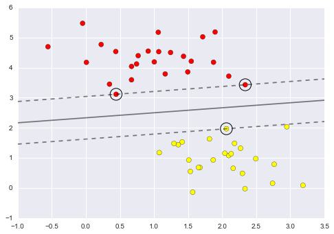

# Course 8

## Machine learning model safari

### Tree based models

#### Decision tree

Take a look at this [animation](http://www.r2d3.us/visual-intro-to-machine-learning-part-1/).

#### Random forest

(Image from [Medium](https://medium.com/@williamkoehrsen/random-forest-simple-explanation-377895a60d2d))

Random forest is part of a more general family of model called [model
ensembles](https://en.wikipedia.org/wiki/Ensemble_learning). This
family of model is based on the idea of [Wisdom of the
crowd](https://en.wikipedia.org/wiki/Wisdom_of_the_crowd).

Model ensemble is usually a great way to improve generalization and
decrease overfitting as illustrated in [this
notebook](https://jakevdp.github.io/PythonDataScienceHandbook/05.08-random-forests.html).

### Neighbor based models

(Image from
[KDnuggets](https://www.kdnuggets.com/2016/01/implementing-your-own-knn-using-python.html))

K Nearest Neighbors methods efficiency can be greatly improved by
using approximate search algorithms such as [Locally Sensitive
Hashing](https://en.wikipedia.org/wiki/Locality-sensitive_hashing). Take
a look at [this talk](https://www.youtube.com/watch?v=V9zl09w1SGM) on
Youtube to get an intuition on how locally sensitive hashing works,
it's pretty cool.

### Support vector machines (SVMs)

Take a look at [this
notebook](https://jakevdp.github.io/PythonDataScienceHandbook/05.07-support-vector-machines.html)
To get a sense of how Support Vector Machines work.

### Deep learning

Take a sneak peek into the [deep learning course](../deep_nlp)
available on this repo.
